- [Lab 1 - MapReduce](#lab-1---mapreduce)
	- [一、实验相关准备](#一实验相关准备)
	- [二、任务梳理](#二任务梳理)
		- [2.1 要求](#21-要求)
		- [2.2 提示](#22-提示)
	- [三、环境搭建](#三环境搭建)
	- [四、编程实现](#四编程实现)
		- [4.1 查看各相关源文件的作用](#41-查看各相关源文件的作用)
		- [4.2 定义master的结构体](#42-定义master的结构体)
		- [4.3 完成makeMaster函数](#43-完成makemaster函数)
		- [4.4 完成制作map和reduce任务的方法](#44-完成制作map和reduce任务的方法)
			- [4.4.1 制作map任务的方法](#441-制作map任务的方法)
			- [4.4.2 制作reduce任务的方法](#442-制作reduce任务的方法)
		- [4.5 完成master和worker之间的请求/分配任务交互](#45-完成master和worker之间的请求分配任务交互)
			- [4.5.1 先看给的RPC示例代码](#451-先看给的rpc示例代码)
			- [4.5.2 仿造示例完成自己的RPC逻辑](#452-仿造示例完成自己的rpc逻辑)
			- [4.5.3 补充相关方法实现代码](#453-补充相关方法实现代码)
				- [4.5.3.1 检查map任务是否都执行完毕](#4531-检查map任务是否都执行完毕)
				- [4.5.3.2 检查reduce任务是否都执行完毕](#4532-检查reduce任务是否都执行完毕)
				- [4.5.3.3 转向mr下一阶段的实现](#4533-转向mr下一阶段的实现)
		- [4.6 完成worker执行任务的函数](#46-完成worker执行任务的函数)
			- [4.6.1 执行map任务的函数](#461-执行map任务的函数)
			- [4.6.2 执行reduce任务的函数](#462-执行reduce任务的函数)
			- [4.6.3 shuffle](#463-shuffle)
			- [4.6.4 wc.go的源码](#464-wcgo的源码)
		- [4.7 完成worker完成任务后向master汇报的交互](#47-完成worker完成任务后向master汇报的交互)
			- [4.7.1 worker通过RPC调用告知master任务已完成](#471-worker通过rpc调用告知master任务已完成)
			- [4.7.2 master处理此RPC调用修改任务状态](#472-master处理此rpc调用修改任务状态)
		- [4.8 编写Worker主逻辑](#48-编写worker主逻辑)
		- [4.9 利用协程不停探测并处理crash](#49-利用协程不停探测并处理crash)
		- [4.10 实现master.go中的Done()方法](#410-实现mastergo中的done方法)
	- [五、测试](#五测试)
		- [5.1 运行测试脚本](#51-运行测试脚本)
		- [5.2 报错“connection refused”](#52-报错connection-refused)
		- [5.3 程序运行到makeMapTask卡死](#53-程序运行到makemaptask卡死)
		- [5.4 切片访问越界报错](#54-切片访问越界报错)
		- [5.5 ALL PASS!](#55-all-pass)
	- [六、总结](#六总结)
	- [七、参考](#七参考)


# Lab 1 - MapReduce


## 一、实验相关准备

- B站 Golang入门到实战教程
- [Go语言圣经](https://gopl-zh.github.io/)
- [Lab1说明及提示](http://nil.csail.mit.edu/6.824/2020/labs/lab-mr.html)
- 经典论文：MapReduce: Simplified Data Processing on Large Clusters
- [MapReduce理解视频](https://www.bilibili.com/video/BV1Vb411m7go/?from=search&seid=8676892438131853528&vd_source=240b118997ae58197aff4713d72527f3)


## 二、任务梳理

### 2.1 要求

1. worker与master通过RPC进行通信

2. 不要修改`main/mrmaster.go`和`main/mrworker.go`

   自己的实现应该放在`mr/master.go`，`mr/worker.go`和`mr/rpc.go`

3. 首先，确保word-count插件是刚创建的

   ```shell
   $ go build -buildmode=plugin ../mrapps/wc.go
   ```

4. 在main文件夹下，运行master

   ```shell
   $ rm mr-out*
   $ go run mrmaster.go pg-*.txt
   ```

   参数`pg-*.txt`指定了`mrmaster.go`的输入文件，每个文件对应一个"split"，并且是一个map任务的输入

5. 运行一些workers：

   ```shell
   $ go run mrworker.go wc.so
   ```

6. 当workers和master完成后，在`mr-out-*`查看输出。最后输出文件的排序并集应该匹配顺序输出

   ```shell
   $ cat mr-out-* | sort | more
   A 509
   ABOUT 2
   ACT 8
   ...
   ```

7. 提供了测试脚本`main/test-mr.sh`，测试检查`wc`和`indexer`MapReduce应用在`pg-xxx.txt`为输入文件时是否产生了**正确的输出**，也检查是否实现了**并行**运行Map和Reduce任务以及是否实现了当运行任务的worker瘫痪时是否能**恢复**

8. 完成实验时，test脚本输出如下：

   ```shell
   $ sh ./test-mr.sh
   *** Starting wc test.
   --- wc test: PASS
   *** Starting indexer test.
   --- indexer test: PASS
   *** Starting map parallelism test.
   --- map parallelism test: PASS
   *** Starting reduce parallelism test.
   --- reduce parallelism test: PASS
   *** Starting crash test.
   --- crash test: PASS
   *** PASSED ALL TESTS
   $
   ```

9. map阶段应该中间key分成`nReduce`组来传入`nReduce`个reduce任务，`nReduce`是`main\mrmaster.go`传给`MakeMaster()`的参数

10. worker应该实现将第x个Reduce任务的输出写入`mr-out-X`文件中，每一行应该是"key value"的格式

    ```go
    // 将reduce的输出写入文件
    // Fprintf根据format参数生成格式化的字符串并写入w。返回写入的字节数和遇到的任何错误
    fmt.Fprintf(ofile, "%v %v\n", intermediate[i].Key, output)
    ```

11. worker应该将map的中间输出输出到当前文件夹

12. `main/mrmaster.go` 期望 `mr/master.go` 实现一个 `Done()` 方法，当MapReduce工作完成时返回`true`，在那个时候， `mrmaster.go` 将退出

13. 当工作完成时，worker进程应该退出。实现的方法：使用 `call()` 的返回值，如果worker没有联系到master，意味着工作完成master已经退出，那么worker也退出。


### 2.2 提示

1. 开始：

   - 编写 `mr/worker.go` 的 `Worker()` 发送RPC给master请求一个任务
   - 然后编写master回复文件名的map任务
   - 再编写worker读取文件并调用`mrsequential.go`中的Map函数

2. 当 `mr/` 文件夹改动后，需要重新构造MapReduce插件

    `go build -buildmode=plugin ../mrapps/wc.go`

3. 中间文件的合理命名方式是 `mr-X-Y` ，X是Map任务的序号，Y是Reduce任务的序号

4. map任务需要一种方式去存储中间的键值对到文件以便reduce任务之后读取。可以使用Go的`encoding/json` package。

   将键值对写到 JSON 文件：

   ```go
     enc := json.NewEncoder(file)
     for _, kv := ... {
       err := enc.Encode(&kv)
   ```

   读取：

   ```go
     dec := json.NewDecoder(file)
     for {
       var kv KeyValue
       if err := dec.Decode(&kv); err != nil {
         break
       }
       kva = append(kva, kv)
     }
   ```

5. map阶段可以使用 `ihash(key)` 函数 (in `worker.go`) 来为给定的key选择reduce任务

6. 读取Map的输入文件、中间键值对排序、将Reduce的输出写入文件等可以参考 `mrsequential.go` 的部分代码

7. master，作为RPC服务器应该是一致的，不要忘记对共享数据加锁

8. workers有时需要等待，例如，reduces得等到最后一个map完成后才能开始。 

   一个可能的实现是workers周期性地向master请求任务，每次请求之间休眠 `time.Sleep()` 。 Another possibility is for the relevant RPC handler in the master to have a loop that waits, either with `time.Sleep()` or `sync.Cond`. Go runs the handler for each RPC in its own thread, so the fact that one handler is waiting won't prevent the master from processing other RPCs.

9. master不能可靠地区分崩溃的工作线程、还活着但由于某种原因而停滞的工作线程和正在执行但速度太慢而无法使用的工作线程。

   可以让master等待一段时间（如10s），然后放弃并将任务重新分配给其他worker，在此之后，master应该认为那个worker已经死亡

10. 为了测试瘫痪恢复机制，可以使用 `mrapps/crash.go` ，它随机地结束一些Map和Reduce函数

11. 为了确保没有人在出现崩溃的情况下观察到部分写入的文件，MapReduce论文提到了使用临时文件并在完成写入后原子地重命名它的技巧。

    你能使用 `ioutil.TempFile` 来创建一个临时文件以及 `os.Rename` 来原子性地重命名它

12. `test-mr.sh` 在子目录 `mr-tmp` 运行所有的进程，如果运行错误，可以在那查看中间或者输出文件


## 三、环境搭建

- 虚拟机ubuntu-22.04.1
- GoLand 2022.3.2
- Go 1.19.5


1. 旧项目采用GOPATH包管理模式 ，这里将golang 依赖管理从GOPATH换成go mod

   终端运行`go env -w GO111MODULE=on`开启go mod

   **踩坑**：在项目根目录执行`go mod init 6.824`生成`go.mod`文件时报错：`Permission denied`。

   **解决**：发现是项目文件从github上clone下来放在了根目录下的repo文件夹下，权限不够，因此重新clone到其他文件夹后可以生成。

   

2. 将项目中采用GOPATH模式的`import`改为go mod模式，例如：

   `6.824/src/main/mrsequential.go`中的`import "../mr"`改为`import "6.824/src/mr"`

   注意import的是包，不是某个go文件！

   

3. 提供的示例：

   - 一个简单的顺序mapreduce实现：`src/main/mrsequential.go`
   - 几个MapReduce应用程序：单词计数`mrapps/wc.go`和`mrapps/indexer.go`

   **示例代码建议看，可以模仿着写**

   可以像下面这样运行word count示例：

   ```
   $ cd ~/6.824
   $ cd src/main
   $ go build -buildmode=plugin ../mrapps/wc.go
   $ rm mr-out*
   $ go run mrsequential.go wc.so pg*.txt
   $ more mr-out-0
   A 509
   ABOUT 2
   ACT 8
   ...
   ```

   顺序执行`mrsequential.go` ：

   - 输入是名为`pg-xxx.txt`的文本文件

   - 输出到文件`mr-out-0`

   **踩坑**：执行到`go build -buildmode=plugin ../mrapps/wc.go`报错`go: C compiler "gcc" not found: exec: "gcc": executable file not found in $PATH`

   **解决**：`sudo apt install gcc`安装gcc

   


## 四、编程实现

代码的编写过程基本是按照遇到什么问题就编写对应部分的代码，碰到嵌套的新的问题就先解决前置问题，这样将大体的代码编写完后再完善下细节，整个任务就完成了。下面是编程时的实现思路，大致是按照整个mr工作的执行顺序。


### 4.1 查看各相关源文件的作用

需要着重看的源文件代码有：

```
-main
	-mrmaster.go
	-mrworker.go
	-mrsequential.go

-mr
	-master.go
	-worker.go
	-rpc.go
	
-mrapps
	-wc.go
```

它们的作用如下：

1. mrmaster
   - 生成master
   - 循环检查整个mapreduce任务是否完成
2. mrworker
   - 从插件文件中获取map函数和reduce函数（因为我们编写的实际上是mapreduce的框架，对于不同的mapreudce任务是通用的，只有map函数和reduce函数的处理逻辑不同，因此map函数和reduce函数通过插件文件获取，就是文件中的`loadPlugin`函数）
   - 将mapf和reducef传入并生成worker
3. mrsequential
   - mapreduce的串行版本：读取输入文件用mapf处理后直接传给reducef然后写入一个输出文件
4. master
   - master相关数据结构及处理逻辑的代码编写（主要编程部分）
5. worker
   - worker相关数据结构及处理逻辑的代码编写（主要编程部分）
6. rpc
   - 定义RPC（提供了RPC的args和reply结构体示例）
   - 制作一个独特的 UNIX 域套接字名称
7. wc
   - word-count应用的mapreduce插件，提供了单词计数的map和reduce函数


### 4.2 定义master的结构体

关于master和worker结构体的定义要想在一开始就定义的非常完美是很困难的，因为要考虑的问题有很多。解决各个问题需要结构体拥有的成员变量很难一下子理清楚，可以先定义个大致的结构，后面需要什么再加什么，随着问题的解决，对代码逻辑是越来越清晰的。但文档中是将最后的版本展示出来，实际做的时候可以用上面的方法。


```go
// 任务类型
type TaskType int

// 任务状态
type TaskState int

// MapReduce执行到的阶段
type Phase int

// 枚举任务类型
const (
	MapTask TaskType = iota
	ReduceTask
)

// 枚举任务状态
const (
	Working TaskState = iota // 任务正在进行
	Waiting                  // 任务正在等待执行
	Finshed                  // 任务已经完成
)

// 枚举MapReduce执行阶段
const (
	MapPhase    Phase = iota // Map阶段
	ReducePhase              // Reduce阶段
	AllDone                  // 全部完成
)

// 定义任务的结构体
type Task struct {
	TaskId     int       // 任务id（唯一），通过Master生成，从0开始
	TaskType   TaskType  // 任务类型
	TaskState  TaskState // 任务状态
	InputFile  []string  // 输入文件名切片，map情况切片里面就一个分配给worker的文件,reduce情况下是worker需要选取的一些需要聚合到一起的中间文件
	ReducerNum int       // 传入的reducer的数量，用于hash
	ReducerKth int       // 表明reducer的序号（最终输出文件命名时需要），不等于taskId，只有为reduce任务时才有意义
	StartTime  time.Time // 任务被分配给worker后开始执行的时间（用于crash判断）
}

// channel 是golang特有的类型化消息的队列，可以通过它们发送类型化的数据在协程之间通信，可以避开所有内存共享导致的坑；通道的通信方式保证了同步性。
type Master struct {
	CurrentPhase      Phase         // 当前MapReduce处于什么阶段
	TaskIdForGen      int           // 用于生成任务唯一TaskId
	MapTaskChannel    chan *Task    // 管理待执行的Map任务，使用chan保证并发安全
	ReduceTaskChannel chan *Task    // 管理待执行的Reduce任务，使用chan保证并发安全
	TaskMap           map[int]*Task // 记录所有Task信息，方便Master管理任务，获得任务进行情况（当任务分配后更新）
	MapperNum         int           // mapper的数量，由于每个文件分给一个mapper做，因此就等于输入文件的个数
	ReducerNum        int           // 传入的reducer的数量，用于hash
}
```


将任务定义成一个结构体`Task`：

`Task`结构体的各成员变量：

- TaskId

  任务id（唯一），通过Master生成，从0开始。类似于数据库中的主键id，可以用于唯一找到该任务。

- TaskType

  任务类型。采用定义的`TaskType`类型，底层是`int`类型，利用枚举和`iota`来快速定义可能的任务类型。

  - MapTask——代表该任务是map任务
  - ReduceTask——代表该任务是reduce任务

- TaskState

  任务状态。采用定义的`TaskState`类型，底层是`int`类型，利用枚举和`iota`来快速定义可能的任务状态。

  - Working——任务正在进行，当master将该任务分配给worker执行但没完成时所处的状态
  - Waiting——任务正在等待执行，当master生成了该任务但还没分配给worker时所处的状态
  - Finshed——任务已经完成，当worker完成了任务并通知master修改任务状态为已完成

- InputFile

  输入文件名切片。map情况下切片里面就一个分配给worker的文件，reduce情况下是worker选取的一些需要聚合到一起的中间文件。

- ReducerNum

  传入的reducer的数量，用于hash确定某个key的kv对应该交给哪个reducer处理。

- ReducerKth

  表明reducer的序号。最终输出文件命名时需要，不等于taskId，只有为reduce任务时才有意义。

- StartTime

  任务被分配给worker后开始执行的时间（用于crash判断）


`Master`结构体的各成员变量：

- CurrentPhase

  记录mapreduce当前处于什么阶段。因为worker和master需要根据当前所处阶段来判断需要执行什么操作，采用定义的`Phase`类型，底层是`int`类型，利用枚举和`iota`来快速定义可能的阶段。

  - MapPhase——mr处于Map阶段
  - ReducePhase——mr处于Reduce阶段
  - AllDone——mr的所有任务都完成了，为全部完成阶段

- TaskIdForGen

  用于生成任务唯一TaskId。每个Task有唯一的Id，无论map task还是reduce task。这个id从0开始，采用自增分配，TaskIdForGen就是用来记录master当前分配到哪个id了。其在`GenerateTaskId()`方法中用到：

  ```go
  // 通过自增产生TaskId
  func (m *Master) GenerateTaskId() int {
  	res := m.TaskIdForGen
  	m.TaskIdForGen++
  	return res
  }
  ```

- MapTaskChannel

  管理待执行的Map任务。当map任务被master生成但尚未分配给worker时放在这个channel里，待有worker向master请求任务时从里面取，使用chan保证并发安全。

- ReduceTaskChannel

  管理待执行的Reduce任务。当reduce任务被master生成但尚未分配给worker时放在这个channel里，待有worker向master请求任务时从里面取，使用chan保证并发安全

- TaskMap

  **记录所有`Working`和`Finished`的Task信息**（注意**`Waiting`状态的任务是放在对应的channel里**而不在这个map中）。类型为map[int]*Task，key是TaskId，value是对应的任务。是为了方便Master管理任务，获得任务进行情况（当任务分配后更新）。在mr工作都完成后TaskMap就有了所有的任务。

- MapperNum

  mapper的数量。由于每个文件分给一个mapper做，因此就等于输入文件的个数。在Master检查map阶段任务是否全部完成的方法`checkMapTaskDone()`中用到 

- ReducerNum

  传入的reducer的数量。用于hash确定某个key的kv对应该交给哪个reducer处理。


**注意：**

1. channel 是golang特有的类型化消息的队列，可以通过它们发送类型化的数据在协程之间通信，可以避开所有内存共享导致的坑；通道的通信方式保证了同步性。
2. 合理地利用枚举来显示同类型的量，以及像`type TaskType int`这种将基本数据类型重命名，比起在注释里标明某个数字代表什么含义更加易读。


### 4.3 完成makeMaster函数

由代码可以看到整个程序是从`mrmaster`调用`mr.MakeMaster`函数创建master开始，在定义完master结构体后，来完成makeMaster函数

```go
// create a Master.
// main/mrmaster.go calls this function.
// nReduce is the number of reduce tasks to use.
func MakeMaster(files []string, nReduce int) *Master {
	fmt.Println("begin make a master...")
	m := Master{
		CurrentPhase:      MapPhase,                     // 开始为Map阶段
		TaskIdForGen:      0,                            // 初始为0，后面通过自增得到唯一的TaskId分配任务
		MapTaskChannel:    make(chan *Task, len(files)), // 输入文件个数决定map任务个数
		ReduceTaskChannel: make(chan *Task, nReduce),
		TaskMap:           make(map[int]*Task, len(files)+nReduce), // 最多为map任务和reduce任务的和
		MapperNum:         len(files),
		ReducerNum:        nReduce,
	}

	m.MakeMapTask(files) // 根据files生成Map任务

	m.server()

	go m.CrashHandle() // 开启探测并处理crash的协程
	return &m
}
```

在这个函数中，首先定义一个Master类型的变量m，这就是整个mr工作的master。开始时将当前阶段设为Map阶段，给`TaskIdForGen`初始设为0，所有任务的到id从0开始。注意`MapTaskChannel`、`ReduceTaskChannel`和`TaskMap`**使用`make`初始化,并且可以设置容量**。由于map任务的个数在本次lab中就等于输入文件的个数（一个输入文件交给一个map处理），所以`MapTaskChannel`的初始容量设为`len(files)`。reduce任务的个数是传入的参数`nReduce`，规定的，因此`ReduceTaskChannel`的初始容量设为nReduce。`TaskMap`最多容纳map任务和reduce任务的和，当所有任务都完成时，里面的任务最多，因此初始容量设为`len(files)+nReduce`。一定要记得在这里初始化channel和map！！！否则channel的默认值是nil，而一个nil channel不会通信！！！所以后面生成map和reduce任务时会出现无法向channel中写而导致程序卡死，具体见5.3。

初始化了一个master后，也有了存放Task的结构（channel和map），这时候还没有生成worker，那么master先要做的就是生成map任务，将其存放在`MapTaskChannel`中等待worker请求。所以下一步需要编写生成map任务的方法`MakeMapTask`，代码见4.4.1。

然后起一个服务端线程来监听worker的RPC请求，方法`server`原始代码中提供了，具体见4.5.1。

为了实现容错机制，还需要开启探测并处理crash的协程`go m.CrashHandle()`，具体代码见


**注意：**

1. channel如果没有设置容量，或者容量设置为0, 说明Channel没有缓存，只有sender和receiver都准备好了后它们的通讯(communication)才会发生(Blocking)。如果设置了缓存，就有可能不发生阻塞， 只有buffer满了后 send才会阻塞， 而只有缓存空了后receive才会阻塞。
2. 一个nil channel不会通信。
3. 利用Go语言的协程来实现不断地探测worker是否crash并解决容错问题。


### 4.4 完成制作map和reduce任务的方法

#### 4.4.1 制作map任务的方法

```go
// Master生成Map任务
func (m *Master) MakeMapTask(files []string) {
	fmt.Println("begin make map tasks...")

	// 遍历输入的文本文件，向map管道中加入map任务
	for _, file := range files {
		id := m.GenerateTaskId()
		input := []string{file}
		mapTask := Task{
			TaskId:     id,
			TaskType:   MapTask,
			TaskState:  Waiting, // 尚未分配给worker时任务状态为waiting
			InputFile:  input,   // map情况切片里面就一个分配给worker的文件
			ReducerNum: m.ReducerNum,
		}
		fmt.Printf("make a map task %d\n", id)
		m.MapTaskChannel <- &mapTask
	}
}
```

入参是所有map任务的输入文件名的切片，根据输入文件来生成对应个数的map任务。

对于本此lab，每个map任务的输入文件只有一个，因此遍历输入的文本文件，对每一个输入文件生成一个map任务，再向`m.MapTaskChannel`中加入map任务。

这里为了可扩展性以及与reduce任务保持统一，还是将输入文件设为一个切片来保存（上面代码中的`input`），实际上切片里只有一个文件名。


#### 4.4.2 制作reduce任务的方法

```go
// Master生成Reduce任务
func (m *Master) MakeReduceTask() {
	fmt.Println("begin make reduce tasks...")
	rn := m.ReducerNum
	// Getwd返回一个对应当前工作目录的根路径
	dir, _ := os.Getwd()
	files, err := os.ReadDir(dir) // files为当前目录下所有的文件
	if err != nil {
		fmt.Println(err)
	}
	for i := 0; i < rn; i++ { // 总共生成rn个reduce任务
		id := m.GenerateTaskId()
		input := []string{} // reduce任务的输入是对应的中间文件
		// 生成的中间文件mr-X-Y存放在当前文件夹
		// 从files中找到对应的输入此reduce任务的中间文件（利用前缀后缀）
		for _, file := range files { // 注意file是文件类型，判断前后缀需要用file.Name()转换成对应的文件名字符串
			if strings.HasPrefix(file.Name(), "mr-") && strings.HasSuffix(file.Name(), strconv.Itoa(i)) {
				input = append(input, file.Name())
			}
		}

		reduceTask := Task{
			TaskId:     id,
			TaskType:   ReduceTask,
			TaskState:  Waiting,
			InputFile:  input,
			ReducerNum: m.ReducerNum,
			ReducerKth: i,
		}
		fmt.Printf("make a reduce task %d\n", id)
		m.ReduceTaskChannel <- &reduceTask
	}
}
```

类似于制作map任务的方法，但是reduce任务的输入文件是map任务的输出中间文件`mr-X-Y`，这里的X是Map任务的`taskId`，Y是`ihash(key) % nreduce`后的值（不等于Reduce任务的`taskId`）。由于生成的中间文件存放在当前文件夹，因此首先获取了当前文件夹的路径`dir`。然后对于每一个reduce任务（总共rn个），在当前文件夹找到对应的输入中间文件，具体通过匹配前缀后`mr-`和后缀`Y`的方法。最后制作reduce任务并加入`m.ReduceTaskChannel`。


### 4.5 完成master和worker之间的请求/分配任务交互

#### 4.5.1 先看给的RPC示例代码

master和worker之间的通信利用了RPC机制（[RPC介绍](https://zhuanlan.zhihu.com/p/187560185)），RPC采用客户端/服务端的模式，通过request-response消息模式实现。

rpc包提供了通过网络或其他I/O连接对一个对象的导出方法的访问，这一部分可以查看[Golang标准库文档](http://doc.golang.ltd/)的相关内容。

- 首先服务端会起线程来监听worker的RPC请求，方法`server`原始代码中提供了：

  ```go
  // 服务端注册一个对象，使它作为一个服务被暴露，服务的名字是该对象的类型名。
  // 注册之后，对象的导出方法就可以被远程访问。服务端可以注册多个不同类型的对象（服务），但注册具有相同类型的多个对象是错误的。
  // 方法必须看起来像这样：func (t *T) MethodName(argType T1, replyType *T2) error
  // 此时，客户端可看到服务"Master"及它的方法"Example"。要调用方法，客户端首先呼叫服务端
  // start a thread that listens for RPCs from worker.go
  func (m *Master) server() {
  	rpc.Register(m)
  	rpc.HandleHTTP()
  	//l, e := net.Listen("tcp", ":1234")
  	sockname := masterSock()
  	os.Remove(sockname)
  	l, e := net.Listen("unix", sockname)
  	if e != nil {
  		log.Fatal("listen error:", e)
  	}
  	go http.Serve(l, nil)
  }
  ```

  对于HTTP监听器，调用HandleHTTP和http.Serve。

- 服务端master想要**导出**一个RPC处理方法`Example`。注意：方法必须看起来像这样：`func (t *T) MethodName(argType T1, replyType *T2) error`

  ```go
  // an example RPC handler.
  // the RPC argument and reply types are defined in rpc.go.
  func (m *Master) Example(args *ExampleArgs, reply *ExampleReply) error {
     reply.Y = args.X + 1
     return nil
  }
  ```

  此时，客户端worker就可看到服务"Master"及它的方法"Master.Example"。

- 要调用Master的Example方法，客户端首先呼叫服务端，代码见`worker.go`的`call`函数，如下：

  ```go
  // send an RPC request to the master, wait for the response.
  // usually returns true.
  // returns false if something goes wrong.
  func call(rpcname string, args interface{}, reply interface{}) bool {
  	// c, err := rpc.DialHTTP("tcp", "127.0.0.1"+":1234")
  	sockname := masterSock()
  	c, err := rpc.DialHTTP("unix", sockname)	// c是生成的client
  	if err != nil {
  		log.Fatal("dialing:", err)
  	}
  	defer c.Close()
  
  	err = c.Call(rpcname, args, reply)	// 参数为要调用的服务和方法、一个包含参数的指针、一个用于接收应答参数的指针
  	if err == nil {
  		return true
  	}
  
  	fmt.Println(err)
  	return false
  }
  ```

  函数Dial（DialHTTP）会在一个原始的连接（或HTTP连接）上依次执行客户端创建一个连接，然后用该连接调用NewClient这两个步骤。

  生成的Client类型值有两个方法，Call和Go，它们的参数为要调用的服务和方法、一个包含参数的指针、一个用于接收应答参数的指针。

  Call方法会等待远端调用完成，而Go方法异步的发送调用请求并使用返回的Call结构体类型的Done通道字段传递完成信号。

- `worker.go`的`CallExample`函数就可以写自己的代码逻辑，初始化`args`和`reply`后调用`call`函数来请求RPC调用master的`Example`方法。调用代码就是`call("Master.Example", &args, &reply)`，这样就可以将`args`传递给master，调用它的`Example`方法处理后得到修改后的`reply`。

  ```GO
  // example function to show how to make an RPC call to the master.
  //
  // the RPC argument and reply types are defined in rpc.go.
  //
  func CallExample() {
  
     // declare an argument structure.
     args := ExampleArgs{}
  
     // fill in the argument(s).
     args.X = 99
  
     // declare a reply structure.
     reply := ExampleReply{}
  
     // send the RPC request, wait for the reply.
     call("Master.Example", &args, &reply)
  
     // reply.Y should be 100.
     fmt.Printf("reply.Y %v\n", reply.Y)
  }
  ```

- 关于参数`args`和`reply`类型的定义见`rpc.go`

  ```go
  import "os"
  import "strconv"
  
  //
  // example to show how to declare the arguments
  // and reply for an RPC.
  //
  
  type ExampleArgs struct {
  	X int
  }
  
  type ExampleReply struct {
  	Y int
  }
  
  // Add your RPC definitions here.
  
  
  // Cook up a unique-ish UNIX-domain socket name
  // in /var/tmp, for the master.
  // Can't use the current directory since
  // Athena AFS doesn't support UNIX-domain sockets.
  func masterSock() string {
  	s := "/var/tmp/824-mr-"
  	s += strconv.Itoa(os.Getuid())
  	return s
  }
  ```


#### 4.5.2 仿造示例完成自己的RPC逻辑

master已经创建好了并持续监听worker任务请求，map任务也已经制作完成并存放在`MapTaskChannel`中等待worker请求任务时被分配给它。接下来就需要完成worker向master进行RPC调用请求分配任务，然后master根据任务的状态来决定是否分配任务。

RPC示例中有很多代码可以直接拿来用，比如master的`server()`以及worker的`call()`。

- 编写worker向master请求任务的函数`RequestTask()`，代码如下：

  ```go
  // 向master请求RPC,获取任务
  func RequestTask() TaskReply {
  	args := TaskArgs{}
  	reply := TaskReply{}
  
  	// send the RPC request, wait for the reply.
  	// 请求调用Master的AssignTask方法
  	ok := call("Master.AssignTask", &args, &reply)
  
  	if !ok { // 请求失败
  		fmt.Println("Call failed!")
  	}
  
  	return reply
  }
  ```

  在`rpc.go`加上参数类型的结构体定义`TaskArgs`和`TaskReply`：

  ```go
  // worker请求master分配任务的reply标志，worker以此来判断需要进行的操作
  type ReqTaskReplyFlag int
  
  // 枚举worker请求任务的reply标志
  const (
  	TaskGetted    ReqTaskReplyFlag = iota // master给worker分配任务成功
  	WaitPlz                               // 当前阶段暂时没有尚未分配的任务，worker的本次请求获取不到任务
  	FinishAndExit                         // mapreduce工作已全部完成，worker准备退出
  )
  
  
  // RPC请求master分配任务时的传入参数——事实上什么都不用传入，因为只是worker获取一个任务。判断分配什么类型的任务由Master根据执行阶段决定
  type TaskArgs struct {
  }
  
  // RPC请求master分配任务时的返回参数——即返回一个Master分配的任务
  type TaskReply struct {
  	Answer ReqTaskReplyFlag
  	Task   Task
  }
  ```

  由于worker通过RPC请求master分配任务时只是获取一个任务，因此传入参数事实上什么都不用传入，为统一还是另外定义个结构体。

  返回参数是一个Master分配的任务以及一个标志`Answer`。因为worker请求分配任务并不总是能成功，可能当前并没有尚未分匹配的任务，又或者整个mr工作已经完成，此时`Task`是无效的，为了worker能更好地通过区分此次请求是哪种情况并作出相应的处理，加入了成员变量`Answer`来进行标志。`Answer`采用定义的`ReqTaskReplyFlag`类型，底层是`int`类型，利用枚举和`iota`来快速定义可能的标志：

  - TaskGetted——master给worker分配任务成功，本次请求到了任务，此时`Task`有意义。
  - WaitPlz——当前阶段暂时没有尚未分配的任务，但整个工作尚未完成，worker的本次请求获取不到任务，请等一段时间再此请求。
  - FinishAndExit——mapreduce工作已全部完成，worker准备退出

- 编写master处理worker请求分配任务的RPC调用的函数`AssignTask`，这也是**核心逻辑**之一，代码如下：

  ```go
  // Master给Worker分配任务的函数
  func (m *Master) AssignTask(args *TaskArgs, reply *TaskReply) error {
  	// 分配任务需要上锁，防止多个worker竞争，保证并发安全，并用defer回退解锁
  	mu.Lock()
  	defer mu.Unlock()
  	fmt.Println("Master gets a request from worker:")
  
  	// Master根据当前执行阶段来判断执行什么操作
  	switch m.CurrentPhase {
  	case MapPhase:
  		// 先检查MapTaskChannel里是否还有未分配的任务
  		if len(m.MapTaskChannel) > 0 { // 还有未分配的map任务
  			taskp := <-m.MapTaskChannel     // 取出的是指针
  			if taskp.TaskState == Waiting { // 若此map任务正等待执行
  				//*reply = TaskReply{*taskp}
  				reply.Answer = TaskGetted // 请求到了map任务
  				reply.Task = *taskp
  				taskp.TaskState = Working          // 将任务状态改为Working，代表已被分配给了worker
  				taskp.StartTime = time.Now()       // 更新任务开始执行的时间
  				m.TaskMap[(*taskp).TaskId] = taskp // 分配任务的同时将其加入TaskMap
  				fmt.Printf("Task[%d] has been assigned.\n", taskp.TaskId)
  			}
  		} else { // 没有未分配的map任务，检查map是否都执行完毕了，若是则Master转向reduce阶段
  			reply.Answer = WaitPlz // 本次请求暂无任务分配
  			// 检查map是否都执行完毕了
  			if m.checkMapTaskDone() { // map阶段任务都执行完了
  				m.toNextPhase() // 转向下一阶段
  			}
  			return nil
  		}
  	case ReducePhase:
  		// 先检查ReduceTaskChannel里是否还有未分配的任务
  		if len(m.ReduceTaskChannel) > 0 { // 还有未分配的reduce任务
  			taskp := <-m.ReduceTaskChannel  // 取出的是指针
  			if taskp.TaskState == Waiting { // 若此reduce任务正等待执行
  				//*reply = TaskReply{*taskp}
  				reply.Answer = TaskGetted // 请求到了reduce任务
  				reply.Task = *taskp
  				taskp.TaskState = Working          // 将任务状态改为Working，代表已被分配给了worker
  				taskp.StartTime = time.Now()       // 更新任务开始执行的时间
  				m.TaskMap[(*taskp).TaskId] = taskp // 分配任务的同时将其加入TaskMap
  				fmt.Printf("Task[%d] has been assigned.\n", taskp.TaskId)
  			}
  		} else { // 没有未分配的reduce任务，检查map是否都执行完毕了，若是则Master转向AllDone阶段
  			reply.Answer = WaitPlz // 本次请求暂无任务分配
  			// 检查map是否都执行完毕了
  			if m.checkReduceTaskDone() { // reduce阶段任务都执行完了
  				m.toNextPhase() // 转向下一阶段
  			}
  			return nil
  		}
  	case AllDone:
  		// map和reduce任务都执行完毕，本次请求的回复通知worker准备退出
  		reply.Answer = FinishAndExit
  		fmt.Println("All tasks have been finished!")
  	default:
  		panic("The phase undefined!!!")
  	}
  
  	return nil // 整个函数的返回error
  }
  ```

  `AssignTask`是master处理worker对分配任务的RPC调用的请求的函数，涉及到master共享字段的访问和修改，如`MapTaskChannel`、`TaskMap`等，为了防止多个worker竞争导致状态不一致，保证并发安全，分配任务需要先上锁，并用`defer`回退解锁。

  利用`switch`来判断`m.CurrentPhase`获取当前mr处于什么阶段，以便master决定是否将Task、什么Task分配给请求的worker。主要是处理三种阶段的情况：

  1. 当前为map阶段

     如果当前为map阶段，那么理应分配的是map任务。**分配任务的逻辑**如下：

     - 先检查`MapTaskChannel`里是否还有未分配的任务（因为某阶段等待分配的任务是存放在对应的channel中）

     - 若还有未分配的map任务，则从`MapTaskChannel`取出一个map Task的指针（channel中存放的是Task指针不是Task）。将其任务状态由`Waiting`改为`Working`，将任务的开始执行时间设为此时的系统时间（任务从被master分给worker起算作开始执行），然后将该任务加入`TaskMap`。在这里还需要将`reply.Answer`设为`TaskGetted`，这样请求任务的worker就可以通过它得知此次请求成功获取到任务，然后再去查看Task。

       ```go
       reply.Answer = TaskGetted // 请求到了map任务
       ```

     - 若**暂时**没有未分配的map任务（可能是map任务都执行完了，也可能是还有一部分在执行，将来还可能有worker crash发生，那时就有任务重新变为`Waiting`放进channel，反正现在没有`Waiting`的map任务了），则将`reply.Answer`设为`WaitPlz`以通知worker此次请求获取不到任务，下次再来。然后通过`checkMapTaskDone()`检查map是否都执行完毕了，具体代码见 4.5.3.1。若map任务都执行完了则通过`toNextPhase()`方法进入mr的下一阶段，在这里是转向reduce阶段，具体代码见4.5.3.3。

  2. 当前为reduce阶段

     如果当前为reduce阶段，那么理应分配的是reduce任务。分配任务的逻辑类似于分配reduce任务的逻辑。

  3. 当前为AllDone阶段

     如果当前为AllDone阶段，那么任务都完成了，整个mr程序准备退出了，将`reply.Answer`设为 `FinishAndExit`，告知worker工作完成了，收拾收拾准备撤了。worker得知后不会再来请求分配任务，也准备退出。

- 这样worker向master请求分配任务，master收到RPC调用请求后进行处理并作出应答的一组逻辑就实现啦。


**注意：**

1. 加锁采用的是**全局**互斥锁，涉及到访问和修改Master的共享字段时加锁，用于保证函数内并发安全，可以紧接着用`defer`在操作完成后自动解锁。

   ```go
   var mu sync.Mutex
   ```

2. 对于worker的任务分配请求，**master如何判断是分给map任务还是reduce任务？**

   ——根据master的字段`CurrentPhase`来判断，所以该字段要及时更新。

3. **在什么时机mr检测是否切换到下一阶段？**

   ——每次channel为空时检测对应阶段任务是否都执行完了，若是则通知worker后转向下一阶段。具体逻辑见`AssignTask`方法的对应分支。

4. 既然`MakeMapTask()`方法是在`MakeMaster`时调用制作map任务，那么**`MakeReduceTask()`方法是在什么时候调用制作reduce任务**呢？

   ——在`toNextPhase()`方法中，map阶段向reduce阶段转换时制作reduce任务。由于reduce任务的输入文件时map任务生成的多个中间文件，所以需要map阶段执行完毕后才能制作reduce任务，这一点在lab的说明中也提到"reduces得等到最后一个map完成后才能开始"。

5. 利用switch来匹配枚举类型的不同的值来进行对应的操作非常有用，逻辑清晰。**Go语言中的switch默认带有break**，所以不用每个case后面都加break。


#### 4.5.3 补充相关方法实现代码

这里放上master与worker关于请求和分配任务相关实现的一些相关的方法代码

##### 4.5.3.1 检查map任务是否都执行完毕

```go
// Master检查map阶段任务是否全部完成，若是则转入reduce阶段
func (m *Master) checkMapTaskDone() bool {
	var (
		mapDoneNum   = 0
		mapUnDoneNum = 0
	)

	// 遍历TaskMap
	for _, v := range m.TaskMap {
		if v.TaskType == MapTask { // map任务
			if v.TaskState == Finshed {
				mapDoneNum++
			} else {
				mapUnDoneNum++
			}
		}
	}

	if mapDoneNum == m.MapperNum && mapUnDoneNum == 0 { // 当map阶段任务全做完才开始reduce阶段
		return true
	}

	return false
}
```

通过遍历`TaskMap`，检查其中每个map任务的`TaskState`，统计完成的map任务数量`mapDoneNum`以及未完成的map任务数量`mapUnDoneNum`，如果`mapDoneNum`等于`m.MapperNum`且`mapUnDoneNum`等于0时认为map任务都执行完毕。这里就用到了master的成员变量`MapperNum`，否则这个数量就要通过参数一层层传进来。


##### 4.5.3.2 检查reduce任务是否都执行完毕

```go
// Master检查reduce阶段任务是否全部完成，若是则工作完成转入AllDone阶段，准备结束程序
func (m *Master) checkReduceTaskDone() bool {
	var (
		reduceDoneNum   = 0
		reduceUnDoneNum = 0
	)

	// 遍历TaskMap
	for _, v := range m.TaskMap {
		if v.TaskType == ReduceTask { // reduce任务
			if v.TaskState == Finshed {
				reduceDoneNum++
			} else {
				reduceUnDoneNum++
			}
		}
	}

	if reduceDoneNum == m.ReducerNum && reduceUnDoneNum == 0 {
		return true
	}

	return false
}
```

逻辑类似于`checkMapTaskDone()`。


##### 4.5.3.3 转向mr下一阶段的实现

```go
// Master在判断当前阶段工作已完成后转入下一阶段
func (m *Master) toNextPhase() {
   switch m.CurrentPhase {
   case MapPhase:
      m.CurrentPhase = ReducePhase // 若当前为Map阶段则下一阶段为Reduce阶段
      m.MakeReduceTask()           // Master开始生成reduce任务
   case ReducePhase:
      m.CurrentPhase = AllDone // 若当前为Reduce阶段则下一阶段为AllDone阶段
   }
}
```

master转向下一阶段方法的实现比较简单，检查当前是什么阶段，若是map阶段则修改`m.CurrentPhase`为reduce阶段，然后调用`MakeReduceTask()`方法制作reduce任务，具体代码见4.4.2；若当前是reduce阶段则修改`m.CurrentPhase`为`AllDone`，标志所有任务都完成了，mr工作准备结束。


### 4.6 完成worker执行任务的函数

上面已经实现了worker向master请求任务，如果成功请求到了一个任务，那么接下来要做的就是worker用`mapf`或`reducef`实际去执行任务，因此下面对worker执行任务的函数进行介绍。

#### 4.6.1 执行map任务的函数

` PerformMapTask`函数，写在`worker.go`里，代码如下：

```go
// 执行map任务
// mapf和reducef是mrworker.go创建worker时传进来的
// task是向Master请求后返回的待处理的任务
func PerformMapTask(mapf func(string, string) []KeyValue, task *Task) {
	intermediate := []KeyValue{}              // 存储map处理后的中间kv对
	for _, filename := range task.InputFile { // map阶段每个worker事实上输入只有一个文件
		file, err := os.Open(filename)
		if err != nil {
			log.Fatalf("cannot open %v", filename)
		}
		// ReadAll: 返回读取的数据和遇到的错误。成功的调用返回的err为nil而非EOF。
		content, err := io.ReadAll(file)
		if err != nil {
			log.Fatalf("cannot read %v", filename)
		}
		file.Close()
		kva := mapf(filename, string(content)) // 调用传入的map函数
		intermediate = append(intermediate, kva...)
	}

	// 对中间键值对按key排序（在这里排序似乎没有必要，因为即使在这个map任务内排序，后面将对应地多个中间文件输入reduce也需要整体再排序）
	//sort.Sort(ByKey(intermediate))

	// 将中间键值对写入中间tmp文件
	// 中间文件的合理命名方式是 `mr-X-Y` ，X是Map任务的序号，Y是ihash(key)%nreduce后的值，这样就建立了key与被分配给的reduce任务的映射关系
	// map任务。可以使用Go的`encoding/json` package去存储中间的键值对到文件以便reduce任务之后读取
	rn := task.ReducerNum
	for i := 0; i < rn; i++ {
		// 创建中间输出文件
		midFileName := "mr-" + strconv.Itoa(task.TaskId) + "-" + strconv.Itoa(i)
		midFile, _ := os.Create(midFileName)
		enc := json.NewEncoder(midFile)   // NewEncoder创建一个将数据写入w的*Encoder
		for _, kv := range intermediate { // 遍历intermediate寻找写入该中间文件的kv
			if ihash(kv.Key)%rn == i {
				enc.Encode(&kv) // Encode将v的json编码写入输出流，并会写入一个换行符
			}
		}
		midFile.Close()
	}
}
```

` PerformMapTask`函数的入参是一个map函数`mapf`以及从master获取的task。具体mr应用的map处理逻辑是放在`mapf`里，而`mapf`和`reducef`是`mrworker.go`创建`worker`时传进来的，在lab中是有插件文件`wc.go`提供了的，此处直接调用即可，`wc.go`的源码也放在了4.6.4。

` PerformMapTask`函数的代码可以参考`main/mrsequenial.go`中的对应部分。

查看了`wc.go`的`Map`函数后，得知这个`mapf`的输入分别是输入文件文件名和文件内容，事实上这个文件名在`Map`函数中并不重要，重要的是读取文件内容并作为字符串传入（即`mapf`的第二个入参string），返回的是中间kv切片，形式如：`[{hello, 1}, {world, 1}, {hello, 1}, ...]`，事实上就是就是分词，然后将`{单词, 1}`加入切片最后返回。

知道了`mapf`事实的处理逻辑后，我们就知道了应该传入什么，得到的是什么。这里用一个`KeyValue`切片`intermediate`来存储map处理后的中间kv对。

现在要做的就是：

- 从分配的task的`task.Input`字段中获取到此map任务的输入文件名。

- 遍历每一个输入文件（对于map任务输入文件事实上只有一个），将文件的内容读取出来并转换为`string`，调用`mapf`，将输出追加到`intermediate`。最后`intermediate`中存放的就是所有输入文件的内容都经过`mapf`处理后的输出。

- 将中间kv对写入到中间temp文件：

  根据要求，中间文件的合理命名方式是 `mr-X-Y` ，`X`是Map任务的`TaskId`，`Y`是`ihash(key) % nreduce`后的值，这样就建立了key与被分配给的reduce任务的映射关系。（注意`Y`不是reduce任务的`TaskId`！！！因为所有的`TaskId`唯一，reduce的`TaskId`并不是从0开始）

  根据命名规范创建中间输出文件，使用`json`格式存储中间的键值对到中间文件以便reduce任务之后读取。因为真正分布式worker都不在一个机器上，涉及网络传输，所以这里也用`json`编码解码走个过场。

  将`intermediate`中的kv对按照 `ihash(kv.Key) % rn`写到对应的中间文件中。


#### 4.6.2 执行reduce任务的函数

` PerformReduceTask`函数，写在`worker.go`里，代码如下：

```go
// 执行reduce任务
func PerformReduceTask(reducef func(string, []string) string, task *Task) {
	intermediate := []KeyValue{} // 存储该reduce任务所有输入的中间文件中的kv（后需对其排序）

	intermediate = shuffle(task.InputFile) // 对reduce的所有输入中间文件洗牌得到一个有序的kv切片

	// 为了确保没有人在出现崩溃的情况下观察到部分写入的文件，MapReduce论文提到了使用临时文件并在完成写入后原子地重命名它的技巧
	// 使用 ioutil.TempFile 来创建一个临时文件以及 os.Rename 来原子性地重命名它

	dir, _ := os.Getwd()
	// CreateTemp 在目录dir中新建一个临时文件，打开文件进行读写，返回结果文件
	// pattern 这是用于生成临时文件的名称。该名称是通过在模式的末尾附加一个随机字符串来创建的
	tmpfile, err := os.CreateTemp(dir, "mr-out-tmpfile-")
	if err != nil {
		log.Fatal("failed to create temp file", err)
	}

	// 对中间键值对中每个不同的key调用一次reduce，注意此时intermediate已经按key排好序了
	i := 0
	for i < len(intermediate) {
		j := i + 1
		// 如果i,j指向的两个key相同则继续向后寻找不同的key
		for j < len(intermediate) && intermediate[j].Key == intermediate[i].Key {
			j++
		}
		values := []string{}     // len为0的切片
		for k := i; k < j; k++ { // 最后values形如{1，1，1，...}
			values = append(values, intermediate[k].Value)
		}
		output := reducef(intermediate[i].Key, values) // 调用传入的reduce函数，输出的结果是该单词在这些文本中出现的次数

		// this is the correct format for each line of Reduce output.
		// 将reduce的输出写入临时文件
		// Fprintf根据format参数生成格式化的字符串并写入w。返回写入的字节数和遇到的任何错误
		fmt.Fprintf(tmpfile, "%v %v\n", intermediate[i].Key, output)
		i = j
	}
	tmpfile.Close()

	// reudce的输出文件，命名格式为：mr-out-*，其中*通过task记录的ReducerKth获取
	oname := "mr-out-" + strconv.Itoa(task.ReducerKth)

	os.Rename(dir+tmpfile.Name(), dir+oname)
}
```

` PerformReduceTask`函数的入参是单词`key`以及出现次数切片，出现次数切片实际的形式就是将map分好的词`{hello, 1}, {world, 1}, {hello, 1}, ...`进行洗牌后将统一个单词`key`的次数归到一起，就变成这种形式：`{hello, [1,1,1,...]}, ...`。具体mr应用的reduce处理逻辑是放在`reducef`里，而`mapf`和`reducef`是`mrworker.go`创建`worker`时传进来的，在lab中是有插件文件`wc.go`提供了的，此处直接调用即可，`wc.go`的源码也放在了4.6.4。

` PerformReduceTask`函数的代码可以参考`main/mrsequenial.go`中的对应部分。

查看了`wc.go`的`Reduce`函数后，发现了其实reduce的处理逻辑很简单。由于传进来的出现次数切片`values`是`[1,1,1,...]`这种形式，那么`len(values)`就等于这些1的求和。将次数和转为`string`后返回即可。

知道了`reducef`事实的处理逻辑后，我们就知道了应该传入什么，得到的是什么。`mapf`的输出并不能直接输入到`reducef`，还需要经过一个`shuffle`过程，将同一个key的values值聚合到一个切片中再传入`reducef`。这里用一个`KeyValue`切片`intermediate`来存储shuffle处理后的有序中间kv对。`shuffle()`函数具体代码见4.6.3。

现在要做的就是：

- 从分配的task的`task.Input`字段中获取到此map任务的输入中间文件名，并将其传入`shuffle()`函数进行聚合和排序。

- 根据lab的提示：为了确保没有人在出现崩溃的情况下观察到部分写入的文件，MapReduce论文提到了**使用临时文件并在完成写入后原子地重命名它**的技巧，使用`os.CreateTemp`来创建一个临时文件以及`os.Rename`来原子性地重命名它。模仿`main/mrsequenial.go`的代码，遍历shuffle后`intermediate`，对每个不同的key以及values，调用`reducef`得到**该单词在所有输入文本中出现的次数**。

- 将reduce的输出以正确的格式写入临时文件，给出的正确格式为：

  ```go
  fmt.Fprintf(tmpfile, "%v %v\n", intermediate[i].Key, output)
  ```

- 重命名临时文件，得到reduce的输出文件，命名格式为：`mr-out-*`，其中`*`通过task记录的`ReducerKth`获取。


#### 4.6.3 shuffle

[shuffle过程介绍](https://blog.csdn.net/ASN_forever/article/details/81233547#:~:text=shuffle%E6%A6%82%E5%BF%B5.%20shuffle%E7%9A%84%E6%9C%AC%E6%84%8F%E6%98%AF%E6%B4%97%E7%89%8C%E3%80%81%E6%B7%B7%E6%B4%97%E7%9A%84%E6%84%8F%E6%80%9D%EF%BC%8C%E6%8A%8A%E4%B8%80%E7%BB%84%E6%9C%89%E8%A7%84%E5%88%99%E7%9A%84%E6%95%B0%E6%8D%AE%E5%B0%BD%E9%87%8F%E6%89%93%E4%B9%B1%E6%88%90%E6%97%A0%E8%A7%84%E5%88%99%E7%9A%84%E6%95%B0%E6%8D%AE%E3%80%82.%20%E8%80%8C%E5%9C%A8MapReduce%E4%B8%AD%EF%BC%8Cshuffle%E6%9B%B4%E5%83%8F%E6%98%AF%E6%B4%97%E7%89%8C%E7%9A%84%E9%80%86%E8%BF%87%E7%A8%8B%EF%BC%8C%E6%8C%87%E7%9A%84%E6%98%AF%E5%B0%86map%E7%AB%AF%E7%9A%84%E6%97%A0%E8%A7%84%E5%88%99%E8%BE%93%E5%87%BA%E6%8C%89%E6%8C%87%E5%AE%9A%E7%9A%84%E8%A7%84%E5%88%99%E2%80%9C%E6%89%93%E4%B9%B1%E2%80%9D%E6%88%90%E5%85%B7%E6%9C%89%E4%B8%80%E5%AE%9A%E8%A7%84%E5%88%99%E7%9A%84%E6%95%B0%E6%8D%AE%EF%BC%8C%E4%BB%A5%E4%BE%BFreduce%E7%AB%AF%E6%8E%A5%E6%94%B6%E5%A4%84%E7%90%86%E3%80%82.%20%E5%85%B6%E5%9C%A8MapReduce%E4%B8%AD%E6%89%80%E5%A4%84%E7%9A%84%E5%B7%A5%E4%BD%9C%E9%98%B6%E6%AE%B5%E6%98%AF,map%E8%BE%93%E5%87%BA%E5%90%8E%20%E5%88%B0%20reduce%E6%8E%A5%E6%94%B6%E5%89%8D%20%EF%BC%8C%E5%85%B7%E4%BD%93%E5%8F%AF%E4%BB%A5%E5%88%86%E4%B8%BAmap%E7%AB%AF%E5%92%8Creduce%E7%AB%AF%E5%89%8D%E5%90%8E%E4%B8%A4%E4%B8%AA%E9%83%A8%E5%88%86%E3%80%82.%20%E5%9C%A8shuffle%E4%B9%8B%E5%89%8D%EF%BC%8C%E4%B9%9F%E5%B0%B1%E6%98%AF%E5%9C%A8map%E9%98%B6%E6%AE%B5%EF%BC%8CMapReduce%E4%BC%9A%E5%AF%B9%E8%A6%81%E5%A4%84%E7%90%86%E7%9A%84%E6%95%B0%E6%8D%AE%E8%BF%9B%E8%A1%8C%E5%88%86%E7%89%87%EF%BC%88split%EF%BC%89%E6%93%8D%E4%BD%9C%EF%BC%8C%E4%B8%BA%E6%AF%8F%E4%B8%80%E4%B8%AA%E5%88%86%E7%89%87%E5%88%86%E9%85%8D%E4%B8%80%E4%B8%AAMapTask%E4%BB%BB%E5%8A%A1%E3%80%82.)

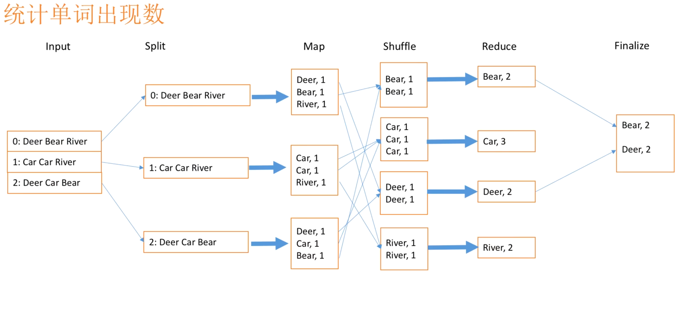

`shuffle()`函数代码如下：

```go
// shuffle函数，将一个reduce任务的所有输入中间文件中的kv排序
func shuffle(files []string) []KeyValue {
	kva := []KeyValue{}              // 存储该reduce任务所有输入的中间文件中的kv
	for _, filename := range files { // reduce阶段每个worker的输入为若干个中间文件
		file, err := os.Open(filename)
		if err != nil {
			log.Fatalf("cannot open %v", filename)
		}

		// 反序列化JSON格式文件
		dec := json.NewDecoder(file)
		// 读取文件内容
		for {
			var kv KeyValue
			// func (dec *Decoder) Decode(v interface{}) error
			// Decode从输入流读取下一个json编码值并保存在v指向的值里
			err := dec.Decode(&kv)
			if err != nil {
				break
			}
			kva = append(kva, kv) // 将中间文件的每组kv都写入kva
		}
		file.Close()
	}
	// 此时kva存放了该reduce任务的所有输入中间文件中的kv
	// 将中间键值对按key排序
	sort.Sort(ByKey(kva)) // 排序后kva形如：[{a,1},{a,1},{b,1},{c,1}...]
	return kva
}
```

这里shuffle主要是将这个reducer的输入文件（即map输出的对应中间文件）中的`json`格式文件内容读取，经过反序列化后将每一个kv对写入`kva`（`kva`存储了该reduce任务所有输入的中间文件中的kv），然后按`key`排序后返回。参考`main/mrsequenial.go`的代码，发现在调用`reducef`前需要得到有序的kv对，这样才好利用for循环更简单地将`[{a,1},{a,1},{b,1},{c,1}...]`生成`[{a,[1,1]}, {b,[1]}, {c,[1]}]`这种`单词, [1, 1, 1, ...]`的形式。

**注意：**

- 这里用到了自定义类型的排序：`[]KeyValue`的按`key`排序。

  关于Go语言[实现自定义类型的排序](https://zhuanlan.zhihu.com/p/352301583)，提供三个方法，用来实现三要素。分别是Len，Less,Swap，在本lab中的实现如下：

  ```go
  // for sorting by key.
  // 定义序列类型
  type ByKey []KeyValue
  
  // for sorting by key.
  // 定义排序三要素
  func (a ByKey) Len() int           { return len(a) }
  func (a ByKey) Swap(i, j int)      { a[i], a[j] = a[j], a[i] }
  func (a ByKey) Less(i, j int) bool { return a[i].Key < a[j].Key }
  
  // Map functions return a slice of KeyValue.
  type KeyValue struct {
  	Key   string
  	Value string
  }
  ```

- 此处`json`数据的解码采用`Decode`方法，可以了解 [json数据的两种解码方法](https://blog.csdn.net/qq_42346574/article/details/112652075)


#### 4.6.4 wc.go的源码

这里放上单词计数应用`wc.go`的源码，可以看下`mapf`和`reducef`内部逻辑是什么，搞清楚输入输出的格式：

```go
package main

//
// a word-count application "plugin" for MapReduce.
//
// go build -buildmode=plugin wc.go
//

import "6.824/src/mr"
import "unicode"
import "strings"
import "strconv"

// The map function is called once for each file of input. The first
// argument is the name of the input file, and the second is the
// file's complete contents. You should ignore the input file name,
// and look only at the contents argument. The return value is a slice
// of key/value pairs.
func Map(filename string, contents string) []mr.KeyValue {
	// function to detect word separators.
	// 分隔符是非字母的unicode
	ff := func(r rune) bool { return !unicode.IsLetter(r) }

	// split contents into an array of words.
	// FieldsFunc返回将字符串按照函数f来确定的分割符来分割的多个字符串
	words := strings.FieldsFunc(contents, ff)

	kva := []mr.KeyValue{}
	// 返回的是索引和数据，数据w是分好的单词，索引不关心
	for _, w := range words {
		// {单词， 1}作为一个键值对追加到kva
		kv := mr.KeyValue{w, "1"}
		kva = append(kva, kv)
	}
	return kva
}

// The reduce function is called once for each key generated by the
// map tasks, with a list of all the values created for that key by
// any map task.
func Reduce(key string, values []string) string {
	// return the number of occurrences of this word.
	// strconv.Itoa(i) 返回i的十进制字符串表示
	// 由于map输出的键值对是{单词，1}，因此values的len就等于value求和
	return strconv.Itoa(len(values))
}
```


### 4.7 完成worker完成任务后向master汇报的交互

上面已经实现了worker得到任务后实际执行任务的函数，接下来就要考虑任务执行完毕后如何通知master并修改相应的状态。因为master要通过worker的汇报才能得知哪些任务已经完成，才能进行任务状态的更新、执行阶段的转换等操作。这就又涉及到master和worker之间的通信，还是采用RPC调用的方式，需要再设计一组RPC请求和处理的方法，可以参考之前请求和分配任务的逻辑，不过这次只是汇报任务已完成以及更新状态，逻辑更简单。

#### 4.7.1 worker通过RPC调用告知master任务已完成

worker完成任务后调用RPC告知master并请求修改任务状态的函数`FinishTaskAndReport`，代码如下：

```go
// worker完成任务后调用RPC告知master并请求修改任务状态
func FinishTaskAndReport(id int) {
	args := FinArgs{TaskId: id}
	reply := FinReply{}

	// 请求调用Master的UpdateTaskState方法
	ok := call("Master.UpdateTaskState", &args, &reply)
	if !ok { //请求失败
		fmt.Println("Call failed!")
	}
}
```

需要传入的是worker完成的任务的`taskId`，因为每个任务`taskId`唯一，因此只需要知道它master就能从`TaskMap`中找到这个任务并修改状态。

这里又定义了一组`args`和`reply`类型，分别是`FinArgs`和`FinReply`，专门用在这一组通信逻辑中，它们的结构体的定义放在`rpc.go`中，如下：

```go
// worker完成工作后调用RPC通知master更新任务状态的传入参数——传入要更新的taskId即可
type FinArgs struct {
	TaskId int
}

// worker完成工作后调用RPC通知master更新任务状态的返回参数——事实上不需要传出什么，master自己修改TaskMap中的对应任务状态即可
type FinReply struct {
}
```

worker完成工作后调用RPC通知master更新任务状态只需要传入要更新的`taskId`即可，事实上不需要传出什么。

请求调用Master的`UpdateTaskState`方法，代码见4.7.2。


#### 4.7.2 master处理此RPC调用修改任务状态

编写master收到通知后负责修改worker完成任务的状态的函数`UpdateTaskState`，代码如下：

```go
// 当worker完成任务时，会调用RPC通知master
// master得知后负责修改worker完成任务的状态,以便master检查该阶段任务是否全部已完成
func (m *Master) UpdateTaskState(args *FinArgs, reply *FinReply) error {
	mu.Lock()
	defer mu.Unlock()
	id := args.TaskId
	fmt.Printf("Task[%d] has been finished!\n", id)

	// 由于创建任务时map任务和reduce任务被分配的taskId是唯一的，因此可以通过taskId在TaskMap中找到对应的Task
	m.TaskMap[id].TaskState = Finshed // 将TaskMap中对应的Task状态修改为Finished
	return nil
}
```

当worker完成任务时，会调用RPC通知master，master得知后负责修改worker完成任务的状态，以便master检查该阶段任务是否全部已完成。

由于涉及到共享字段的访问和修改，因此先加锁。然后根据`args`传入的`TaskId`，master在`TaskMap`中找到对应的任务，修改其状态为`Finished`，标志该任务已完成。


### 4.8 编写Worker主逻辑

在`work.go`中worker各种的操作函数已经编写完毕，还剩下`worker()`函数待填充。这个函数由`main/mrworker.go`调用，相当于起了一个worker线程，创建了一个worker（worker并不像master一样是结构体，而只是一个函数）。

`mrworker`在调用`worker`时需要传入mr应用的具体`mapf`和`reducef`。

由于worker不是完成一个任务后就退出，它在完成一个任务后如果master还有待分配的任务，那么它还可以继续请求任务。所以函数主体使用一个`for`循环，使得worker周期性地向master请求任务。**根据之前在`TaskReply`中设置的`Answer`字段，worker可以得知每次请求任务是否成功，以便自己作出正确的处理**，具体如下：

- 每次循环worker首先调用`RequestTask()`函数向master请求分配任务，然后判断返回的`TaskReply`的`Answer`。
- 如果`Answer`等于`TaskGetted`，代表此次请求worker成功被分配到了任务，此时`TaskReply`中设置的`Task`字段才有效。接下来worker就要执行对应的任务操作，因此需要进一步判断`Task`是什么任务（通过判断任务类型）：
  - 如果是map任务，那么依次调用"执行map任务的函数`PerformMapTask(mapf, &task)`"以及"完成任务后报告给master的函数`FinishTaskAndReport(task.TaskId)`"。
  - 如果是reduce任务，那么依次调用"执行reduce任务的函数`PerformTReduceTask(reducef, &task)`"以及"完成任务后报告给master的函数`FinishTaskAndReport(task.TaskId)`"。
- 如果`Answer`等于`WaitPlz`，代表由于当前阶段暂时没有未分配的任务，此次请求没有获得任务，worker可以等待1s后再次请求任务。
- 如果`Answer`等于`FinishAndExit`，代表mapreduce已经处于`AllDone`阶段，worker需要准备退出了。此时将循环标志`loop`置为`false`，跳出任务请求循环，准备结束worker线程。相当于进入收尾阶段。


`Worker()`函数代码如下：

```go
// main/mrworker.go calls this function.
// 传入mapf，reducef
func Worker(mapf func(string, string) []KeyValue,
	reducef func(string, []string) string) {

	// workers周期性地向master请求任务，每次请求之间休眠 time.Sleep()
	loop := true

	for loop {
		re := RequestTask()
		switch re.Answer {
		case TaskGetted: // 当worker成功被分配到任务
			task := re.Task
			switch task.TaskType {
			case MapTask: // map任务
				fmt.Printf("A worker get a map task and taskId is %d\n", task.TaskId)
				PerformMapTask(mapf, &task)
				FinishTaskAndReport(task.TaskId)
			case ReduceTask: // reduce任务
				fmt.Printf("A worker get a reduce task and taskId is %d\n", task.TaskId)
				PerformReduceTask(reducef, &task)
				FinishTaskAndReport(task.TaskId)
			}
		case WaitPlz: // 本次请求并未分得任务，worker等待1s后再下次请求
			time.Sleep(time.Second)
		case FinishAndExit: // mapreduce已经处于AllDone阶段，worker准备退出
			loop = false
		default:
			fmt.Println("request task error!")
		}
	}
}
```

**注意：**

- worker向master请求分配任务如何得知是否真正分得了任务？

  ——根据之前在`TaskReply`中设置的`Answer`字段，worker可以得知每次请求任务是否成功，以便自己作出正确的处理。


### 4.9 利用协程不停探测并处理crash

到上面为止，mr的绝大部分代码逻辑都已经完成了，还需要完善一下细节。根据lab要求以及最后的测试脚本，mr工作还需要实现当运行任务的worker瘫痪时是否能恢复，即容错机制。

根据lab的提示，可以让master等待一段时间（如10s），然后放弃并将任务重新分配给其他worker。所以这里利用了Go语言中的协程，在`MakeMaster()`中开启一个开启探测并处理crash的协程`CrashHandle()`，在mr执行期间不停地探测是否有`Working`状态的任务执行时间超过了10s。

```go
go m.CrashHandle() // 开启探测并处理crash的协程
```

如果超过了，那么不管它是崩溃的工作线程、还活着但由于某种原因而停滞的工作线程还是正在执行但速度太慢而无法使用的工作线程（因为master无法区分这些情况，那就不区分），master都认为这个发生了crash，需要对其进行处理。

处理方法是将该任务重置，当作未分配的任务重新加入`MapTaskChannel`等待分配，相应地将任务状态为待分配，将crash的任务从`TaskMap`中删除，等到再分配时添加回来（这是为了保证`TaskMap`中只有已分配给worker的Task记录，未分配的Task放在channel里）。这样下次有worker向master请求任务时，这个crash的任务可以被重新分配给其他worker。


`CrashHandle()`协程代码逻辑如下：

```go
// master不能可靠地区分崩溃的工作线程、还活着但由于某种原因而停滞的工作线程和正在执行但速度太慢而无法使用的工作线程。
// 可以让master等待一段时间（如10s），然后放弃并将任务重新分配给其他worker，在此之后，master应该认为那个worker已经死亡
func (m *Master) CrashHandle() {
	for {
		time.Sleep(time.Second * 2)        // 每2秒做一次判断
		mu.Lock()                      // 访问master的共享资源先加锁
		if m.CurrentPhase == AllDone { // 所有任务都完成了就不用再判断crash了
			mu.Unlock()
			break
		}

		for _, task := range m.TaskMap {
			// Since()函数保留时间值，并用于评估与实际时间的差异
			// time.Since(t)等价于time.Now().Sub(t)
			// 当任务处于Working状态持续10s以上时认为crash
			if task.TaskState == Working && time.Since(task.StartTime) > 10*time.Second {
				fmt.Printf("Task[%d] is crashed!\n", task.TaskId)
				// 将该任务重置当作未分配的任务重新加入MapTaskChannel等待分配
				// StartTime会在任务重新被分配给worker时更新
				task.TaskState = Waiting // 更新状态为待分配
				switch task.TaskType {   // 加入对应的channel等待分配给其他worker
				case MapTask:
					m.MapTaskChannel <- task
				case ReduceTask:
					m.ReduceTaskChannel <- task
				}
				delete(m.TaskMap, task.TaskId) // 将crash的任务从TaskMap中删除，等到再分配时添加回来
				// 这是因为保证TaskMap中只有分配给worker的Task记录（正在执行和已完成），未分配的Task放在channel里
			}
		}
		mu.Unlock()
	}
}
```


### 4.10 实现master.go中的Done()方法

根据lab的要求，`main/mrmaster.go` 期望 `mr/master.go` 实现一个 `Done()` 方法，当MapReduce工作完成时返回`true`，在那个时候， `mrmaster.go` 将退出。可以看到，这个`Done()`方法是用来检查master何时退出、mr程序何时退出。

代码逻辑很简单，就是在每次调用时检查当前阶段是否为`AllDone`，若是，则代表mr任务都已完成，可以开始退出。

```go
// main/mrmaster.go 周期性地调用 Done() 来检查整个工作
func (m *Master) Done() bool {
	ret := false
	mu.Lock() // 先加锁，因为master在执行其他过程中也可能正在访问CurrentPhase
	defer mu.Unlock()
	if m.CurrentPhase == AllDone {
		ret = true
	}
	return ret
}
```


## 五、测试

### 5.1 运行测试脚本

在终端运行提供的测试脚本`sh test-mr.sh`


### 5.2 报错“connection refused”

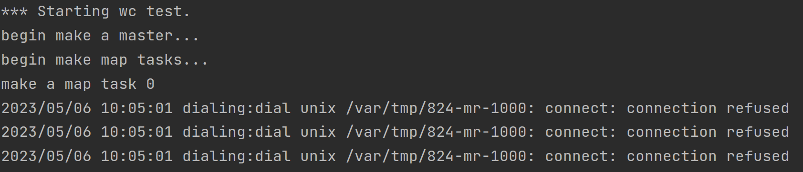

- 一开始设置crash每3s探测一次，而`mrmaster.go`在每1s调用一次`Done()`检测所有任务是否都完成，若`AllDone`则1s后master再退出。这就导致可能master已经退出了crash还在探测，就出现`connection refused`错误。因此将crash改为每2s做一次判断

```go
func (m *Master) CrashHandle() {
	for {
		time.Sleep(time.Second * 2)    // 每2秒做一次判断
		mu.Lock()                      // 访问master的共享资源先加锁
		if m.CurrentPhase == AllDone { // 所有任务都完成了就不用再判断crash了
			mu.Unlock()
			break
		}

		for _, task := range m.TaskMap {
			// Since()函数保留时间值，并用于评估与实际时间的差异
			// time.Since(t)等价于time.Now().Sub(t)
			// 当任务处于Working状态持续10s以上时认为crash
			if task.TaskState == Working && time.Since(task.StartTime) > 10*time.Second {
				fmt.Printf("Task[%d] is crashed!", task.TaskId)
				// 将该任务重置当作未分配的任务重新加入MapTaskChannel等待分配
				// StartTime会在任务重新被分配给worker时更新
				task.TaskState = Waiting // 更新状态为待分配
				switch task.TaskType {   // 加入对应的channel等待分配给其他worker
				case MapTask:
					m.MapTaskChannel <- task
				case ReduceTask:
					m.ReduceTaskChannel <- task
				}
				delete(m.TaskMap, task.TaskId) // 将crash的任务从TaskMap中删除，等到再分配时添加回来
				// 这是因为保证TaskMap中只有分配给worker的Task记录（正在执行和已完成），未分配的Task放在channel里
			}
		}
		mu.Unlock()
	}
}
```


### 5.3 程序运行到makeMapTask卡死

- 由终端打印出的信息可以看到，make了第0个map任务后就卡死了

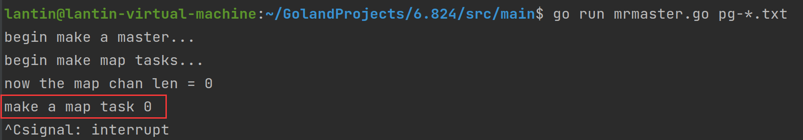


- 经过逐步排查，发现是在将task加入MapTaskChannel时卡死

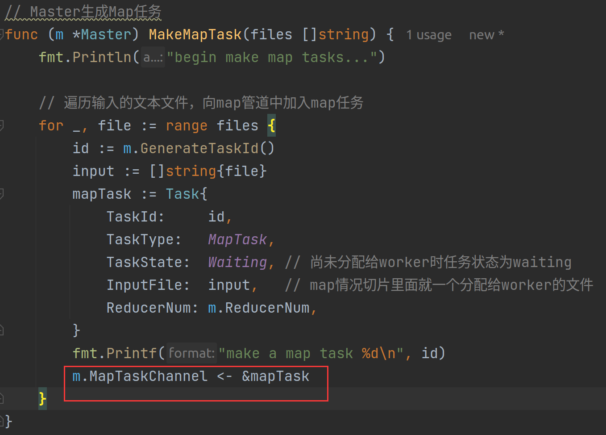


- `Master`结构体关于`channel`的声明如下，只是指出了`chan`的类型：

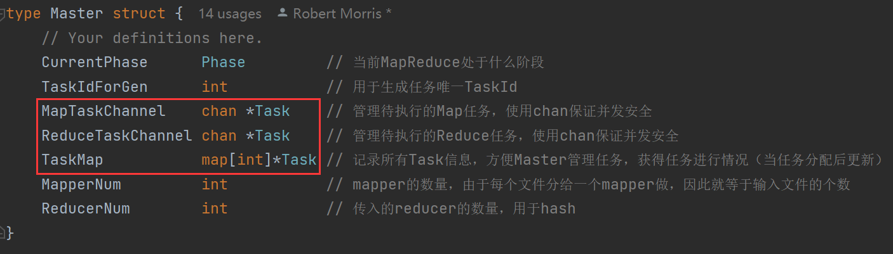

而在创建`Master`的`MakeMaster`函数中却没有对这些channel初始化：

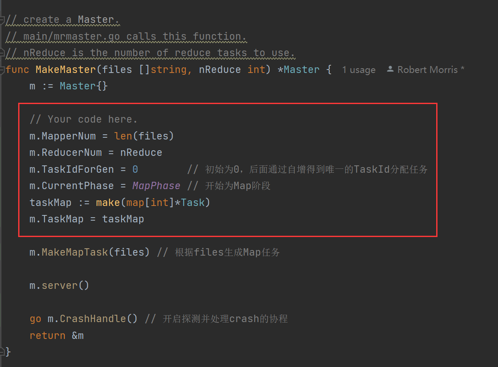

因此对`MakeMaster`作如下修改，初始化channel和map并设置它们的容量大小（channel的容量也代表缓存大小）：

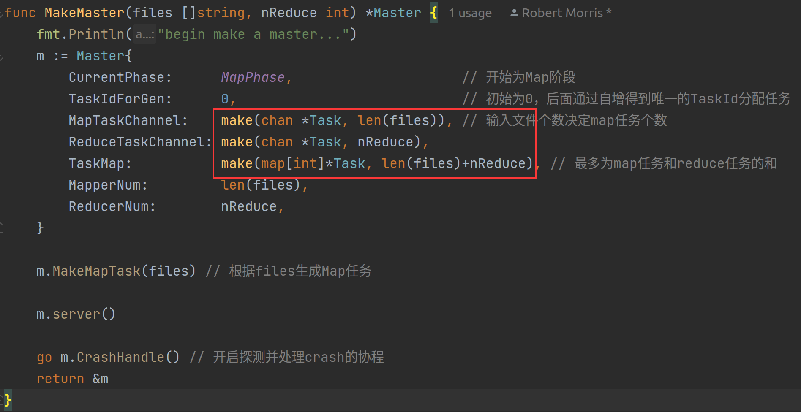


### 5.4 切片访问越界报错

- 将上述两个报错修改后运行测试脚本`sh test-mr.sh`后`wc test`、`indexer test`通过了测试。但在`map parallelism test`出现了错误：

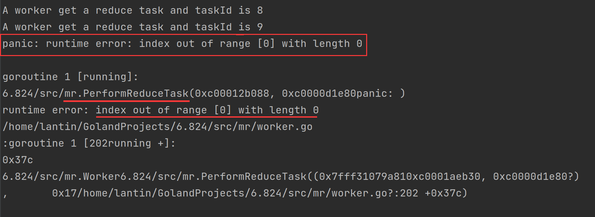


- 根据定位找到是`worker.go`中的reduce任务执行函数`PerformReduceTask`，出现了切片访问越界问题：

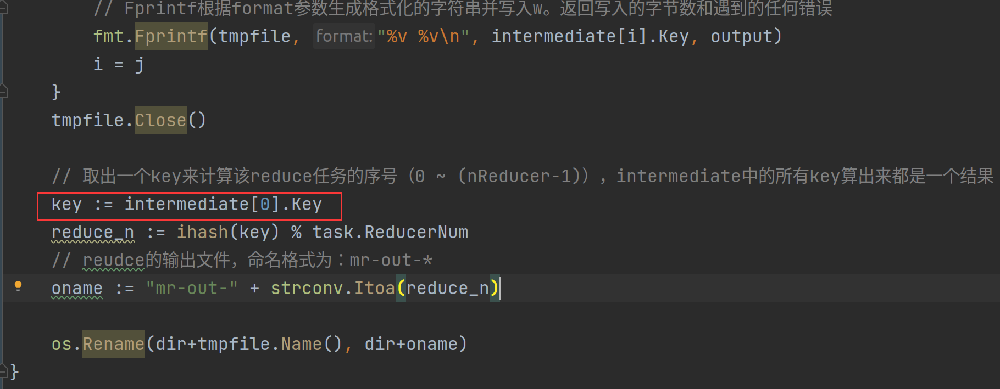


- `key := intermediate[0].Key`本意是想在`immediate`中取出第一个元素，根据它的key计算出这个reduce的输出文件名，因为`mr-out-*`这里的`*`应该是`0 ~ (nReducer-1)`的一个值，并不等于reduce task的`taskId`（所有map和reduce任务得`taskId`是唯一的，reduce任务的`taskId`是接在`map`任务的后面）。

  但经过排查`mr-tmp`文件夹下的文件，发现测试过程中有的reduce的输入中间文件中没有kv对，即最开始的测试文本中没有对应这个reduce的单词key！这就导致`intermediate`切片中此时也没有元素，从而访问`intermediate[0]`出现越界。

  在执行`PerformMapTask`函数时，可以看到无论是否有kv对被归到第`i`个reduce执行，中间文件`mr-0-i`、`mr-2-i`、...、`mr-7-i`都生成了，只是里面没有内容罢了，因此第`i`个reduce的`input`还是有那么多个中间文件，只是没有内容罢了：

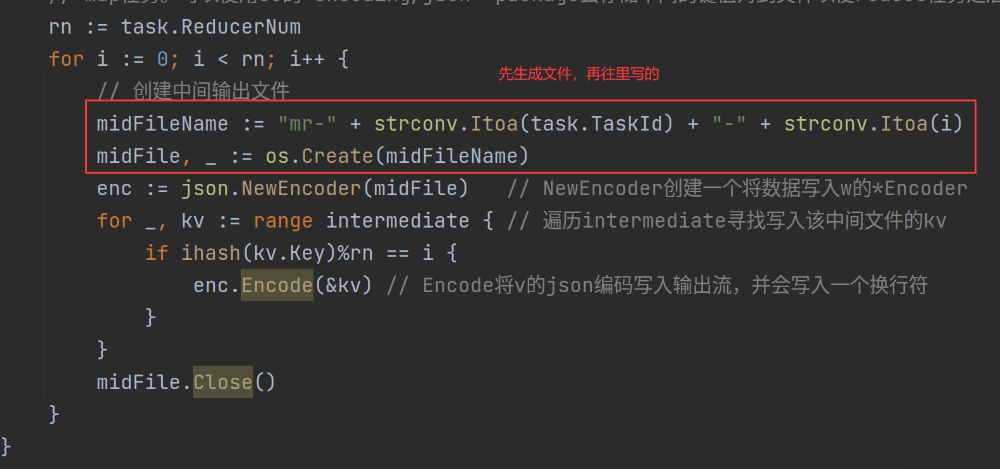


- 因此作出修改，在`Task`结构体中添加成员`ReducerKth`来记录reducer的序号，并在`MakeReduceTask()`生成reduce任务时初始化：

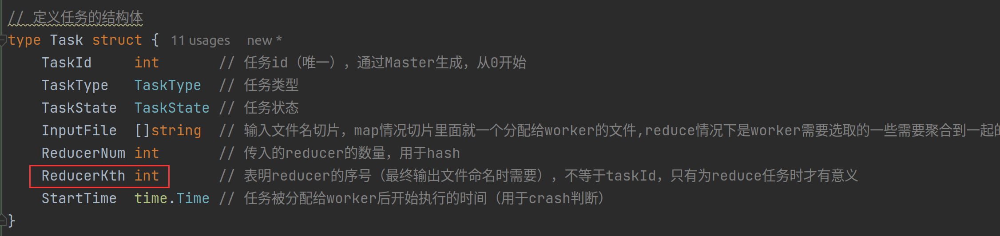

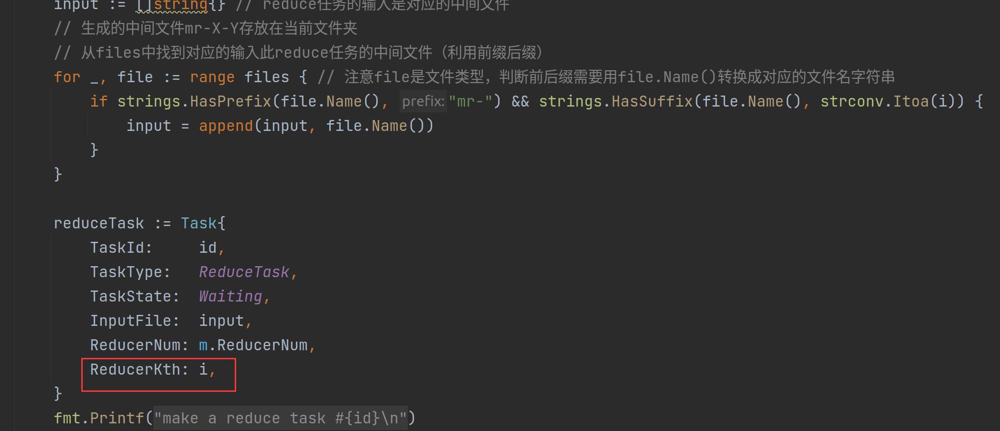

再将`PerformReduceTask`函数中数组越界处代码修改：

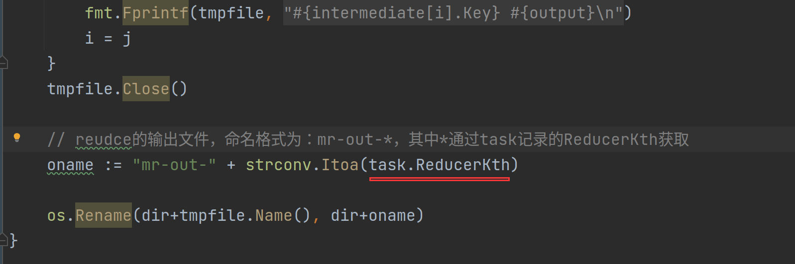


### 5.5 ALL PASS!

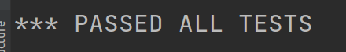

​	将上面三个bug修复后所有7个test都通过啦！！！


## 六、总结

1. 养成变量初始化的好习惯。这次调bug过程中，很大部分时间都花在5.3由于channel未初始化的问题上，还是因为平时编程习惯太随意以及对Go语言的学习还太浅，为了做lab临时学的Go还是不够深入，但是在实践中学习进步确实快。

2. 随时打印执行阶段。可以在各个函数中、各个阶段里清晰地在终端打印出对应信息，这很有助于之后的bug调试！！！对于分布式的程序或者多线程程序，调试是比较困难的，所以在终端中输出清晰的标志信息有助于定位是哪里出现了问题，哪里卡死了。打印输出不断缩小范围debug非常有效！！！

3. 本次实验要求在linux上运行，因此我安装了Ubuntu虚拟机。有时涉及到需要在linux虚拟机和本机windows之间文件互传。可以通过xshell：

   通过xshell实现linux虚拟机和本机windows上的文件互传：

   - 服务器要安装了rz，sz（`yum install lrzsz`）

   - 本地windows主机也通过ssh连接了linux服务器
   - 运行sz，会将文件下载到windows本地：
     - 下载一个文件 sz filename 
     - 下载多个文件 sz filename1 filename2 　
     - 下载dir目录下的所有文件，不包含dir下的文件夹 sz dir/*

   - 运行rz，会将windows的文件传到linux服务器：

     输入rz回车后，会出现文件选择对话框，选择需要上传文件，一次可以指定多个文件，上传到服务器的路径为当前执行rz命令的目录。

4. linux上压缩文件夹：

   - `tar -zcvf 压缩包名.tar.gz 压缩文件夹名`， 如`tar -zcvf dir1.tar.gz dir1`
   - `zip -r 压缩包名.zip 压缩文件夹名`，如`zip -r dir1.zip dir1`
   
5. linux上解压文件：

   - `tar -zxvf 压缩包名.tar.gz`， 如`tar -zxvf zipFile.tar.gz`

   - `unzip 压缩包名.zip`，解压到当前路径，如`unzip zipFile.zip`

     `unzip 压缩包名.zip -d 文件夹路径`，解压到特定文件夹内，如`unzip zipFile.zip -d dir`

6. 一些关于`Git`、`github`、`markdown`使用上遇到的问题及解决办法：

   - 利用`Git`上传项目到`github`：

     - 先在`github`创建仓库

     - 然后在本地仓库打开`Git bash`，依次输入指令：

       ```shell
       git init
       git add README.md
       git commit -m "first commit"
       git branch -M main
       git remote add origin https://github.com/lantin16/仓库名.git
       git push -u origin main
       ```

     - 若`git remote add origin xxx`时报错，解决办法见：[git问题error: remote origin already exists.](https://blog.csdn.net/weixin_43916997/article/details/123645376)

     - 若上传项目文件后在`github`中见到文件夹图标上有白色箭头且无法打开文件夹，解决办法见：[github文件夹有白色箭头并且不能打开的解决办法](https://blog.csdn.net/xiebaochun/article/details/114143346)
     
     - 关于`README`中的图片由于本地路径的原因在上传`github`后无法显示的问题：
     
       - 将Typora设置为“复制图片到assets文件夹”以及“优先使用相对路径”：
     
         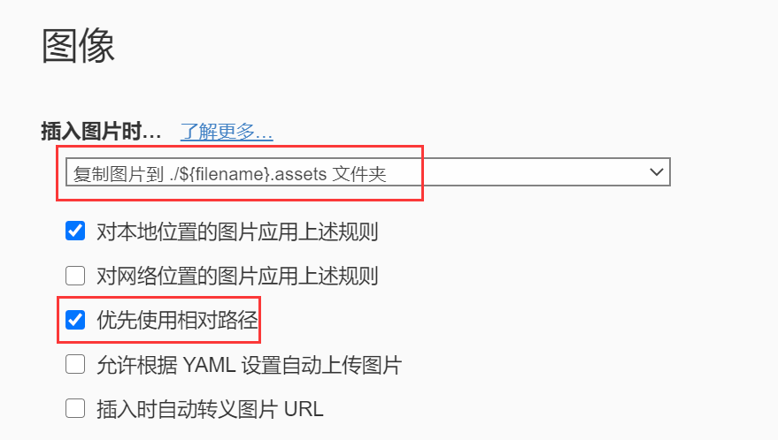
     
       - 在一开始就将文件名改为“Lab1-README”，这样生成的就是`Lab1-README.assets`图片文件夹。
     
       - 然后在上传到`gtihub`时将`README`文件和`Lab1-README.assets`文件夹都上传，这样就可以在`github`上通过相对路径访问到服务器上的图包文件夹从而正常显示图片了。
     
     - [typora toc生成大纲目录后传到github不显示问题](https://www.cnblogs.com/cool-fire/p/15728127.html)
     
     - `github`上可以直接操作删除仓库中的某个文件：[删除仓库中的文件](https://docs.github.com/zh/repositories/working-with-files/managing-files/deleting-files-in-a-repository)
     

7. [GitHub代码仓库地址](https://github.com/lantin16/6.824_lab1_MR.git)


## 七、参考

- [参考实现1](https://blog.csdn.net/weixin_45938441/article/details/124018485?spm=1001.2101.3001.6650.5&utm_medium=distribute.pc_relevant.none-task-blog-2%7Edefault%7EBlogCommendFromBaidu%7ERate-5-124018485-blog-120931874.pc_relevant_3mothn_strategy_recovery&depth_1-utm_source=distribute.pc_relevant.none-task-blog-2%7Edefault%7EBlogCommendFromBaidu%7ERate-5-124018485-blog-120931874.pc_relevant_3mothn_strategy_recovery&utm_relevant_index=10)

- [参考实现2](https://juejin.cn/post/6865679367398227981#heading-16)
- [Golang标准库文档](http://doc.golang.ltd/)
- [6.824 lab1 官方说明与提示](http://nil.csail.mit.edu/6.824/2020/labs/lab-mr.html)


