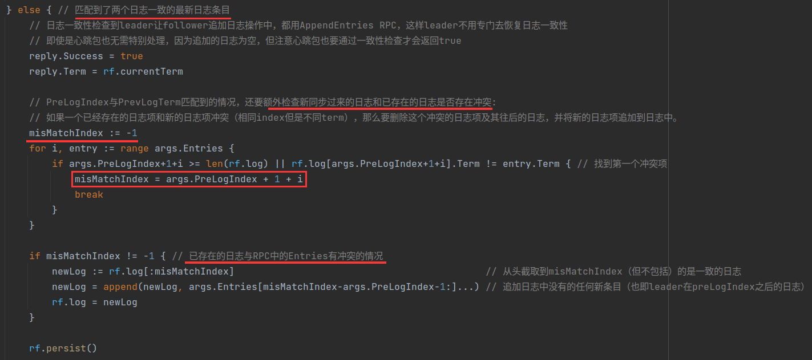
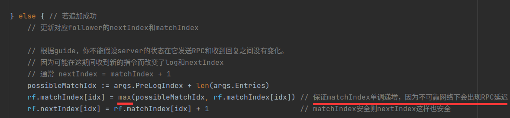

- [Lab 2 - Raft](#lab-2---raft)
	- [一、实验相关准备](#一实验相关准备)
	- [二、任务梳理](#二任务梳理)
		- [2.1 任务说明](#21-任务说明)
		- [2.2 Part 2A](#22-part-2a)
			- [2.2.1 任务要求](#221-任务要求)
			- [2.2.2 任务提示](#222-任务提示)
		- [2.3 Part 2B](#23-part-2b)
			- [2.3.1 任务要求](#231-任务要求)
			- [2.3.2 任务提示](#232-任务提示)
		- [2.4 Part 2C](#24-part-2c)
			- [2.4.1 任务要求](#241-任务要求)
			- [2.4.2 任务提示](#242-任务提示)
	- [三、环境搭建](#三环境搭建)
	- [四、编程实现](#四编程实现)
		- [4.1 查看各相关源文件的作用](#41-查看各相关源文件的作用)
		- [4.2 定义raft的相关结构体](#42-定义raft的相关结构体)
		- [4.3 完成Make函数](#43-完成make函数)
		- [4.4 实现Raft的leader选举和心跳机制](#44-实现raft的leader选举和心跳机制)
			- [4.4.1 超时检测](#441-超时检测)
			- [4.4.2 candidate参选](#442-candidate参选)
			- [4.4.3 server的投票逻辑](#443-server的投票逻辑)
			- [4.4.4 当选leader](#444-当选leader)
			- [4.4.5 实现GetState函数](#445-实现getstate函数)
		- [4.5 实现leader和follower追加新日志条目](#45-实现leader和follower追加新日志条目)
			- [4.5.1 实现Start函数](#451-实现start函数)
			- [4.5.2 leader发送AppendEntry](#452-leader发送appendentry)
			- [4.5.3 follower接收AppendEntries RPC](#453-follower接收appendentries-rpc)
		- [4.6 实现applier](#46-实现applier)
		- [4.7 实现raft状态的持久化以及重启后恢复](#47-实现raft状态的持久化以及重启后恢复)
			- [4.7.1 实现保存持久状态函数persist](#471-实现保存持久状态函数persist)
			- [4.7.2 实现恢复持久状态函数readPersist](#472-实现恢复持久状态函数readpersist)
			- [4.7.3 在对应位置添加持久化及恢复持久化状态的调用](#473-在对应位置添加持久化及恢复持久化状态的调用)
	- [五、测试](#五测试)
		- [5.1 一些技巧](#51-一些技巧)
			- [5.1.1 打印日志](#511-打印日志)
			- [5.1.2 多次测试](#512-多次测试)
			- [5.1.3 单元测试](#513-单元测试)
		- [5.2 debug记录](#52-debug记录)
			- [5.2.1 Bug in Part 2A](#521-bug-in-part-2a)
				- [5.2.1.1 切片索引越界](#5211-切片索引越界)
				- [5.2.1.2 小写字母字段导致的报错](#5212-小写字母字段导致的报错)
				- [5.2.1.3 一段时间后Candidate一直轮流参加竞选却选不出leader](#5213-一段时间后candidate一直轮流参加竞选却选不出leader)
				- [5.2.1.4. 某个leader一直在任发送心跳包，测试程序未能中止](#5214-某个leader一直在任发送心跳包测试程序未能中止)
				- [5.2.1.5 数据竞争报错](#5215-数据竞争报错)
				- [5.2.1.6 测试网络故障后的选举时没有出现不符逻辑的打印信息](#5216-测试网络故障后的选举时没有出现不符逻辑的打印信息)
				- [5.2.1.7 leader失联后会短时间内向其他server发送多次心跳包](#5217-leader失联后会短时间内向其他server发送多次心跳包)
			- [5.2.2 Bug in Part 2B](#522-bug-in-part-2b)
				- [5.2.2.1 client向leader发送指令后却使得该leader阻塞了](#5221-client向leader发送指令后却使得该leader阻塞了)
				- [5.2.2.2 TestFailAgree2B报错：failed to reach agreement](#5222-testfailagree2b报错failed-to-reach-agreement)
			- [5.2.3 Bug in Part 2C](#523-bug-in-part-2c)
				- [5.2.3.1 TestUnreliableAgree2C报错：切片索引越界](#5231-testunreliableagree2c报错切片索引越界)
				- [5.2.3.2 Part 2C部分测试报错：failed to reach agreement 以及apply error](#5232-part-2c部分测试报错failed-to-reach-agreement-以及apply-error)
				- [5.2.3.3 Part 2C debug 总结](#5233-part-2c-debug-总结)
	- [六、总结](#六总结)

# Lab 2 - Raft


## 一、实验相关准备

- 6.824相关课程
- [Lab2说明及提示](http://nil.csail.mit.edu/6.824/2020/labs/lab-raft.html)
- 经典论文：
  - Fault-Tolerant Virtual Machines
  - In Search of an Understandable Consensus Algorithm
- [Raft共识算法讲解视频](https://www.bilibili.com/video/BV1pr4y1b7H5/?spm_id_from=333.788.top_right_bar_window_view_later.content.click&vd_source=240b118997ae58197aff4713d72527f3)
- [关于Raft实现的建议](https://thesquareplanet.com/blog/students-guide-to-raft/)
- [Raft可视化模拟](https://raft.github.io/)


## 二、任务梳理

### 2.1 任务说明

- 提供了框架代码`src/raft/raft.go`

- 提供了测试程序`src/raft/test_test.go`

- 完成实验后执行以下命令进行测试：

  ```shell
  $ cd ~/6.824
  $ git pull
  ...
  $ cd src/raft
  $ go test
  Test (2A): initial election ...
  --- FAIL: TestInitialElection2A (5.04s)
  config.go:326: expected one leader, got none
  Test (2A): election after network failure ...
  --- FAIL: TestReElection2A (5.03s)
  config.go:326: expected one leader, got none
  ...
  $
  ```

- 关于代码：

  - Raft的实现放在`raft/raft.go`，你的实现必须包括下面的接口

    ```go
    // create a new Raft server instance:
    rf := Make(peers, me, persister, applyCh)
    
    // start agreement on a new log entry:
    rf.Start(command interface{}) (index, term, isleader)
    
    // ask a Raft for its current term, and whether it thinks it is leader
    rf.GetState() (term, isLeader)
    
    // each time a new entry is committed to the log, each Raft peer
    // should send an ApplyMsg to the service (or tester).
    type ApplyMsg
    ```

    - `Make(peers, me, persister, applyCh)`创建一个Raft peer

      `peers`参数是Raft peers（包括这一个）的网络标识符的一个数组

      `me`参数是这个peer在peer数组里的索引

    - `Start(command)`让Raft开始处理将指令追加到replicated log

      `Start()`应该立刻返回，而不应该等到追加完成

      该服务期望你的实现为每个新提交的日志条目发送`ApplyMsg`到`Make()`的`applyCh`通道参数。

    - `raft.go`包含有发送RPC（`sendRequestVote()`）和处理传入的RPC（`RequestVote()`）的示例代码

    - 你的Raft peers应该使用`src/labrpc`包来交换RPCs

      tester会让`labrpc`来延迟RPCs、将它们重新排序、丢弃它们来模拟各种网络故障

      你可以暂时修改`labrpc`，但是确保在提交测试时使用的是原始的`labrpc`

    - 你的Raft实例必须只能用RPC交互。比如，你不能使用Go的共享变量或者文件来交互

  - 本次lab2分为三个部分


### 2.2 Part 2A

#### 2.2.1 任务要求

- 实现Raft的leader选举和心跳机制（没有`log entries`的`AppendEntries`RPCs）。

- Part 2A的目标是：选出一个leader，在没有故障的情况下，这个leader仍然是leader；如果旧leader故障，或者旧leader的数据包丢失，那么新的leader接管。

- 运行`go test -run 2A`来测试你的Part 2A部分的代码。

  **路径切换**到`6.824/src/raft`再执行测试`go test -run 2A`
  
  若Part 2A全部通过，则显示如下：
  
  ```go
  $ go test -run 2A
  Test (2A): initial election ...
  ... Passed -- 4.0 3 32 9170 0
  Test (2A): election after network failure ...
  ... Passed -- 6.1 3 70 13895 0
PASS
  ok raft 10.187s
$
  ```
  
  每个"Passed"行包括5个数字，它们分别是：
  
  1. 测试花费的时间（以秒为单位）
  2. Raft peers的数量（通常是3或5）
  3. 在测试期间发送的RPC的数量
  4. RPC消息中的总字节数
  5. 以及Raft报告提交的日志条目的数量。


#### 2.2.2 任务提示

- 你不能直接运行你的Raft实现；相反，你应该通过tester来运行它，即运行`go test -run 2A`

- 根据Raft论文中的Figure 2，此阶段，你关心的是发送和接收RequestVote RPCs、与选举相关的服务器规则以及与leader选举相关的状态

  

- 将Figure 2中的leader选举的状态添加到`raft.go`中的Raft结构中。

  你还需要定义一个结构来保存关于每个日志条目的信息。

- 填充`RequestVoteArgs`和`RequestVoteReply`结构体。修改`Make()`以创建一个后台groutine，当它有一段时间没有收到另一个peer的消息时，通过发送RequestVote RPCs周期性地启动leader选举。

  通过这种方式，peer将了解谁是leader，如果已经有leader，或者自己成为leader。

  实现`RequestVote()` RPC处理程序，以便服务器相互投票。

- 要实现心跳（heartbeats），定义一个`AppendEntries` RPC结构(尽管你可能还不需要所有参数)，并让leader定期发送它们。

  编写一个`AppendEntries` RPC处理方法，重置选举超时，以便当一个server已经当选时，其他servers不会仍想成为leader。

- 确保不同peers的选举超时不总是同时发生，否则所有peers只会为自己投票，没有人会成为leader。

- tester要求leader每秒发送heartbeat RPCs不超过10次。

- tester要求你的Raft在旧leader故障后的5秒内选出一个新的leader（如果大多数peer仍然可以通信）。

  但是，请记住，如果出现分裂投票，leader选举可能需要多轮（如果数据包丢失或候选人不幸选择了相同的随机退出时间，则可能发生这种情况）。您必须选择足够短的选举超时设定（以及心跳间隔），以便即使需要多轮选举，也很可能在5秒内完成选举。

- 论文的5.2节提到了150到300毫秒范围内的选举超时设定。只有当leader发出的心跳频率大大超过每150毫秒一次时，这个范围才有意义。因为测试器将你的心跳限制为每秒10次，所以你必须使用比论文的150到300毫秒更大的选举超时设定的同时又不能太大，因为那样您可能无法在5秒内选出领导者。

- 你或许会发现Go的`rand`很有用。

- 你需要编写定期或延迟后执行操作的代码。要做到这一点，最简单的方法是创建一个带有调用了`time.Sleep()`的循环的goroutine。不要使用Go的`time.Timer`或 `time.Ticker` ，它们很难使用正确。

- 阅读关于[locking](http://nil.csail.mit.edu/6.824/2020/labs/raft-locking.txt)和[structure](http://nil.csail.mit.edu/6.824/2020/labs/raft-structure.txt)的建议（一定要读！！！否则Part 2A会遇到很多加锁不合理导致的死锁和`DATA RACE`！！！）。

- 如果你的代码在通过测试时遇到困难，请再次阅读论文的Figure 2，leader选举的完整逻辑就分布在Figure的多个部分。

- 不要忘记实现`GetState()`

- tester在永久关闭一个实例时会调用你的Raft的`rf.Kill()`。你可以使用`rf.killed()`检查`Kill()`是否已被调用。

  你可能希望在所有循环中都这样做，以避免死亡的Raft实例打印令人困惑的消息。

- 调试代码的一个好方法是在peer发送或接收消息时插入print语句，并使用`go test -run 2A > out`将输出收集到一个文件中。然后，通过研究`out`文件中的消息跟踪，你可以确定你的实现在哪里偏离了期望的协议。

  你可能会发现`util.go`中的`DPrintf`在调试不同的问题时打开和关闭打印非常有用。

- Go RPC只发送名称以大写字母开头的结构字段（导出的）。

  子结构也必须有大写的字段名（例如数组中的日志记录字段）。`labgob`包会提醒你这一点，不要忽视警告。

- 用`go test -race`检查你的代码，并修复它报告的任何race。


### 2.3 Part 2B

#### 2.3.1 任务要求

- 实现leader和follower追加新日志条目的代码
- 运行`go test -run 2B`来测试


#### 2.3.2 任务提示

- 你的首要目标应该是通过`TestBasicAgree2B()`。从实现`Start()`开始，然后根据Figure2写通过AppendEntries RPCs发送和接收新日志条目的代码。
- 你需要实现论文5.4.1节提到的选举限制.
- 在lab 2B的早期测试中无法达成协议的一种可能是，即使leader还活着也在反复举行选举。寻找选举计时器管理中的错误，或者在赢得选举后不立即发送心跳。
- 你的代码可能具有重复检查某些事件的循环。不要让这些循环连续执行而不暂停，因为这会拖慢实现，导致测试失败。使用Go的[条件变量](https://pkg.go.dev/sync#Cond)，或者在每个循环迭代中插入一个`time.Sleep(10 * time.Millisecond)`。
- 为了将来的实验，请编写或重写干净而清晰的代码，思路可以参考raft-structure、raft-locking和guide文档。


如果你的代码运行太慢，接下来的测试可能会失败。你可以使用`time`命令检查你的解决方案使用了多少实时时间和CPU时间。下面是典型的输出示例：

```shell
$ time go test -run 2B
Test (2B): basic agreement ...
	... Passed -- 1.6 3 18 5158 3
Test (2B): RPC byte count ...
	... Passed -- 3.3 3 50 115122 11
Test (2B): agreement despite follower disconnection ...
	... Passed -- 6.3 3 64 17489 7
Test (2B): no agreement if too many followers disconnect ...
	... Passed -- 4.9 5 116 27838 3
Test (2B): concurrent Start()s ...
	... Passed -- 2.1 3 16 4648 6
Test (2B): rejoin of partitioned leader ...
	... Passed -- 8.1 3 111 26996 4
Test (2B): leader backs up quickly over incorrect follower logs ...
	... Passed -- 28.6 5 1342 953354 102
Test (2B): RPC counts aren't too high ...
	... Passed -- 3.4 3 30 9050 12
PASS
ok raft 58.142s

real 0m58.475s
user 0m2.477s
sys 0m1.406s
$
```

- "ok raft 58.142s"意味着Go测量Part 2B花费的实际时间为58.142秒。

- “user 0m2.477s”意味着代码消耗了2.477秒的CPU时间，即实际执行指令所花费的时间（而不是等待或休眠的时间）。

- 如果你的解决方案在Part 2B测试中使用的实时时间远远超过一分钟，或者CPU时间远远超过5秒，那么你之后可能会遇到麻烦。

  查看花费在睡眠或等待RPC超时上的时间、在没有睡眠或等待条件或通道消息的情况下运行的循环，或者大量的RPC发送。


### 2.4 Part 2C

如果基于raft的服务器重新启动，它应该从停止的地方恢复服务。这要求Raft在重新启动后保持持久状态。论文的Figure2提到了哪个状态应该是持久化的。

真正的实现会在每次更改时将Raft的持久状态写入磁盘，并在重新启动后从磁盘读取状态。你的实现将不使用磁盘，相反，它将从`Persister`对象保存和恢复持久状态(参见`Persister.go`)。调用`Raft.Make()`的会提供一个初始保存Raft最近持久化状态（如果有的话）的`Persister`。Raft应该从这个`Persister`初始化它的状态，并且应该在每次状态改变时使用它来保存自己的持久状态。使用`Persister`的`ReadRaftState()`和`SaveRaftState()`方法。


#### 2.4.1 任务要求

- 完成`raft.go`中的`persist()`和`readPersist()`函数，通过添加代码来保存和恢复持久状态。
- 你需要将状态编码（或“序列化”）为字节数组，以便将其传递给`Persister`。
- 使用`labgob`编码器，参见`persist()`和`readPersist()`中的注释。`labgob`类似于Go的gob编码器，但如果你尝试编码带有小写字段名的结构，则会打印错误信息。
- 在你的实现更改持久化状态的地方插入对`persist()`的调用。一旦你完成了这些，你就应该能通过剩下的测试。

**注意**：为了避免内存耗尽，Raft必须定期丢弃旧的日志条目，但是在下次实验之前你不必担心这个问题。


#### 2.4.2 任务提示

- 许多2C测试涉及服务器故障和网络丢失RPC请求或应答。
- 您可能需要一次将nextIndex备份多个条目的优化。看看从论文第7页底部到第8页顶部(用灰线标记)。
- 完整的Lab2测试（2A+2B+2C）所需的合理时间是4分钟的实时时间和1分钟的CPU时间。


## 三、环境搭建

- 虚拟机ubuntu-22.04.1
- GoLand 2022.3.2
- Go 1.19.5


## 四、编程实现

考虑到lab3与lab2的关联性，在完成lab3的过程中需要修改lab2中的不完善代码。因此这一节中的代码是在完成了lab3后的版本，部分变量和函数调用会在lab3文档中说明。


### 4.1 查看各相关源文件的作用

lab2的相关示例和代码在`6.824/src/raft`文件夹中

```
-raft
	-config.go
	-raft.go
	-persister.go
	-test_test.go
	-util.go
```

这些文件的作用如下：

1. config.go

   完成raft集群的相关配置，模拟测试中可能出现的情形

2. raft.go

   提供raft结构框架和需要实现的相关API，根据注释完成相关功能的实现（主要编程部分）

3. persister.go

   帮助raft和kvraft持久化raft状态和快照

4. test_test.go

   raft部分测试程序，模拟了实际可能遇到的网络延迟、不稳定、丢包、分区等问题，测试raft集群实现的正确性和健壮性

5. util.go

   工具文件，目前提供了控制raft日志打印的`DPrintf()`函数，若在raft中想要打印日志可以使用`DPrintf()`，然后调试时若想打印日志则将util.go文件中的`Debug`改为1，否则改为0即可


### 4.2 定义raft的相关结构体

这里将后续raft需要的结构体一起定义了，主要包括raft server结构体、日志条目结构体、日志apply传输的message结构体以及一些枚举类型。

```go
// raft server的当前状态
type ServerState int

// 枚举server状态类型
const (
	Follower  ServerState = iota // 跟随者
	Candidate                    // 候选者
	Leader                       // 领导者
)

// 日志条目结构体
type LogEntry struct {
	Command interface{} // 客户端要求的指令
	Term    int         // 此日志条目的term
	Index   int         // 此日志条目的index
}

// as each Raft peer becomes aware that successive log entries are
// committed, the peer should send an ApplyMsg to the service (or
// tester) on the same server, via the applyCh passed to Make(). set
// CommandValid to true to indicate that the ApplyMsg contains a newly
// committed log entry.
//
// in Lab 3 you'll want to send other kinds of messages (e.g.,
// snapshots) on the applyCh; at that point you can add fields to
// ApplyMsg, but set CommandValid to false for these other uses.
type ApplyMsg struct {
	CommandValid bool // 当ApplyMsg用于apply指令时为true，其余时候为false
	Command      interface{}
	CommandIndex int
	CommandTerm  int // 指令执行时的term，便于kvserver的handler比较

	SnapshotValid     bool   // 当ApplyMsg用于传快照时为true，其余时候为false
	SnapshotIndex     int    // 本快照包含的最后一个日志的index
	StateMachineState []byte // 状态机状态，就是快照数据
}

// A Go object implementing a single Raft peer.
type Raft struct {
	mu        sync.Mutex          // Lock to protect shared access to this peer's state
	peers     []*labrpc.ClientEnd // RPC end points of all peers
	persister *Persister          // Object to hold this peer's persisted state
	me        int                 // this peer's index into peers[]
	dead      int32               // set by Kill()

	// Your data here (2A, 2B, 2C).
	// Look at the paper's Figure 2 for a description of what
	// state a Raft server must maintain.
	currentTerm int        // Raft server的当前任期
	votedFor    int        // 此server当前任期投票给的节点的ID。如果还没有投票，就为-1
	leaderId    int        // 该raft server知道的最新的leader id，初始为-1
	log         []LogEntry // 此Server的日志，包含了若干日志条目，类型是日志条目的切片，第一个日志索引是1

	// 所有servers上易变的状态
	commitIndex int // 已知的已提交的日志的最大index
	lastApplied int // 应用到状态机的日志的最大index

	// leader上易变的状态（在选举后被重新初始化）
	nextIndex  []int // 对于每一个server来说，下一次要发给对应server的日志项的起始index（初始化为leader的最后一个日志条目index+1）
	matchIndex []int // 对于每一个server来说，已知成功复制到该server的最高日志项的index（初始化为0,且单调递增）

	state  ServerState   // 这个raft server当前所处的角色/状态
	timer  *time.Timer   // 计时器指针
	ready  bool          // 标志candidate是否准备好再次参加选举，当candidate竞选失败并等待完竞选等待超时时间后变为true
	hbTime time.Duration // 心跳间隔（要求每秒心跳不超过十次）

	applyCh chan ApplyMsg //  根据Make()及其他部分的注释，raft server需要维护一个发送ApplyMsg的管道

	lastIncludedIndex int // 上次快照替换的最后一个条目的index
	lastIncludedTerm  int // 上次快照替换的最后一个条目的term

	passiveSnapshotting bool // 该raft server正在进行被动快照的标志（若为true则这期间不进行主动快照）
	activeSnapshotting  bool // 该raft server正在进行主动快照的标志（若为true则这期间不进行被动快照）
}
```


将raft server定义成一个结构体`Raft`，这也是最主要的结构体：

`Raft`结构体的各成员变量：

- mu

  控制raft临界区中共享变量访问和修改的锁

- peers

  raft集群的所有server的rpc指针，我的理解它可以看作raft servers的一个切片

- persister

  负责raft server持久化的一个对象

- me

  该raft server在该集群中的编号，即在peers中的索引

- dead

  标志该server是否存活，测试程序可通过它模拟server故障的情况

- currentTerm

  raft server的当前任期

- votedFor

  该server当前任期投票给的节点的编号。如果还没有投票，就为-1

- leaderId

  该raft server知道的最新的leader编号（不一定是真实leader），初始为-1

- log

  该server的日志，包含了若干日志条目。log[0]是占位日志，不代表实际日志条目，实际日志从log[1]开始

- commitIndex

  该server已提交的日志的最大index

- lastApplied

  该server已经应用到状态机的日志的最大index

- nextIndex

  对于每一个server来说，leader下一次要发给对应server的日志项的起始index（初始化为leader的最后一个日志条目index+1），该切片由leader维护

- matchIndex

  对于每一个server来说，leader已知成功复制到该server的最高日志项的index（初始化为0，且单调递增），该切片由leader维护

- state

  该server当前所处的角色/状态，有三种：follower、candidate、leader

- timer

  该server的计时器指针，负责超时参选、选举超时等的计时功能

- ready

  标志candidate是否准备好再次参加选举，当candidate竞选失败并等待完竞选等待超时时间后变为true

- hbTime

  心跳间隔（实验要求每秒心跳不超过十次）

- applyCh

  raft server发送ApplyMsg给应用层的channel。在lab2中只需要根据日志条目生成msg然后发送到`applyCh`即认为是日志apply了，在lab3中需要在应用层kvserver实现从`applyCh`接收msg并实际应用到kv状态机中

- lastIncludedIndex

  上次快照替换的最后一个条目的index

- lastIncludedTerm

  上次快照替换的最后一个条目的term

- passiveSnapshotting

  该raft server正在进行被动快照的标志（若为true则这期间不进行主动快照）

- activeSnapshotting

  该raft server正在进行主动快照的标志（若为true则这期间不进行被动快照）


**注意**：

1. 后文中所说的`term`均是指任期。

2. 存储日志的切片`log`下标从0开始，但是日志的index是从1开始的，注意区分`log`下标和index。在lab2中为了让日志index与`log`切片下标对应，故在`log[0]`填充一个占位日志，占位日志不具备实际意义，不是真实日志，其term为-1，index为0，均是非法值，以示区分。在一些地方如leader选举过程中也免去了单独讨论日志为空的情况。

3. `commitIndex`和`lastApplied`是所有servers上易变的状态。

   `nextIndex`和`matchIndex`切片是leader上易变的状态，在每次选举后会被重新初始化。

4. `commitIndex`、`lastApplied`、`nextIndex`、`matchIndex`和`lastIncludedIndex`中的数字均指的是日志条目的index而非数组下标。

5. 要导出的成员变量开头记得大写。


日志条目`LogEntry`结构体的各成员变量：

- Command

  该日志条目存储的指令，在lab3中为Get、Append、Put指令

- Term

  此日志条目的term

- Index

  此日志条目的index


发送到`applyCh`中的message结构体`ApplyMsg`的各成员变量：

- CommandValid

  当ApplyMsg用于apply指令时为true，其余时候为false

- Command

  要apply的指令

- CommandIndex

  要apply的指令的index

- CommandTerm

  要apply的指令的term

- SnapshotValid

  当ApplyMsg用于apply快照时为true，其余时候为false

- SnapshotIndex

  要apply的快照所包含的最后一个日志的index

- StateMachineState

  状态机状态，就是要让kvserver安装的快照数据

ApplyMsg有两种用途，一种是运送要apply的指令，一种是运送要安装的快照。


### 4.3 完成Make函数

启用一个raft server是通过`Make()`函数实现的，在`Make()`函数中会初始化一些变量，负责从crash中恢复，起用于超时检测、apply日志等的协程，最后返回一个`Raft`指针。

```go
// the service or tester wants to create a Raft server. the ports
// of all the Raft servers (including this one) are in peers[]. this
// server's port is peers[me]. all the servers' peers[] arrays
// have the same order. persister is a place for this server to
// save its persistent state, and also initially holds the most
// recent saved state, if any. applyCh is a channel on which the
// tester or service expects Raft to send ApplyMsg messages.
// Make() must return quickly, so it should start goroutines
// for any long-running work.
// 在config.go的start1(i int)中被用到起一个Raft
// 创建一个raft peer
func Make(peers []*labrpc.ClientEnd, me int,
	persister *Persister, applyCh chan ApplyMsg) *Raft {
	rf := &Raft{}
	rf.peers = peers         // peers参数是Raft peers（包括这一个）的网络标识符的一个数组
	rf.persister = persister //调用Raft.Make()的会提供一个初始保存Raft最近持久化状态的Persister
	rf.me = me               // me参数是这个peer在peer数组里的索引
	rf.dead = 0              // 0代表该server还存活，1代表它被kill了

	// Your initialization code here (2A, 2B, 2C).
	var mutex sync.Mutex
	rf.mu = mutex
	rf.currentTerm = 0
	rf.state = Follower // server刚开始为follower，且current term为0
	rf.votedFor = -1    // 初始时还没投票，就为-1
	rf.leaderId = -1
	// 一开始没有日志条目
	// 由于合法日志索引从1开始，为了让日志index与切片下标对应，故先填充一个元素
	// 这个元素不是日志，term值和index值非法，在leader选举过程中也免去了单独讨论空日志的情况，不用怕空指针报错
	// 注意，这里占位日志的index应设为0而非其他值！！！
	rf.log = []LogEntry{{Term: -1, Index: 0}}
	rf.commitIndex = 0
	rf.lastApplied = 0
	rf.ready = false
	rf.hbTime = 100 * time.Millisecond // 心跳间隔设为100ms一次
	rf.applyCh = applyCh

	// 一开始每个follower都会开始计时一个随机的选举超时时间，到点后如果没有收到leader或candidate的消息，则宣布竞选
	// 根据lab提示，选举超时设定应该比150ms~300ms更大但又不至于太大，这里选择250ms~400ms内的一个随机值
	// 因为限制心跳不超过每秒10次，且还要保证5s内选出leader
	// time.Duration(x) 是进行的类型转换，把整型x转换成了time.Duration类型
	rf.timer = time.NewTimer(time.Duration(getRandMS(300, 500)) * time.Millisecond)

	rf.lastIncludedIndex = 0
	rf.lastIncludedTerm = -1

	rf.passiveSnapshotting = false
	rf.activeSnapshotting = false

	// initialize from state persisted before a crash
	// 从crash中恢复之前的状态
	rf.readPersist(persister.ReadRaftState())
	rf.recoverFromSnap(persister.ReadSnapshot()) // 从快照中恢复
	rf.persist()

	DPrintf("Server %v (Re)Start and lastIncludedIndex=%v, rf.lastIncludedTerm=%v\n", rf.me, rf.lastIncludedIndex, rf.lastIncludedTerm)

	// 起一个goroutine循环处理超时
	go rf.HandleTimeout()

	// 起一个goroutine循环检查是否有需要应用到状态机日志
	go rf.applier()

	return rf
}
```

- `Make()`函数会传入`peers`、`me`、`persister`、`applyCh`，这是在config集群构建时定义好的，因此我们只需要将它们赋值到Raft的对应变量即可。

- 初始时，每个server都是follower，心跳间隔设为100ms，随机超时的计时器设为300~500ms的一个**随机值**（使用随机超时的原因论文中有），然后开启一个循环处理超时逻辑的协程`rf.HandleTimeout()`，负责检查超时参选和选举超时等状态的转换。

  生成一个区间内的随机值我写了个`getRandMS()`：

  ```go
  // 获取l~r毫秒范围内一个随机毫秒数
  func getRandMS(l int, r int) int {
  	// 如果每次调rand.Intn()前都调了rand.Seed(x)，每次的x相同的话，每次的rand.Intn()也是一样的（伪随机）
  	// 推荐做法：只调一次rand.Seed()：在全局初始化调用一次seed，每次调rand.Intn()前都不再调rand.Seed()。
  	// 此处采用使Seed中的x每次都不同来生成不同的随机数，x采用当前的时间戳
  	rand.Seed(time.Now().UnixNano())
  	ms := l + (rand.Intn(r - l)) // 生成l~r之间的随机数（毫秒）
  	return ms
  }
  ```

  [Go 生成指定范围内随机数的方法](https://blog.csdn.net/sphinx1122/article/details/118445834)

- 如果server是从crash中恢复的话，可以通过`readPersist()`和`recoverFromSnap()`读取之前持久化的状态及快照来恢复到上一次快照的状态。

- raft server检查是否有需要apply的日志以及将日志发送到`applyCh`是通过起一个协程`applier()`来循环检测的。


### 4.4 实现Raft的leader选举和心跳机制

#### 4.4.1 超时检测

raft的leader选举是通过每个server自身的计时器来实现超时检测的，在程序中先用协程`HandleTimeout()`来循环检测超时。

```go
// 处理超时的协程，会一直循环检测超时
func (rf *Raft) HandleTimeout() {
	for {
		select {
		case <-rf.timer.C: // 当timer超时后会向C中发送当前时间，此时case的逻辑就会执行，从而实现超时处理
			if rf.killed() { // 如果rf被kill了就不继续检测了
				return
			}
			rf.mu.Lock()
			nowState := rf.state // 记录下状态，以免switch访问rf.state时发送DATA RACE
			rf.mu.Unlock()

			switch nowState { // 根据当前的角色来判断属于哪种超时情况，执行对应的逻辑
			case Follower: // 如果是follower，则超时是因为一段时间没接收到leader的心跳或candidate的投票请求
				// 竞选前重置计时器（选举超时时间）
				rf.timer.Stop()
				rf.timer.Reset(time.Duration(getRandMS(300, 500)) * time.Millisecond)

				go rf.RunForElection() // follower宣布参加竞选
			case Candidate: // 如果是candidate，则超时是因为出现平票等造成上一任期竞选失败
				// 重置计时器
				// 对于刚竞选失败的candidate，这个计时是竞选失败等待超时设定
				// 对于已经等待完竞选失败等待超时设定的candidate，这个计时是选举超时设定
				rf.timer.Stop()
				rf.timer.Reset(time.Duration(getRandMS(300, 500)) * time.Millisecond)

				rf.mu.Lock()
				if rf.ready { // candidate等待完竞选等待超时时间准备好再次参加竞选
					rf.mu.Unlock()
					go rf.RunForElection()
				} else {
					rf.ready = true // candidate等这次超时后就可以再次参选
					rf.mu.Unlock()
				}
			case Leader: // 成为leader就不需要超时计时了，直至故障或发现自己的term过时
				return
			}

		}
	}
}
```

- `HandleTimeout()`一开始为raft server初始化时就起的协程，负责不断进行超时参选和竞选超时检测等，直至该server当选为leader后不再进行超时检测（因为leader只要不crash且一直保持与大多数成员的通信leader就不会下台，也就不需要超时检测）。

- 这里选用go中`time`包的`Timer`来计时，当超时触发后，可以调用`Reset()`来重置计时器供下次使用。若想要提前中止计时，可以调用`Stop()`来中止然后调用`Reset()`来重置。具体可参考[Go Timer的介绍](https://zhuanlan.zhihu.com/p/487913206)。

- 超时时间主要有三种：

  1. 超时参选时间：若follower等待完该时间后仍没有收到leader的消息（心跳或追加日志等rpc）就会宣布参选leader。
  2. 选举超时时间：candidate迟迟收不到足够当选的选票且没有收到其他server当选leader的消息时超过此时间后本次竞选失败，但仍会保持candidate状态等待下次参选或受到有leader产生的消息后退回follower。
  3. 竞选失败等待时间：candidate竞选失败后为了防止多个candidate再次同时参选而分票故需要等待一个随机的竞选失败等待时间后才能再次参选。

  这三种超时时间我均采用300~500ms范围的一个随机时长，不作时间上的区分。下面以竞选两次成功当选为例展示了这几种超时时间：

  

  具体可参考[对leader选举的解读，包括几种超时时间](https://juejin.cn/post/6998470783831900197)

- server的三种状态（follower、candidate、leader）有各自的超时检测策略，程序采用select case来实现超时逻辑，具体可参考[channel和select的使用](https://www.jianshu.com/p/fe5dd2efed5d)。主要原理是当timer超时后会向自带的channel `C`中发送当前时间，此时case的逻辑就会执行，从而实现超时处理。超时处理是根据server的**当前状态**进行对应的逻辑处理，用到了`switch`。

  这里先用`nowState`记录下当前状态再进行后续处理的原因是，如果在switch中直接访问`rf.state`可能与其他线程发生`DATA RACE`，若是整体加锁又可能引发死锁，因此选择在每次检查前先加锁用一个变量`nowState`来记录下来状态，后续直接通过访问`nowState`来进一步判断。

- 对于follower，只需要计时超时选举时间，超时即重置计时器后参选（重置计时器后就是为选举时间计时），参选是起一个协程调用`RunForElection()`函数。

- 对于candidate，有两种超时需要考虑，选举超时时间和竞选失败等待时间，这两种时间段内都是candidate状态，并且需要执行的操作不同。对于选举超时时间结束后，需要重置计时器再等待一段竞选失败等待时间而不能立即再次参选。对于竞选失败等待时间结束后，可以再次参选。因此这里用一个变量`ready`来区分，当前为选举超时时间到达这里时（即`ready`为false）会重置计时器并将`ready`置为true提醒下次超时到达这里时就可以参选了，如果到达这里时`ready`为true代表这次就是竞选失败等待结束了，所以可以直接参选。

- 对于leader，由于leader非异常情况会一直为leader，因此不需要超时计时，因此直接退出循环检测超时的协程`HandleTimeout()`即可。


#### 4.4.2 candidate参选

candidate参选leader是通过`RunForElection()`函数实现的，当candidate再次参选或follower第一次参选时回调用该函数。

```go
// 当follower一段时间没联系到leader时宣布自己成为candidate参加竞选，流程如下：
// 1. 自增current term
// 2. 给自己投一票
// 3. 重置选举计时器
// 4. 向所有其他servers发送请求投票RPC
func (rf *Raft) RunForElection() {
	rf.Convert2Candidate() // 转换成candidate宣布开始竞选

	rf.mu.Lock()
	sameTerm := rf.currentTerm // 记录rf.currentTerm的副本，在goroutine中发送RPC时使用相同的term，防止过程中rf.currentTerm改变导致args.Term不一致
	rf.ready = false           // 不管是follower第一次参选还是candidate再次参选，只要参加竞选就将ready设为false以便超时后的等待判定
	rf.mu.Unlock()

	// 使用条件变量来检查得到大多数票的条件
	votes := 1                    // 得票数（自己一开始给自己投的票要先算上，否则最后少了一张赞成票）
	finished := 1                 // 收到的请求投票回复数（自己的票也算）
	var voteMu sync.Mutex         // 用于保护votes和finished的锁
	cond := sync.NewCond(&voteMu) // 将条件变量与锁关联

	// candidate向除自己以外的其他server发送请求投票RPC
	for i, _ := range rf.peers { // i是目的server在rf.peers[]中的索引（id）

		if rf.killed() { // 如果在竞选过程中Candidate被kill了就直接结束
			return
		}

		rf.mu.Lock()
		if rf.state != Candidate { // 如果自己不再是Candidate则不继续请求投票
			rf.mu.Unlock()
			return
		}
		rf.mu.Unlock()

		if i == rf.me { // 读到自己则跳过
			continue
		}

		// 利用协程并行地发送请求投票RPC，参考lec5的code示例vote-count-4.go
		go func(idx int) {
			rf.mu.Lock()
			args := RequestVoteArgs{
				Term:         sameTerm, // 此处用之前记录的currentTerm副本
				CandidatedId: rf.me,
				LastLogIndex: rf.log[len(rf.log)-1].Index,
				LastLogTerm:  rf.log[len(rf.log)-1].Term,
			}
			rf.mu.Unlock()
			reply := RequestVoteReply{}

			// 注意传的是args和reply的地址而不是结构体本身！
			ok := rf.sendRequestVote(idx, &args, &reply) // candidate向 server i 发送请求投票RPC
			if !ok {
				DPrintf("Candidate %d call server %d for RequestVote failed!\n", rf.me, idx)
			}

			// 如果candidate任期比其他server的小，则candidate更新自己的任期并转为follower，并跟随此server
			rf.mu.Lock()

			// 处理RPC回复之前先判断，如果自己不再是Candidate了则直接返回
			// 防止任期混淆（当收到旧任期的RPC回复，比较当前任期和原始RPC中发送的任期，如果两者不同，则放弃回复并返回）
			if rf.state != Candidate || rf.currentTerm != args.Term {
				rf.mu.Unlock()
				return
			}

			if rf.currentTerm < reply.Term {
				rf.votedFor = -1            // 当term发生变化时，需要重置votedFor
				rf.state = Follower         // 变回Follower
				rf.currentTerm = reply.Term // 更新自己的term为较新的值
				rf.persist()
				rf.mu.Unlock()

				rf.timer.Stop()
				rf.timer.Reset(time.Duration(getRandMS(300, 500)) * time.Millisecond)
				return // 这里只是退出了协程.
			}
			rf.mu.Unlock()

			vote := reply.VoteGranted // 查看是否收到选票。如果RPC发送失败，reply中的投票仍是默认值，相当于没收到投票
			voteMu.Lock()             // 访问votes和finished前加锁
			if vote {
				DPrintf("Candidate %d got a vote from server %d!\n", rf.me, idx)
				votes++
			}
			finished++
			voteMu.Unlock()
			cond.Broadcast() // // Broadcast 会清空队列，唤醒全部的等待中的 goroutine
		}(i) // 因为i随着for循环在变，因此将它作为参数传进去
	}

	sumNum := len(rf.peers)     // 集群中总共的server数
	majorityNum := sumNum/2 + 1 // 满足大多数至少需要的server数量

	voteMu.Lock() // 调用 Wait 方法的时候一定要持有锁
	// 检查是否满足“获得大多数选票”的条件
	for votes < majorityNum && finished != sumNum { // 投票数尚不够，继续等待剩余server的投票
		cond.Wait() // 调用该方法的 goroutine 会被放到 Cond 的等待队列中并阻塞，直到被 Signal 或者 Broadcast 方法唤醒

		// 当candidate收到比自己term大的rpc回复时它就回到follower，此时直接结束自己的竞选
		// 或者该candidate得不到多数票但又由于有server崩溃而得不到sumNum张选票而一直等待，此时只有当有leader出现并发送心跳让该candidate变回follower跳出循环
		// 所以每次都要检测该candidate是否仍然在竞选，如果它已经退选，就不用一直等待选票了
		rf.mu.Lock()
		stillCandidate := (rf.state == Candidate)
		rf.mu.Unlock()
		if !stillCandidate {
			voteMu.Unlock() // 如果提前退出，不要忘了把这个锁释放掉
			return
		}
	}

	if votes >= majorityNum { // 满足条件，直接当选leader
		rf.Convert2Leader() // 成为leader就不需要超时计时了，直至故障或发现自己的term过时
	} else { // 收到所有回复但选票仍不够的情况，即竞选失败
		DPrintf("Candidate %d failed in the election and continued to wait...\n", rf.me)
	}
	voteMu.Unlock()
}
```

- 首先通过调用`Convert2Candidate()`将自身状态转变为candidate宣布参选，首先自增自己的term，投票给自己（也算作一票），具体代码如下：

  ```go
  // server转换状态成candidate
  // 两种情况下会用到：
  // 1. Follower未接到Leader的心跳或Candidate的投票请求直至超时，会转为candidate参加竞选，follower -> candidate
  // 2. Candidate由于分票等原因本轮未选出leader，经过一个超时时间后参加下一轮竞选，candidate -> candidate
  func (rf *Raft) Convert2Candidate() {
  	rf.mu.Lock()
  	defer rf.mu.Unlock()
  
  	rf.state = Candidate // 宣布自己成为candidate
  	rf.currentTerm++
  	rf.votedFor = rf.me
  	rf.leaderId = -1 // 参加竞选则leaderId更新为C待定（可之后更新为自己或其他server id）
  	rf.persist()
  	DPrintf("Candidate %d run for election! Its current term is %d\n", rf.me, rf.currentTerm)
  }
  ```

- 这里用`sameTerm`先记录`rf.currentTerm`是因为candidate向其他server发送请求投票的rpc时需要使用相同的term（本轮参选时自己的term），而这一过程并不是瞬间完成的，因此为了防止此过程中`rf.currentTerm`改变导致`args.Term`不一致在之前先记录下这一term。

- candidate只要确定自己收到了多数赞同票（超过一半）则会立刻宣布当选而不用等到收到所有回复，这里通过**条件变量**来检查达成多数票这一条件。用变量`votes`来记录自己的得票数（自己一开始投给自己的一票也要算上），用变量`finished`来记录已经收到的请求回复数（无论赞成与否）。

- 然后利用for循环向除自己以外的所有server发送投票请求rpc。每次发送前要依次检查该candidate**是否已经被kill**，**是否已经不再是candidate**，这是因为发送并不是瞬时完成，中途candidate可能收到leader的消息而自己退出，也可能发生了crash，这些情况都不需要继续等待投票，直接return。

  利用**协程**向其他server发送**RequestVote RPC**，该类RPC的**参数**`RequestVoteArgs`及**回复**`RequestVoteReply`的结构体如下：

  ```go
  // example RequestVote RPC arguments structure.
  // field names must start with capital letters!
  type RequestVoteArgs struct {
  	// Your data here (2A, 2B).
  	Term         int // candidate的当前任期
  	CandidatedId int // 请求投票的candidate的ID
  	LastLogIndex int // candidate最后一个日志条目的index（确保安全性的选举限制用）
  	LastLogTerm  int // candidate最后一个日志条目的term（确保安全性的选举限制用）
  }
  
  // example RequestVote RPC reply structure.
  // field names must start with capital letters!
  type RequestVoteReply struct {
  	// Your data here (2A).
  	Term        int  // currentTerm，用来更新candidate的term（如果需要的话）
  	VoteGranted bool // 当candidate收到这张选票时为true
  }
  ```

  参数中的`LastLogIndex`和`LastLogTerm`是为了确保安全性的选择，用于比较candidate与投票者哪个的日志更新。

- 实际发送RPC是通过调用`sendRequestVote()`，其内部再调用所给的`Call()`方法来调对应的handler方法`Raft.RequestVote`来处理投票逻辑，代码如下：

  ```go
  // 由candidate调用此方法请求其他server投票
  // 入参server是目的server在rf.peers[]中的索引（id）
  func (rf *Raft) sendRequestVote(server int, args *RequestVoteArgs, reply *RequestVoteReply) bool {
  	ok := rf.peers[server].Call("Raft.RequestVote", args, reply) // 调用对应server的Raft.RequestVote方法进行请求投票逻辑处理
  	return ok
  }
  ```

  **注意**传的是args和reply的**地址**而不是结构体本身！

- 收到回复后依然先判断当前是否仍为相同term的candidate，若不是直接返回，防止**任期混淆**。

- 然后根据回复进行相应的处理：

  - 若对方server的term更高则自己退回follower，并将任期更新为对方的更大值，然后重置计时器（follower需要超时参选的计时）

  - 若收到赞成票则将`votes`和`finished`均+1，注意这两个变量的访问和修改需要条件变量的专用锁`voteMu`来保护，也要注意不要与`rf.mu`发生死锁。

  - 每收到一个rpc回复就调用`cond.Broadcast()`来广播唤醒等待在`cond.Wait()`的goroutine，然后**先确定自己仍是candidate再检查票数条件**（原因在注释中说明了）。若票数已够则会退出下面的for循环当选leader，调用`Convert2Leader()`转变为leader。如果票数不够且没有收到所有回复，则继续等待投票。如果票数不够但已经收到所有回复，代表这次竞选失败，candidate结束本轮参选，等待下轮参选。注意**退出前记得解锁**`rf.mu`和`voteMu`。

    （关于golang中条件变量的使用可以看下相关博客和文档，查看`cond.Broadcast()`和`cond.Wait()`的**源码**可以帮助理解）

- 另外可参考[关于leader选举一些规则和情况的解释](https://zhuanlan.zhihu.com/p/406866860)


#### 4.4.3 server的投票逻辑

其他server在收到candidate的请求投票RPC后会执行handler函数`RequestVote()`来处理投票逻辑，代码如下：

```go
// example RequestVote RPC handler.
// 另一个raft server收到candidate请求投票的rpc后进行逻辑处理
func (rf *Raft) RequestVote(args *RequestVoteArgs, reply *RequestVoteReply) {
	// Your code here (2A, 2B).
	rf.mu.Lock()
	defer rf.mu.Unlock()

	// 见Figure2 "RequestVote RPC"
	// 根据Figure2的说明，当候选者term < 投票者的current term时直接返回false
	if args.Term < rf.currentTerm {
		reply.VoteGranted = false
		reply.Term = rf.currentTerm // 将自己的current term附在回复中
		return
	}

	// 候选者term >= 投票者的current term的情况，需要进一步判断
	// Raft通过比较最后一个日志条目的index和term来决定两个日志哪个更新

	// 见Figure2 "Rules for Servers“
	// 当RPC请求或回复中的term > 当前server的current term时
	// 1. set currentTerm = T
	// 2. 转换到follower状态
	if rf.currentTerm < args.Term {
		// 下台并采用更高的任期，这会重新设置votedFor，就拥有新任期的投票权
		rf.votedFor = -1           // 当term发生变化时，需要重置votedFor
		rf.leaderId = -1           // term改变，leaderId也要重置
		rf.state = Follower        // 变回Follower
		rf.currentTerm = args.Term // 更新自己的term为较新的值
		rf.persist()
	}

	// 判断candidate的log是否至少与这个待投票的server的log一样新，见论文5.4节，两个规则
	// 如果日志的最后条目具有不同的term，那么具有较后term的日志是更新
	// 如果日志的最后条目具有相同的term，那么哪个日志更长，哪个日志就更新
	uptodate := false
	voterLastLog := rf.log[len(rf.log)-1] // 获取投票者最后一个日志条目（如果是空日志，则获取到的是初始化时加在下标0的“占位”元素）

	// args.LastLogIndex >= voterLastLog.index需要加等号是因为第一届leader选举过程中，两个server都还没有日志
	// 它们比较的最后一个日志的term和index事实上都是初始化加入的占位元素的term和index，即term -1 == -1， index 0 == 0
	// 显然这种情况投票者是会投票给这个candidate的
	if (args.LastLogTerm > voterLastLog.Term) || (args.LastLogTerm == voterLastLog.Term && args.LastLogIndex >= voterLastLog.Index) {
		uptodate = true
	}

	// 见Figure2 "RequestVote RPC"
	if (rf.votedFor == -1 || rf.votedFor == args.CandidatedId) && uptodate { // 投票给这个candidate
		rf.votedFor = args.CandidatedId
		rf.leaderId = -1 // 你投票了，说明你不信之前的leader了
		reply.VoteGranted = true
		rf.persist()
		rf.timer.Stop()
		rf.timer.Reset(time.Duration(getRandMS(300, 500)) * time.Millisecond)
	} else { // 不符合的不予投票
		reply.VoteGranted = false
	}
	reply.Term = rf.currentTerm // 其实这里reply.Term就等于请求投票的candidate的term

}
```

- 首先如果投票者自身的term比发来请求的candidate的term更大则直接拒绝投票给它，并在reply中附上自己的term通知对方退回follower。

- 如果投票者的term小于candidate的term则将自己的term更新为candidate的term并重置`votedFor`为 -1（论文中提到一个server在一个term中只能给一个candidate投票，因此当term发生变化时会重置`votedFor`，代表该term内可以投票），然后将状态改为follower（因为leader和其他candidate也可以收到RequestVote RPC，在这种情况下得知有比自己term更大的candidate需要先退回follower）。

- 如果两个term是相等的关系则会直接进入下面的安全性检查。

- 关于为保证安全性的选举限制，在论文5.4.1有相关阐述：

  > Raft determines which of two logs is more up-to-date by comparing the index and term of the last entries in the logs. If the logs have last entries with different terms, then the log with the later term is more up-to-date. If the logs end with the same term, then whichever log is longer is more up-to-date.  

  通俗来讲，就是**投票者必须确保candidate的日志至少与自己的一样新或更新才会给它投票**。这是为了保证**当选的leader一定包含之前term所有已提交的日志**，关于安全性的详细介绍可以看raft论文。

  Raft通过比较二者日志中最后一个条目的index和term来决定两个日志哪个更新，具体是通过**两个规则**：

  - 如果日志的最后条目具有不同的term，那么具有较大term的日志更新
  - 如果日志的最后条目具有相同的term，那么日志的最后条目的index更大的日志更新

- 这里用变量`uptodate`为true来表示candidate的日志更新，在实现规则2时比较最后条目的index采用`>=`而不是`>`的原因见代码注释。

- 最后的代码块才是最终决定是否投票给这个candidate，需要满足`rf.votedFor == -1`（当前term该server还没有投票）**或**`rf.votedFor == args.CandidatedId`（当前term已经将票投给了它），**并且**`uptodate`为true（满足安全性原则）。然后才会把票投给它，并且重置计时器（相当于心跳包的作用，重置超时选举的时间）。


#### 4.4.4 当选leader

在candidate收到足够的赞成票后会当选leader，之后它就需要担负leader的职责开始自己的工作，在程序中candidate通过`Convert2Leader()`函数转换为leader，代码如下：

```go
// server转换状态成leader
// candidate收到大多数servers的投票后成功当选转为leader，candidate -> leader
func (rf *Raft) Convert2Leader() {
	rf.mu.Lock()
	DPrintf("Candidate %d was successfully elected as the leader! Its current term is %d\n", rf.me, rf.currentTerm)
	rf.state = Leader
	rf.leaderId = rf.me // 成功当选，则leaderId是自己

	// leader上任时初始化nextIndex以及matchIndex
	rf.nextIndex = make([]int, len(rf.peers))
	for i := 0; i < len(rf.nextIndex); i++ {
		rf.nextIndex[i] = rf.log[len(rf.log)-1].Index + 1 // 初始化为leader的最后一个日志条目index+1
	}
	rf.matchIndex = make([]int, len(rf.peers))
	for i := 0; i < len(rf.matchIndex); i++ {
		rf.matchIndex[i] = 0 // 初始化为0
	}
	rf.mu.Unlock()

	// 为了leader上任时获知之前commit到了哪里，让leader在其任期开始时先在日志中提交一个空白的无操作条目
	// 解决当前term无提交日志时不能服务读请求的问题
	// 但是这样的话会有部分lab 2的测试通过不了，原因是lab2的部分测试不会考虑空白日志占据一个日志位
	// 实际应用时可能需要应用层添加一个空白指令，此处为通过实验测试就不加了
	// rf.Start(0) // 代表空白指令

	// 起一个协程循环发送心跳包，心跳间隔为100ms
	go func() {
		for !rf.killed() { // leader没有被kill就一直发送
			rf.mu.Lock()
			stillLeader := (rf.state == Leader)
			rf.mu.Unlock()

			if stillLeader { // 如果leader仍然是leader
				go rf.LeaderAppendEntries()
				time.Sleep(rf.hbTime) // 心跳间隔
			} else { // 如果当前server不再是leader（变为了follower）则重启计时器并停止发送心跳包
				rf.timer.Stop()
				rf.timer.Reset(time.Duration(getRandMS(300, 500)) * time.Millisecond)
				go rf.HandleTimeout()
				return
			}
		}
	}()
}
```

- 首先将状态改为leader。

- 然后初始化`nextIndex`和`matchIndex`切片，这两个切片在**leader上任时初始化**。`nextIndex`的各元素均初始化为leader的最后一个日志条目的index + 1，`matchIndex`的各元素均初始化为0。

  关于这两个切片的理解：

  - `nextIndex`的值一开始被设置为日志的最高index，随着AppendEntries RPC返回不匹配而逐渐减小，逼近日志匹配的位置。
  - `matchIndex`开始时认为没有日志项匹配，只有在AppendEntries RPC匹配上了才能更新对应值。这样做是为了数据安全：只有当某个日志项被成功复制到了多数派，leader才能更新`commitIndex`为日志项对应的index。而判断日志项被成功复制到了大多数server就是根据`matchIndex`的各个值。

- 起一个协程循环发送心跳包，心跳间隔为100ms，每次循环前先检查自己是不是仍是leader，若是则调用`rf.LeaderAppendEntries()`发送心跳包，否则重置计时器、重新调用`rf.HandleTimeout()`后退出（leader不再是leader后需要恢复超时参选的计时）。

- 心跳包并不作为单独的一种rpc，其实是附带日志为空的AppendEntries RPC，当leader有日志需要同步给follower时就附带上日志段，没有的话就发日志为空的AppendEntries RPC作为心跳包，这里不进行单独区分，均使用`LeaderAppendEntries()`发送。


#### 4.4.5 实现GetState函数

根据实验提示，还需要实现一个`GetState()`函数来返回当前的term，以及该server是否认为自己是leader，`config.go`需要调用该函数。实现比较简单，代码如下：

```go
// return currentTerm and whether this server
// believes it is the leader.
func (rf *Raft) GetState() (int, bool) {
	var term int
	var isleader bool

	// Your code here (2A).
	rf.mu.Lock()
	defer rf.mu.Unlock()

	term = rf.currentTerm
	if rf.state == Leader {
		isleader = true
	} else {
		isleader = false
	}
	return term, isleader
}
```


### 4.5 实现leader和follower追加新日志条目

#### 4.5.1 实现Start函数

根据实验提示，Part 2B需要从实现`Start()`开始，该函数的功能是leader接收应用层传来的指令（client的请求），为它生成日志，并利用raft算法将其同步到大多数server然后apply。可以说`start()`函数是应用层传输指令到下层raft集群共识的**入口**，代码如下：

```go
// the service using Raft (e.g. a k/v server) wants to start
// agreement on the next command to be appended to Raft's log. if this
// server isn't the leader, returns false. otherwise start the
// agreement and return immediately. there is no guarantee that this
// command will ever be committed to the Raft log, since the leader
// may fail or lose an election. even if the Raft instance has been killed,
// this function should return gracefully.
//
// the first return value is the index that the command will appear at
// if it's ever committed. the second return value is the current
// term. the third return value is true if this server believes it is
// the leader.
// 接受客户端的command，并且应用raft算法
func (rf *Raft) Start(command interface{}) (int, int, bool) {
	index := -1
	term := -1
	isLeader := true

	// Your code here (2B).
	term, isLeader = rf.GetState() // 直接调用GetState()来获取该server的当前任期以及是否为leader

	rf.mu.Lock()
	defer rf.mu.Unlock()

	index = rf.log[len(rf.log)-1].Index + 1 // index：如果这条日志最后被提交，那么它将在日志中的索引（注意索引0处的占位元素也算在切片len里面）

	if isLeader == false { // 如果这个Server不是leader则直接返回false，不继续执行后面的追加日志
		return term, term, false
	}

	// 如果是leader则准备开始向其他server复制日志
	newLog := LogEntry{ // 将指令形成一个新的日志条目
		Command: command,
		Term:    term,
		Index:   index,
	}
	rf.log = append(rf.log, newLog) // leader首先将新日志条目追加到自己的日志中
	rf.persist()
	DPrintf("[Start]Client sends a new commad(%v) to Leader %d!\n", command, rf.me)
	// 客户端发来新的command，复制日志到各server，调用LeaderAppendEntries()
	// 如果追加失败（网络问题或日志不一致被拒绝），则重复发送由携带日志条目的周期性的心跳包来完成
	go rf.LeaderAppendEntries() // 由新日志触发AppendEntries RPC的发送
	return index, term, true
}
```

- `Start()`函数需要传入要共识的指令，在lab2中不用管指令是什么，只用把传入的`command`赋给`LogEntry`的`Command`即可。第一个返回值是该指令提交后在日志中的index，第二个返回值是当前的term，第三个返回值是当前server是否认为自己是leader。
- 关于当前的term和是否为leader可以直接调用`GetState()`函数来获取。**注意**由于`GetState()`内部也要请求锁`rf.mu`，因此不要将`GetState()`的调用放在`Start()`函数的临界区内，否则会发生**死锁**！
- 只有该server认为自己是leader时才会为该指令生成日志条目并追加到自己的日志末尾，然后向其他server共识。这里若是小分区的leader（非真正有效的leader）收到也无妨，因为它就算追加了该日志，后面也无法达成共识，不会提交该日志条目。
- 追加完新日志条目后直接用一个协程来调用`LeaderAppendEntries()`来发送AppendEntries RPC同步日志。（当然这里也可以不立刻发送，而是等待下一次心跳来自动同步日志）


#### 4.5.2 leader发送AppendEntry

无论是平时的心跳包来维持地位，还是同步自己的日志给follower，leader都需要不断向follower发送AppendEntries RPC，这是通过`LeaderAppendEntries()`函数实现的，代码如下：

```go
// leader发送日志追加RPC或心跳包的相关逻辑
// leader调用LeaderAppendEntries()的两种情况：
// 1. 周期性发送心跳包
// 2. 客户端发来新的command，复制日志到各server
func (rf *Raft) LeaderAppendEntries() {

	rf.mu.Lock()
	sameTerm := rf.currentTerm // 记录rf.currentTerm的副本，在goroutine中发送RPC时使用相同的term
	// 由于leader永远不会覆盖或删除自己日志中的条目，因此matchIndex当然单调递增
	// 这里更新leader自己的matchIndex和nextIndex其实只是为了在判断“大多数复制成功”更新commitIndex时正确达成共识（毕竟leader不用往自己发送RPC复制日志）
	rf.matchIndex[rf.me] = rf.log[len(rf.log)-1].Index // 更新leader自己的matchIndex，就等于其log最后一个日志条目的index
	rf.nextIndex[rf.me] = rf.matchIndex[rf.me] + 1     // 更新leader自己的nextIndex
	rf.mu.Unlock()

	// leader向除自己以外的其他server发送AppendEntries RPC
	for i, _ := range rf.peers { // i是目的server在rf.peers[]中的索引（id）

		if i == rf.me { // 读到自己则跳过
			continue
		}

		// 利用协程并行地发送AppendEntries RPC（包括心跳包）
		go func(idx int) {

			if rf.killed() { // 如果在发送AppendEntries RPC过程中leader被kill了就直接结束
				return
			}

			rf.mu.Lock()

			// 发送RPC之前先判断，如果自己不再是leader了则直接返回
			if rf.state != Leader {
				rf.mu.Unlock()
				return
			}

			appendLogs := []LogEntry{} // 若为心跳包则要追加的日志条目为空切片
			nextIdx := rf.nextIndex[idx]

			if nextIdx <= rf.lastIncludedIndex { // 如果要追加的日志已经被截断了则向该follower发送快照
				go rf.LeaderSendSnapshot(idx, rf.persister.ReadSnapshot())
				rf.mu.Unlock()
				return
			}

			// 根据Figure2的Leader Rule 3
			// If last log index ≥ nextIndex for a follower: send AppendEntries RPC with log entries starting at nextIndex
			// 如果leader的日志从nextIdx开始有要发送的日志，则此AppendEntries RPC需要携带从nextIdx开始的日志条目
			if rf.log[len(rf.log)-1].Index >= nextIdx {
				// copy:目标切片必须分配过空间且足够承载复制的元素个数，并且来源和目标的类型必须一致
				appendLogs = make([]LogEntry, len(rf.log)-nextIdx+rf.lastIncludedIndex)
				copy(appendLogs, rf.log[nextIdx-rf.lastIncludedIndex:]) // 将leader日志nextIdx及之后的条目复制到appendLogs
			}
			preLog := rf.log[nextIdx-rf.lastIncludedIndex-1] // preLog是leader要发给server idx的日志条目的前一个日志条目
			args := AppendEntriesArgs{
				Term:         sameTerm,
				LeaderId:     rf.me,
				PreLogIndex:  preLog.Index,
				PreLogTerm:   preLog.Term,
				Entries:      appendLogs, // 若为心跳包则要追加的日志条目为空切片，否则为携带日志的切片
				LeaderCommit: rf.commitIndex,
			}
			rf.mu.Unlock()
			reply := AppendEntriesReply{}

			DPrintf("Leader %d sends AppendEntries RPC(term:%d, Entries len:%d) to server %d...\n", rf.me, sameTerm, len(args.Entries), idx)
			// 注意传的是args和reply的地址而不是结构体本身！
			ok := rf.sendAppendEntries(idx, &args, &reply) // leader向 server i 发送AppendEntries RPC

			if !ok {
				// 如果由于网络原因或者follower故障等收不到RPC回复（不是follower将回复设为false）
				// 则leader无限期重复发送同样的RPC（nextIndex不前移），等到下次心跳时间到了后再发送
				DPrintf("Leader %d calls server %d for AppendEntries or Heartbeat failed!\n", rf.me, idx)
				return
			}

			// 如果leader收到比自己任期更大的server的回复，则leader更新自己的任期并转为follower，跟随此server
			rf.mu.Lock() //要整体加锁，不能只给if加锁然后解锁
			defer rf.mu.Unlock()

			// 处理RPC回复之前先判断，如果自己不再是leader了则直接返回
			// 防止任期混淆（当收到旧任期的RPC回复，比较当前任期和原始RPC中发送的任期，如果两者不同，则放弃回复并返回）
			if rf.state != Leader || rf.currentTerm != args.Term {
				return
			}

			if rf.currentTerm < reply.Term {
				rf.votedFor = -1            // 当term发生变化时，需要重置votedFor
				rf.state = Follower         // 变回Follower
				rf.currentTerm = reply.Term // 更新自己的term为较新的值
				rf.persist()
				return // 这里只是退出了协程
			}

			// 如果出现follower的日志与leader的不一致，即append失败
			if reply.Success == false { // follower拒绝接受日志的情况（不一致）
				possibleNextIdx := 0 // 可能的nextIndex[idx]

				if reply.ConflictTerm == -1 { // 如果follower的日志中没有prevLogIndex
					possibleNextIdx = reply.ConflictIndex // 这里需要提前判断节省时间，否则后面2C部分测试会FAIL
				} else {
					foundConflictTerm := false

					// 从后往前找
					k := len(rf.log) - 1
					for ; k > 0; k-- {
						if rf.log[k].Term == reply.ConflictTerm {
							foundConflictTerm = true
							break
						}
					}

					if foundConflictTerm {
						possibleNextIdx = rf.log[k+1].Index // 若找到了对应的term，则找到对应term出现的最后一个日志条目的下一个日志条目
					} else {
						possibleNextIdx = reply.ConflictIndex
					}

				}
				if possibleNextIdx < rf.nextIndex[idx] && possibleNextIdx > rf.matchIndex[idx] {
					rf.nextIndex[idx] = possibleNextIdx
				} else { // 若不满足则视为过时，舍弃掉这次RPC回复
					return
				}

			} else { // 若追加成功
				// 更新对应follower的nextIndex和matchIndex

				// 根据guide，你不能假设server的状态在它发送RPC和收到回复之间没有变化。
				// 因为可能在这期间收到新的指令而改变了log和nextIndex
				// 通常 nextIndex = matchIndex + 1
				possibleMatchIdx := args.PreLogIndex + len(args.Entries)
				rf.matchIndex[idx] = max(possibleMatchIdx, rf.matchIndex[idx]) // 保证matchIndex单调递增，因为不可靠网络下会出现RPC延迟
				rf.nextIndex[idx] = rf.matchIndex[idx] + 1                     // matchIndex安全则nextIndex这样也安全

				// 根据Figure2 Leader Rule 4，确定满足commitIndex < N <= 大多数matchIndex[i]且在当前任期的N
				// 先对matchIndex升序排序，为了不影响到matchIndex原来的值，此处对副本排序
				sortMatchIndex := make([]int, len(rf.peers))
				copy(sortMatchIndex, rf.matchIndex)
				sort.Ints(sortMatchIndex)                         // 升序排序
				maxN := sortMatchIndex[(len(sortMatchIndex)-1)/2] // 满足N <= 大多数matchIndex[i] 的最大的可能的N
				for N := maxN; N > rf.commitIndex; N-- {
					if rf.log[N-rf.lastIncludedIndex].Term == rf.currentTerm {
						rf.commitIndex = N // 如果log[N]的任期等于当前任期则更新commitIndex
						DPrintf("Leader%d's commitIndex is updated to %d.\n", rf.me, N)
						break
					}
				}
			}

		}(i) // 因为i随着for循环在变，因此将它作为参数传进去
	}

}
```

- 该类RPC的**参数**`AppendEntriesArgs`及**回复**`AppendEntriesReply`的结构体如下：

  ```go
  // 追加日志条目的RPC请求结构
  // 心跳包是没有log entries的AppendEntries RPCs
  type AppendEntriesArgs struct {
  	Term         int // leader的任期
  	LeaderId     int
  	PreLogIndex  int        // 新条目之前的紧接着的日志的索引
  	PreLogTerm   int        // 新条目之前的紧接着的日志的任期
  	Entries      []LogEntry // 要存储/追加到server的日志条目，为了效率可一次追加多条（若为心跳包则此字段为空）
  	LeaderCommit int        // leader提交到的日志索引位置
  }
  
  // 追加日志条目的RPC回复结构
  type AppendEntriesReply struct {
  	Term          int  // RPC接收server的current term，leader更新自己用（如果需要的话）
  	Success       bool // 如果follower包含有匹配leader的preLogIndex以及preLogTerm的日志条目则返回true
  	ConflictIndex int
  	ConflictTerm  int
  }
  ```

  其中`ConflictIndex`和`ConflictTerm`是为了日志回溯加速优化加入的。

  `ConflictIndex`可以认为是冲突位置的Index（不一定是最终的位置，但是是本轮RPC得到的回退最大的位置），下次从这个位置开始往后将leader的日志复制发给该server。

  `ConflictTerm`是follower在`ConflictIndex`处日志的term，为 -1代表该follower的日志中没有`prevLogIndex`对应的term也正确的日志条目。

- 一开始先将leader自己的`nextIndex`和`matchIndex`，因为后面判断“日志在大多数server复制成功”时leader自己也应该算进去。

  由于leader肯定跟自己的所有日志都匹配，因此`matchIndex`设为最后日志一个条目的index。

- 然后leader向除自己以外的其他server发送AppendEntries RPC，这里有部分逻辑涉及到lab3加入快照功能后的修改，放在后面再介绍。

- 首先初始化一个空的切片`appendLogs`（如果这次没有日志要同步则就将这个空切片放到`args`里，也即心跳包），查询对应server的`nextIndex`值，如果leader在`nextIndex`后面还有日志，则需要追加后面这段日志，将这段日志**复制**到`appendLogs`后放到`args`发给对应server。

  这里使用`copy`来**复制**leader日志中的一段而不是使用切片的截取，这是因为切片的截取只是一种视图窗口，**修改截取后的切片也会影响到原切片**，为了防止leader的日志被某些操作误改，因此这里用复制。

- `args`中的`PreLogIndex`和`PreLogTerm`是leader要发给该serve的日志段的**前一个**日志条目，follower在收到rpc后会根据这两个值来判断日志是否在该位置匹配上了。（心跳包也可以帮助leader定位日志匹配的位置）

  `LeaderCommit`代表leader日志commit到了哪个位置，follower会根据该值来更新自己的`commitIndex`。

- 通过`sendAppendEntries()`来向follower实际发送AppendEntries RPC，代码如下：

  ```go
  // 由leader调用，向其他servers发送日志条目追加请求或心跳包（没有携带日志条目的AppendEntries RPCs）
  // 入参server是目的server在rf.peers[]中的索引（id）
  func (rf *Raft) sendAppendEntries(server int, args *AppendEntriesArgs, reply *AppendEntriesReply) bool {
  	ok := rf.peers[server].Call("Raft.AppendEntries", args, reply) // 调用对应server的Raft.AppendEntries方法进行请求日志追加处理
  	return ok
  }
  ```

- 同样地，在收到rpc回复后需要先检查leader身份和term，然后根据`reply.Success`来判断本次日志追加是否成功。如果失败代表本次日志不匹配，需要在下次发送AppendEntries RPC时继续寻找日志匹配的位置。如果成功则会更新对应follower的`nextIndex`和`matchIndex`以及leader自己的`commitIndex`。

- 当日志不匹配时，下一次AppendEntries RPC为了寻找日志匹配的位置会将`nextIndex`回退一个位置检查前一个位置是否能匹配上，靠每次回退1最终找到日志匹配的位置，但如果不匹配的日志太多就可能需要发送很多轮AppendEntries RPC经过很多次不匹配才能回退到匹配的位置。因此为了加速日志回溯，尽快找到日志匹配的位置以便同步日志给follower，需要对`nextIndex`的回退进行优化。关于**日志回溯优化**，可以查看助教给的**guide**，里面关于如何实现写的非常清楚。另外，对于为什么这样写能够实现日志回溯加速，可以参考[这个blog](https://blog.csdn.net/qq_39446719/article/details/120790329)的理解。

  - 如果follower的日志中没有`prevLogIndex`（`reply.ConflictTerm == -1`）直接将`possibleNextIdx`设为`ConflictIndex`，用possible而不是直接修改`nextIndex`是因为要保证`nextIndex`和`matchIndex`单调递增（处于安全性要求）。
  - 如果follower的日志中有`preLogIndex`日志但term不匹配，则在leader的日志中从后往前（从前往后当日志较长时可能比较慢）寻找reply中的`ConflictTerm`。如果找到了这个term的日志，则leader下次将自己在该term的最后一个日志条目的下一个日志条目开始的日志段发给那个follower（若leader和follower同时拥有该term的日志，则不会有冲突，直接取下一个 term 作为日志发起就好）。如果在leader中没找到这个term的日志，则follower在`ConflictIndex`及之后的日志都不能要了，直接将`possibleNextIdx`设为`reply.ConflictIndex`。

- 若日志追加成功或心跳包被接受，则更新leader维护的`matchIndex`和`nextIndex`切片的对应值。追加成功代表该follower已经同步了发送的日志段，因此`possibleMatchIdx`向前推进`len(args.Entries)`，为了保证即使在等待回复期间leader的`log`和`nextIndex`被修改了`matchIndex`和`nextIndex`也**单调不减**，对`matchIndex`在原值和possible值间取较大值，再根据`nextIndex = matchIndex + 1`的关系得到`nextIndex`的更新值。

- 由于`matchIndex`代表对应follower与leader日志的匹配情况，因此`matchIndex`一旦更新，leader就可以检查当前是否满足”多数server复制成功“的条件（达成共识情况）。具体实现是将各个server的`matchIndex`值按升序排列，找到**满足`N <= 大多数matchIndex[i]`的最大的可能的`N`**，排序好的`matchIndex`值数组的中间偏小的那个值可以作为搜索的起点，小于等于它的值肯定小于等于大多数`matchIndex`值。最后只用验证对应条目的term是否等于当前term即可，若通过term检查则可以将leader的`commitIndex`推进到这个最大的`N`，代表leader将日志**提交**到了这里。验证term是因为**leader不能直接提交之前term的日志，而只能通过提交当前term的日志来间接提交之前term的日志**（具体见raft论文Figure.8）。


#### 4.5.3 follower接收AppendEntries RPC

follower接收到AppendEntries RPC后的handler函数是`AppendEntries()`，代码如下：

```go
// AppendEntries RPC handler
// 其他servers收到leader的追加日志rpc或心跳包后进行逻辑处理
func (rf *Raft) AppendEntries(args *AppendEntriesArgs, reply *AppendEntriesReply) {
	// 检查日志是匹配的才接收
	rf.mu.Lock()
	defer rf.mu.Unlock()

	// 根据Figure2 AppendEntries RPC的receiver实现规则
	// leader自己的term比RPC接收server的term还要小，则追加日志失败
	// 如果AppendEntries RPC中的任期过时，则不应该重启计时器！
	if args.Term < rf.currentTerm {
		reply.Success = false
		reply.Term = rf.currentTerm // 将自己的current term附在回复中
		return
	}

	// 见Figure2 "Rules for Servers“及5.3节
	// 当RPC请求或回复中的term > 当前server的current term时
	// 1. set currentTerm = T
	// 2. 转换到follower状态
	// 另外，当candidate收到来自另一个声称是leader的server的RPC时，
	// 如果这个leader的term >= 这个candidate的current term，则candidate将承认这个leader是合法的，并返回到follower状态
	wasLeader := (rf.state == Leader) // 标志rf曾经是leader

	if args.Term > rf.currentTerm {
		rf.votedFor = -1           // 当term发生变化时，需要重置votedFor
		rf.currentTerm = args.Term // 更新自己的term为较新的值
		rf.persist()
	}

	// 这里实现了candidate或follower在收到leader的心跳包或日志追加RPC后重置计时器并维持follower状态
	rf.state = Follower         // 变回或维持Follower
	rf.leaderId = args.LeaderId // 将rpc携带的leaderId设为自己的leaderId，记录最近的leader（client寻找leader失败时用到）
	DPrintf("Server %d gets an AppendEntries RPC(term:%d, Entries len:%d) with a higher term from Leader %d, and its current term become %d.\n",
		rf.me, args.Term, len(args.Entries), args.LeaderId, rf.currentTerm)

	// 如果follower的term与leader的term相等（大多数情况），那么follower收到AppendEntries RPC后也需要重置计时器
	rf.timer.Stop()
	rf.timer.Reset(time.Duration(getRandMS(300, 500)) * time.Millisecond)

	if wasLeader { // 如果是leader收到AppendEntries RPC（虽然概率很小）
		go rf.HandleTimeout() // 如果是leader重回follower则要重新循环进行超时检测
	}

	// 如果args.PrevLogIndex < rf.lastIncludedIndex，对于参数中index < rf.lastIncludedIndex部分的log，按照index转换规则会导致index<0，不要处理这部分log
	if args.PreLogIndex < rf.lastIncludedIndex {
		// 如果要追加的日志段过于陈旧（该follower早就应用了更新的快照），则不进行追加
		if len(args.Entries) == 0 || args.Entries[len(args.Entries)-1].Index <= rf.lastIncludedIndex {
			// 这种情况下要是reply false则会导致leader继续回溯发送更长的日志，但实际应该发送更后面的日志段，因此reply true但不实际修改自己的log
			reply.Success = true
			reply.Term = rf.currentTerm
			return
		} else {
			args.Entries = args.Entries[rf.lastIncludedIndex-args.PreLogIndex:]
			args.PreLogIndex = rf.lastIncludedIndex
			args.PreLogTerm = rf.lastIncludedTerm
			// 之后执行下面匹配上了的else分支
		}
	}

	// 如果follower中没有leader在preLogIndex处相匹配的日志
	if rf.log[len(rf.log)-1].Index < args.PreLogIndex || rf.log[args.PreLogIndex-rf.lastIncludedIndex].Term != args.PreLogTerm {
		// 日志回溯加速优化修改
		if rf.log[len(rf.log)-1].Index < args.PreLogIndex { // 如果follower的日志中没有prevLogIndex
			reply.ConflictIndex = rf.log[len(rf.log)-1].Index + 1
			reply.ConflictTerm = -1
		} else { // 如果follower在其日志中确实有prevLogIndex，但是任期不匹配
			reply.ConflictTerm = rf.log[args.PreLogIndex-rf.lastIncludedIndex].Term
			i := args.PreLogIndex - 1 - rf.lastIncludedIndex
			for i >= 0 && rf.log[i].Term == reply.ConflictTerm { // 在其日志中搜索其条目中任期等于conflictTerm的第一个索引
				i--
			}
			reply.ConflictIndex = i + 1 + rf.lastIncludedIndex
		}

		reply.Success = false // 返回false
		reply.Term = rf.currentTerm
		return
	} else { // 匹配到了两个日志一致的最新日志条目
		// 日志一致性检查到leader让follower追加日志操作中，都用AppendEntries RPC，这样leader不用专门去恢复日志一致性
		// 即使是心跳包也无需特别处理，因为追加的日志为空，但注意心跳包也要通过一致性检查才会返回true

		// PreLogIndex与PrevLogTerm匹配到的情况，还要额外检查新同步过来的日志和已存在的日志是否存在冲突:
		// 如果一个已经存在的日志项和新的日志项冲突（相同index但是不同term），那么要删除这个冲突的日志项及其往后的日志，并将新的日志项追加到日志中。
		misMatchIndex := -1
		for i, entry := range args.Entries {
			if args.PreLogIndex+1+i > rf.log[len(rf.log)-1].Index || rf.log[args.PreLogIndex-rf.lastIncludedIndex+1+i].Term != entry.Term { // 找到第一个冲突项
				misMatchIndex = args.PreLogIndex + 1 + i
				break
			}
		}

		if misMatchIndex != -1 { // 已存在的日志与RPC中的Entries有冲突的情况
			newLog := rf.log[:misMatchIndex-rf.lastIncludedIndex]                       // 从头截取到misMatchIndex（但不包括）的是一致的日志
			newLog = append(newLog, args.Entries[misMatchIndex-args.PreLogIndex-1:]...) // 追加日志中没有的任何新条目（也即leader在preLogIndex之后的日志）
			rf.log = newLog
		}

		rf.persist()

		// If leaderCommit > commitIndex, set commitIndex = min(leaderCommit, index of last new entry)
		if args.LeaderCommit > rf.commitIndex {
			// leader都还没有将所有日志提交，则follower最多提交到leader提交的位置
			// leader已经至少提交到了发给follower的最后一个日志，则follower就把自己现有的日志提交
			rf.commitIndex = min(args.LeaderCommit, rf.log[len(rf.log)-1].Index)
		}
		reply.Success = true
		reply.Term = rf.currentTerm
	}
}
```

- 用样地，先检查`args`中的term，进行对应的处理。
- term检查完毕后证明该server具备接受该RPC的前提条件，将状态设为follower并重置计时器（无论日志是否匹配或是心跳包这次都要重置接收者的计时器以维持leader的统治）。
- 涉及到lab3增加快照后的改动到后面再介绍。
- 然后根据server自己的log和`args`中的`PreLogIndex`和`PreLogTerm`来检查是否日志匹配，若匹配则在自己的日志追加`args`中的`Entries`，若不匹配则根据日志加速回溯优化在reply中返回相关信息帮助leader定位下次发送哪里开始的日志。
- follower中没有与leader在`preLogIndex`处相匹配的日志有两种情况：
  - follower的日志不够长，压根就没有到`preLogIndex`这里。这种情况直接让`ConflictIndex`为follower最后一个日志条目的index+1，也即下次leader从follower最后日志的后一个index发来日志段，再继续检测是否匹配。`ConflictTerm`设为 -1让leader明白直接将`possibleNextIdx`设到`ConflictIndex`即可。
  - follower的日志有index为`preLogIndex`的条目，但是term与`preLogTerm`不匹配。则将`ConflictTerm`设为follower在`preLogIndex`处条目的term，将`ConflictIndex`设为follower日志中任期等于`conflictTerm`的第一个条目的index，代表着follower该term的日志均不可信了，下次从`ConflictIndex`开始发送日志。
- 若follower的日志中有`PreLogIndex`和`PreLogTerm`均匹配上的日志条目，还要进一步检查新同步过来的日志和已存在的日志是否存在冲突。最后将leader发来的日志段对应部分追加到follower本地日志上。
- 追加成功的情况下，follower根据自己日志的最大长度和`leaderCommit`的较小值来更新自己的`commitIndex`，即”提交“自己的日志。
- 日志一致性检查包含在了follower追加日志的操作中，都用AppendEntries RPC，这样leader不用专门去恢复日志一致性。
- 即使是心跳包也无需特别处理，因为追加的日志为空，但注意心跳包也要通过一致性检查才会返回true，因此心跳包也能帮助进行日志一致性检查。


### 4.6 实现applier

日志用来承载指令，被提交的指令最终需要应用到状态机上。由于lab2只需要实现raft集群，暂不涉及到上层应用，因此这里姑且认为指令生成msg后发送到`applyCh`即是“应用完”。程序里是通过在raft server初始化时就起一个专门用于apply日志的协程`applier()`来循环检查是否有需要apply的日志，若有则生成msg并发送到`applyCh`，代码如下：

```go
// 循环检查是否有需要apply的日志
func (rf *Raft) applier() {
	for !rf.killed() { // 如果server没有被kill就一直检测
		rf.mu.Lock()

		var applyMsg ApplyMsg
		needApply := false

		if rf.lastApplied < rf.commitIndex {
			rf.lastApplied++

			if rf.lastApplied <= rf.lastIncludedIndex { // 说明这条命令已经被做成snapshot了，不需要提交
				rf.lastApplied = rf.lastIncludedIndex // 直接将lastApplied提前到lastIncludedIndex
				rf.mu.Unlock()                        // continue前不要忘了先解锁！！！
				continue
			}

			applyMsg = ApplyMsg{
				CommandValid:  true, // true代表此applyMsg包含一个新的已提交的日志条目
				SnapshotValid: false,
				Command:       rf.log[rf.lastApplied-rf.lastIncludedIndex].Command,
				CommandIndex:  rf.lastApplied,
				CommandTerm:   rf.log[rf.lastApplied-rf.lastIncludedIndex].Term,
			}
			needApply = true

		}
		rf.mu.Unlock()

		// 本日志需要apply
		if needApply {
			rf.applyCh <- applyMsg // 将ApplyMsg发送到管道
		} else {
			time.Sleep(10 * time.Millisecond) // 不要让循环一直连续执行，可能占用很多时间而测试失败
		}
	}
}
```

- `commitIndex`及之前的日志均是已提交的，是可以apply的，而`lastApplied`是上次apply到的位置，因此只要检查到`lastApplied`与`commitIndex`之间还有日志，那么这些日志也要apply。

- 每次拿到锁后检查若有日志要apply，那么**一次只提交后一个**日志条目，这是为了防止持有锁过久跟上层应用层的某些逻辑发生死锁。（比如lab3中若从`applyCh`中取出一个msg并将它应用到状态机上，之后若要在回复client前确认该server的身份和term需要请求锁`rf.mu`，此时就会发生死锁）

- 若要apply，则生成一个`ApplyMsg`来携带指令以及term、index等其他相关信息，该结构体在lab3中也会承担传输快照的功能。

  由于这里`applier()`是apply日志的，因此将`commandValid`置为true并附上指令的相关信息。

- 在**解锁后才将msg发送到`applyCh`**，即msg的生成和发送非原子。因为将发送或接收一个无缓冲的channel放在临界区很可能会发生永久阻塞，是有风险的，这里就是可能出现raft层的`applier()`先持有了`rf.mu`，但是应用层的某些逻辑需要请求`rf.mu`而阻塞，无法进行下一次从`applyCh`中取msg，因此`applier()`也就无法将msg发送出去然后释放锁，双方就一直阻塞下去。故将生成和发送分开，毕竟发送msg不需要锁的保护。

- 每次检查间隔10ms，防止太频繁占用过多资源。


### 4.7 实现raft状态的持久化以及重启后恢复

集群中的server发生故障是很正常的，为了保证server在crash了重启后能够恢复到较新的状态并继续正常工作，需要将raft必要的某些状态持久化，以便恢复时使用。论文的Figure2提到了**哪些状态应该持久化**，主要就是`currentTerm`、`votedFor`和`log`，**当它们发生改变时，都需要进行一次持久化**。

在本次实验中不用真的将持久状态写入磁盘，而是通过提供的`Persister`对象来保存和恢复持久状态（具体实现参考`persister.go`），你只需要实现填充相关函数及在对应位置调用持久化和恢复持久状态的代码即可。Part 2C比较简单，代码量较少，主要是要在网络情况不稳定、故障可能发生的情况下将前面实现的逻辑完善。


#### 4.7.1 实现保存持久状态函数persist

`persist()`函数主要用于保存raft的持久状态，当server从crash中恢复时就是用的持久化的状态。这里只需要仿照给的示例将需要持久化的状态变量编码为字节数组然后传递给`persister`保存起来即可。

```go
// save Raft's persistent state to stable storage,
// where it can later be retrieved after a crash and restart.
// see paper's Figure 2 for a description of what should be persistent.
// 保存Raft的持久化状态（编码）
func (rf *Raft) persist() {
	// Your code here (2C).
	// Example:
	// w := new(bytes.Buffer)
	// e := labgob.NewEncoder(w)
	// e.Encode(rf.xxx)
	// e.Encode(rf.yyy)
	// data := w.Bytes()
	// rf.persister.SaveRaftState(data)
	w := new(bytes.Buffer)
	e := labgob.NewEncoder(w)

	// 根据Figure2来确定应该持久化的变量，对它们编码
	e.Encode(rf.currentTerm)
	e.Encode(rf.votedFor)
	e.Encode(rf.log)

	// raft快照中恢复时需要用到这两个，因此也持久化了
	e.Encode(rf.lastIncludedIndex)
	e.Encode(rf.lastIncludedTerm)
	data := w.Bytes()

	// 调用SaveRaftState()将编码后的字节数组传递给Persister
	rf.persister.SaveRaftState(data)

}
```

- 这里还持久化了`lastIncludedIndex`和`lastIncludedTerm`，这是lab3实现快照功能需要增加持久化的，后面再介绍。


#### 4.7.2 实现恢复持久状态函数readPersist 

`readPersist()`函数主要是将之间持久化的状态从字节数组编码中解码出来然后用于server的状态恢复。同样地，只需要仿照给的示例解码出对应的状态值赋给当前的对应变量即可。

```go
// restore previously persisted state.
// 恢复之前的持久化状态（解码）
// 传入的是一个byte数组，而ReadRaftState()返回的就是[]byte
// 因此恢复持久化状态应该：
// 1. data := rf.persister.ReadRaftState()
// 2. rf.readPersist(data)
func (rf *Raft) readPersist(data []byte) {
	if data == nil || len(data) < 1 { // bootstrap without any state?
		return
	}
	// Your code here (2C).
	// Example:
	// r := bytes.NewBuffer(data)
	// d := labgob.NewDecoder(r)
	// var xxx
	// var yyy
	// if d.Decode(&xxx) != nil ||
	//    d.Decode(&yyy) != nil {
	//   error...
	// } else {
	//   rf.xxx = xxx
	//   rf.yyy = yyy
	// }
	r := bytes.NewBuffer(data)
	d := labgob.NewDecoder(r)
	var currentTerm int
	var votedFor int
	var log []LogEntry

	var lastIncludedIndex int
	var lastIncludedTerm int

	if d.Decode(&currentTerm) != nil || d.Decode(&votedFor) != nil || d.Decode(&log) != nil ||
		d.Decode(&lastIncludedIndex) != nil || d.Decode(&lastIncludedTerm) != nil {
		DPrintf("Raft server %d readPersist ERROR!\n", rf.me)
	} else {
		rf.currentTerm = currentTerm
		rf.votedFor = votedFor
		rf.log = log

		rf.lastIncludedIndex = lastIncludedIndex
		rf.lastIncludedTerm = lastIncludedTerm

	}
}G
```


#### 4.7.3 在对应位置添加持久化及恢复持久化状态的调用

1. 当需要持久化的状态发生变化时（在lab2中为`currentTerm`、`votedFor`和`log`），紧接着调用`persist()`进行持久化。
2. 恢复持久化状态只在server从crash中重启后调用一次，而server重启会调用`Make()`来初始化，因此只用在`Make()`初始化完后调用`readPersist()`函数即可。
3. 在lab2中，由于还没有使用快照，因此每次重启后server需要重新执行**完整**的raft日志才能恢复其状态。
4. Figure2中提到的如`commitIndex`、`lastApplied`等易变的状态是不需要持久化的，它们在正常的raft共识过程中会自动更新到正确位置。


## 五、测试

### 5.1 一些技巧

#### 5.1.1 打印日志

使用`util.go`里提供的`DPrintf()`函数，在调试时，可以将Debug设为1就可以将打印信息显示在终端，也可以存到日志文件中。如果程序调试得差不多了，最后跑测试程序想直接看测试结果，就可以把Debug设为0，这样就不会打印日志信息，只显示各项测试结果。


#### 5.1.2 多次测试

- 很多bug在是概率性发生的，因此单次测试通过并不一定说明程序没有bug，因此需要多次运行测试程序来检查。

- 多次测试可以使用测试脚本：[go-test-many.sh](https://link.zhihu.com/?target=https%3A//gist.github.com/jonhoo/f686cacb4b9fe716d5aa)

  使用方式：在src/raft下运行如 `bash go-test-many.sh 200 4 2A`，可以同时起4个tester子进程测试2A 200次。


#### 5.1.3 单元测试

- `go test -run 2A`这种会把Part 2A相关的所有单元测试都执行一遍。

- 如果想要执行某一个指定的测试函数 , 可以像这样：

  `go test -v -run 测试函数名字`


### 5.2 debug记录

由于我是每做一个部分就会先将该部分报错解决完再写下一个部分的代码，因此下面的debug记录是**递进**的，可能会发现前面debug时的代码截图和后面的代码不一致，这是因为我是**边debug边不断完善代码结构**的。可能我在发现一个bug的时候，为了解决它修改了某些代码，就导致与前面debug时截的代码图就不一样了，我认为这是记录我debug以及不断完善代码的一个思路吧。**完整且最终的代码见上文的代码介绍部分**，debug部分从前往后看应该也是没有问题的，代码会逐渐趋于我的最终版本（但是上文的代码是lab3完成后的版本，因此可能有较大出入）。有些bug是只有我这样写的逻辑才会出现的，因此**仅供参考**。


#### 5.2.1 Bug in Part 2A

##### 5.2.1.1 切片索引越界

1. 第一次报错

   

   定位到了`LeaderAppendEntries`方法：

   

   是由于一开始各个server都没有日志时`rf.nextIndex[idx]`为0，再减1导致访问切片`rf.log`时出界。

   究其原因是，论文中提到server中的日志条目索引是从1开始，而切片默认索引从0开始，我为了使二者统一，在Make函数初始化raft peer中的log成员变量时选择在log[0]的位置加入了一个占位用的**无效**日志条目，它没有意义，且term值和index值非法（均为-1），如下图所示。这样做还有一个好处就是，在leader选举过程中出于安全性的考虑（在论文5.4.1节），Raft需要比较最后一个条目的index和term来决定两个日志哪个更新，加入占位无效日志元素可以免去单独讨论空日志的情况，不用怕空指针报错。

   

   但这样初始化log会导致一开始在server中没有有效日志条目（但有占位无效日志）时，`nextIndex`在初始化为了0（因为`rf.log[len(rf.log)-1].index`取到的是占位无效日志的index，即非法值-1）。这样在`LeaderAppendEntries`中取`preLog`时就会出现下标-1 的报错。

   ```go
   rf.nextIndex[i] = rf.log[len(rf.log)-1].index + 1 // 初始化为leader的最后一个日志条目index+1
   ```

   

   **改正：**

   既然日志条目是从1开始，那么-1，0都是非法值，log[0]的占位无效日志条目的index如果设为0，那么在取`preLog`时就是取的`rf.log[0]`，是有效的。而且此时nextIndex为1，代表下一个有效日志应该追加在log[1]，也符合nextIndex的意义。

   本来想着既然用无效日志占位，那么term和index都设为非法值，随便哪个非法值都行，就统一设成了-1，最后还是出现了问题，以后需要谨慎思考。


2. 第二次报错

   

   在测试网络故障后的重新选举时又在这个位置报了索引越界的错误，查看`test_test.go`相关代码，发现这部分测试人为将原leader失联（如下图），以测试是否正常产生新的唯一的leader，因此出现原leader 2 给server0 和1发送RPC均失败。

   

   

   于是打印了`rf.nextIndex[idx]`后发现一开始这个值是1，符合预期，因为索引0的位置为占位无效日志，下一个正常日志条目应该存在索引1的位置。但是当AppendEntries RPC失败后（可能是因为日志不匹配，也可能是机器故障网络丢包等导致RPC失败），如果日志不匹配按照逻辑leader收到false后应该将对应的`nextIndex[idx]`向前移然后重新发送AppendEntries RPC；而如果是机器故障或网络传输失败导致leader没有收到RPC回复，由于bool型如果没初始化则默认值为false（恰好满足了下面的`if`条件，实际上不是follower收到RPC后设置的false）。如下图所示，这导致`nextIndex[idx]`减到了0，在访问`rf.log[rf.nextIndex[idx]-1]`时出现索引为-1而报错。

   

   

   **改正：**

   在`LeaderAppendEntries()`方法中的多个goroutine并行发送RPC的逻辑中修改，如果RPC没有发送成功（对方`disconnect`了），则直接`return`，而不是接着执行后面的判断日志是否一致的操作。因为根据论文提到的，如果RPC没有成功到达接收方，这种情况应该由leader无限期重复发送**相同**的RPC，而不应该与server接收到了此RPC但是由于日志不一致而拒绝接受（`reply.Success`被设为了false）的情况混为一谈，因为后者leader是需要将 `nextIndex`**前移**再发送`AppendEntries RPC`的。具体如下图：
   
   


##### 5.2.1.2 小写字母字段导致的报错


可以看到报错的信息提示，在我定义的结构体`LogEntry`中，其字段`command`、`term`、`index`使用的是小写字母，而RPC或persist/snapshot中的小写字段将破坏Raft，推测是这些字段需要导出。


**改正：**

将`LogEntry`结构体定义处的成员变量全部改成大写字母开头，并且修改相关调用处的字段名

```go
// 日志条目结构体
// 注意成员变量要大写开头
type LogEntry struct {
	Command interface{} // 客户端要求的指令
	Term    int         // 此日志条目的term
	Index   int         // 此日志条目的index
}
```


##### 5.2.1.3 一段时间后Candidate一直轮流参加竞选却选不出leader


可以看到第一轮选举时，candidate正常获得了多数选票并当选。但是之后虽然三个candidate轮流竞选，但并未得到选票，推测是server投票的方法`RequestVote`的投票逻辑出现了问题，导致server在收到投票请求后一直检查不符合投票条件而没有票投出，也就一直没有candidate获得大多数票，进而出现重复循环参选却选不出leader。

看到下图投票的代码逻辑，根据论文中提到的RequestVote RPC的Receiver implementation中的

> If votedFor is null or candidateId, and candidate’s log is at least as up-to-date as receiver’s log, grant vote

这是为了满足leader选举的规则之一——**同一任期内**，Follower只能投给一个候选人，就是说同一个term内只有一次投票机会，不得改变自己的主意。注意这里强调的是一个term内只有一张选票，言外之意就是允许例如server将任期5的票投给了节点A，之后又收到节点B的任期6的请求，因为它的任期更大，server将自己的任期也改为了6，那么它在任期6就有新的一张票可以投，所以又把票投给了B。但是根据我之前的实现，在server投完票后增加了自己的任期但没有同步更新`votedFor`。所以就出现了第一次选举时各server的`votedFor`都为-1（尚未投票），所以能正常选出leader。而当大家的`votedFor`都改为第一任leader后，此时如果第一任leader崩溃而导致再次选举，那么server在收到新的投票请求时，由于`votedFor`既不是-1也不是当前候选人而不满足投票条件。


**改正：**

根据 Figure2 的“Rules for Servers”，当server收到包含有比自己当前任期还大的任期的rpc请求或回复时，要将自己的`current term`更新为较大值，并转变为follower。可以看到server的任期要更新为较大值这一行为与转变为follower是一致的，因此我选择在方法`Convert2Follower`中加入一个语句，让该server跟随传入的id，因为传入的只可能是任期>=它的任期的leader或candidate。


这样在比如任期5的candidate发来投票请求后，server跟新自己任期为5并将`votedFor`该为该`candidateId`，可以进到投票的`if`逻辑。之后当收到另一个任期5的candidate发来的投票请求时就不会调用`Convert2Follower`修改`votedFor`，也就不满足投票条件，以此实现一个任期内只能投一张票。**这里`votedFor`代表的更偏向于跟随xx，而不一定是投票给xx。**


在**Student's  Guide**中这样提示到：


##### 5.2.1.4. 某个leader一直在任发送心跳包，测试程序未能中止


1. 经过排查测试程序`test_test.go`定位到`cfg.checkOneLeader()`语句未能正常结束，再看到`config.go`中关于`checkOneLeader()`方法的定义，最终定位到下图调用`GetState()`方法出现了问题，并没有返回结果。


2. 进到我编写的`GetState()`方法逻辑，利用打印信息发现问题在于请求锁一直请求不到，而导致测试程序一直卡死在`GetState()`里等待，说明我编写的锁的逻辑存在问题。

   

   

   在网上找到一个方法帮助定位阻塞的地方：[利用pprof来检测goroutine中的锁阻塞](https://blog.csdn.net/u013536232/article/details/107868474#:~:text=%E5%BE%88%E7%AE%80%E5%8D%95%EF%BC%8C%E5%8F%AA%E9%9C%80%E8%A6%81%E5%9C%A8,%E5%87%BA%E6%9D%A5%E4%BE%9B%E5%A4%A7%E5%AE%B6%E5%8F%82%E8%80%83%EF%BC%9A)，具体操作如下：

   - 在raft文件夹下新建了一个`debug.go`文件：

     ```go
     package raft
     
     import (
     	"net/http"
     	_ "net/http/pprof"
     )
     
     const pprofAddr string = ":7890"
     
     func StartHttpDebugger() {
     	go http.ListenAndServe(pprofAddr, nil)
     }
     ```

   - 然后在测试程序`test_test.go`中相应的方法下起一个goroutine来运行pprof服务：

     

   - 运行`go test -run 2A -race`，然后在浏览器打开http://localhost:7890/debug/pprof/，选择"goroutine"可以查看每一个goroutine的调用栈，搜索日志中的`sync.runtime_SemacquireMutex`：

     

     可以看到红框框出来的就是程序阻塞在这里等待锁的地方，后面是具体的行数。

   - **注意**：出现`sync.runtime_SemacquireMutex`并不一定是死锁或者长时间锁等待，可能只是请求页面的那个时刻刚好有锁处于等待状态，但这个锁可能马上就被获取到了，这其实是非常正常的。但这种方法可以帮助定位到可能的程序中锁阻塞的位置。


3. 上面只是帮助找到了程序阻塞在了哪个位置，但即使我知道了是在`GetState()`请求锁处一直阻塞，我还是不知道是哪个线程因为什么占用了锁而一直不释放。因此我选择采用比较笨的办法，**在每次加锁和释放锁的位置打印锁的相关信息**，来看各个功能对锁的占用情况。结果如下图所示：

   

   可以看到Server 0和Server 2在追加日志或接受心跳包的过程中得到了锁，此时它们的`GetState()`方法被调用要请求锁，但所以一直没有被释放，故阻塞在了`GetState()`。因此问题出在了`AppendEntries()`方法的锁逻辑。


4. 进到`AppendEntries()`方法，缩小范围，最终定位到了下面这个`if`语句中，这里我调用了`GetState()`来获取`rf`是否为leader。我想的是如果场上同时存在两个leader（虽然几率很小），那么一个leader向另一个leader发送的心跳包被接收到后，接收的leader可能会返回follower状态，而由于成为leader后就没有超时计时了嘛，所以如果这里是leader返回follower就需要额外调用`rf.HandleTimeout()`方法来起一个超时检测。因此我用`wasLeader`来记录之前是否为leader，想着既然有现成的`GetState()`方法就用它来获取是否为leader不就好了，但问题恰恰出在这里！！！！在外面`AppendEntries()`已经占有了`rf.mu`，里面这个`if`又调用了`GetState()`一直请求`rf.mu`不成功而阻塞，导致外面的`AppendEntries()`执行不到释放`rf.mu`的位置，就这样程序死锁在了这里！！！（这个小小的bug花了我一整天来找。死锁真的在不经意间就发生了，调用的时候要格外小心，死锁可能就发生在内外之间）

   


**改正：**

在这里不调用`GetState()`，转而直接用检测`rf`的状态来判断曾经是否为leader，因为`AppendEntries()`已经持有了锁，因此可以放心访问共享变量。


##### 5.2.1.5 数据竞争报错

运行`go test -race`时显示存在很多的`DATA RACE`，它们大多是我在锁的使用上不正确导致的。一开始我尝试根据报错定位在每个出现`DATA RACE`的代码前后加锁和解锁来逐个修复每个它们，但这样效率非常低，而且有些地方我写的代码逻辑并不好加锁。途中碰到了许多问题：

- 如果加锁粒度太大，比如将并行发送心跳包的每个goroutine前后加锁（因为生成`args`都需要访问leader的类成员），那么就会出现后面的goroutine必须等到前面的发送完自己才能发送给对应的server，这就导致其实并没有实现**并行发送**，还是一个等着另一个发送完，实际运行起来也确实是在“串行发送”，与论文设计思路不符。
- 如果简单地在函数一开始就加锁`rf.mu.Lock()`然后写`defer rf.mu.Unlock()`也不总是有效。比如`LeaderAppendEntries`函数如果这样做，由于它里面有个`for`循环会起多个goroutine来并行发送`AppendEntries RPC`并处理回复，就会出现外部的`LeaderAppendEntries`函数已经结束并释放锁了，而里面起的goroutine还有一部分没有结束。由于发送RPC生成`args`都需要访问leader的类成员，但外面已经将锁释放，那么访问leader类成员的代码其实是**不在临界区**的！就会出现跟其他访问该server类成员的`DATA RACE`。所以多线程的加锁解锁是要考虑实际运行时的锁的存在时间的！
- 如果加锁粒度太小，比如对每个访问共享的可变类成员前后都加锁解锁，这种做法很麻烦暂且不说（因为可变类成员的访问在代码逻辑中真的太频繁了），而且这样做在实际运行会出现比如goroutine发送一个RPC是一卡一卡的。这也很容易理解，一个goroutine刚请求到了锁，然后访问或修改了一个类成员变量，然后释放了锁，这个锁马上又被其他goroutine抢过去了，所以它又得继续等待锁来访问下一个类成员变量。一次发送RPC被切成了好几段等待锁，当然会大大影响效率。
- 锁并没有智能到将里面的共享变量保护起来，然后其他线程访问这些变量时识别出然后就会阻塞。它只是给临界区前加了个限制——访问临界区需要先持有锁，所以锁要保护共享变量，需要在访问到共享变量的地方前后都加锁。要想访问就先要持有锁，这样就达到了访问安全的目的。说到底就是将一段代码”框起来“。


在被各处`DATA RACE`困扰了很久之后，我决定好好学习下关于锁的技巧，lab也给出了一些提示（[raft-lock](https://pdos.csail.mit.edu/6.824/labs/raft-locking.txt)），里面提到了几个重要的规则：

- 无论何时，只要有多个线程使用某份数据，并且它们中至少有一个线程可能会修改这份数据，那么这些线程就应该使用锁来防止数据被同时使用。

  ```go
  rf.mu.Lock()
  if rf.state != Leader {
  	rf.mu.Unlock()	// return前解锁
  	return
  }
  args := AppendEntriesArgs{Term: rf.currentTerm, LeaderId: rf.me}
  rf.mu.Unlock()
  ```

  上面代码可以改成下面这种形式：

  ```go
  rf.mu.Lock()
  flag := (rf.state == Leader)	// 或许可以替换三元运算符
  args := AppendEntriesArgs{Term: rf.currentTerm, LeaderId: rf.me}
  rf.mu.Unlock()	// 这样就不用写两个unlock了
  if !flag {
  	return
  }
  ```

- 每当代码对共享数据进行**一系列**修改时，如果其他goroutines在**中途**查看数据，则可能会发生故障，则应该在**整个**修改序列周围使用锁。如：

  ```go
  rf.mu.Lock()
  rf.currentTerm += 1
  rf.state = Candidate
  rf.mu.Unlock()
  ```

  我们需要在**整个更新序列中连续持有锁**。所有其他使用`rf.currentTerm`或`rf.state`的代码都必须持有锁，以确保所有使用的独占访问。

- 每当代码对共享数据进行一系列读取（或读写），如果另一个goroutine在序列中途修改了数据，则会出现故障时，所以应该在整个序列周围使用锁。如：

  ```go
  rf.mu.Lock()
  if args.Term > rf.currentTerm {
  	rf.currentTerm = args.Term
  }
  rf.mu.Unlock()
  ```

  真正的Raft代码需要使用比这些例子更长的临界区。例如，Raft RPC处理程序可能应该为整个处理函数持有锁。（`RequestVote()`、`AppendEntries()`）

- 在做任何可能等待的事情时持有锁通常是一个坏主意：读取Go通道、在通道上发送、等待计时器、调用`time.Sleep()`或发送RPC(并等待回复)。一个原因是，您可能希望其他goroutines在等待期间取得进展。另一个原因是避免死锁。

  想象一下，两个server在持有自己的锁的情况下互相发送rpc；而它们的RPC处理函数也需要持有自己的锁以更新状态；两个RPC处理程序都无法完成，因为它们都需要等待RPC调用持有的锁。

  **等待的代码应该首先释放锁**。如果这样不方便，有时创建一个单独的goroutine来执行等待也是有用的。

- 在释放和重新获取锁的过程中，要小心假设。可能出现这种情况的一种情况是，在锁持有的情况下避免等待。（这句我没太懂，看例子），比如下面发送请求投票RPC就是**错误**的：

  ```go
  rf.mu.Lock()
  rf.currentTerm += 1
  rf.state = Candidate
  for <each peer> {
  	go func() {
  		rf.mu.Lock()
  		args.Term = rf.currentTerm
  		rf.mu.Unlock()
  		Call("Raft.RequestVote", &args, ...)
  		// handler the reply...
  	} ()
  }
  rf.mu.Unlock()
  ```

  **错误的原因：**`args.Term`或许和`rf.currentTerm`不一样。因为每个RPC都在单独的goroutine中被发送，在这个过程中，可能Candidate接收到了其他server的RPC改变了自己的`currentTerm`，可能经过了许多个term而这个server可能不再是Candidate。

  **修复的做法：**创建的goroutines使用外部代码中`rf.currentTerm`的副本。`Call()`之后的reply处理部分的代码在再次请求锁之后必须再次检查相关的假设（例如，它必须检查自从决定成为Candidate之后`rf.currentTerm`没有改变）。


基于上面的规则和建议，我重新编写了代码中关于锁的部分，如下：

1.  对于两个RPC处理程序（`RequestVote()`、`AppendEntries()`），根据建议让整个处理函数持有锁。因为这两个函数没有起goroutine，只是顺序执行，而且涉及到的Raft可变成员访问和修改较多。这样其中访问共享变量就不需要单独加锁了，是最简单的一种加锁。

   

   

2. 对于状态转换函数（`Convert2Candidate()`、`Convert2Leader()`），根据情况加锁。

   - 对`Convert2Candidate()`，由于其中操作较少且简单，因此整个加锁即可：

     

   - 对`Convert2Leader()`，由于其中涉及到`nextIndex`和`matchIndex`的初始化（新leader上任时初始化）以及循环发送心跳包的goroutine逻辑，因此简单整个加锁并不可取，需要更**细粒度**地加锁。

     

     我采取的是先对前面的`state`、`currentTerm`、`nextIndex`和`matchIndex`等的修改整个加锁，这里不用分的太细，会影响效率。然后对goroutine内部判断是否仍为leader的逻辑加锁（因为访问`rf.state`需要加锁），一开始我是这样写的：

     ```go
     // 起一个协程循环发送心跳包，心跳间隔为100ms
     	go func() {
     		for !rf.killed() { // leader没有被kill就一直发送
     			rf.mu.Lock()	// 加锁
     			if rf.state == Leader { // 如果leader仍然是leader
                     rf.mu.Unlock()	// 解锁1
     				go rf.LeaderAppendEntries(true)
     				time.Sleep(rf.hbTime) // 心跳间隔
     			} else { // 如果当前server不再是leader（变为了follower）则重启计时器并停止发送心跳包
                     rf.mu.Unlock()	// 解锁2
     				rf.timer.Stop()
     				rf.timer.Reset(time.Duration(getRandMS(600, 800)) * time.Millisecond)
     				fmt.Printf("Server %d is no longer the leader and becomes the follower.\n", rf.me)
     				go rf.HandleTimeout()
     				return
     			}
     		}
     	}()
     ```

     这里加锁主要是因为`if`的判断条件`rf.state == Leader`会访问到`rf.state`，向上面那样写就需要在每个分支处都解锁防止某些情况下该锁未解而死锁，但是倘若分支多一些或者像`switch`这种，就要写许多`rf.mu.Unlock()`。因此可以像下面这样写，在`if`前先加锁访问`rf.state`后存到一个标志`stillLeader`中，然后解锁，后面判断就用这个标志即可：

     ```go
     // 起一个协程循环发送心跳包，心跳间隔为100ms
     	go func() {
     		for !rf.killed() { // leader没有被kill就一直发送
     			rf.mu.Lock()	// 加锁
     			stillLeader := (rf.state == Leader)	// 标志
     			rf.mu.Unlock()	// 解锁
     
     			if stillLeader { // 判断标志
     				go rf.LeaderAppendEntries(true)
     				time.Sleep(rf.hbTime) // 心跳间隔
     			} else { // 如果当前server不再是leader（变为了follower）则重启计时器并停止发送心跳包
     				rf.timer.Stop()
     				rf.timer.Reset(time.Duration(getRandMS(600, 800)) * time.Millisecond)
     				fmt.Printf("Server %d is no longer the leader and becomes the follower.\n", rf.me)
     				go rf.HandleTimeout()
     				return
     			}
     		}
     	}()
     ```

   - 之前我还写了一个状态转换函数——`Convert2Follower()`，负责将leader、Candidate、follower转为follower时改变状态、任期等字段。它原本代码如下：

     

     我像`Convert2Candidate()`那样对它整个加锁，但在实际测试的过程中，经常会在此函数报`DATA RACE`或死锁。因为调用`Convert2Follower()`的地方大多是`RunForElection()`、`LeaderAppendEntries()`等函数，这些函数在外部已经由于其他逻辑而持有了`rf.mu`锁，那么到调用`Convert2Follower()`时执行到里面又会请求`rf.mu`锁。外部函数由于`Convert2Follower()`无法继续执行而阻塞在这里无法释放锁，而`Convert2Follower()`内部又在等待外部函数释放锁，就这样发生了死锁。但是如果不在`Convert2Follower()`里面加锁又会出现`DATA RACE`，暂时没想出好的办法。所以**我选择将`Convert2Follower()`删除，然后将其中修改可变成员变量的代码直接放在了调用此函数的逻辑处，然后在那里统一管理锁。**之前文章中提到`Convert2Follower()`均为还没有调试到这一步写的，也算是我调试思路的一个记录吧XD。

3. 对于Candidate请求投票的函数``RunForElection()`以及leader发送AppendEntries RPC的函数`LeaderAppendEntries()`加细粒度的锁，里面逻辑较复杂，需要仔细斟酌。

   - `RunForElection()`

     

     - 对锁1：根据上面关于锁的建议的最后一点，在goroutine外部就保存`rf.currentTerm`的副本`sameTerm`，然后在goroutine里面创建`args`结构时用`sameTerm`防止一轮发送的投票RPC中term不一致，因此这里需要加一次锁再解锁。
     - 对锁2：由于创建`args`结构需要访问Candidate的log字段，因此这里也要加锁。
     - 对锁3：当接收者的term比Candidate的term还高时，那么Candidate要退回follower。根据上面关于锁的建议，对共享数据进行的一系列读取（或读写）需要对整个操作序列都加锁防止修改中途变量被访问。因此这里我对整个`if`加了锁，由于退回follower后不会继续执行之后的逻辑，因此这里`if`里面最后会`return`，那么不要忘了return前解锁防止这个锁一直占有。
     - 对锁4：类似判断是否仍为leader，这里也是先记录是否仍为Candidate（加锁访问`rf.state`），然后用`stillCandidate`来作为`if`判断条件。
     - 对锁5：`voteMu`是用于保护`votes`和`finished`的锁，并与条件变量关联。goroutine中若收到投票的RPC回复那么就需要加这对锁来保护修改`votes`和`finished`。
     - 对锁6：由于调用 `Wait` 方法的时候一定要持有锁，因此在`for`循环前先请求锁`voteMu.Lock()`，检查完条件如果不再是Candidate那么`return`前要先把这个锁释放。执行`cond.Wait()`会在内部先释放`voteMu`然后又请求`voteMu`将goroutine阻塞在Cond队列等待上面的`cond.Broadcast()`来唤醒。别忘了最后如果得到多数票成功当选那么不会再进入`for`，需要在最后再手动释放`voteMu`锁。

   - `LeaderAppendEntries()`

     

     加锁思路与`RunForElection()`类似，此处不赘述。

4. 其他函数加锁

   - `GetState()`，整体加锁

     

   - `HandleTimeout()`，加细粒度的锁

     

     - 对锁1：采用上面类似方法，先加锁获取`rf.state`然后将`nowState`作为`switch`的判断依据。

     - 对锁2：调试过程中报了这里的`rf.ready`的读写`DATA RACE`，因此这里也加了锁。


##### 5.2.1.6 测试网络故障后的选举时没有出现不符逻辑的打印信息


在进行election after network failure测试时，可以看到前一项测试（initial election测试）已经通过了且之前选出的Leader是server 0。按照`test_test.go`中的election after network failure测试部分的代码（如下图），这部分测试会先建立一个拥有3个server的Raft集群，然后等它们选出1个leader，再让原leader失联看是否产生了新的唯一的leader。按理来说，此时上一项测试的Raft集群应该已经由`TestInitialElection2A()`测试函数在结束前调用`cfg.cleanup()`清除掉了。但根据终端打印的信息，之前测试选出的leader 0还在不停地发送心跳包来阻止新集群的选举，说明此时是存在两个3server的Raft集群，它们之间的通信非常混乱导致server接收到了不该接收的RPC而一直选不出新的leader。


进到`config.go`中的`cleanup()`方法看了下（如下图），发现它会调用Raft的`Kill()`方法。


回到`raft.go`中看`Kill()`方法（如下图），这部分的注释提示道：

> 测试程序不会在每次测试后停止Raft创建的goroutines，但它会调用 Kill() 方法。您的代码可以使用 killed()来检查是否调用了 Kill() 。原子的使用避免了对锁的需要。
>
> 
>
> 长时间运行的goroutine使用内存，可能会占用CPU时间，可能会导致之后的测试失败，并产生令人困惑的调试输出。任何具有长时间运行循环的goroutine都应该调用 killed() 来检查它是否应该停止。

总算在这段注释中找到了第二个测试迷惑输出的原因了！！！


**改正：**

根据上面注释中的建议“Any goroutine with a long-running loop should call killed() to check whether it should stop.”，我们知道应该在相关逻辑处**加入调用`killed()`来检查该server是否已经被kill**，如果是则使之相关逻辑线程停止执行（server的活动停止代表它已经“挂了”），避免不同测试建立的raft集群相互影响。

在代码中的更改如下：

1. 在`Convert2Leader()`中循环发送心跳包的goroutine中加入检查，每次发送心跳前检查leader是否被kill了，如果是则停止发送心跳。

   

2. 在`HandleTimeout()`中每次计时器到时后加入检查，判断状态前检查该server是否被kill了，如果是则停止后续检查等操作并退出循环检测超时，这样该server不会再有其他行为了（dead）。

   

3. 在`RunForElection()`中Candidate向除自己以外的其他server发送请求投票RPC的`for`循环中加入检查，判断该Candidate是否被kill了，如果是则退出竞选，等到超时后在`HandleTimeout()`中又检测到它dead，那么退出循环检测后它就不会再有其他行为了。

   

4. 在`LeaderAppendEntries()`中leader向除自己以外的其他server发送追加日志或心跳RPC的goroutine中加入检查，判断leader是否被kill了，如果是则退出发送的goroutine，等到超时后在`Convert2Leader()`中又检测到它dead，那么退出循环不再发送心跳包。

   


##### 5.2.1.7 leader失联后会短时间内向其他server发送多次心跳包

正常逻辑应该是leader向其他成员发送心跳包，然后由于自己`disconnect`了，因此会显示发送失败，然后再在下一次心跳时重新发送心跳包。但根据终端打印的信息，测试时leader被设为`disconnect`后会在短时间内重复发送多次心跳包，而发送失败的信息却在很久之后才打印。

经检查是我在`LeaderAppendEntries()`中的逻辑写错了，发送心跳包我是通过在`Convert2Leader()`中每经过一个心跳间隔调用一次`LeaderAppendEntries()`方法来向各个server发送一轮心跳包。那么逻辑上`LeaderAppendEntries()`应该只负责一轮的RPC发送，即使发送失败（失联）或者由于日志不一致导致server拒绝接受RPC，都应该在心跳间隔后等到下一次调用`LeaderAppendEntries()`时再重新发送。但是我之前写的是在`LeaderAppendEntries()`内部的goroutine中用一个`for`循环来不断重复发送RPC直至发送成功或者leader被推翻，这就导致本来调用一次只负责发送一轮的`LeaderAppendEntries()`，如果发送失败就会在一个心跳间隔内发送多轮RPC，增大了开销且没意义。


**改正：**

将`LeaderAppendEntries()`goroutine内的发送失败或拒绝后重复发送的相关代码删除。


#### 5.2.2 Bug in Part 2B

##### 5.2.2.1 client向leader发送指令后却使得该leader阻塞了

如下图所示，根据终端打印的信息，一开始选出了server 2成为leader，然后它正常向server 0和server 1发送了心跳包并重置了它们的计时器。但是当client找到leader 2并向它发送指令后（之前还没有选出leader或client联络到非leader的server时，`Start()`均会提前返回并打印“not leader”），leader仿佛“消失”了一样，接下来却触发了server 1参与竞选，而这显然不符合逻辑。再后面，server 1得到server 0的选票成功当选，向server 0和server 2发送心跳包，但是每次只有server 0进行了回复。


经过排查，发现原先的leader 2并没有在某处被kill或disconnect，那么它大概率是阻塞在了某个地方使得它无法进行其他的逻辑处理。经过多次执行测试，发现每次都是在client成功找到leader并调用`Start()`向leader发送指令后出现不合逻辑的选举，猜测是`Start()`方法里面出了问题。原先的`Start()`方法代码如下图：


问题就出在最后调用`rf.LeaderAppendEntries()`，由于`Start()`加锁我才用的是整体加锁然后`defer`解锁。当测试程序调用非leader的`Start()`方法时会解锁然后提前返回。但是如果调用的是leader的`Start()`方法（成功找到leader并向它发送指令），那么执行到`rf.LeaderAppendEntries()`时，`LeaderAppendEntries()`内部需要请求锁`rf.mu`，而外面的`Start()`解锁得等到执行完`LeaderAppendEntries()`然后return后才由`defer`解锁，这就出现了死锁，导致leader阻塞在了这里（而leader其他逻辑行为也需要持有锁，故leader基本什么都做不了，因此即使后面选出了新leader它也处理不了心跳包）。


**改正：**

将`rf.LeaderAppendEntries()`改为`go rf.LeaderAppendEntries()`，让leader发送AppendEntries RPC这一行为用一个goroutine来执行，这样`Start()`可以继续执行`return`然后`defer`解锁，`LeaderAppendEntries()`内部也就可以正常请求到锁。


##### 5.2.2.2 TestFailAgree2B报错：failed to reach agreement

只单独测试`TestFailAgree2B`这个测试函数，可以执行`go test -v -run TestFailAgree2B`。

如下图，是在指令102处没有达成共识。


看到测试程序`test_test.go`中的对应测试函数`TestFailAgree2B`，指令102是在测试有一个follower失联后leader和剩下的follower能否达成共识（预期应该能达成共识）：


前面没有server失联时是能达成共识的，现在是三个server的集群失联了一个server，还剩下一个leader和另一个follower。我在`LeaderAppendEntries()`方法中leader更新`matchIndex`和`nextIndex`处打印了当时所有server的`matchIndex`和`nextIndex`，发现leader自己的`matchIndex`和`nextIndex`没有更新，这是不符合实际的：


**改正：**

经过上面分析可知，由于`matchIndex`和`nextIndex`是对于集群中每个server都有一个对应的值，当然需要包括leader自己。它们在leader当选时被重新初始化，然后不断更新直到正确的值。我采用的做法是在`LeaderAppendEntries()`方法处增加对leader自己对应的`matchIndex`和`nextIndex`值更新，这样每次追加日志调用`LeaderAppendEntries()`时都会首先更新leader自己的`matchIndex`和`nextIndex`（若为心跳包则更新为相等的值也不影响），如下图：


`matchIndex`字段的含义是这个server上复制的最高日志条目的index，对于leader，它与自己的日志永远保持一致，故`matchIndex[leaderId]`就等于leader的log最后一个日志条目的index。`nextIndex`就在`matchIndex`后一个。这样修改后Part 2B测试就全部通过了。


#### 5.2.3 Bug in Part 2C

##### 5.2.3.1 TestUnreliableAgree2C报错：切片索引越界


定位到`applier()`创建`applyMsg`时访问`rf.log`越界：


经过多次单独测试，发现此问题为概率性问题，有时候并不会出现，有时候会在`LeaderAppendEntries()`中出现（如下图），均是在访问`rf.log`的某个索引时出现越界。


因为很多问题只有在多次的运行中才会出现，所以这里用一个**测试脚本**快速地进行多次（10次）测试：

1. 在raft文件夹下新建脚本文件`testScript2C.sh`，如下：

   ```shell
   #!/bin/bash
   
   rm -rf res
   mkdir res
   
   for ((i = 0; i < 10; i++))
   do
                       #replace job name here
       (go test -v -run TestUnreliableAgree2C ) &> ./res/$i &
   
       sleep 5
   
       grep -nr "FAIL.*raft.*" res
   
   done
   ```

2. 在终端运执行`bash testScript2C.sh`，每次执行的结果存在了同目录下的`res`文件夹。（注意这里执行`sh testScript2C.sh`会报错"Syntax error: Bad for loop variable"。是因为从 ubuntu 6.10 开始，ubuntu 就将先前默认的bash shell 更换成了dash shell；其表现为 /bin/sh 链接倒了/bin/dash而不是传统的/bin/bash。）


我在leader发送AppendEntries RPC和follower接收AppendEntries RPC处都加上了打印`len(args.Entries)`即当前RPC数据包中的日志条目数据长度。终于发现了问题就出在这个模拟**不可靠**的网络环境测试，因为在不可靠网络环境中，RPC及其回复的数据包，可能丢失、延迟、乱序等，再加上没有及时得到回应会重发RPC，这就导致网络中数据包很混乱，往往无法确定实际接收的顺序。上述bug就是由于**延迟乱序**导致的，我之前在`AppendEntries()`中关于日志一致追加成功处的逻辑代码如下：


这样就会出现如下情况：

1. 首先leader收到了client发来的两个command（cmd1, cmd2），然后它会增加自己的日志并向其他followers复制日志，比如第一轮leader发送的AppendEntries RPC（cmd1, cmd2）。有的follower及时收到了RPC就追加到自己的日志上并回复leader，而有的follower由于网络延迟并没有及时收到该AppendEntries RPC也就没有回复leader。

2. 这时leader又收到了client发来的两个command（cmd3, cmd4），开始第二轮发送AppendEntries RPC。

   - 对于第一轮收到“追加成功”回复的follower，leader本轮发送AppendEntries RPC（cmd3, cmd4），大多数follower及时收到RPC，此时大多数server上日志拥有cmd1, cmd2, cmd3, cmd4，满足commit条件，因此leader会将commitIndex更新到4。

   - 而对于没有收到第一轮回复的follower，leader在第二轮会发送带有更长日志的AppendEntries RPC（cmd1, cmd2, cmd3, cmd4），且此RPC中的`LeaderCommit`为刚刚更新到的4，这时有可能第二轮的RPC比第一轮的更早到达这些follower（不可靠网络说不准的），那么第一轮还没有收到的follower就会直接追加自己的日志为cmd1, cmd2, cmd3, cmd 4，且**也将自己的commitIndex更新到4**。此时可能第一轮的RPC（cmd1, cmd2）到达了这个follower（延迟导致），那么它RPC中携带的`PreLogIndex`、`PreLogTerm`当然能匹配上follower中的日志（任期没有更换，日志也在之前先到达的第二轮RPC后复制好了），因此follower就会返回`success`并**截断**自己在`prevLogIndex`的日志然后**追加**上cmd1, cmd2。这样就导致这些follower的日志从`[cmd1, cmd2, cmd3, cmd3]`**缩短**为`[cmd1, cmd2]`。此时不满足最后的`if`的条件`args.LeaderCommit > rf.commitIndex`，因为follower在之前第二轮RPC到达时将自己的`commitIndex`更新为了4，但此时是在处理延迟到达的第一轮RPC，在发送第一轮的RPC时，`leaderCommit`还没有到达4（发送那个RPC时还没有达成共识到4），也就不会进入`if`将follower的`commitIndex`更新成较小值（事实上也不应该更新为较小值，因为`commitIndex`应该是单调递增的）。最后就出现了follower的`commitIndex`比自己日志长度还大的不符合实际的情况。

     与此同时，`applier`一直在定期检查并apply指令，这些follower**的`lastApplied`随着apply的过程而逐渐增加向自己的`commitIndex`逼近（`commitIndex`仍然是刚刚分析的不合实际的4）**。当它们在apply了cmd2后（`lastApplied`增加到2）由于仍然满足`rf.commitIndex > rf.lastApplied`，所以`lastApplied`继续增加到了3。这时错误就发生了，因为创建`applyMsg`时需要访问`rf.log[rf.lastApplied].Command`，而follower实际的log长度只有2（cmd1, cmd2），就出现了数组越界。


关于这一点，在guide中也提到了，原文如下：


大意是follower直接截断自己在`prevLogIndex`之后的日志，然后追加`Entries`参数中包括的任何条目是不正确的。（事实上我确实是因为接收延迟到达的之前的RPC然后直接截断再追加旧RPC中的日志导致的此bug，不认真看guide了属于是）

guide指出，如果follower**拥有**leader发送的RPC中的**所有条目**，follower必须**不截断**其日志。任何跟随leader发送的条目都**必须被保留**。这是因为follower可能从leader那里收到了一个**过时**的AppendEntries RPC，而截断日志将意味着 "**收回** "follower可能**已经告诉**leader它的日志中的条目。这时不对的。


**改正：**

1. 当`PreLogIndex`与`PrevLogTerm`匹配到时，还要**额外检查**新同步过来的日志和已存在的日志**是否存在冲突**。如果一个已经存在的日志项和新的日志项冲突（相同index但是不同term），那么**要删除这个冲突的日志项及其往后的日志**，并将**新的日志项追加**到日志中。**如果这里没有先进行检查，直接截断后将全部新日志直接追加到了已有日志上**。 这样做一旦有旧的AppendEntries RPC到来，RPC的`args.Entries`的日志项是旧的，如果直接把args.Entries追加到日志中，就会出现新数据丢失的不安全问题。

   因此我在follower匹配成功`PreLogIndex`和`PrevLogTerm`的逻辑分支下加入先检查找到冲突的第一个日志条目（`misMatchIndex`），以此解决旧RPC到达会覆盖follower更新的日志的问题：

   

2. 配套地，在`LeaderAppendEntries()`收到回复追加成功的分支下加入保证`matchIndex`单调递增的语句。因为之前收到旧RPC会覆盖较新的日志，如果按之前的逻辑，`matchIndex`和`nextIndex`也会被设为较小值（倒退），不符合单调递增的要求。因此在这里也加入一个验证，如果收到RPC回复后可能的`matchIndex`值比原来更小则不采用更小的值（旧RPC导致）而保持原较大值：

   


##### 5.2.3.2 Part 2C部分测试报错：failed to reach agreement 以及apply error

`TestFigure8Unreliable2C`测试的是在不可靠网络环境下且出现Figure8中提到的情况，这个报错由于涉及到的网络很混乱，打印的log信息也很多很杂，并不是很好靠看log来debug。所以我只有去多看几遍论文Figure8的相关内容以及guide里面提到的问题。有时候此测试会报错`failed to reach agreement`，这是由于集群没有**按时**达成共识，可能是在某些循环或逻辑中耗费了太多时间。这两种报错在lab2C的各个测试环节中都可能出现，因此下面会在检查代码的过程中修改一些可能的bug及优化（有没有用我也并不确定==!往往只改某些并不能完全避免这两种报错，只能说尝试吧，可供参考）。

1. 当我看到guide中关于日志加速回溯优化这一部分的时候想到论文中提到过AppendEntries RPC被拒绝后`nextIndex`每次减一可能会需要很多次RPC往返才能定位到匹配的index处，那么在不可靠网络中，重发，延迟，丢失等导致RPC到达的不确定性可能使得达成共识太慢而fail。由于论文作者提到此优化他认为并不必需所以我一开始也没有实现，现在想来在2.4.2的任务提示中就暗示我们可能会因此fali（该做的还是得做哇！）。于是我按照guide中的提示完成了日志加速回溯优化（具体代码看前文`LeaderAppendEntries()`和`AppendEntries()`相关部分）。

2. 在发送RPC请求前和处理RPC回复前先判断自身的`state`和`currentTerm`，防止出现leader已经变回follower却还有goroutine在发送AppendEntries RPC或者Candidate已经变回follower了却还在发送RequestVote RPC的情况。

   具体修改在`RunForElection()`和`LeaderAppendEntries`利用goroutine并行发送RPC的前后增加对自身`state`和`currentTerm`的判断，如果已经变化则直接return。

   [这点改动是参考这个blog](https://blog.csdn.net/qq_39446719/article/details/120790329)

3. 检查2C某个测试打印的日志时发现下图的异常现象：

   server 1首先宣布竞选（term为22），之后server 4由于RPC延迟等原因也超时宣布竞选（term为23）。在①处server 1收到了来自server 4的请求投票RPC且自身term变为23，但是server 1后面又在②处显示当选leader且term为23。按理说在①处server 1就应该变回了follower的，问题就出在①之前server 1收到了server 4 的投票（此时已经满足多数票），在②之后server 1当选，可以推理此时server 1是从follower跳到了leader。看到代码的`RunForElection()`函数：

   

   可以看到，Candidate获得一张选票（`votes`加1）与下面当选leader（判断`votes >= majorityNum`）之间是没有`rf.mu`保护的，而原本的代码**当检查条件投票数不够时进入for循环是先判断是否仍是Candidate**然后`Wait()`阻塞。这样就会导致当所需的最后一张选票到达唤醒`Wait`时，直接不满足for循环条件而跳出去了，如果此时Candidate变回了follower就不会被检测到，而是执行再下面的`if`里的`rf.Convert2Leader()`，也就表现为被退回follower又直接成为了term23的leader。这显然是不对的，这个Candidate状态的判断并没有覆盖全。

   

   [关于条件变量Cond的详细介绍](https://zhuanlan.zhihu.com/p/351579973)，根据`Wait()`和`Broadcast()`的源码可知：

   - `Wait()` 被调用时，先将调用者加入阻塞队列，**释放锁**（因此`Wait()`调用前一定要加锁），然后才进入阻塞等待状态。**阻塞期间，调用者不持有锁**。因此在这期间，其它协程有机会更新阻塞队列。

     **`Wait()` 调用前一定要加锁**！！！

   -  `Signal()` 和 `Broadcast()`。这两个方法**不涉及锁**，具体实现都是先检查有没有被拷贝，然后执行对应的**唤醒函数**。

   

   **改正：**

   将判断是否仍为Candidate的语句放在`Wait()`之后，goroutine每次被唤醒，均要先判断state再执行下面的逻辑（继续等待选票或成功当选）：

   

    

4. 再看到第3点的日志截图：

   

   抛开server 1直接从follower变成leader这一错误不谈（第3点已修复），server 4在收到延迟的选票后也成为了leader，此时场上存在两个leader（并不是在不同分区，因为server 1和4仍然可以通信）。从图中可以看到，leader 1先向server 4发送了AppendEntries RPC且箭头指向的地方也显示leader 4（term：23）也收到了此RPC，按照常理，此时leader 4应该会退回follower（尽管它们的任期都为23），但是后面leader 4仍然在发送AppendEntries RPC，这显然不正常。

   看到代码的`AppendEntries()`函数：

   

   由于内部的`if`语句条件是当`rf.currentTerm < args.Term`时才退回follower，那么在混乱的网络条件下，有可能出现Candidate或leader收到**同任期**的另一个leader发出的AppendEntries RPC，论文中提到

   > ```
   > 当candidate收到来自另一个声称是leader的server的RPC时，如果这个leader的term >= 这个candidate的current term，则candidate将承认这个leader是合法的，并返回到follower状态。
   > ```

   注意这里是带有等号的比较，同任期Candidate也会退回follower，那么为了避免场上存在多个leader，合理推测如果是leader收到**同任期**的另一个leader发出的RPC时也要退回follower。

   

   **改正：**

   我将这部分逻辑重新写了下，将>和≥的操作分的更清楚了：

   

   主要是将`rf.state = Follower`移到了`if args.Term > rf.currentTerm `的外面，这样Candidate和leader收到**同任期**的leader发来的RPC也可以退回follower了。

   

   **作出此修改后，Part 2C的多次测试已经可以做到仅有很少的几次FAIL了**！！！（之前的修改每次改完仍然会存在三分之一左右的FAIL）。可见这个地方是Part 2C测试FAIL的很大一部分来源！！！修改完之后只会在TestReliableChurn2C测试时**偶尔**报failed to reach agreement。

5. 既然修改了4后只在TestReliableChurn2C测试时偶尔报failed to reach agreement，那么我就仔细看了下某次测试的log，如下：

   

   搜索了没有达成共识的指令，发现它被client发送到leader 2后其他的server均**正常追加**到了自己的日志中且**一致**更新了`matchIndex`和`nextIndex`，因此问题不是出现在追加上。

   

   看到各个server在apply此日志的情况：

   

   

   

   

   可以看到，server 0，1，2，4都正常apply了该指令，但从截图中划出的server 3 apply的index可以看出，**在其他server apply log[1264]时，server 3还在apply很早之前的日志条目**，苦苦追赶却始终赶不上！**到最后测试结束时，server 3也只apply到了log[1022]，还是差一点才到log[1264]**，因此也就报错此指令没达成共识。

   

   因此，对于这种因为崩溃后重新加入集群而不停追赶进度却追赶不上的server，存在apply速度不够的情况导致通不过此测试。

   

   **改正：**

   我之前在是对每一个server都起一个goroutine来专门apply日志，这个goroutine**每隔10ms就会检查一次**是否`rf.commitIndex > rf.lastApplied`，如果是则**将`lastApplied`加一并apply一个日志条目**。然后再等10ms进行下一次检查。我本来想的是间隔10ms应该算是挺小的了，因为是专门的goroutine常驻后台检测（只要server没被kill），apply的速度应该够用。但是从测试结果来看，某些测试中apply还是**慢了一点**（失败时只离达成共识差一点）。如下图：

   

   

   因此我对`applier()`进行了修改，两次检测间还是间隔10ms，不同的是，每次**只要检测到`rf.commitIndex > rf.lastApplied`**（即`lastApplied`还没有赶上`commitIndex`），就开启一个for循环来apply**位于`lastApplied`和`commitIndex`之间的日志**，**直至`lastApplied`追赶上`commitIndex`才释放锁等待下一次检测**。如下图：

   

   这样一次检测就可以apply多个日志，对比之前每次检测追加一条日志然后等10ms再下一次检测而言，大大节省了apply日志中间等待的多个10ms。**修改完之后运行测试脚本测试了20次Part 2C均PASS！！！**

   


##### 5.2.3.3 Part 2C debug 总结

2C这一部分虽说代码量并不大，但复杂、混乱的网络测试环境暴露出了许多之前在2A，2B部分编写的代码漏洞。加上这部分测试动辄几万行的日志，想从中找出bug所在还是非常困难的，光2C部分的debug就花了我一个多星期，可以说是三个部分中我调试最久的一部分。不过在吸取了其他网友们的经验以及自己不断看日志的努力下，终于能够全部PASS了，还是成就感十足的！！！

这部分主要是不停地读Raft论文相关部分以及student‘s guide，检查自己的实现有哪些没有很好地按照上面规定的实现。

2C部分的测试主要是报两种错：**apply error**和**fail to reach agreement**。就调试的经验来看：

1. apply error主要是由于复杂、延迟的网络模拟出的恶劣通信环境导致很多在2A和2B中没有考虑到的极端情况出现，代码对这些情况的处理缺失就很容易报错apply error。尤其是server state转换要及时且合理，当server在等待之后进行某件事之前要检查自己是否仍然是正确的state，这些判断必不可少，如果自己的state已经被改变却还在做着原来的事肯定会出错。总的来说，**apply error需要检查代码的逻辑问题**。
2. fail to reach agreement主要是由于测试程序规定了某个时限（测试程序不会一直等待正确的结果，当超时后就会FAIL），而网络延迟、代码逻辑编写较复杂或太冗余导致的**集群进展太慢**，**没有在时限内达成共识**，测试就会不通过，报fail to reach agreement。因此在Part 2C中需要考虑**优化问题**。在debug的过程中我也尝试了许多可能的优化点以提高速度，如日志加速回溯优化、一次检测apply多个日志条目，甚至小到在leader日志中寻找`ConflictTerm`是从前往后找还是从后往前找（因为越往后日志越长，如果每次从前往后找会浪费掉很多时间，冲突日志应该是位于较后部）。反正debug的过程中你会更熟悉自己的代码，绞尽脑汁思考可能的优化，虽然可能做了某个优化仍然会报FAIL，但前进一点点总归是好事，也能锻炼自己的思维。


## 六、总结

1. 有些测试日志太长，终端可能无法完全显示，可以输出到文件中再查看。若日志文件过大，Goland中可能也无法完整显示，可以用vscode或其他文本编辑器查看。

2. 对于某个测试函数一直失败，可以在调试时仅执行该函数的测试。`go test -v -run 测试函数名字`

3. 可以用测试脚本多次执行测试程序，因为有些bug是概率性的，一次PASS并不能说明没有bug（Part 2C尤其明显），确保自己程序的健壮性。

4. 对于数据竞争是需要处理的，它意味着你的某些共享数据访问并不安全，需要将它们视作报错来解决掉。

5. 有时某个功能函数有时需要整体加锁，整体加锁往往是要保证操作的原子性。但有时又只能局部加锁，因为整体加锁可能导致死锁或阻塞太久。很多时候凭借直觉加锁觉得没有问题，但测试时却出现死锁等问题，debug又会非常痛苦，因此在编程时要细细思量该加何种粒度的锁，不要想当然。

6. 完成lab2就已经将raft共识算法的基本功能实现了，对于raft论文和主教给的guide都要仔细阅读！！！可能你漏掉或不在意的某句关键提醒恰恰导致了后面从上十万行日志中”海底捞针“的痛苦经历。

7. 在lab3中将会在raft集群之上实现一个kv服务端（即上层应用层），接受client请求，依靠raft算法共识然后真正执行请求指令并回复client。另外，还会实现快照功能来进行日志压缩以及优化server重启后需要重新执行的日志长度。

8. lab2是lab3的基础，有很多关于raft实现上的bug在lab2的测试环境下尚未暴露，之后在lab3会一并暴露出来，到时混合着应用层的日志以及跨层的逻辑，debug会更加困难。因此，在lab2编码时即要谨慎思考，每一步想想为什么这么些，往往想当然的代码就会导致后面难以查找的bug。

9. 经历了lab2，我对利用锁来防止数据竞争理解更深了一些，也体会到了golang中协程的方便之处。对如何找到和处理死锁、如何加锁不容易产生死锁等问题也有了更实际的体会。总之，lab2啃下来还是受益匪浅的。

   