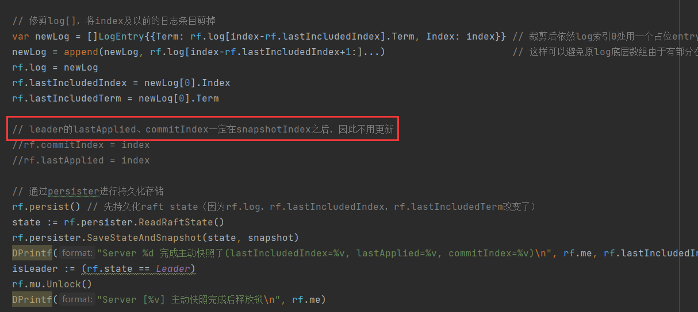
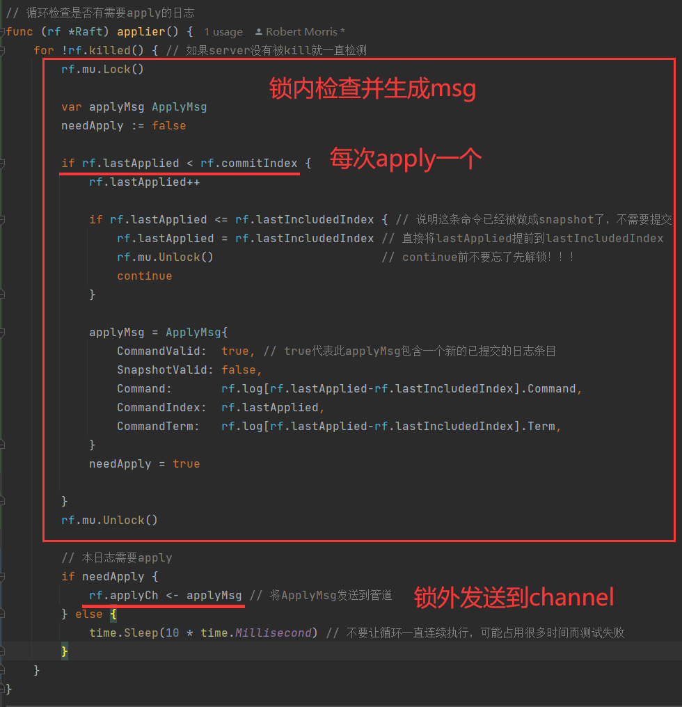

- [Lab 3 - Fault-tolerant Key/Value Service](#lab-3---fault-tolerant-keyvalue-service)
	- [一、实验相关准备](#一实验相关准备)
	- [二、任务梳理](#二任务梳理)
		- [2.1 任务说明](#21-任务说明)
		- [2.2 Part 3A：无日志压缩的键值服务](#22-part-3a无日志压缩的键值服务)
			- [2.2.1 第一阶段](#221-第一阶段)
				- [2.2.1.1 任务要求](#2211-任务要求)
				- [2.2.1.2 任务提示](#2212-任务提示)
			- [2.2.2 第二阶段](#222-第二阶段)
				- [2.2.2.1 任务要求](#2221-任务要求)
				- [2.2.2.2 任务提示](#2222-任务提示)
		- [2.3 Part 3B：具有日志压缩功能的键值服务](#23-part-3b具有日志压缩功能的键值服务)
			- [2.3.1 第一阶段](#231-第一阶段)
				- [2.3.1.1 任务要求](#2311-任务要求)
				- [2.3.1.2 任务提示](#2312-任务提示)
			- [2.3.2 第二阶段](#232-第二阶段)
				- [2.3.2.1 任务要求](#2321-任务要求)
				- [2.3.2.2 任务提示](#2322-任务提示)
	- [三、环境搭建](#三环境搭建)
	- [四、编程实现](#四编程实现)
		- [4.1 查看各相关源文件的作用](#41-查看各相关源文件的作用)
		- [4.2 编写client端的相关代码](#42-编写client端的相关代码)
			- [4.2.1 定义Clerk结构体](#421-定义clerk结构体)
			- [4.2.2 实现MakeClerk函数](#422-实现makeclerk函数)
			- [4.2.3 实现Clerk的Get和PutAppend方法](#423-实现clerk的get和putappend方法)
		- [4.3 编写server端指令执行的相关代码](#43-编写server端指令执行的相关代码)
			- [4.3.1 定义相关变量和结构体](#431-定义相关变量和结构体)
			- [4.3.2 实现StartKVServer函数](#432-实现startkvserver函数)
			- [4.3.3 实现Get和PutAppend请求的两个handler函数](#433-实现get和putappend请求的两个handler函数)
			- [4.3.4 实现kvserver应用msg到状态机的applyMessage函数](#434-实现kvserver应用msg到状态机的applymessage函数)
		- [4.4 实现主动快照](#44-实现主动快照)
			- [4.4.1 主动快照的定期检查](#441-主动快照的定期检查)
			- [4.4.2 raft完成主动快照](#442-raft完成主动快照)
		- [4.5 实现被动快照](#45-实现被动快照)
			- [4.5.1 leader发送被动快照数据](#451-leader发送被动快照数据)
			- [4.5.2 follower接收InstallSnapshot RPC](#452-follower接收installsnapshot-rpc)
			- [4.5.3 kvserver安装被动快照](#453-kvserver安装被动快照)
		- [4.6 利用快照从crash中恢复](#46-利用快照从crash中恢复)
		- [4.7 下标变换](#47-下标变换)
		- [4.8 AppendEntries RPC相关修改](#48-appendentries-rpc相关修改)
			- [4.8.1 AppendEntries函数的修改](#481-appendentries函数的修改)
			- [4.8.2 LeaderAppendEntries函数的修改](#482-leaderappendentries函数的修改)
	- [五、测试](#五测试)
		- [5.1 一些技巧](#51-一些技巧)
			- [5.1.1 打印日志](#511-打印日志)
			- [5.1.2 多次测试](#512-多次测试)
			- [5.1.3 单元测试](#513-单元测试)
		- [5.2 debug记录](#52-debug记录)
			- [5.2.1 Bug in Part 3A](#521-bug-in-part-3a)
				- [5.2.1.1 输出结果文件报：labgob warning](#5211-输出结果文件报labgob-warning)
				- [5.2.1.2 client发送rpc请求的kvserver与实际处理该请求的kvserver对应不上](#5212-client发送rpc请求的kvserver与实际处理该请求的kvserver对应不上)
				- [5.2.1.3 在正常执行完若干条指令后，leader再向其他follower发送AppendEntries RPC却收不到响应](#5213-在正常执行完若干条指令后leader再向其他follower发送appendentries-rpc却收不到响应)
				- [5.2.1.4 The four-way deadlock 问题](#5214-the-four-way-deadlock-问题)
				- [5.2.1.5 测试时间过长](#5215-测试时间过长)
			- [5.2.2 Bug in Part 3B](#522-bug-in-part-3b)
				- [5.2.2.1 日志截断导致的切片访问越界问题](#5221-日志截断导致的切片访问越界问题)
				- [5.2.2.2 主动快照与被动快照同时进行导致的数组越界](#5222-主动快照与被动快照同时进行导致的数组越界)
				- [5.2.2.3 主、被动快照后日志重新提交、应用优化](#5223-主被动快照后日志重新提交应用优化)
				- [5.2.2.4 有server失联后client向其发送请求后卡死](#5224-有server失联后client向其发送请求后卡死)
				- [5.2.2.5 主动快照检查优化](#5225-主动快照检查优化)
				- [5.2.2.6 主、被动快照重叠导致状态不一致而丢失某些append的值报错get wrong value](#5226-主被动快照重叠导致状态不一致而丢失某些append的值报错get-wrong-value)
				- [5.2.2.7 生成和发送msg非原子性导致的append丢失](#5227-生成和发送msg非原子性导致的append丢失)
		- [5.3 All Pass](#53-all-pass)
	- [六、总结](#六总结)


# Lab 3 - Fault-tolerant Key/Value Service


## 一、实验相关准备

- 6.824相关课程

- [关于Raft实现的建议](https://thesquareplanet.com/blog/students-guide-to-raft/)

- [Lab3说明及提示](http://nil.csail.mit.edu/6.824/2020/labs/lab-kvraft.html)

- 经典论文：
  - In Search of an Understandable Consensus Algorithm
  - ZooKeeper: Wait-free coordination for Internet-scale systems
  - [raft作者博士论文 第6章](https://web.stanford.edu/~ouster/cgi-bin/papers/OngaroPhD.pdf)
  
- [共识、线性一致性与顺序一致性](https://segmentfault.com/a/1190000022248118)

- [官方交互示意图](https://link.zhihu.com/?target=https%3A//pdos.csail.mit.edu/6.824/notes/raft_diagram.pdf)

  


## 二、任务梳理

### 2.1 任务说明

- 使用 lab 2 中实现的Raft库构建一个容错的键/值存储服务。你的键/值服务将是一个复制状态机，由几个使用Raft进行复制的键/值服务器组成。只要大多数服务器存活并且可以通信，不管其他故障或网络分区，键/值服务应该继续处理客户端请求。

- 这个服务支持三种操作： `Put(key, value)`,  `Append(key, arg)` 和 `Get(key)`。它维护一个简单的键/值对数据库。键和值都是字符串。

  `Put()`替换数据库中特定key的value，`Append(key, arg)`将`arg`追加到key对应的value，`Get()`获取key的当前value。

  对于不存在的key的`Get`操作应该返回一个空字符串。对不存在的key的`Append`操作应该类似于`Put`。

  每个客户端通过带有`Put/Append/Get`方法的`Clerk`与服务通信。`Clerk`管理RPC与服务器的交互。

- 你的服务必须为调用`Clerk` `Get/Put/Append`方法的应用程序提供强一致性。

  我们所说的强一致性就是：如果一次调用一个，那么`Get/Put/Append`方法应该表现得好像系统只有其状态的一个副本，并且每次调用都应该观察到前面调用序列所隐含的对状态的修改。对于并发调用，返回值和最终状态必须与操作按某种顺序一次执行一个相同。如果调用在时间上重叠，则它们是并发的，例如，如果客户端X调用`Clerk.Put()`，然后客户端Y调用`Clerk.Append()`，然后客户端X的调用返回。此外，一个调用必须要观察到在调用开始之前已经完成的所有调用的效果（因此我们在技术上要求线性一致性）。

- 强一致性对应用程序来说很方便，因为它意味着，所有客户端都看到相同的状态，并且都看到最新的状态。对于单个服务器来说，提供强一致性相对容易。如果服务是复制的，则比较困难，因为所有服务器必须为并发请求选择相同的执行顺序，并且必须避免使用不是最新的状态回复客户端。

- 这个实验室有两个部分。在Part A中，你将实现该服务，而不必担心Raft日志会无限制地增长。在Part B，你将实现快照(论文中的第7节)，这将允许Raft丢弃旧的日志条目。

- 你应该重新阅读Raft论文，特别是第7和第8节。

- 在`src/kvraft`中提供了框架代码和测试。你需要修改`kvraft/client.go` , `kvraft/server.go` , 以及有可能` kvraft/common.go` 中的代码。

  执行下面的指令来运行：

  ```shell
  $ cd ~/6.824
  $ git pull
  ...
  $ cd src/kvraft
  $ go test
  ...
  $
  ```


### 2.2 Part 3A：无日志压缩的键值服务

每个键/值服务器（“kvservers”）都有一个关联的Raft对等体。Clerk发送`Put()`， `Append()`和`Get()` RPCs到其关联的Raft是leader的kvserver。kvserver代码向Raft提交`Put/Append/Get`操作，以便Raft日志保存`Put/Append/Get`操作的序列。所有的kvserver按顺序执行Raft日志中的操作，并将这些操作应用到它们的键/值数据库中，目的是让服务器维护键/值数据库的相同副本。

Clerk有时不知道哪个kvserver是Raft leader。如果Clerk将RPC发送到错误的kvserver，或者如果它无法到达kvserver，则Clerk应该重新尝试发送到不同的kvserver。如果键/值服务将操作提交到它的Raft日志（并因此将操作应用到键/值状态机），则leader通过响应其RPC将结果报告给Clerk。如果操作提交失败（例如，如果leader被替换），服务器报告一个错误，然后Clerk用另一个服务器重试。

kvservers不应该直接通信，它们只能通过Raft进行交互。对 lab 3 的所有部分，你必须确保你的Raft实现继续通过所有的 lab 2 测试。


#### 2.2.1 第一阶段

##### 2.2.1.1 任务要求

- 第一个任务是实现一个解决方案，该解决方案能在没有丢失消息和服务器故障的情况下工作。
- 你需要在`client.go`中向`Clerk` `Put/Append/Get`方法里添加RPC发送代码。然后，在`server.go`里实现`PutAppend()`和`Get()` RPC处理程序。这些处理程序应该使用`Start()`在Raft日志中输入一个`Op`。你应该在`server.go`中填写`Op`的结构定义，以便它描述一个`Put/Append/Get`操作。每个服务器应该在Raft提交命令时执行`Op`命令，也就是当它们出现在`applyCh`上时。RPC处理程序应该注意到Raft何时提交它的`Op`，然后回复RPC。
- 当你稳定可靠地通过第一个测试时就完成了这个任务


##### 2.2.1.2 任务提示

- 对于client如何与raft交互不清楚可以看下raft论文的第8章以及raft作者博士论文第6章。
- 调用`Start()`之后，你的kvservers将需要等待Raft完成共识协议。已达成一致的命令到达`applyCh`。当`PutAppend()`和`Get()`处理程序使用`Start()`向Raft日志提交命令时，你的代码将需要保持读取`applyCh`。注意kvserver和它的Raft库之间的死锁。
- 你可以向Raft `ApplyMsg`添加字段，也可以向Raft RPCs如`AppendEntries`中添加字段。
- 如果一个kvserver不是majority的一部分，它就不应该完成`Get()` RPC（这样它就不会提供陈旧的数据）。一个简单的解决方案是在Raft日志中输入每个`Get()`（以及每个`Put()`和`Append()`）。你不必实现第8节中描述的只读操作的优化。
- 最好从一开始就添加锁，因为避免死锁的需要有时会影响整个代码设计。使用`go test -race`检查代码是否没有race。


#### 2.2.2 第二阶段

##### 2.2.2.1 任务要求

- 现在，你需要修改你的解决方案，以便在面对网络和服务器故障时继续运行。
- 你将面临的一个问题是，Clerk可能必须多次发送一个RPC，直到它找到一个回复为肯定的kvserver。如果leader在向Raft日志提交条目后刚好故障，那么Clerk可能不会收到回复，因此可能会将请求重新发送给另一个leader。对`Clerk.Put()`或`Clerk.Append()`的每次调用应该只执行一次，因此你必须确保重新发送不会导致服务器执行两次请求。
- 添加代码来处理故障，并处理重复的Clerk请求，包括Clerk在一个term内向kvserver leader发送请求，等待回复超时的情况，以及向另一个term的一个新的leader重新发送请求的情况。这些请求应该只执行一次。你的代码应该通过`go test -run 3A`测试。


##### 2.2.2.2 任务提示

- 你的解决方案需要处理 一个leader为Clerk的RPC调用了`Start()`但在将请求提交到日志之前失去了leader地位 的情况。在这种情况下，您应该安排Clerk将请求重新发送到其他服务器，直到它找到新的leader。一种方法是让服务器检测到它已经失去了领导地位，方法是注意到`Start()`返回的索引位置出现了不同的请求，或者Raft的term发生了变化。如果前任leader自己在一个分区，它将不会知道新的leader。但是同一分区中的任何client也不能与新的leader通信，所以在这种情况下，服务器和客户端无限期地等待直到分区愈合。
- 你可能需要修改你的Clerk以记住哪个服务器是最后一个RPC的leader，并首先将下一个RPC发送到该服务器。这将避免浪费时间在每个RPC上搜索leader，这可能有助于您足够快地通过某些测试。
- 你需要唯一地标识客户端操作，以确保键/值服务只执行每个操作一次。
- 您的重复检测方案应该快速释放服务器内存，例如，通过让每个RPC暗示client已经看到了其前一个RPC的回复。可以假设一个client一次只在Clerk调用一次。


如果你的代码通过 lab 3A 的测试，那么运行结果看起来像下面这样：

```shell
$ go test -run 3A
Test: one client (3A) ...
... Passed -- 15.1 5 12882 2587
Test: many clients (3A) ...
... Passed -- 15.3 5 9678 3666
Test: unreliable net, many clients (3A) ...
... Passed -- 17.1 5 4306 1002
Test: concurrent append to same key, unreliable (3A) ...
... Passed -- 0.8 3 128 52
Test: progress in majority (3A) ...
... Passed -- 0.9 5 58 2
Test: no progress in minority (3A) ...
... Passed -- 1.0 5 54 3
Test: completion after heal (3A) ...
... Passed -- 1.0 5 59 3
Test: partitions, one client (3A) ...
... Passed -- 22.6 5 10576 2548
Test: partitions, many clients (3A) ...
... Passed -- 22.4 5 8404 3291
Test: restarts, one client (3A) ...
... Passed -- 19.7 5 13978 2821
Test: restarts, many clients (3A) ...
... Passed -- 19.2 5 10498 4027
Test: unreliable net, restarts, many clients (3A) ...
... Passed -- 20.5 5 4618 997
Test: restarts, partitions, many clients (3A) ...
... Passed -- 26.2 5 9816 3907
Test: unreliable net, restarts, partitions, many clients (3A) ...
... Passed -- 29.0 5 3641 708
Test: unreliable net, restarts, partitions, many clients, linearizability checks (3A) ...
... Passed -- 26.5 7 10199 997

PASS
ok kvraft 237.352s
```

每个Passed后的数字是实时时间（以秒为单位）、对等体数量、发送的RPCs数量（包括client RPCs）和执行的键/值操作（`Clerk Get/Put/Append`调用）的数量。


### 2.3 Part 3B：具有日志压缩功能的键值服务

就目前代码的情况而言，重启服务器会重播完整的Raft日志，以恢复其状态。但是，对于长期运行的服务器来说，永远记住完整的Raft日志是不现实的。因此，你将修改Raft和kvserver以配合节省空间：kvserver将不时地持久存储其当前状态的“快照”，而Raft将丢弃快照之前的日志条目。当服务器重新启动（或者远远落后于leader，必须迎头赶上）时，**服务器首先安装快照，然后重播创建快照点之后的日志条目**。Raft论文的第7节概述了这个方案，你必须设计细节。

你必须在你的Raft库和服务之间设计一个接口，允许你的Raft库丢弃日志条目。你必须修改你的Raft代码，以便**在只存储日志尾部的情况下运行**。Raft应该以一种允许Go垃圾收集器释放和重用内存的方式丢弃旧的日志条目，**这要求对丢弃的日志项没有可访问的引用（指针）**。

测试器将`maxraftstate`传递给`StartKVServer()`。`maxraftstate`表示持久化Raft状态的最大允许大小（包括日志，但不包括快照），以字节为单位。你应该将`maxraftstate`与`persistent.RaftStateSize()`进行比较。当你的key/value服务器检测到Raft状态大小接近这个阈值时，它应该保存一个快照，并告诉Raft库它已经快照了，这样Raft就可以丢弃旧的日志条目。如果`maxraftstate`为-1，则不需要快照。`maxraftstate`适用于你的Raft传递给`persistent.SaveRaftState()`的gob编码字节。


#### 2.3.1 第一阶段

##### 2.3.1.1 任务要求

- 修改你的Raft代码，以便它可以在收到一个日志索引后丢弃该索引之前的日志条目，并在仅存储该索引之后的日志条目时能继续运行。确保 lab 2 的所有测试都仍然能成功通过。
- 修改你的kvserver代码，以便它能检测到持久化的Raft状态何时变得过大，然后将快照交给Raft，并告诉Raft它可以丢弃旧的日志条目。Raft应该使用`persistent.SaveStateAndSnapshot()`来保存每个快照（不要使用文件）。当kvserver实例重新启动时，它应该从persister中恢复快照。


##### 2.3.1.2 任务提示

- 考虑一下kvserver应该在何时对其状态进行快照，以及快照中应该包含哪些内容。Raft必须使用`SaveStateAndSnapshot()`将每个快照以及相应的Raft状态存储在persister对象中。你可以使用`ReadSnapshot()`读取最新存储的快照。
- 你的kvserver必须能够跨检查点检测日志中的重复操作，因此用于检测它们的任何状态都必须包含在快照中。
- 快照中存储的结构的所有字段都大写。
- 你可以添加方法到你的Raft，以便kvserver可以管理修剪Raft日志的过程以及管理kvserver快照。


#### 2.3.2 第二阶段

##### 2.3.2.1 任务要求

- 修改你的Raft leader代码，以便在leader丢弃了follower需要的日志条目时向follower发送一个InstallSnapshot RPC。当follower接收到一个InstallSnapshot RPC时，它必须将包含的快照交给它的kvserver。你可以借助`applyCh`来实现，通过向`ApplyMsg`添加新字段。最终你的解决方案要通过 lab 3 的所有测试。


##### 2.3.2.2 任务提示

- 请在单个InstallSnapshot RPC中发送整个快照。不要实现图13中分割快照的offset机制。
- 确保你在进行其他快照测试之前通过了`TestSnapshotRPC`。
- Lab 3测试所需的合理时间是400秒的实时时间和700秒的CPU时间。此外，`go test -run TestSnapshotSize`的实时时间应该少于20秒。


你的代码应该通过3B测试（如这里的示例）以及3A测试（并且你的Raft必须继续通过 lab 2 测试)。

```shell
$ go test -run 3B
Test: InstallSnapshot RPC (3B) ...
... Passed -- 1.5 3 163 63
Test: snapshot size is reasonable (3B) ...
... Passed -- 0.4 3 2407 800
Test: restarts, snapshots, one client (3B) ...
... Passed -- 19.2 5 123372 24718
Test: restarts, snapshots, many clients (3B) ...
... Passed -- 18.9 5 127387 58305
Test: unreliable net, snapshots, many clients (3B) ...
... Passed -- 16.3 5 4485 1053
Test: unreliable net, restarts, snapshots, many clients (3B) ...
... Passed -- 20.7 5 4802 1005
Test: unreliable net, restarts, partitions, snapshots, many clients (3B) ...
... Passed -- 27.1 5 3281 535
Test: unreliable net, restarts, partitions, snapshots, many clients, linearizability checks (3B
... Passed -- 25.0 7 11344 748
PASS
ok kvraft 129.114s
```


## 三、环境搭建

- 虚拟机ubuntu-22.04.1
- GoLand 2022.3.2
- Go 1.19.5


## 四、编程实现

### 4.1 查看各相关源文件的作用

lab3的相关示例和代码在`6.824/src/kvraft`文件夹中

```
-kvraft
	-client.go
	-common.go
	-config.go
	-server.go
	-test_test.go
```

这些文件的作用如下：

1. client.go

   模拟client，能够向kvserver服务端发起`Get`、`Put`和`Append`请求

2. common.go

   定义Err类型、RPC参数和回复的结构体

3. config.go

   完成相关配置，模拟测试中可能出现的情形

4. server.go

   提供应用层kvserver结构框架和需要实现的相关API，根据注释完成相关功能的实现（主要编程部分）。kvserver需要接收client发来的请求并将请求传给raft层完成共识，然后真正将请求应用到状态机，并且还要能支持快照功能。

5. test_test.go

   kvraft测试程序，模拟了实际可能遇到的日志过长、网络延迟、不稳定、丢包、分区等问题，测试kvserver服务和快照功能的正确性和健壮性。


### 4.2 编写client端的相关代码

这部分主要是完善`client.go`中的代码，定义client的结构体以及完成client向服务端kvserver发起`Get`、`Put`、`Append`请求的逻辑。


#### 4.2.1 定义Clerk结构体

我个人理解这个`Clerk`结构体就是模拟的client-server关系中的client，它的结构体定义如下：

```go
type Clerk struct {
	servers []*labrpc.ClientEnd	// kvserver集群
	// You will have to modify this struct.
	clientId    int64 // client的唯一标识符
	knownLeader int   // 已知的leader，请求到非leader的server后的reply中获取
	commandNum  int   // 标志client为每个command分配的序列号到哪了（采用自增，从1开始）
}
```

- `servers`可以理解为kvserver集群的指针切片，但是要注意虽然都是kvserver的所有server，但这里的序号跟``StartKVServer()`中初始化kvserver集群中序号是**不对应**的！（从`config.go`的`makeClient()`中可以看出，构建client时的servers切片是经过了一次打乱顺序处理了的，虽然我不清楚为什么要这么做）这可能直接导致你在实现client快速重新定位leader时出现错误，具体见5.2.1.2。
- `clientId`是用来唯一标识client，为随机生成的`int64`类型，在本次实验中可认为不会重复。
- `knownLeader`是为了client请求到非leader的server后用于下一次快速找到leader使用的。
- `commandNum`记录该client请求的command序号到哪里了，用来防止改变状态机状态的command被重复执行而发生错误，采用从1开始的自增实现。


#### 4.2.2 实现MakeClerk函数

该函数是用来构造初始化client的，代码如下：

```go
func MakeClerk(servers []*labrpc.ClientEnd) *Clerk {
	ck := new(Clerk)
	ck.servers = servers
	// You'll have to add code here.
	ck.clientId = nrand() // clientId通过提供的nrand()随机生成，重复概率忽略不计
	ck.knownLeader = -1   // 开始还不知道谁是leader，设为-1
	ck.commandNum = 1

	return ck
}
```


#### 4.2.3 实现Clerk的Get和PutAppend方法

client有三种请求类型，分别是Get、Put和Append，这里将Put和Append请求集成到一起。`Get()`和`PutAppend()`的逻辑和结构基本一样，代码如下：

```go
// fetch the current value for a key.
// returns "" if the key does not exist.
// keeps trying forever in the face of all other errors.
//
// you can send an RPC with code like this:
// ok := ck.servers[i].Call("KVServer.Get", &args, &reply)
//
// the types of args and reply (including whether they are pointers)
// must match the declared types of the RPC handler function's
// arguments. and reply must be passed as a pointer.
func (ck *Clerk) Get(key string) string {
	// You will have to modify this function.

	args := GetArgs{
		Key:      key,
		ClientId: ck.clientId,
		CmdNum:   ck.commandNum,
	}

	i := 0 // 从server 0开始发送请求
	serversNum := len(ck.servers)
	for ; ; i = (i + 1) % serversNum { // 循环依次向每一个server请求直至找到leader

		if ck.knownLeader != -1 { // 如果找到了leader
			i = ck.knownLeader // 下次直接向leader发起请求
		} else {
			time.Sleep(time.Millisecond * 5)
		}

		reply := GetReply{}

		DPrintf("Client[%d] request [%d] for Get(key:%v)......\n", ck.clientId, i, args.Key)
		ok := ck.servers[i].Call("KVServer.Get", &args, &reply)

		if !ok {
			DPrintf("Client[%d] Get request failed!\n", ck.clientId)
			ck.knownLeader = -1 // 没收到回复则下次向其他kvserver发送
			continue
		} else { // 成功收到rpc回复
			switch reply.Err {
			case OK: // 一切正常
				ck.commandNum++
				ck.knownLeader = i // 找到leader
				DPrintf("Client[%d] request(Seq:%d) for Get(key:%v) [successfully]!\n", ck.clientId, args.CmdNum, args.Key)
				return reply.Value
			case ErrWrongLeader: // 连接kvserver不是leader
				ck.knownLeader = -1
				DPrintf("Client[%d] request(Seq:%d) for Get(key:%v) but [WrongLeader]!\n", ck.clientId, args.CmdNum, args.Key)
				continue
			case ErrNoKey:
				ck.commandNum++
				ck.knownLeader = i // 找到leader
				DPrintf("Client[%d] request(Seq:%d) for Get(key:%v) but [NoKey]!\n", ck.clientId, args.CmdNum, args.Key)
				return "" // key不存在，返回空串
			case ErrTimeout:
				ck.knownLeader = -1 // 下次需要重新找个server发送请求
				DPrintf("Client[%d] request(Seq:%d) for Get(key:%v) but [Timeout]!\n", ck.clientId, args.CmdNum, args.Key)
				continue
			}
		}

	}
}

// shared by Put and Append.
//
// you can send an RPC with code like this:
// ok := ck.servers[i].Call("KVServer.PutAppend", &args, &reply)
//
// the types of args and reply (including whether they are pointers)
// must match the declared types of the RPC handler function's
// arguments. and reply must be passed as a pointer.
// Put和Append操作都会调它，相当于集成（因为KVServer的这两个操作是用一个函数 实现）
func (ck *Clerk) PutAppend(key string, value string, op string) {
	// You will have to modify this function.

	args := PutAppendArgs{
		Key:      key,
		Value:    value,
		Op:       op,
		ClientId: ck.clientId,
		CmdNum:   ck.commandNum,
	}

	i := 0 // 从server 0开始发送请求
	serversNum := len(ck.servers)
	for ; ; i = (i + 1) % serversNum { // 循环依次向每一个server请求直至找到leader

		if ck.knownLeader != -1 { // 如果找到了leader
			i = ck.knownLeader // 下次直接向leader发起请求
		} else {
			time.Sleep(time.Millisecond * 5)
		}

		reply := PutAppendReply{}

		DPrintf("Client[%d] request [%d] for PutAppend(key:%v, value:%v)......\n", ck.clientId, i, args.Key, args.Value)
		ok := ck.servers[i].Call("KVServer.PutAppend", &args, &reply)

		if !ok {
			DPrintf("Client[%d] PutAppend request failed!\n", ck.clientId)
			ck.knownLeader = -1 // 没收到回复则下次向其他kvserver发送
			continue
		} else { // 成功收到rpc回复
			switch reply.Err {
			case OK: // 一切正常
				ck.commandNum++
				ck.knownLeader = i // 找到leader
				DPrintf("Client[%d] request(Seq:%d) for PutAppend [successfully]!\n", ck.clientId, args.CmdNum)
				return
			case ErrWrongLeader: // 连接kvserver不是leader
				ck.knownLeader = -1 // 下次发给reply中携带的leaderId
				DPrintf("Client[%d] request(Seq:%d) for PutAppend but [WrongLeader]!\n", ck.clientId, args.CmdNum)
				continue
			case ErrNoKey:
				ck.commandNum++
				ck.knownLeader = i // 找到leader
				DPrintf("Client[%d] request(Seq:%d) for Append but [NoKey]!\n", ck.clientId, args.CmdNum)
				return // key不存在，append类似put处理
			case ErrTimeout:
				ck.knownLeader = -1 // 下次需要重新找个server发送请求
				DPrintf("Client[%d] request(Seq:%d) for PutAppend but [Timeout]!\n", ck.clientId, args.CmdNum)
				continue
			}
		}
	}
}
```

- raft作者在其博士论文的 Figure 6.1 展示了client用来与复制状态机交互的RPC：

  
  
  **本次实验并不完全按照这个实现，但是会借鉴其中的一些思想。**
  
- client是通过RPC向kvserver发起请求的，这里定义了两对RPC参数和回复的结构体来完成，在`common.go`文件中定义即可，代码如下：

  ```go
  // Put or Append
  type PutAppendArgs struct {
  	Key   string
  	Value string
  	Op    string // "Put" or "Append"
  	// You'll have to add definitions here.
  	// Field names must start with capital letters,
  	// otherwise RPC will break.
  	ClientId int64
  	CmdNum   int // client为每个command分配的唯一序列号
  }
  
  type PutAppendReply struct {
  	Err Err // error的字符串
  	//LeaderId int // 如果找错了leader则server将自己记录的leaderId附在reply里供client下一次直接定位
  }
  
  type GetArgs struct {
  	Key string
  	// You'll have to add definitions here.
  	ClientId int64
  	CmdNum   int // client为每个command分配的唯一序列号
  }
  
  type GetReply struct {
  	Err   Err
  	Value string
  	//LeaderId int // 如果找错了leader则server将自己记录的leaderId附在reply里供client下一次直接定位
  }
  ```

  - 根据请求的具体含义，`PutAppendArgs`比`GetArgs`多了`Op`和`value`字段，`Op`是为了区分`Put`和`Append`指令（因为它们共用一个请求函数`PutAppend()`）。
  - client在请求时会为每个请求分配一个唯一的序列号，即`CmdNum`，也要发送给kvserver。
  - reply需要包括本次请求的`Err`信息，以便client获知请求失败与否以便下次采取对应措施。由于上面提到的Client与kvserver端对servers集群的编号认知不同，本来打算利用reply里面附带的`LeaderId`来帮助client下次快速定位leader也不可行了，因此不再要这个字段。

- 还需要定义`Err`类型来区分每次请求的请求结果，也在`common.go`中定义即可，具体如下：

  ```go
  // Err类型
  const (
  	OK             = "OK"
  	ErrNoKey       = "ErrNoKey"
  	ErrWrongLeader = "ErrWrongLeader"
  	ErrTimeout     = "ErrTimeout"
  )
  
  type Err string
  ```

  请求成功会将`Err`字段设为`OK`。

- client发起请求首先先初始化一个`args`，附上必要信息。

- 因为**只有leader才能接受client的请求并且回复**，而非leader身份的server接收到client的请求时应该直接返回而不能执行。因此，client首先要找到leader，一般client会随机向一个kvserver发起请求，若请求的不是leader则随机向另一个kvserver再次请求，直到找到leader为止。这里为了不短时间内再次请求非leader的server，采用**从0开始依次循环请求**，若不是leader则继续请求下一个。如果上一次找到了leader并请求成功，client则会将上一次请求的编号`i`用`knownLeader`记录下来（注意，由于编号的不对应性leader的序号**不能**用raft集群中leader的编号），下次直接向`i`号kvserver再次请求即可。

- 这里注意初始化reply结构体时要在for循环内部，即对每次RPC调用都重新初始化一个reply，否则reply的复用会导致接收到不对应的请求发来的回复。

- 然后根据回复进行对应的处理：

  - `OK`和`ErrNoKey`均是请求成功（leader收到且处理了该请求，并且发来的回复也被client接收到），此时将`knownLeader`置为此次请求的`i`（下次直接向`i`请求），然后将`commandNum`加1代表下次新指令的序号，最后return。
  - `ErrWrongLeader`和`ErrTimeout`为请求失败，请求到非leader的server以及超时所采取的措施就是下次换个server继续发起请求（client会一直重复发起请求直至向leader请求成功，因此后面server端的实现必须能过滤重复请求）。

  

论文中对于client的请求逻辑也作出了说明（实际实现可能有些许差异）：

1. **客户端请求是通过leader来处理的，那么客户端如何找到leader？**

   

2. **Raft如何防止陈旧的领导信息无限期地延迟客户端请求？**

   - **Leaders**：

     比如一个leader被分区隔开而不自知，它永远无法将日志复制到大多数server，那么与它连接的client的请求就会一直得不到回复。

     解决：如果超时了client的请求还没有得到回复，那么client就用另一个服务器重试请求，这样总可以找到真正的leader。

   - **Followers**：

     followers保持跟踪leader（AppendEntries RPC会携带`leaderId`），以便它们可以重定向或代理客户端。当开始新的选举或任期改变时，他们必须放弃这些信息（重置`leaderId`）。

   - **Clients**：

     如果client失去了与leader（或任何特定服务器）的连接，它应该简单地使用随机服务器进行重试，不要在这个leader上吊死，因为它可能已经挂了。


### 4.3 编写server端指令执行的相关代码

#### 4.3.1 定义相关变量和结构体

```go
const RespondTimeout = 500 // kvserver回复client的超时时间，单位：毫秒

type Op struct {
	// Your definitions here.
	// Field names must start with capital letters,
	// otherwise RPC will break.
	ClientId int64 // 标识客户端
	CmdNum   int
	OpType   string // 操作类型，put/append/get
	Key      string
	Value    string // 若为Get命令则value可不设
}

// session跟踪为client处理的最新序列号，以及相关的响应。如server接收到序列号已经执行过的命令，它会立即响应，而不需要重新执行请求
type Session struct {
	LastCmdNum int    // 该server为该client处理的上一条指令的序列号
	OpType     string // 最新处理的指令的类型
	Response   Reply  // 对应的响应
}

// GetReply和PutAppendReply的统一结构，用于kvserver保存请求的回复用
type Reply struct {
	Err   Err
	Value string // Get命令时有效
}

type KVServer struct {
	mu      sync.Mutex
	me      int
	rf      *raft.Raft // 每个kvserver都有一个关联的raft peer
	applyCh chan raft.ApplyMsg
	dead    int32 // set by Kill()

	// Your definitions here.
	kvDB                  map[string]string  // 服务器保存的键值对（具体的业务逻辑）
	sessions              map[int64]Session  // 此server的状态机为各个client维护的会话（session）
	maxraftstate          int                // snapshot if log grows this big
	notifyMapCh           map[int]chan Reply // kvserver apply到了等待回复的日志则通过chan通知对应的handler方法回复client，key为日志的index
	logLastApplied        int                // 此kvserver apply的上一个日志的index
	passiveSnapshotBefore bool               // 标志着applyMessage上一个从channel中取出的是被动快照并已安装完
}
```

- 对于三种类型的指令均采用一种结构体`Op`，通过`OpType`字段来具体区分，里面还带有一些必要的标识字段和信息。

- `Session`结构体是用来保存server为该client处理的**最新序列号**以及相关的**响应**。因为每个操作server只能执行一次，不能因为收到client的多次重复请求（可能是延迟、丢失导致的重发）就执行多次，这会使得状态机的状态错误。故**通过`Session`结构体来记录下每个client上一次请求的结果，当重复请求到来时（根据序列号来判断），直接返回`Session`中保存的`Reply`而不再次执行**。

- **Raft如何实现线性一致性？**

  ——Raft的日志提供了在每个服务器上应用命令的串行顺序。（保证一致的执行顺序）

  由于回复丢失、故障、网络等原因，可能出现client重发多次请求，server得能过滤重复的请求，不能重复apply一个cmd多次。

  **基本思想**：server保存client操作的结果并且用它们来跳过重复执行多次相同的请求。

  **实现**：

  1. 每个client都有一个唯一的标识符。

  2. clients为每个cmd分配一个唯一的序列号。

  3. 每个server的状态机为每个client维护一个会话（*session*）。

     session跟踪为client处理的最新序列号，以及相关的响应。如server接收到序列号已经执行过的命令，它会立即响应，而不需要重新执行请求。

  因此，命令当它们在Raft日志中的第一次出现时生效，并且只生效一次，因为任何后续出现都会被状态机过滤掉。本次实验由于Get指令不会改变状态机状态因此不进行过滤。

- `Reply`结构体是`GetReply`和`PutAppendReply`的**统一**结构，用于kvserver在`Session`中保存请求的回复，也用于kvserver在apply了指令后向正在等待的handler发送请求结果。

- `KVServer`是服务端server的结构体。
  - kvserver拥有自己的锁来控制应用层的并发问题，区别于raft层的锁。
  - 每个kvserver**关联**一个raft server，且在集群中的序号`me`相同。
  - `applyCh`用于在raft server和kvserver之间传递msg，由kvserver在初始化时传递给raft。
  - `kvDB`模拟状态机状态，由于是kv服务，因此就用一个hash来保存键值对即可。
  - `sessions`用来维护此kvserver与各个client之间的会话（`session`），也用一个map来保存，key为各个client的`ClientId`。
  - `maxraftstate`是kvserver需要进行主动快照的临界`raft state size`大小。
  - `notifyMapCh`用于当kvserver apply到了正在等待回复的日志时，通过channel传递reply并通知对应的handler方法回复client，key为日志的index。
  - `logLastApplied`记录此kvserver apply的上一个日志的index，以便在应用端也能获知apply的进度，与raft层的`lastApplied`功能类似。
  - `passiveSnapshotBefore`标志`applyMessage()`上一个从channel中取出的是被动快照并已安装完，设置该字段的原因见5.2.2.7。


#### 4.3.2 实现StartKVServer函数

`StartKVServer()`函数作用是初始化kvserver，代码如下：

```go
// servers[] contains the ports of the set of
// servers that will cooperate via Raft to
// form the fault-tolerant key/value service.
// me is the index of the current server in servers[].
// the k/v server should store snapshots through the underlying Raft
// implementation, which should call persister.SaveStateAndSnapshot() to
// atomically save the Raft state along with the snapshot.
// the k/v server should snapshot when Raft's saved state exceeds maxraftstate bytes,
// in order to allow Raft to garbage-collect its log. if maxraftstate is -1,
// you don't need to snapshot.
// StartKVServer() must return quickly, so it should start goroutines
// for any long-running work.
func StartKVServer(servers []*labrpc.ClientEnd, me int, persister *raft.Persister, maxraftstate int) *KVServer {
	// call labgob.Register on structures you want
	// Go's RPC library to marshall/unmarshall.
	DPrintf("(Re)Start KVServer[%d]!\n", me)

	labgob.Register(Op{})

	kv := new(KVServer)
	kv.me = me
	kv.maxraftstate = maxraftstate

	// You may need initialization code here.
	var mutex sync.Mutex
	kv.mu = mutex
	kv.dead = 0 // 0代表该server还存活，1代表它被kill了
	kv.applyCh = make(chan raft.ApplyMsg)

	kv.rf = raft.Make(servers, me, persister, kv.applyCh) // kvserver会创建对应的raft
	kv.kvDB = make(map[string]string)
	kv.sessions = make(map[int64]Session)
	kv.notifyMapCh = make(map[int]chan Reply) // 这里里面的channel也要初始化，在该client第一次对次kvserver发起请求的handle中初始化
	kv.logLastApplied = 0
	kv.passiveSnapshotBefore = false

	// 开启goroutine来apply日志或快照
	go kv.applyMessage()

	// 开启goroutine来定期检查log是否太大需要快照
	go kv.checkSnapshotNeed()

	return kv
}
```

- 由于一个kvserver关联一个raft server，因此在这里也要调用`raft.Make()`来初始化对应的raft。

- 在初始化kvserver后起一个`applyMessage()`协程来循环检测和apply从`applyCh`中传来的指令或快照。

  另起一个`checkSnapshotNeed()`协程来循环检测`raft state size`判断kvserver是否需要进行主动快照，若需要则进行主动快照。


#### 4.3.3 实现Get和PutAppend请求的两个handler函数

client向kvserver发送Get或Put/Append请求，`KVServer.Get()`和`KVServer.PutAppend()`就是对应的handler函数，二者处理逻辑基本一样，代码如下：

```go
// Get handler
func (kv *KVServer) Get(args *GetArgs, reply *GetReply) {
	// Your code here.

	getOp := Op{
		ClientId: args.ClientId,
		CmdNum:   args.CmdNum,
		OpType:   "Get",
		Key:      args.Key,
	}

	index, _, isLeader := kv.rf.Start(getOp) // 调用rf.Start()，将client的cmd传给raft server

	if !isLeader { // 如果client联系的这个server不是leader
		reply.Err = ErrWrongLeader // 回复的报错信息
		return
	}

	notifyCh := kv.createNotifyCh(index)

	select {
	case res := <-notifyCh:
		reply.Err = res.Err
		reply.Value = res.Value // Get请求要返回value
	case <-time.After(RespondTimeout * time.Millisecond):
		reply.Err = ErrTimeout
	}

	go kv.CloseNotifyCh(index) // 关闭并删除此临时channel，下个请求到来时重新初始化一个channel

}

// PutAppend handler
func (kv *KVServer) PutAppend(args *PutAppendArgs, reply *PutAppendReply) {
	// Your code here.
	kv.mu.Lock()

	// KVServer在处理每个Client的新的请求的时候，首先判断该请求的CmdNum和该Client上一个处理完成的请求的CmdNum（存在session里）
	if args.CmdNum < kv.sessions[args.ClientId].LastCmdNum { // 如果这个请求的序号小于该client上一个已经完成的请求的序号
		// 标志这个请求Client已经收到正确的回复了，只是这个重发请求到的太慢了
		kv.mu.Unlock()
		return // 直接返回。因为Client在一个命令没有成功之前会无限重试。所以如果收到了一个更小CmdNum的请求，可以断定这个请求Client已经收到正确的回复了
	} else if args.CmdNum == kv.sessions[args.ClientId].LastCmdNum { // 回复丢失或延迟导致client没收到而重发了这个请求
		// 将session中记录的之前apply该命令的结果直接返回，使得不会apply一个命令多次
		reply.Err = kv.sessions[args.ClientId].Response.Err
		kv.mu.Unlock()
		return
	} else { // 如果是未处理的新请求
		kv.mu.Unlock() // 一定要先解锁！！否则Start()会发生四向锁
		paOp := Op{
			ClientId: args.ClientId,
			CmdNum:   args.CmdNum,
			OpType:   args.Op,
			Key:      args.Key,
			Value:    args.Value,
		}

		index, _, isLeader := kv.rf.Start(paOp) // 调用rf.Start()，将client的cmd传给raft server

		if !isLeader { // 如果client联系的这个server不是leader
			reply.Err = ErrWrongLeader // 回复的报错信息
			return
		}

		notifyCh := kv.createNotifyCh(index)

		select {
		case res := <-notifyCh:
			reply.Err = res.Err
		case <-time.After(RespondTimeout * time.Millisecond):
			reply.Err = ErrTimeout
		}

		go kv.CloseNotifyCh(index) // 关闭并删除此临时channel，下个请求到来时重新初始化一个channel

	}
}
```

- 虽说两个handler结构相似，但`PutAppend()`比起`Get()`多了一部分检查。原因是Put和Append操作会改变状态机的状态，如果client多次重复某一请求，kvserver需要能**过滤**它们，因为重复执行很危险，会让client端认知的与server端实际的状态不一致。但Get操作只是获取value，并不会改变状态机状态，因此在**本次实验中并不对重复的Get请求进行过滤**，而是再次执行。

- 具体如何**过滤**重复的Put和Append请求，主要是通过`args`中的`CmdNum`与对应client的`session`中的`LastCmdNum`进行比较（这是**第一道防线**）：

  - 如果这次请求的序号**小于**该client上一个已经完成的请求的序号，代表Client其实已经收到了这个请求的正确回复，只是这个重发请求到的太慢了，直接return即可。（因为对于某个操作client只有在收到正确回复后才会请求下一个操作）
  - 如果这次请求的序号**等于**该client上一个已经完成的请求的序号，那么代表回复丢失或延迟导致client没收到而重发了这个请求，其实该请求一种执行过了，这时直接将对应`session`中保存的上次执行完的结果返回给client即可，而不再次执行。
  - 如果这次请求的序号**大于**该client上一个已经完成的请求的序号，那么代表这次请求是尚未执行的新请求，需要下到raft共识然后由kvserver实际执行后回复结果给client。（最主要的逻辑）

- 判断是新请求后**，首先如果持有`kv.mu`一定要先解锁**，然后初始化一个指令`Op`，调用`kv.rf.Start()`来查看该kvserver是否是leader（**一定要在调用`rf.Start()`前确保没持有`kv.mu`！**因为`Start()`内部需要持有`rf.mu`，很容易发生**四向锁**，具体见5.2.1.4）。另外，请求的指令也是通过调用`kv.rf.Start()`来**下放到raft层进行共识**的，现在需要等待该指令共识完成后通过`applyCh`传回来在状态机上apply。

  如果请求的kvserver不是leader，则直接返回`ErrWrongLeader`，因为非leader是没有权限接受请求的。

- 如果是leader，则在handler中为`kv.notifyMapCh[index]`初始化一个`notifyCh`，用于handler与`applyMessage()`完成该指令的apply后进行通信。**handler就是通过这个channel来知道该请求什么时候被真正执行以及获取reply**。这里通过函数`createNotifyCh()`完成`notifyCh`的创建，代码如下：

  ```go
  // 为leader在kv.notifyMapCh中初始化一个缓冲为1的channel完成本次与applyMessage()的通信
  func (kv *KVServer) createNotifyCh(index int) chan Reply {
  	kv.mu.Lock()
  	defer kv.mu.Unlock()
  
  	notifyCh := make(chan Reply, 1)
  	kv.notifyMapCh[index] = notifyCh
  	return notifyCh
  }
  ```

- 然后用select-case来一边等待`notifyCh`中的请求结果，一边进行500ms的超时计时，如果超时仍未收到结果则kvserver直接回复`ErrTimeout`。

- 最后用一个协程`CloseNotifyCh()`来关闭并删除`notifyCh`，也就是说`notifyCh`是一个临时通信用的channel，每次请求到来会重新初始化一个。`CloseNotifyCh()`的代码如下：

  ```go
  // KVServer回复client后关闭对应index的notifyCh
  func (kv *KVServer) CloseNotifyCh(index int) {
  	kv.mu.Lock()
  	defer kv.mu.Unlock()
  
  	if _, ok := kv.notifyMapCh[index]; ok { // 如果存在这个channel，就把它关闭并从map中删除
  		close(kv.notifyMapCh[index])
  		delete(kv.notifyMapCh, index)
  	}
  }
  ```

  


#### 4.3.4 实现kvserver应用msg到状态机的applyMessage函数

`applyMessage()`函数从kvserver被初始化时就被开启一直循环检测`applyCh`是否有msg要取出来应用，取出的msg主要有两种，一种是**指令**，另一种是**快照**。这里先介绍如果取出的是指令，应该执行的操作逻辑。

```go
// kvserver执行apply的指令为了与leader server的kvDB保持一致
// 并发请求的一致顺序靠raft达成共识的一致日志来保证
// kvserver执行从applyCh取出来的命令或安装快照
func (kv *KVServer) applyMessage() {
	DPrintf("KVserver[%d] (re)start applymessage.\n", kv.me)
	for !kv.killed() {
		applyMsg := <-kv.applyCh // 不断从applyCh中取applyMsg

		if applyMsg.CommandValid { // 如果取出的是command则执行
			DPrintf("KVServer[%d] get a Command applyMsg(= %v) from applyCh.\n", kv.me, applyMsg)

			kv.mu.Lock()

			if applyMsg.CommandIndex <= kv.logLastApplied {
				kv.mu.Unlock()
				continue
			}

			// 如果上一个取出的是被动快照且已安装完，则要注意排除“跨快照指令”
			// 因为被动快照安装完后，后续的指令应该从快照结束的index之后紧接着逐个apply
			if kv.passiveSnapshotBefore {
				if applyMsg.CommandIndex-kv.logLastApplied != 1 {
					kv.mu.Unlock()
					continue
				}
				kv.passiveSnapshotBefore = false
			}

			// 否则就将logLastApplied更新为较大值applyMsg.CommandIndex
			kv.logLastApplied = applyMsg.CommandIndex
			DPrintf("KVServer[%d] update logLastApplied to %d.\n", kv.me, kv.logLastApplied)

			op, ok := applyMsg.Command.(Op) // 类型断言
			if !ok {                        // 断言失败也不报panic，继续执行后面的
				DPrintf("convert fail!\n") // 可能是掺杂的leader上任后添加的空白指令
			} else { // 断言成功
				reply := Reply{}
				sessionRec, exist := kv.sessions[op.ClientId]

				// 如果apply的指令之前已经apply过且不是Get指令则不重复执行，直接返回session中保存的结果
				if exist && op.OpType != "Get" && op.CmdNum <= sessionRec.LastCmdNum { // 若为重复的Get请求可以重复执行
					reply = kv.sessions[op.ClientId].Response // 返回session中记录的回复
					DPrintf("KVServer[%d] use the reply(=%v) in sessions for %v.\n", kv.me, reply, op.OpType)
				} else { // 没有apply过的指令就在状态机上执行，重复的Get指令可以重新执行
					switch op.OpType {
					case "Get":
						v, existKey := kv.kvDB[op.Key]
						if !existKey { // 键不存在
							reply.Err = ErrNoKey
							reply.Value = "" // key不存在则Get返回空字符串
						} else {
							reply.Err = OK
							reply.Value = v
						}
						DPrintf("KVServer[%d] apply Get(key:%v, value:%v) Op!\n", kv.me, op.Key, reply.Value)
					case "Put":
						kv.kvDB[op.Key] = op.Value
						reply.Err = OK
						DPrintf("KVServer[%d] apply Put(key:%v, value:%v) Op!\n", kv.me, op.Key, op.Value)
					case "Append":
						oldValue, existKey := kv.kvDB[op.Key] // 若key不存在则取出的为该类型的零值
						if !existKey {                        // key不存在则append类似于put
							reply.Err = ErrNoKey
							kv.kvDB[op.Key] = op.Value
						} else {
							reply.Err = OK
							kv.kvDB[op.Key] = oldValue + op.Value // 追加到原value的后面
						}
						DPrintf("KVServer[%d] apply Append(key:%v, value:%v) Op!\n", kv.me, op.Key, op.Value)
					default:
						DPrintf("Unexpected OpType!\n")
					}

					// 将最近执行的除Get指令外的指令执行结果存放到session中以便后续重复请求直接返回而不重复执行
					if op.OpType != "Get" { // Get请求的回复就不用放到session了
						session := Session{
							LastCmdNum: op.CmdNum,
							OpType:     op.OpType,
							Response:   reply,
						}
						kv.sessions[op.ClientId] = session
						DPrintf("KVServer[%d].sessions[%d] = %v\n", kv.me, op.ClientId, session)
					}

				}

				if _, existCh := kv.notifyMapCh[applyMsg.CommandIndex]; existCh {
					if currentTerm, isLeader := kv.rf.GetState(); isLeader && applyMsg.CommandTerm == currentTerm {
						kv.notifyMapCh[applyMsg.CommandIndex] <- reply // 向对应client的notifyMapCh发送reply通知对应的handle回复client
					}
				}

			}
			kv.mu.Unlock()

		} else if applyMsg.SnapshotValid { // 如果取出的是snapshot
			DPrintf("KVServer[%d] get a Snapshot applyMsg from applyCh.\n", kv.me)

			// 在raft层已经实现了follower是否安装快照的判断
			// 只有followr接受了快照才会通过applyCh通知状态机，因此这里状态机只需要安装快照即可
			kv.mu.Lock()
			kv.applySnapshotToSM(applyMsg.StateMachineState) // 将快照应用到状态机
			kv.logLastApplied = applyMsg.SnapshotIndex       // 更新logLastApplied避免回滚
			kv.passiveSnapshotBefore = true                  // 刚安装完被动快照，提醒下一个从channel中取出的若是指令则注意是否为“跨快照指令”
			kv.mu.Unlock()
			DPrintf("KVServer[%d] finish a negative Snapshot, kv.logLastApplied become %v.\n", kv.me, kv.logLastApplied)

			kv.rf.SetPassiveSnapshottingFlag(false) // kvserver已将被动快照安装完成，修改对应raft的passiveSnapshotting标志
		} else { // 错误的ApplyMsg类型
			DPrintf("KVServer[%d] get an unexpected ApplyMsg!\n", kv.me)
		}
	}
}
```

- 首先用个for循环不断从`applyCh`中取msg，然后根据msg的`CommandValid`标志来辨认取出的是指令，进入指令执行分支。在这里先只介绍**指令执行分支**，快照安装分支放在后面快照部分。

- 先比较msg的`CommandIndex`与`logLastApplied`，如果不比`logLastApplied`大的话则认为是已经过时的指令，直接返回。

- 然后通过`passiveSnapshotBefore`来排除“**跨快照指令**”，关于为什么要设置这个检查见5.2.2.7。

- 经过上面的检查留下来的就是真正要apply的新指令，先将`kv.logLastApplied`更新为指令的`CommandIndex`。然后检查`kv.sessions`记录的该client的`session`情况。如果有该client的session记录且当前指令不是Get指令且当前要执行的指令的`CmdNum`小于等于session中记录的`LastCmdNum`，那么代表这个指令其实已经执行过了，直接返回session中保存的回复即可（这里是过滤重复请求的**第二道防线**）。

  否则当前指令是没有apply过的，需要在状态机上执行。

- 根据指令类型`op.OpType`来执行对应的查询、修改、追加操作，在这里真正修改状态机，即`kvDB`的键值信息。如果指令不是Get操作，那么就将这次结果存到kvserver对应client的`session`中以便下次快速回复。

- 最后**检查`kv.notifyMapCh`在`CommandIndex`上是否有channel在等待**。

  - 若有channel正在等待执行结果，那么进一步检查当前server是否失去了leader地位或term已经改变了，如果都没有的话就将reply发送到等待的channel中通知对应的handler已经执行完毕，可以回复client了。
- 否则说明该server不是leader，只需要执行完指令不需要回复client；或者该server是leader但client已经等待超时了，那么这次也不需要回复client，而是等待client下次重试请求时将session中的reply直接回复给它。
  


### 4.4 实现主动快照

之前没有快照功能的程序，重启服务器会**重播完整的Raft日志**，以恢复其状态。但是，对于长期运行的服务器来说，日志会越来越长，用来存储它们空间越来越大，永远记住完整的Raft日志是不现实的。因此，kvserver需要时不时地持久存储其当前状态的“快照”，而Raft将丢弃快照之前的日志条目。当服务器重新启动时，只需要**先安装快照**，然后**重播快照点之后的日志条目**即可。我们将kvserver**定期主动检查**`raft state size`是否需要快照而进行的快照称为**主动快照**。


#### 4.4.1 主动快照的定期检查

主动快照是由kvserver主动检查认为有必要才发起的，在程序中是通过`StartKVServer()`中起一个独立的协程`checkSnapshotNeed()`来一直循环检查的，代码如下：

```go
// kvserver定期检查是否需要快照（主动进行快照）
func (kv *KVServer) checkSnapshotNeed() {
	for !kv.killed() {
		var snapshotData []byte
		var snapshotIndex int

		// 如果该server正在进行被动快照（从接受leader发来的快照到通过channel发给kvserver再到kvserver实际安装快照这期间）
		// 这期间该server不检测是否需要主动快照，避免主、被动快照重叠应用导致上层kvserver状态与下层raft日志不一致
		if kv.rf.GetPassiveFlagAndSetActiveFlag() {
			DPrintf("Server %d is passive snapshotting and refuses positive snapshot.\n", kv.me)
			time.Sleep(time.Millisecond * 50) // 检查间隔50ms
			continue
		}

		// 若该server没有开始被动快照，则可以进行检查是否需要主动快照
		// 主动快照的标志在GetPassiveFlagAndSetActiveFlag()方法中已经设置了，这样做是为了保证检查被动快照标志和设置主动快照标志的原子性
		// 比较 maxraftstate 和 persistent.RaftStateSize，如果RaftStateSize超过maxraftstate的90%则认为日志过大需要进行快照
		if kv.maxraftstate != -1 && float32(kv.rf.GetRaftStateSize())/float32(kv.maxraftstate) > 0.9 {
			kv.mu.Lock()
			// 准备进行主动快照
			DPrintf("KVServer[%d]: The Raft state size is approaching the maxraftstate, Start to snapshot...\n", kv.me)
			snapshotIndex = kv.logLastApplied
			// 将snapshot 信息编码
			w := new(bytes.Buffer)
			e := labgob.NewEncoder(w)
			e.Encode(kv.kvDB)
			e.Encode(kv.sessions)

			snapshotData = w.Bytes()
			kv.mu.Unlock()
		}

		if snapshotData != nil {
			kv.rf.Snapshot(snapshotIndex, snapshotData) // kvserver命令raft进行快照（截止到index）
		}
		kv.rf.SetActiveSnapshottingFlag(false) // 无论检查完需不需要主动快照都要将主动快照标志修改回false

		time.Sleep(time.Millisecond * 50) // 检查间隔50ms
	}

}
```

- 检查主动快照前先确保没有当前没有在进行被动快照，具体通过`kv.rf.GetPassiveFlagAndSetActiveFlag()`来完成**被动快照进行标志**`passiveSnapshotting`的查看，并且如果该标志为false则将**主动快照进行标志**`activeSnapshotting`**原子**地置为true。因此要在`Raft`结构体中增加两个快照标志`passiveSnapshotting`和`activeSnapshotting`，以及`GetPassiveFlagAndSetActiveFlag()`，代码如下：

  ```go
  // 由kvserver调用，获取rf.passiveSnapshotting标志，若其为false，则设activeSnapshotting为true
  func (rf *Raft) GetPassiveFlagAndSetActiveFlag() bool {
  	rf.mu.Lock()
  	defer rf.mu.Unlock()
  	if !rf.passiveSnapshotting {
  		rf.activeSnapshotting = true // 若没有进行被动快照则将主动快照进行标志设为true，以便后续的主动快照检查
  	}
  	return rf.passiveSnapshotting
  }
  ```

  这里这样做是为了**避免主、被动快照重叠导致的状态不一致**，具体见5.2.2.6。

- 如果当前没有进行被动快照并且已经设置了`activeSnapshotting`来阻止后续被动快照的开始，那么就可以开始检查是否需要主动快照。具体检查标准就是当前的`raftstatesize`如果**接近**了`maxraftstate`（程序里设置的达到90%），就认为日志过大，需要进行主动快照裁剪日志。这里为了在kvserver获取`raftstatesize`数据，写了一个函数`GetRaftStateSize()`，代码如下：

  ```go
  // 返回raft state size的字节数
  func (rf *Raft) GetRaftStateSize() int {
  	return rf.persister.RaftStateSize()
  }
  ```

- **主动快照打快照的位置（`index`）根据当前的`logLastApplied`**，先在kvserver上将状态数据（`kvDB`和`sessions`）编码为字节数组，然后作为快照数据传入`kv.rf.Snapshot()`函数来同步**更新raft的相关状态**（如`rf.lastIncludedIndex`等），并且**持久化快照数据和raft状态数据**。也就是说，主动快照是先在kvserver上打快照，再修改raft层的相关状态以及持久化。

  **注意**这里调用`kv.rf.Snapshot()`不要用协程！否则可能出现由于主动快照裁剪日志较慢而在kvserver上疯狂发起主动快照，这显然是无意义的，因此等待一次主动快照完成后再准备下次检测。

- 别忘了即使检查后本次不需要主动快照也要将主动快照进行标志`activeSnapshotting`改回false，代表主动快照检查结束，以便被动快照可以开始。因此要在`raft.go`中增加一个`SetActiveSnapshottingFlag()`函数来修改raft的状态：

  ```go
  // 由kvserver调用修改rf.activeSnapshotting
  func (rf *Raft) SetActiveSnapshottingFlag(flag bool) {
  	rf.mu.Lock()
  	defer rf.mu.Unlock()
  	rf.activeSnapshotting = flag
  }
  ```

- 主动快照的检查间隔为50ms。


#### 4.4.2 raft完成主动快照

当kvserver检测到`raftstatesize`逼近阈值会将`kvDB`等状态编码后传给raft，通知raft进行快照的相关后续操作（如更新自己的相关状态，leader还需要将此快照发送给各follower等）。调用的raft函数就是`Snapshot()`，代码如下：

```go
// raft层接收对应kvserver传来的快照将包含的最后一个index以及快照数据并进行快照
// leader or follower都可以主动快照
func (rf *Raft) Snapshot(index int, snapshot []byte) {
	rf.mu.Lock()

	// 如果主动快照的index不大于rf之前的lastIncludedIndex（这次快照其实是重复或更旧的），则不应用该快照
	if index <= rf.lastIncludedIndex {
		DPrintf("Server %d refuse this positive snapshot.\n", rf.me)
		rf.mu.Unlock()
		return
	}

	DPrintf("Server %d start to positively snapshot(rf.lastIncluded=%v, snapshotIndex=%v).\n", rf.me, rf.lastIncludedIndex, index)

	// 修剪log[]，将index及以前的日志条目剪掉
	var newLog = []LogEntry{{Term: rf.log[index-rf.lastIncludedIndex].Term, Index: index}} // 裁剪后依然log索引0处用一个占位entry，不实际使用
	newLog = append(newLog, rf.log[index-rf.lastIncludedIndex+1:]...)                      // 这样可以避免原log底层数组由于有部分在被引用而无法将剪掉的部分GC（真正释放）
	rf.log = newLog
	rf.lastIncludedIndex = newLog[0].Index
	rf.lastIncludedTerm = newLog[0].Term
	// 主动快照时lastApplied、commitIndex一定在snapshotIndex之后，因此不用更新

	// 通过persister进行持久化存储
	rf.persist() // 先持久化raft state（因为rf.log，rf.lastIncludedIndex，rf.lastIncludedTerm改变了）
	state := rf.persister.ReadRaftState()
	rf.persister.SaveStateAndSnapshot(state, snapshot)

	isLeader := (rf.state == Leader)
	rf.mu.Unlock()

	// leader通过InstallSnapshot RPC将本次的SnapShot信息发送给其他Follower
	if isLeader {
		for i, _ := range rf.peers {
			if i == rf.me {
				continue
			}
			go rf.LeaderSendSnapshot(i, snapshot)
		}
	}
	return

}
```

- 快照会涉及**截断日志**，将快照点之前的日志丢弃，恢复只需从快照点之后重播。

  在之前的实验中我们将`log[0]`设置为一个**占位日志**，无实际意义，这样就可以让日志条目在`log`中的下标和`index`对应起来。

  因此在设计快照的时候我们也不将`log[0]`存真正的日志，而是作为快照的一个标志用。`log[0]`的index设为`lastIncludedIndex`，代表该server最近一次快照的快照位置的`index`，term设为`lastIncludedTerm`为对应的term，**这两个变量由raft维护**。（注意这两个变量所指的日志条目是**包含在**上一次快照的最后一个条目，也就是说，该条目执行后的效果是包含在快照中的，从快照中恢复是从该条目的**下一个**条目开始重新apply）

  正是因为从快照中恢复需要知道从哪里重播，因此`lastIncludedIndex`和`lastIncludedTerm`也需要进行**持久化**，在`raft.go`中将它们发生变化的地方也加上`rf.persist()`。并且将`persist()`和`readPersist()`函数内部也加上对这两个变量的编解码。

- 当raft收到该主动快照的调用时，应先判断这次主动快照的快照位置是否比自己上一次快照的位置（`rf.lastIncludedIndx`）更新，如果不是则认为该快照并不先进不予接受，直接return。

- 如果接受该快照就从快照位置开始截断日志，然后更新`log`、`lastIncludedIndex`、`lastIncludedTerm`等变量。注意这里除了要调用`rf.persist()`持久化raft state外，还需要调用`rf.persister.SaveStateAndSnapshot()`将快照也一并持久化。

- 最后如果进行主动快照的是leader，还要调用`LeaderSendSnapshot()`函数将这次快照数据发给其他follower帮助它们**追赶进度**（这对于其他follower来说是被动快照，是否接受由它们自己判断）。


### 4.5 实现被动快照

每个kvserver都可以定期判断自己是否需要进行主动快照，而follower也可以接受leader发来的快照数据来完成被动快照来追赶进度。


#### 4.5.1 leader发送被动快照数据

leader在**每次进行完主动快照后**就会向其他follower发送一轮包含被动快照数据的RPC，具体通过调用`LeaderSendSnapshot()`完成，代码如下：

```go
// leader发送SnapShot信息给落后的Follower
// idx是要发送给的follower的序号
func (rf *Raft) LeaderSendSnapshot(idx int, snapshotData []byte) {
	rf.mu.Lock()
	sameTerm := rf.currentTerm // 记录rf.currentTerm的副本，在goroutine中发送RPC时使用相同的term
	rf.mu.Unlock()

	// leader向follower[idx]发送InstallSnapshot RPC

	if rf.killed() { // 如果在发送InstallSnapshot RPC过程中leader被kill了就直接结束
		return
	}

	rf.mu.Lock()

	// 发送RPC之前先判断，如果自己不再是leader了则直接返回
	if rf.state != Leader {
		rf.mu.Unlock()
		return
	}

	args := InstallSnapshotArgs{
		Term:              sameTerm,
		LeaderId:          rf.me,
		LastIncludedIndex: rf.lastIncludedIndex,
		LastIncludedTerm:  rf.lastIncludedTerm,
		SnapshotData:      snapshotData,
	}
	rf.mu.Unlock()
	reply := InstallSnapshotReply{}

	DPrintf("Leader %d sends InstallSnapshot RPC(term:%d, LastIncludedIndex:%d, LastIncludedTerm:%d) to server %d...\n",
		rf.me, sameTerm, args.LastIncludedIndex, args.LastIncludedTerm, idx)
	// 注意传的是args和reply的地址而不是结构体本身！
	ok := rf.sendSnapshot(idx, &args, &reply) // leader向 server idx 发送InstallSnapshot RPC

	if !ok {
		DPrintf("Leader %d calls server %d for InstallSnapshot failed!\n", rf.me, idx)
		// 如果由于网络原因或者follower故障等收不到RPC回复
		return
	}

	// 如果leader收到比自己任期更大的server的回复，则leader更新自己的任期并转为follower，跟随此server
	rf.mu.Lock() //要整体加锁，不能只给if加锁然后解锁
	defer rf.mu.Unlock()

	// 处理RPC回复之前先判断，如果自己不再是leader了则直接返回
	// 防止任期混淆（当收到旧任期的RPC回复，比较当前任期和原始RPC中发送的任期，如果两者不同，则放弃回复并返回）
	if rf.state != Leader || rf.currentTerm != args.Term {
		return
	}

	if rf.currentTerm < reply.Term {
		rf.votedFor = -1            // 当term发生变化时，需要重置votedFor
		rf.state = Follower         // 变回Follower
		rf.currentTerm = reply.Term // 更新自己的term为较新的值
		rf.persist()
		return // 这里只是退出了协程
	}

	// 若follower接受了leader的快照则leader需要更新对应的matchIndex和nextIndex等（也得保证递增性，不能回退）
	if reply.Accept {
		possibleMatchIdx := args.LastIncludedIndex
		rf.matchIndex[idx] = max(possibleMatchIdx, rf.matchIndex[idx]) // 保证matchIndex单调递增，因为不可靠网络下会出现RPC延迟
		rf.nextIndex[idx] = rf.matchIndex[idx] + 1                     // matchIndex安全则nextIndex这样也安全
	}

}
```

- 这里使用的RPC重新定义了一对参数和回复的结构体`InstallSnapshotArgs`、`InstallSnapshotReply`，相关代码加在`raft.go`中：

  ```go
  // leader向follower发送快照的RPC请求结构
  type InstallSnapshotArgs struct {
  	Term              int    // leader的任期
  	LeaderId          int    // 便于follower将client重定向到leader
  	LastIncludedIndex int    // 快照替换的最后一个条目的index
  	LastIncludedTerm  int    // 快照替换的最后一个条目的term
  	SnapshotData      []byte // 快照的数据
  }
  
  // leader向follower发送快照的RPC回复结构
  type InstallSnapshotReply struct {
  	Term   int  // RPC接收server的current term，leader更新自己用（如果需要的话）
  	Accept bool // follower是否接受这个快照
  }
  ```

- 通过`sendSnapshot()`来向follower实际发送InstallSnapshot RPC，代码如下：

  ```go
  // 由leader调用，向其他servers发送快照
  // 入参server是目的server在rf.peers[]中的索引（id）
  func (rf *Raft) sendSnapshot(server int, args *InstallSnapshotArgs, reply *InstallSnapshotReply) bool {
  	ok := rf.peers[server].Call("Raft.CondInstallSnap", args, reply) // 调用对应server的Raft.GetSnapshot方法安装日志
  	return ok
  }
  ```

- 大致结构跟之前的投票请求和日志追加RPC类似，不同的是在leader收到接受回复后可能需要更新对应的`matchIndex`和`nextIndex`。


#### 4.5.2 follower接收InstallSnapshot RPC

follower接收到InstallSnapshot RPC后的handler函数是`CondInstallSnap()`，在该函数中follower要自己判断哪个快照更新，是否要应用发来的被动快照。具体代码如下：

```go
// 被动快照
// follower接收leader发来的InstallSnapshot RPC的handler
func (rf *Raft) CondInstallSnap(args *InstallSnapshotArgs, reply *InstallSnapshotReply) {
	rf.mu.Lock()
	defer rf.mu.Unlock()
	// Figure 13 rules[1]
	if args.Term < rf.currentTerm {
		reply.Term = rf.currentTerm
		reply.Accept = false
		return
	}

	// 接受leader的被动快照前先检查给server是否正在进行主动快照，若是则本次被动快照取消
	// 避免主、被动快照重叠应用导致上层kvserver状态与下层raft日志不一致
	if rf.activeSnapshotting {
		reply.Term = rf.currentTerm
		reply.Accept = false
		return
	}

	wasLeader := (rf.state == Leader) // 标志rf曾经是leader

	if args.Term > rf.currentTerm {
		rf.votedFor = -1           // 当term发生变化时，需要重置votedFor
		rf.currentTerm = args.Term // 更新自己的term为较新的值
		rf.persist()
	}

	rf.state = Follower         // 变回或维持Follower
	rf.leaderId = args.LeaderId // 将rpc携带的leaderId设为自己的leaderId，记录最近的leader（client寻找leader失败时用到）

	// 如果follower的term与leader的term相等（大多数情况），那么follower收到AppendEntries RPC后也需要重置计时器
	rf.timer.Stop()
	rf.timer.Reset(time.Duration(getRandMS(300, 500)) * time.Millisecond)

	if wasLeader { // 如果是leader收到AppendEntries RPC（虽然概率很小）
		go rf.HandleTimeout() // 如果是leader重回follower则要重新循环进行超时检测
	}

	snapshotIndex := args.LastIncludedIndex
	snapshotTerm := args.LastIncludedTerm
	reply.Term = rf.currentTerm

	if snapshotIndex <= rf.lastIncludedIndex { // 说明snapshotIndex之前的log已经做成snapshot并删除了
		DPrintf("Server %d refuse the snapshot from leader.\n", rf.me)
		reply.Accept = false
		return
	}

	var newLog []LogEntry

	// 如果leader传来的快照比本地的快照更新

	rf.lastApplied = args.LastIncludedIndex // 下一条指令直接从快照后开始（重新）apply

	if snapshotIndex < rf.log[len(rf.log)-1].Index { // 若应用此次快照，本地还有日志要接上
		// 若快照和本地日志在snapshotIndex索引处的日志term不一致，则扔掉本地快照后的所有日志
		if rf.log[snapshotIndex-rf.lastIncludedIndex].Term != snapshotTerm {
			newLog = []LogEntry{{Term: snapshotTerm, Index: snapshotIndex}}
			rf.commitIndex = args.LastIncludedIndex // 由于后面被截断的日志无效，故等重新计算commitIndex
		} else { // 若term没冲突，则在snapshotIndex处截断并保留后续日志
			newLog = []LogEntry{{Term: snapshotTerm, Index: snapshotIndex}}
			newLog = append(newLog, rf.log[snapshotIndex-rf.lastIncludedIndex+1:]...)
			rf.commitIndex = max(rf.commitIndex, args.LastIncludedIndex) // 后面日志有效则保证commit不回退
		}
	} else { // 若此快照比本地日志还要长，则应用后日志就清空了
		newLog = []LogEntry{{Term: snapshotTerm, Index: snapshotIndex}}
		rf.commitIndex = args.LastIncludedIndex
	}

	// 更新相关变量
	rf.lastIncludedIndex = args.LastIncludedIndex
	rf.lastIncludedTerm = args.LastIncludedTerm
	rf.log = newLog
	rf.passiveSnapshotting = true

	// 通过persister进行持久化存储
	rf.persist()                                                                       // 先持久化raft state（因为rf.log，rf.lastIncludedIndex，rf.lastIncludedTerm改变了）
	rf.persister.SaveStateAndSnapshot(rf.persister.ReadRaftState(), args.SnapshotData) // 持久化raft state及快照

	// 向kvserver发送带快照的ApplyMsg通知它安装
	rf.InstallSnapFromLeader(snapshotIndex, args.SnapshotData)

	DPrintf("Server %d accept the snapshot from leader(lastIncludedIndex=%v, lastIncludedTerm=%v).\n", rf.me, rf.lastIncludedIndex, rf.lastIncludedTerm)
	reply.Accept = true
	return
}
```

- 被动快照前先检查是否正在进行主动快照（`activeSnapshotting`），如果是则取消本次被动快照。

- 然后是handler常规的一些检查。

  再就是比**较发来的快照和自己上一次快照哪个更新来决定是否接受此次被动快照**，具体是比较参数中和自己的`lastIncludedIndex`。

- 如果接受被动快照则准备裁剪日志。主要分为两种情况：

  - 本地日志比快照位置更长

    - 进一步检查本地日志在`snapshotIndex`处日志条目的term**不等于**`snapshotTerm`，如下图所示：

      

      认为本地日志在快照点及之后的日志全部失效，采用快照的`snapshotIndex`和`snapshotTerm`作为`log[0]`构造一个新的空日志，等待leader下次AppendEntries RPC追加与leader一致的后续日志。将`commitIndex`改到快照点，等待重新计算。

    - 若快照点处的term检查通过，如下图所示：

      

      这种情况只需要从`snapshotIndex`处截断日志即可，`commitIndex`如果比`snapshotIndex`更新则维持原值即可，不用回退。

  - 本地日志还没到快照位置

    

    这种情况属于follower落后leader太多，则直接用`snapshotIndex`和`snapshotTerm`作为`log[0]`构造一个新的空日志，将`commitIndex`更新到`snapshotIndex`即可。

- 不管是哪种情况，被动快照最后会在kvserver上安装，状态机会变为`snapshotIndex`处的日志应用完的状态，因此**安装完被动快照后均应该从`snapshotIndex`后紧接着的日志条目开始应用**，故`lastApplied`都直接更新到`snapshotIndex`。

- 同样地，接受被动快照就进行相关变量的更新和持久化，并且将`passiveSnapshotting`置为true防止主动快照的开始。

- follower通过调用`InstallSnapFromLeader()`函数来将快照数据发送到自己的kvserver，让它们安装快照，更新状态机状态。代码如下：

  ```go
  // 如果接受，则follower将leader发来的快照发到applyCh便于状态机安装
  func (rf *Raft) InstallSnapFromLeader(snapshotIndex int, snapshotData []byte) {
  	// follower接收到leader发来的InstallSnapshot RPC后先不要安装快照，而是发给状态机，判断为较新的快照时raft层才进行快照
  	snapshotMsg := ApplyMsg{
  		SnapshotValid:     true,
  		CommandValid:      false,
  		SnapshotIndex:     snapshotIndex,
  		StateMachineState: snapshotData, // sm_state
  	}
  
  	rf.applyCh <- snapshotMsg // 将包含快照的ApplyMsg发送到applyCh，等待状态机处理
  	DPrintf("Server %d send SnapshotMsg(snapIndex=%v) to ApplyCh.\n", rf.me, snapshotIndex)
  
  }
  ```

  主要就是构造快照的msg并将其发送到`applyCh`。


#### 4.5.3 kvserver安装被动快照

kvserver不断从`applyCh`中取出msg来apply，如果取出的是command msg则进入执行指令的分支，如果取出的是snapshot msg则进入安装快照的分支，这是通过`applyMsg.CommandValid`和`applyMsg.SnapshotValid`来区分的。这里补充`server.go`中`applyMessage()`函数的安装快照相关代码：

```go
func (kv *KVServer) applyMessage() {
	DPrintf("KVserver[%d] (re)start applymessage.\n", kv.me)
	for !kv.killed() {
		applyMsg := <-kv.applyCh // 不断从applyCh中取applyMsg

		if applyMsg.CommandValid { // 如果取出的是command则执行
			// 指令执行分支，具体代码见4.3.4节

		} else if applyMsg.SnapshotValid { // 如果取出的是snapshot
			DPrintf("KVServer[%d] get a Snapshot applyMsg from applyCh.\n", kv.me)

			// 在raft层已经实现了follower是否安装快照的判断
			// 只有followr接受了快照才会通过applyCh通知状态机，因此这里状态机只需要安装快照即可
			kv.mu.Lock()
			kv.applySnapshotToSM(applyMsg.StateMachineState) // 将快照应用到状态机
			kv.logLastApplied = applyMsg.SnapshotIndex       // 更新logLastApplied避免回滚
			kv.passiveSnapshotBefore = true                  // 刚安装完被动快照，提醒下一个从channel中取出的若是指令则注意是否为“跨快照指令”
			kv.mu.Unlock()
			DPrintf("KVServer[%d] finish a negative Snapshot, kv.logLastApplied become %v.\n", kv.me, kv.logLastApplied)

			kv.rf.SetPassiveSnapshottingFlag(false) // kvserver已将被动快照安装完成，修改对应raft的passiveSnapshotting标志
		} else { // 错误的ApplyMsg类型
			DPrintf("KVServer[%d] get an unexpected ApplyMsg!\n", kv.me)
		}
	}
}
```

- 由于被动快照是否安装已经在raft层判断过了，因此传到`applyCh`中的均是认为需要安装的快照，kvserver取出snapshot msg后直接安装即可。

- 通过`applySnapshotToSM()`函数将快照数据解码后应用到状态机（实际更改状态机到快照记录的状态），代码如下：

  ```go
  // 将快照应用到state machine
  func (kv *KVServer) applySnapshotToSM(data []byte) {
  	if data == nil || len(data) == 0 { // 如果传进来的快照为空或无效则不应用
  		return
  	}
  
  	r := bytes.NewBuffer(data)
  	d := labgob.NewDecoder(r)
  	var kvDB map[string]string
  	var sessions map[int64]Session
  
  	if d.Decode(&kvDB) != nil || d.Decode(&sessions) != nil {
  		DPrintf("KVServer %d applySnapshotToSM ERROR!\n", kv.me)
  	} else {
  		kv.kvDB = kvDB
  		kv.sessions = sessions
  	}
  }
  ```

- 更改kvserver记录的`logLastApplied`到快照点，以及将`passiveSnapshotBefore`设为true，保证下一个apply的指令是紧接在快照点后面的，具体见5.2.2.7。

- 别忘了通过调用`SetPassiveSnapshottingFlag()`将`passiveSnapshotting`设为false，标志被动快照结束。该函数代码如下：

  ```go
  // 由kvserver调用修改rf.passiveSnapshotting
  func (rf *Raft) SetPassiveSnapshottingFlag(flag bool) {
  	rf.mu.Lock()
  	defer rf.mu.Unlock()
  	rf.passiveSnapshotting = flag
  }
  ```

  


### 4.6 利用快照从crash中恢复

之前没有快照功能时server要从crash中恢复必须从头开始replay日志，这对于日志很长的情况是很慢的。而快照可以让server只用从上一次快照点处开始replay，大大节省了时间。由于快照和raft状态的持久化是通过`rf.persister`，在raft层操作，因此重启kvserver时不需要作恢复操作，而是在`StartKVServer()`调用`raft.Make()`**重启raft时再进行恢复**。

在`raft.Make()`中：

```
func Make(peers []*labrpc.ClientEnd, me int,
	persister *Persister, applyCh chan ApplyMsg) *Raft {
	// 一些初始化...

	// initialize from state persisted before a crash
	// 从crash中恢复之前的状态
	rf.readPersist(persister.ReadRaftState())
	rf.recoverFromSnap(persister.ReadSnapshot()) // 从快照中恢复
	rf.persist()

	// 起协程...

	return rf
}
```

- 先调用`readPersist()`函数来读取之前持久化的raft state并赋给相应的变量以**恢复raft状态**。

- 再调用`recoverFromSnap()`来从之前持久化的快照数据中**恢复状态机状态**，代码如下：

  ```go
  func (rf *Raft) recoverFromSnap(snapshot []byte) {
  	if snapshot == nil || len(snapshot) < 1 { // 如果没有快照则直接返回
  		return
  	}
  
  	rf.lastApplied = rf.lastIncludedIndex
  	rf.commitIndex = rf.lastIncludedIndex
  
  	// raft恢复后向kvserver发送快照
  	snapshotMsg := ApplyMsg{
  		SnapshotValid:     true,
  		CommandValid:      false,
  		SnapshotIndex:     rf.lastIncludedIndex,
  		StateMachineState: snapshot, // sm_state
  	}
  
  	go func(msg ApplyMsg) {
  		rf.applyCh <- msg // 将包含快照的ApplyMsg发送到applyCh，等待状态机处理
  	}(snapshotMsg)
  
  	DPrintf("Server %d recover from crash and send SnapshotMsg to ApplyCh.\n", rf.me)
  }
  ```

  由于状态机状态是存在kvserver，因此raft要做的就是将持久化的快照数据读取出来然后通过`applyCh`发送到kvserver来安装。


### 4.7 下标变换

在没有快照功能时，由于`log[0]`占位日志的存在，日志条目的`index`和其在`log`中的下标是**对应**的，因此在很多地方通过`index`可以“直接”访问到`log`中对应的元素。但是加入快照功能后，裁剪日志的操作会破坏这种对应关系，直接用`index`访问会出现数组**访问越界**的报错。故要对程序利用`index`访问`log`的地方作出修改，进行下标变换以正常访问`log`。


下标变换也很简单，如上图所示，**将原来直接通过`index`作为下标访问`log`的地方改为`index-lastIncludedIndex`作为下标即可**。

关于裁剪日志后的下标变换可以参考[裁剪后index变换](https://blog.csdn.net/darkLight2017/article/details/122587599)。


### 4.8 AppendEntries RPC相关修改

由于加入了快照功能，因此在发送和接收AppendEntries RPC很可能出现要发送的日志处于快照点之前的情况，那么就要作出相应的处理，防止出现数组访问越界的情况。


#### 4.8.1 AppendEntries函数的修改

在`AppendEntries()`函数中主要是在follower检查与leader的日志匹配前加上一个检查：

```go
	// 如果args.PrevLogIndex < rf.lastIncludedIndex，对于参数中index < rf.lastIncludedIndex部分的log，按照index转换规则会导致index<0，不要处理这部分log
	if args.PreLogIndex < rf.lastIncludedIndex {
		// 如果要追加的日志段过于陈旧（该follower早就应用了更新的快照），则不进行追加
		if len(args.Entries) == 0 || args.Entries[len(args.Entries)-1].Index <= rf.lastIncludedIndex {
			// 这种情况下要是reply false则会导致leader继续回溯发送更长的日志，但实际应该发送更后面的日志段，因此reply true但不实际修改自己的log
			reply.Success = true
			reply.Term = rf.currentTerm
			return
		} else {
			args.Entries = args.Entries[rf.lastIncludedIndex-args.PreLogIndex:]
			args.PreLogIndex = rf.lastIncludedIndex
			args.PreLogTerm = rf.lastIncludedTerm
			// 之后执行下面匹配上了的else分支
		}
	}
```

这个检查是当follower已经通过快照截断了`args.PreLogIndex`的日志，此时对于`rf.lastIncludedIndex`之前的日志采用4.7所说的下标规则会导致下标 < 0而访问越界。因此要分情况讨论：

- 如果是**心跳包**（`len(args.Entries) == 0`）或本次RPC携带的要追加的**日志段全部位于follower的快照点之前**，那么在这种情况下不进行本次日志追加，但是返回”接受“此RPC，这样leader下次就会发来那之后的日志段，那时再检查是否匹配。

  因为心跳包也兼具有日志匹配的功能，因此这里也不返回拒绝，否则leader就会不停向前回溯以找到匹配位置，但显然前面的日志也是被截断的，就永远找不到匹配位置了。

- 如果不是心跳包且本次携带的追加日志段**有部分是位于follower的快照点之后**，那么就将`args.Entries`改为`lastIncludedIndex`后面这段，相应地修改`args.PreLogIndex`和`args.PreLogTerm`为`rf.lastIncludedIndex`和`rf.lastIncludedTerm`。这样再执行后面的正常日志匹配流程时**一定会走到匹配上的分支**（因为经过修改后`PreLog`一定能和follower在`log[0]`处匹配上），那么在该分支上会**进一步检查后半部分**的`args.Entries`是否匹配。


#### 4.8.2 LeaderAppendEntries函数的修改

在任务要求中写道”在leader丢弃了follower需要的日志条目时向follower发送一个InstallSnapshot RPC“。我采用的实现是在leader向follower发送AppendEntries RPC前先检查是否`nextIdx <= rf.lastIncludedIndex`，如果是则代表要追加的日志已经leader被截断了，此时直接向该follower发送快照。因此在`LeaderAppendEntries()`中对应位置加入了：

```go
			if nextIdx <= rf.lastIncludedIndex { // 如果要追加的日志已经被截断了则向该follower发送快照
				go rf.LeaderSendSnapshot(idx, rf.persister.ReadSnapshot())
				rf.mu.Unlock()
				return
			}
```


## 五、测试

### 5.1 一些技巧

#### 5.1.1 打印日志

使用`server.go`里提供的`DPrintf()`函数，在调试时，可以将Debug设为1就可以将打印信息显示在终端，也可以存到日志文件中。如果程序调试得差不多了，最后跑测试程序想直接看测试结果，就可以把Debug设为0，这样就不会打印日志信息，只显示各项测试结果。


#### 5.1.2 多次测试

- 很多bug在是概率性发生的，因此单次测试通过并不一定说明程序没有bug，因此需要多次运行测试程序来检查。

- 多次测试可以使用测试脚本：[go-test-many.sh](https://link.zhihu.com/?target=https%3A//gist.github.com/jonhoo/f686cacb4b9fe716d5aa)

  使用方式：在src/raft下运行如 `bash go-test-many.sh 200 4 3A`，可以同时起4个tester子进程测试3A 200次。


#### 5.1.3 单元测试

- `go test -run 3A`这种会把Part 3A相关的所有单元测试都执行一遍。

- 如果想要执行某一个指定的测试函数 , 可以像这样：

  `go test -v -run 测试函数名字`


### 5.2 debug记录

下文中截图中的代码可能是debug前的代码，也可能修改过后由于更后面的bug而再次修改，因此仅供参考，最终代码以上文第四节为准。


#### 5.2.1 Bug in Part 3A

##### 5.2.1.1 输出结果文件报：labgob warning


查看到`src/labgob/labgob.go`中打印此提示的代码，上面有一段注释：


大意就是：如果**代码为多个 RPC 调用重复使用相同的 RPC 回复变量**，或者代码将持久状态恢复到已经具有非默认值的变量中，通常会出现此警告。


经过注释的提示，我找到自己编写的`client.go`中的`Get()`和`PutAppend()`方法，它们仅当**leader执行完它们的请求并成功收到回复时**才会退出，否则它们需要找到正确的leader并**重复发送**该请求。因此我想着既然重复发送的都是同一个请求，那么就仅将RPC需要的`args`和`reply`初始化一次，然后每次发送都用它们即可。但是根据warning的提示，问题就出现在**这个reply重复被多个RPC使用**上。


**改正：**因此我选择将reply的初始化放入for循环内部，这样每次重发都重新初始化一个`reply`，就不会收到非请求本次的回复：


##### 5.2.1.2 client发送rpc请求的kvserver与实际处理该请求的kvserver对应不上


可以看到一开始 leader[3] 成功回复了client的put请求，但下一个Get请求client发送给了kvserver[3]，随之却显示是kvserver[0]在处理（kvserver[0]当然不是leader，将它知道的leaderId 3返回给client），然后就出现了kvserver[3]收到`WrongLeader`的回复。为什么本应kvserver[3]处理的请求却是kvserver[0]在处理？


经检查并不是进行rpc调用时将kvserver编号传错，也不是kvserver创建raft时编号传错。因此我怀疑`MakeClerk(servers []*labrpc.ClientEnd)`传进去的servers与`StartKVServer(servers []*labrpc.ClientEnd, me int, persister *raft.Persister, maxraftstate int)`传进去的servers在**序号上并不对应**！也就是说，在测试文件创建集群servers时，虽然Clerk和KVServer使用的都是`servers`这几个`*labrpc.ClientEnd`，但**其中的顺序不一定相同**。这就导致Clerk在自己的servers切片中找到第`i`个server并向它发送RPC请求，在KVserver的servers里却不一定是第`i`个来处理请求。我在编写代码的时候理所当然地认为，既然是同一个集群，那么创建Clerk和KVServer传进去的servers参数也就是相同的，这种认知就导致出现了上面的“错误”。


在查看`MakeClerk()`和`StartKVServer()`的调用位置发现，它们都是在`kvraft/config.go`中被调用来创建Clerk和KVServer的。


在这里我发现`MakeClerk()`传进去的是调用了`random_handles()`之后的servers，也就是**随机化**了servers内部的server handles，也就应证了我的猜想。


而`StartKVServer()`传进去的却是没有随机化的servers：


**改正：**既然如此，KVServer在RPC回复中附带的`leaderId`来告知client下次向哪个server来请求就没有了作用（因为server序号的不对应）。因此我将回复`ErrWrongLeader`附带的`leaderId`**去掉**，client**按顺序**来向servers发送请求。当收到`ErrWrongLeader`回复时则向下一个server发送请求直至找到leader。当收到leader的回复时则**记录下这个server在Clerk servers中的序号**，下次直接向它发送请求。


##### 5.2.1.3 在正常执行完若干条指令后，leader再向其他follower发送AppendEntries RPC却收不到响应


从图中可以看到，当client正常收到第三条指令的回复后，第四条指令时leader向其他follower同步日志就一直得不到响应了，我怀疑是其他follower在哪里阻塞住了。


1. 经检查，是由于`server.go`中的`applyMessage()`方法。此方法不断从`applyCh`中接收`applyMsg`然后执行其中的指令，并将reply发送到对应index的channel中（即`kv.notifyMapCh[applyMsg.CommandIndex]`，**这个channel在handle方法里初始化**，缓冲大小设为了1），等待请求handle方法从对应channel中取出来回复client。对于leader而言，因为client将RPC请求发送到了它那，因此它的channel会初始化并且handle会从channel中取reply然后回复client。但对于其他followers，并**没有client调用它们的handle方法**，它们的`kv.notifyMapCh[applyMsg.CommandIndex]`也就**没有初始化**，因此它们的`applyMessage`方法也就阻塞在了向channel发送reply这一步。

   **向未初始化的channel中发送或从中接收都会一直阻塞！**

   

   **改正：** 在取出`kv.notifyMapCh`中的某个channel前，**先要判断是否存在这个channel**，**之后再操作channel**（close或收发消息）。

   

   

2. 由于对于其他followers，并没有client调用它们的handle方法，因此这些kvservers的`applyMessage()`在状态机上执行完指令后如果也将reply发送到它们对应的channel（`kv.notifyMapCh[applyMsg.CommandIndex]`）总会出现channel已满的情况，而channel满了就无法继续向里面发送，那么follower就无法继续apply后面的命令（阻塞在了发送这一步）。因此我修改了`applyMessage()`的逻辑，所有kvserver都会apply命令，但只有leader才将reply发送到对应channel通知handle程序回复client。代码如下：

   

   但这又导致了followers在执行了部分命令后失去响应，经过检查发现它们在某个时刻**阻塞在了`kv.rf.GetState()`**。

   `rf.GetState()`方法需要请求锁`rf.mu`，我怀疑`GetState()`一直请求不到锁而后面的逻辑又无法进行来释放锁从而导致了**死锁**。

   经过检查是由于我是实现的`rf.applier()`：

   

   由于`kv.applyMessage()`阻塞在了`rf.GetState()`（请求`rf.mu`）而**无法从`applyCh`中取出下一条指令**，`rf.mu`又在raft层被**`rf.applier()`在for循环之前就占有了**，不执行完for循环将`rf.lastApplied`到`rf.commitIndex`之间的指令全部apply锁就无法释放。但是由于`applyCh`在`StartKVServer()`中初始化为了**不带缓冲**的channel，因此如果KVServer不执行到`applyMessage()`后面从`applyCh`中取出下一条指令，`rf.applier()`就无法将剩下的指令发送到`applyCh`，也就无法释放锁`rf.mu`。因此发生了死锁。

   

   **改正：**

   - 尝试过在`StartKVServer()`中初始化`applyCh`时将其初始化为一个**带缓冲**的channel，但是如果for循环要apply的日志太多`applyCh`还是会装满，`GetState()`等不到for循环结束释放锁仍然会死锁。
   - 也尝试过更改`rf.applier()`的加锁逻辑，让for循环每次循环都重新请求锁和释放锁，而不是在整个for循环前后加锁和解锁。但是这样做又会导致lab2C测试有时在短时间内达不成共识而失败。

   因此我决定在`applyMessage()`中不采用`GetState()`，以及更改`kv.notifyMapCh`的逻辑：

   之前我将`kv.notifyMapCh`设为每个日志条目的index对应的一个用于`applyMessage()`与handle通信的channel，**只在第一次时就初始化为一个缓冲为1的channel，后面的请求就都用这个channel**。这也就出现一种情况，就是经历了多个任期的leader更换后，可能大多数kvserver的`kv.notifyMapCh`都以及初始化了。 

   现在我将`kv.notifyMapCh`设为一个用于`applyMessage()`与handle**临时**通信的channel，**只负责client一次请求**的通信。当确定此请求要追加到raft层的日志中达成共识后，由handle初始化对应的`kv.notifyMapCh`，handle就等待`applyMessage()`执行完此命令后将reply发送到这个临时的channel。然后当handle就**一次请求回复client后**（无论是超时还是执行完回复），都将这个index对应的`kv.notifyMapCh`中的channel**关闭并从map中删除**（[关于channel的关闭](https://juejin.cn/post/7033671944587182087)）。如下图所示：

    

   而`applyMessage()`对应部分改为：

   

   不再通过调用`rf.GetState()`来判断并向leader发送reply，而是**通过index对应的`kv.notifyMapCh`是否存在临时通信的channel来判断是否有handle在另一侧等着这个reply**。因为只有leader才能接收client的请求并添加到日志，然后初始化一个临时的channel，因此在`applyMessage()`中检测到`kv.notifyMapCh`对应位置**已经有初始化的channel**，**代表这个kvserver就是leader**，并且一定**有handle在等待**这个index位置的命令的reply（因为如果handle超时会关闭并删除这个临时的channel，因此检测到还存在意味着handle正在等）。并且只有leader才会收到reply然后回复client，**follower就只需要在状态机上执行完命令更新session后然后将reply丢弃而不需要向channel发送reply**。这就间接解决了leader的判断问题。


##### 5.2.1.4 The four-way deadlock 问题

在做完上述几点修改后，运行测试程序发现`Test: many clients (3A)`一直无法结束。查看日志发现第一个leader正常执行命令然后回复client一段时间后，从`applyCh`接收到一个`applyMsg`后就阻塞住了，仿佛“消失”了一般，raft在剩下的server中选出了新leader并继续正常回复client，但一直无法与旧leader通信。

这个问题初看非常“诡异”且很难排查，困扰了我一两天，最后发现leader**阻塞在了`applyMessage()`从`applyCh`接收到一个`applyMsg`后请求`kv.mu`的位置**：


阻塞的位置找到了，那么下一步就是找到是哪里一直在持有`kv.mu`不释放而让`applyMessage()`一直请求不到。由于有多个client在并发和leader通信，日志文件也很多很乱，我只有采用最笨的方法，**在每个`kv.mu`请求锁成功以及解锁成功处都打上了日志**，一点点看是哪里发生了死锁。最后找到发现这个死锁很隐蔽，因为涉及到了raft层的`rf.mu`锁，锁中锁很难排查。具体位置在kvserver的handle请求`rf.Start()`处，如下图所示：


`rf.Start()`代码如下，它里面是需要调用`rf.GetState()`的：


`rf.applier()`代码如下：


1. 当leader一边在`applyMessage()`等待请求锁`kv.mu`时，此时有另一个client发来了它的请求，并且通过RPC调用了leader的handle**先拿到了锁**`kv.mu`，但是它执行到了`kv.rf.Start()`由于`Start()`内部要调用`rf.GetState()`，而**`GetState()`里面要请求`rf.mu`**，于是这个handle就拿着`kv.mu`一直在等待`GetState()`拿到`rf.mu`执行完才能释放锁`kv.mu`。
2. 那么为什么`GetState()`拿不到`rf.mu`呢？原来此时raft层的`applier()`正在apply `rf.lastApplied` 到`rf.commitIndex`之间的日志，**`applier()`在for循环将这之间的日志全部apply之前都不会释放`rf.mu`**。
3. 那么是什么让`applier()`无法执行完for循环呢？原来要apply一个日志需要生成`applyMsg`并将其发送到`applyCh`，但是由于**`applyCh`被初始化为无缓冲的channel**，因此**如果`applyMessage()`侧不从`applyCh`中取出`applyMsg`那`applier()`就无法向其中发送**，也就不能apply后面的日志，for循环也就不能结束，不能释放`rf.mu`。
4. 那么为什么`applyMessage()`不从`applyCh`中取`applyMsg`好让`applier()`继续向其中发送呢？这就回到了第一点，由于leader请求不到`kv.mu`，执行不了命令，也就进入不了下一次循环而无法继续从`applyCh`中取。


这个**四向锁**的示意图如下：


如果能够打破其中一环就可以解决此问题，一开始我想既然`rf.applier()`要向`applyCh`发送完多个`applyMsg`才释放`rf.mu`而`applyCh`又是无缓冲的channel，所以才`applyMessage()`那边不取，这边就不能接着发。那么我将`applyCh`初始化为一个**带缓冲的channel**（如缓冲为5）不就`rf.applier()`不用等待取出就可以接着向里面发送直到发送完毕释放`rf.mu`。但是这样**治标不治本**，一旦`rf.applier()`要发送的`applyMsg`数量超过缓冲大小而`kv.applyMessage()`执行较慢，那么`rf.applier()`还是可能由于缓冲满了而无法继续向`applyCh`发送，`kv.applyMessage()`还是可能由于四向锁而请求不到`kv.mu`。


后来我又找到kvserver的handle函数，仔细查看后发现为什么要等待`rf.Start()`执行完才释放`kv.mu`呢？难道`rf.Start()`到`kv.mu.Unlock()`之间的代码需要`kv.mu`保护吗？这段代码如下：


事实上调用`rf.Start()`内部只涉及`rf.mu`，而需要`kv.mu`保护的是修改`kv.notifyMapCh[index]`，当时我想的是既然`rf.Start()`无所谓，而下面更新`kv.notifyMapCh[index]`又需要持有`kv.mu`，那就索性把`kv.mu.Unlock()`放在它们之后不就行了。初看确实没问题，但上面四向锁的的确确存在，而且这个死锁还很难发现。果然加锁解锁不是那么随意就能搞定的，加锁不是包含范围越大越省事，可能一时的省事带来的是debug时的痛不欲生，是我缺乏思考了。


**改正：**既然`kv.mu`实际会影响`rf.Start()`而修改`kv.notifyMapCh[index]`又确实需要`kv.mu`保护，那么我在前面不需要锁的地方先解锁，执行完`rf.Start()`再重新加锁来保护的更新不就好了，修改后如下：


其实在 lab 2里助教给的student-guide的最后就有提到过这个问题，但是当时我做lab 2看到这部分不太理解这个问题发生的场景（lab 2还没有构建raft层之上的应用），再加上lab 2写完通过了测试我也就认为guide不用看了，没想到在lab 3中还是遇到了。看来这些给的辅助材料要**认真阅读**哇，尤其是student-guide，都是前人踩过的坑！但自己实际写代码遇到后经过刻骨铭心的debug发现问题再回过头来看更加深了理解，如果只是按照guide上写的做可能并不理解这样在实际中究竟有什么用，不这样写行不行？用另外的方法行不行？只有在自己实践才知道各种写法的优劣与可行性，也对算法有了更深的理解。

下面是student-guide中关于四向锁这部分的说明：

> **The four-way deadlock**: All credit for finding this goes to [Steven Allen](http://stebalien.com/), another 6.824 TA. He found the following nasty four-way deadlock that you can easily get into when building applications on top of Raft.
>
> Your Raft code, however it is structured, likely has a `Start()`-like function that allows the application to add new commands to the Raft log. It also likely has a loop that, when `commitIndex` is updated, calls `apply()` on the application for every element in the log between `lastApplied` and `commitIndex`. These routines probably both take some lock `a`. In your Raft-based application, you probably call Raft’s `Start()` function somewhere in your RPC handlers, and you have some code somewhere else that is informed whenever Raft applies a new log entry. Since these two need to communicate (i.e., the RPC method needs to know when the operation it put into the log completes), they both probably take some lock `b`.
>
> In Go, these four code segments probably look something like this:
>
> ```
> func (a *App) RPC(args interface{}, reply interface{}) {
>     // ...
>     a.mutex.Lock()
>     i := a.raft.Start(args)
>     // update some data structure so that apply knows to poke us later
>     a.mutex.Unlock()
>     // wait for apply to poke us
>     return
> }
> func (r *Raft) Start(cmd interface{}) int {
>     r.mutex.Lock()
>     // do things to start agreement on this new command
>     // store index in the log where cmd was placed
>     r.mutex.Unlock()
>     return index
> }
> func (a *App) apply(index int, cmd interface{}) {
>     a.mutex.Lock()
>     switch cmd := cmd.(type) {
>     case GetArgs:
>         // do the get
> 	// see who was listening for this index
> 	// poke them all with the result of the operation
>     // ...
>     }
>     a.mutex.Unlock()
> }
> func (r *Raft) AppendEntries(...) {
>     // ...
>     r.mutex.Lock()
>     // ...
>     for r.lastApplied < r.commitIndex {
>       r.lastApplied++
>       r.app.apply(r.lastApplied, r.log[r.lastApplied])
>     }
>     // ...
>     r.mutex.Unlock()
> }
> ```
>
> Consider now if the system is in the following state:
>
> - `App.RPC` has just taken `a.mutex` and called `Raft.Start`
> - `Raft.Start` is waiting for `r.mutex`
> - `Raft.AppendEntries` is holding `r.mutex`, and has just called `App.apply`
>
> We now have a deadlock, because:
>
> - `Raft.AppendEntries` won’t release the lock until `App.apply` returns.
> - `App.apply` can’t return until it gets `a.mutex`.
> - `a.mutex` won’t be released until `App.RPC` returns.
> - `App.RPC` won’t return until `Raft.Start` returns.
> - `Raft.Start` can’t return until it gets `r.mutex`.
> - `Raft.Start` has to wait for `Raft.AppendEntries`.
>
> There are a couple of ways you can get around this problem. The easiest one is to take `a.mutex` *after* calling `a.raft.Start` in `App.RPC`. However, this means that `App.apply` may be called for the operation that `App.RPC` just called `Raft.Start` on *before* `App.RPC` has a chance to record the fact that it wishes to be notified. Another scheme that may yield a neater design is to have a single, dedicated thread calling `r.app.apply` from `Raft`. This thread could be notified every time `commitIndex` is updated, and would then not need to hold a lock in order to apply, breaking the deadlock.

只能说确实如助教所说，只有在构建了raft之上的应用（lab 3）才会遇到这个问题，因为涉及到两个层面的锁的死锁，也难怪我在lab 2没发现。这时再看guide写的四段伪代码就能很好地理解了，因为它们与我实现的某些函数一一对应，比起lab 2看到这里的一头雾水，此时豁然开朗，果然，有的坑得自己亲自踩过啊！再看了助教提到的解决办法，确实跟我最后采用的解决方法一致，小小的解锁位置的改动竟然就解决了困扰我多时的问题，看来**加锁解锁的粒度与位置确实需要仔细斟酌**，否则容易出现难以差距的bug。


##### 5.2.1.5 测试时间过长

修复完上述bug后lab 3A已经能稳定通过了，下面用脚本测试20后的结果：


但是仍然存在问题，虽然确实能通过，但Part 3A测试总用时高达400多秒，测试结果如下所示：

```shell
Test: one client (3A) ...
  ... Passed --  15.1  5  3610  596
Test: many clients (3A) ...
  ... Passed --  16.0  5  5519  947
Test: unreliable net, many clients (3A) ...
  ... Passed --  16.1  5  5481  910
Test: concurrent append to same key, unreliable (3A) ...
  ... Passed --   1.2  3   209   52
Test: progress in majority (3A) ...
  ... Passed --   0.8  5    87    2
Test: no progress in minority (3A) ...
  ... Passed --   1.1  5   135    3
Test: completion after heal (3A) ...
  ... Passed --   1.0  5    64    3
Test: partitions, one client (3A) ...
  ... Passed --  23.0  5  3733  446
Test: partitions, many clients (3A) ...
  ... Passed --  23.3  5  5839  794
Test: restarts, one client (3A) ...
  ... Passed --  43.6  5  4445  593
Test: restarts, many clients (3A) ...
  ... Passed --  67.9  5  7769  967
Test: unreliable net, restarts, many clients (3A) ...
  ... Passed --  68.1  5  7640  922
Test: restarts, partitions, many clients (3A) ...
  ... Passed --  62.8  5  6988  736
Test: unreliable net, restarts, partitions, many clients (3A) ...
  ... Passed --  51.8  5  5807  592
Test: unreliable net, restarts, partitions, many clients, linearizability checks (3A) ...
  ... Passed --  43.2  7  9109  399
PASS
ok      6.824/src/kvraft        435.333s
```

经排查后，发现是我在下面三个循环中每次循环前加了`time.Sleep(10 * time.Millisecond)`，分别是：

- client发送Get/PutAppend请求得不到回复或找错了leader后，重新发送请求前。

  

  

- `kv.applyMessage()`每次应用完一个命令后，在从`applyCh`取下一个`applyMsg`前。

  


在编写代码时加上这个sleep是因为在lab 2的建议中提到在循环的操作中最好加上一点时间间隔，防止不间断发起请求或检查占用太多资源。但没想到lab 3反而拖慢了这么多测试时间。


**改正**：将这三处sleep删掉或减少间隔时长。

如下图所示，跟上面没删之前的测试时间相比，改完后**执行时间大大缩短**。但同时第三列的**发送的RPC数量也多了很多**，也符合预期，因为没有了间隔，请求失败后立即重新请求，这就导致失败的RPC多了很多。这二者应该是有一个取舍问题，可以考虑将sleep时间设的小一点（如5ms等），但是既然测试都能通过，说明测试程序对这方面要求并不太高。


#### 5.2.2 Bug in Part 3B

##### 5.2.2.1 日志截断导致的切片访问越界问题


报错位置为raft的方法`LeaderAppendEntries()`在向各个follower发送AppendEntries RPC前访问自己的log出现了越界：


通过我在报错语句前打印的日志可以看到，问题出在leader已经将自己的`rf.log`前部截断并生成快照（**leader的`rf.lastIncludedIndex`和`rf.lastIncludedTerm`已经更新**），但是它发给其他follower的InstallSnapshot RPC尚未得到回复，因此leader也就**还没有更新对应的`matchIndex`和`nextIndex`**（因为我将这俩的更新放在了leader收到InstallSnapshot RPC的“接受”回复之后）。所以，同时在进行的AppendEntries就出现切片访问越界。


在raft作者博士论文Figure 5.3中提到过：

> Leaders resort to sending a snapshot only when they have already discarded the next log entry needed
> to replicate entries to the follower with AppendEntries. 

上面提到**如果leader要截断的日志部分包含将要发送给其他followers的AppendEntries，那么leader就要发送快照给对应的follower帮助它们同步**。

可以看到，当leader将自己的部分日志发送给follower的时候，可能同时另一个协程已经完成主动快照截断了leader的日志。因此按照作者的说法，为了帮助follower尽快追上leader的日志进度，也防止数组越界，我在`LeaderAppendEntries()`方法判断向follower发送的日志前添加了一个**日志检查**，如果要追加的日志已经被截断了则直接向该follower发送快照。


**改正**：如果`nextIdx <= rf.lastIncludedIndex`则直接调用`rf.LeaderSendSnapshot`。


##### 5.2.2.2 主动快照与被动快照同时进行导致的数组越界

问题出在server进行主动快照的方法`Snapshot()`，在初始化位置0处的占位条目时出现数组越界：


从打印的日志可以看到，leader已经给server 0发送了自己的快照，server 0 也接受了**被动快照**并将其发送到`ApplyCh`，但随之raft state size接近了`maxraftstate`，于是kvserver决定让server 0进行**主动快照**。就是在主动快照的过程中发生了切片访问越界。


**改正：**在主动快照方法`Snapshot()`裁剪log前加一个判断，如果主动快照的index不大于rf之前的lastIncludedIndex（这次快照其实是重复或更旧的），则不应用该快照，直接返回。


##### 5.2.2.3 主、被动快照后日志重新提交、应用优化

之前在主动快照方法`rf.Snapshot()`和被动快照方法`rf.CondInstallSnap()`中，快照完成后我直接将`rf.commitIndex`和`rf.lastApplied`两个变量直接设为了快照截止的index。如图所示：


但这样可能需要回退到快照的位置重新应用和提交之后的日志，虽然在上层的kvserver设有`logLastApplied`来过滤重复提交的日志指令，但这样会造成不必要的浪费。因此我分析之后在快照的两个方法中对`rf.commitIndex`和`rf.lastApplied`进行了更清晰的处理。


**改正：**

具体分析主动和被动快照两种情况：

- **主动快照**：由于主动快照是kvserver定期检查自己的`raftstatesize`来判断是否进行主动快照，一旦状态尺寸达到需要快照的标准就从当前`kv.logLastApplied`开始主动快照，这一过程是先在应用层打快照然后才传到raft层的`rf.Snapshot()`来修改下层相关变量以及持久化的。因此**当kvserver决定要主动快照时，raft层的`rf.commitIndex`和`rf.lastApplied`是一定在快照截止索引`kv.logLastApplied`之后的**（raft层的`lastApplied`应用到这里，kvserver才能从channel中取出并更新自己的`LoglastApplied`到该index），所以其实**没有必要在`rf.Snapshot()`方法中修改`rf.commitIndex`和`rf.lastApplied`**，因为这样实际就是让它们回退重新提交，让它们继续向前提交日志即可。

  

- **被动快照**：被动快照是follower接收到leader发来的安装快照RPC并决定安装快照后，先在raft层裁剪日志、持久化等，再发送到对应的kvserver实际安装到应用层。leader发来的快照截止位置可能有两种情况，一是**follower还没有apply到这**，这个快照是帮助follower尽快追赶上leader的进度，那么这种情况下**`rf.commitIndex`和`rf.lastApplied`直接更新到快照截止的index即可**；二是follower已经apply到了更后面，这个快照是帮助follower裁剪日志的，那么这种情况下**`rf.lastApplied`回退到到快照截止的index（因为被动快照是要发送到kvserver安装的，因此后面会直接将数据库等上层状态修改到被动快照的状态，那么快照之后的指令必须重新apply，否则会出现日志应用的丢失）**，**`rf.commitIndex`这种情况下可不回退（因为回退后也会在下一次的AppendEntries后更新到后面的值）**。另外，如果follower的日志与快照在快照截止位置的term不一致那么也需要将快照之后的日志丢弃（以leader为准）。

  

  


##### 5.2.2.4 有server失联后client向其发送请求后卡死


出现某个server失联，然后client也不再发起请求，测试程序无法结束的问题。**根据日志向上搜寻失联的server最后一次活动的位置**，排除测试程序shutdown该server的可能，因为如果是这样client会向其他server继续请求而不是卡死。经检查，就是在client向失联的server发起请求后没有返回`ErrWrongLeader`或`ErrTimeout`，client也被卡死在里面。继续定位发现**请求到达kvserver的请求handle方法后调用`kv.rf.Start()`，之后就没有从里面出来**，由于请求超时逻辑在指令传给raft层成功之后才会开启，因此也不会超时返回client让它请求别的server，一切死锁。


我尝试过一种“治标不治本”的方法，既然是卡死在`kv.rf.Start()`走不到超时逻辑才无法继续的，那么我在client发出请求的时候就在client端开启一个超时检测，client迟迟收不到回复就在更上层的位置超时并请求其他server。由于失联了一台server还有多数server存活，因此也还是“看起来”解决了问题（其实并没有==!）。

后面我进一步探索为什么进到`kv.rf.Start()`会出不来，是哪里发生了死锁，最后看了茫茫多的日志之后总算发现是**`rf.Start()`和`rf.applier()`发生了死锁**！我在**`rf.applier()`中的实现是每次拿到锁后将`lastApplied`到`commitIndex`之间的日志都apply再释放锁，这样就会导致其他协程无法拿到`rf.mu`，一旦`rf.applier()`中阻塞在发送到channel那，锁就一直无法释放**。如下图所示：


**改正**：**在锁内发送或接收channel是有风险的**，况且这里还持有锁直到一段日志全部apply才释放。因此我修改了`rf.applier()`的逻辑，每次请求到锁后检查是否有日志需要apply，如果有就生成**一个**msg然后**释放锁**，然后在临界区外发送msg到channel。




##### 5.2.2.5 主动快照检查优化

之前检查`raftstatesize`是否需要主动快照的时机我选在每次成功apply一个指令后就检查一次，也就是放在`kv.applyMessage()`中将请求结果发送到`kv.notifyMapCh[applyMsg.CommandIndex]`之后，如下图所示：


但这样存在问题，就是如果一条指令执行完了检查到需要快照，并用**协程**通到raft层进行主动快照，然后继续从`applyCh`中取指令执行，这时如果之前的主动快照raft层还没有裁剪完日志，那么这次检查主动快照又会让raft层裁剪日志，由于快照index更新（多1）就会导致这次raft层也会接收主动快照。若是裁剪日志还没完成，后面会连续主动快照多次，但从常理来看显然这些快照相差并不多，是不必要的。因此我**将检查主动快照另外开了一个协程来检测**，独立于`applyMessage()`，也不会影响到指令的执行。并且通知raft层快照不再采用协程，待一次主动快照完成后才检测下一次，防止短时间内无意义的多次主动快照。


**改正**：


##### 5.2.2.6 主、被动快照重叠导致状态不一致而丢失某些append的值报错get wrong value


从打印的日志来看，Get请求获取的value**缺失了某些append追加的值**。而根据缺失的server编号向前搜索，发现该server之前是追加过该值的，因此要找到**追加过的值又消失**的原因。这一类型错误出现概率还非常大，因此需要重点对待。最后通过日志发现某些server丢失已经执行过的某些append操作的原因是，在执行完该append指令后发生了**主、被动快照重叠进行**，导致**kvserver的数据库等状态与raft层日志apply位置等状态不一致**，从而丢失了某一段已经执行过的日志。具体情况如下：

1. 首先弄清两种快照各自的先后关系：

   - 被动快照是先在raft层由follower接收leader发来的快照，然后修改raft层的相关状态并持久化，通过`applyCh`发送到kvserver，kvserver后续从`applyCh`中取出该快照数据后直接安装，将数据库设为快照数据的中的状态，被动快照结束。

     即**先修改raft层状态，再修改kvserver的状态**。

   - 主动快照是单开的一个协程来定期检测`raftstatesize`，若超过了某一阈值则决定开始主动快照。先在kvserver上将数据库等状态打成快照，调用raft的相关函数通知raft层裁剪日志、更新对应状态并将该快照一起持久化，主动快照结束。

     即**先记录kvserver状态，再修改raft层的状态**。

2. 由于主动快照是单开的协程来独立检测，因此**主、被动快照是可以同时进行的**。再加上**二者对kvserver和raft状态修改的交错性**，很可能出现一种快照还没结束，另一种快照就将前者修改的状态又改变了，导致kvserver与raft层日志执行位置“认知”的不一致。

3. 根据上述分析，若出现主、被动快照交错执行，则可能有如下两种情况可能导致状态不一致：

   - **被动快照先开始**：

     

   - **主动快照先开始**：

     

4. 其实这两种情况归根结底是一种原因造成的，就是**后修改raft层状态的主动快照将raft层状态更新到更新的位置**，但是**后修改kvserver状态的被动快照将kvserver的状态回退到了比较旧的位置**，因此造成kvserver和raft的不一致，若恰好位于两种快照之间的日志中有append或put操作，则会丢失执行结果。

5. 既然问题是主、被动快照重叠导致的状态不一致，那么只需要让两层的状态一致即可，**要么都向被动快照看齐，要么都向主动快照看齐**，即使是都回退到被动快照的位置也只需要重新apply在那之后的日志即可，而不会出现不一致的错误。

6. 找到了原因，我采用的解决的思路就是**在raft层设置两个标志，分别标志着主动和被动快照的开始**。当一种快照开始时，将对应标志设为true，若后面另一种快照想要开始，**需要先检查对方标志是否为true，即检查对方快照是否在进行中。若是则自己先不要开始**，直到对方快照结束将标志设为false这边才可以开始。


**改正**：

- 在`Raft`结构体中新增两个bool变量，`passiveSnapshotting`标志被动快照正在进行，`activeSnapshotting`标志主动快照正在进行。二者均初始化为false，一旦某种快照正在进行则设对应标志为true，结束后改回false。

- `passiveSnapshotting`在被动快照被follower接受时设为true，即`CondInstallSnap()`函数中：

  

  在被动快照被安装到kvserver后改回false，即`kv.applyMessage()`的快照应用分支：

  

  为了kvserver能够修改raft层的变量，编写了`passiveSnapshotting`的get和set方法，具体如下：

  

  由于主动快照前需要检查`passiveSnapshotting`是否为false，若是则要将`activeSnapshotting`设为true来开始主动快照，具体是在`kv.checkSnapshotNeed()`中。因为**这里需要保证访问`passiveSnapshotting`和修改`activeSnapshotting`是原子性的**，因此`GetPassiveFlagAndSetActiveFlag()`并不是简单地返回`passiveSnapshotting`，而是同时修改了`activeSnapshotting`。如果不这么做，可能出现主动快照前先检查了`passiveSnapshotting`为false然后释放锁`rf.mu`，准备进行主动快照但是还没有将`activeSnapshotting`设为true（没有抢到锁），这期间可能插入被动快照，等到被动快照结束后主动快照才拿到锁来修改`activeSnapshotting`为true，这又会导致状态的不一致。

  

- `activeSnapshotting`在主动快照开始前检查`passiveSnapshotting`为false的**同时**被设为true，即`GetPassiveFlagAndSetActiveFlag()`函数中。

  在主动快照被raft层持久化后改回false，即`rf.Snapshot()`中：

  

  被动快照前需要先检查`passiveSnapshotting`是否为false，若是才能开始被动快照，否则直接取消本次被动快照：

  

  或者在`kv.checkSnapshotNeed()`一次主动快照检测结束后，若不需要主动快照也要记得将`activeSnapshotting`改回false：

  


##### 5.2.2.7 生成和发送msg非原子性导致的append丢失

这个bug触发概率比较小，但是确实存在，查看日志后发现下图的情况发生：


我将图中log[200]这种成为“跨快照指令”，因为它在生成和发送到applyCh之间插入了一次被动快照，从而导致发送延后更改了kvserver的某些状态而使某些指令丢失。根本原因是**`rf.applier()`中检查并生成msg和将msg发送到applyCh两个操作是非原子的**。但是根据之前的修改可知如果将发送放在锁内可能发生死锁，因此另寻他法。

最后我选择在`KVServer`结构体中加一个标志变量`passiveSnapshotBefore`来标志上一个从`applyCh`中取出的是快照。通过这个标志在每次从`applyCh`中取出指令并apply前先检查，**如果上一次刚刚取出快照并安装完成，则紧接着的这个指令应该是快照位置紧接着的下一个index的指令**，若不是，则认为是出现了“跨快照指令”。这种指令的处理方法也很简单，就是直接忽略不应用，也不改变`kv.logLastApplied`，继续从`applyCh`取下一条指令，直到取出快照后紧接着的那条指令才应用，然后就可以将`passiveSnapshotBefore`改回false，按照常理，跨快照指令每次最多只会有一条。


**改正**：

`passiveSnapshotBefore`在`kv.applyMessage()`取出并安装完被动快照后设为true：


每次应用指令前先检查`passiveSnapshotBefore`，如果为true则进一步检查该指令是否为快照后紧接着的那条指令，若不是则跳过，若是则代表排除跨快照指令，将`passiveSnapshotBefore`改回false后执行该指令（只有排除了快照指令才能修改`rf.logLastApplied`）：


### 5.3 All Pass

将上述bug改完后能够稳定通过3A和3B的所有测试，如下图：


## 六、总结

1. lab3是在lab2实现的raft集群基础上构建应用层代码，具体实现了一个键值服务，能够相应client的Get、Put和Append请求。另外还增加了快照功能，帮助server尽快从crash中恢复到快照记录的状态，也使得leader可以帮助落后太多的follower尽快追赶上进度。快照之前的日志可以被裁剪，因此也节省了日志占用的存储空间。
2. lab2的代码尽管能够稳定通过lab2的所有测试，但加入了日志裁剪和应用层的并发问题后，很容易就出现数组越界以及跨层死锁问题，尤其是跨层死锁很难被发现，以四向锁问题为典型。所以尽量避免在持有`kv.mu`的时候再去请求`rf.mu`，这样一旦`rf.mu`迟迟请求不到`kv.mu`也无法释放，很容易出现死锁。
3. 尽量避免在持有锁时去向channel发送或从中接收，因为一旦channel持续阻塞锁就无法释放，这也是很多死锁出现的原因。
4. 慎用协程，不要想当然就用，有些逻辑是需要严格保证先后顺序的，如果用协程就可能出现后面的先完成了导致状态出错。但有时不用协程又可能一直阻塞或降低效率，因此是否使用协程需要仔细考虑。
5. 如果lab2的代码写的并不是很完善的话，在lab3就会花费很多时间来debug，这很痛苦，建议lab2就打好基础。
6. 在lab3中由于有raft和应用层两部分的log，调试的时候出现十几万行的日志是很常见的，因此建议花点时间重新精简、规范下自己的log格式，否则看日志文件debug宛如大海捞针。
7. lab3 的Part 3B部分由于主被动快照的重叠进行导致的状态不一致问题花费了我很长的时间来找到问题，看到茫茫多的日志心烦意乱，时间越花越多却没有进展，最后还是得静下心来才能找出隐藏的问题。
8. 嘛~总算啃完了lab3，接下来就向最后的lab4进发了！

