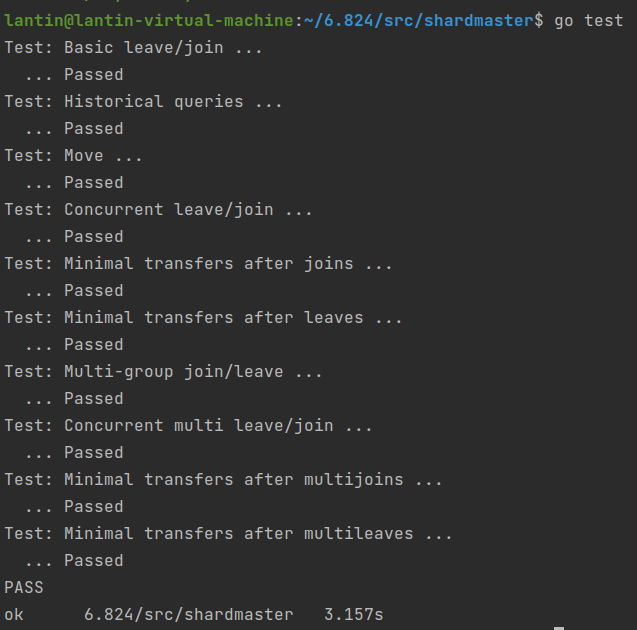
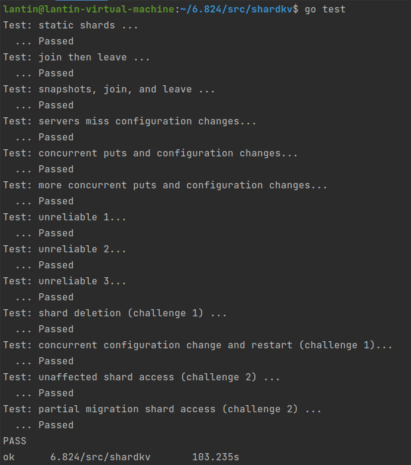

- [Lab 4 - Sharded Key/Value Service](#lab-4---sharded-keyvalue-service)
	- [一、实验相关准备](#一实验相关准备)
	- [二、任务梳理](#二任务梳理)
		- [2.1 任务说明](#21-任务说明)
		- [2.2 Part 4A：Shard Master](#22-part-4ashard-master)
			- [2.2.1 任务要求](#221-任务要求)
			- [2.2.2 任务提示](#222-任务提示)
		- [2.3 Part 4B：Sharded Key/Value Server](#23-part-4bsharded-keyvalue-server)
			- [2.3.1 任务要求](#231-任务要求)
			- [2.3.2 任务提示](#232-任务提示)
		- [2.4 挑战任务](#24-挑战任务)
			- [2.4.1 状态的垃圾回收](#241-状态的垃圾回收)
			- [2.4.2 配置更改期间的客户端请求](#242-配置更改期间的客户端请求)
	- [三、环境搭建](#三环境搭建)
	- [四、编程实现](#四编程实现)
		- [4.1 查看各相关源文件的作用](#41-查看各相关源文件的作用)
		- [4.2 编写shardmaster的相关代码](#42-编写shardmaster的相关代码)
			- [4.2.1 shardmaster的client端](#421-shardmaster的client端)
				- [4.2.1.1 定义Clerk结构](#4211-定义clerk结构)
				- [4.2.1.2 实现MakeClerk函数](#4212-实现makeclerk函数)
				- [4.2.1.3 实现Clerk的Query、Join、Leave和Move方法](#4213-实现clerk的queryjoinleave和move方法)
			- [4.2.2 shardmaster的server端](#422-shardmaster的server端)
				- [4.2.2.1 定义相关变量和结构体](#4221-定义相关变量和结构体)
				- [4.2.2.2 实现StartServer函数](#4222-实现startserver函数)
				- [4.2.2.3 实现四种配置相关请求的handler函数](#4223-实现四种配置相关请求的handler函数)
				- [4.2.2.4 实现shardmaster应用msg中配置变更相关指令的applyConfigChange()函数](#4224-实现shardmaster应用msg中配置变更相关指令的applyconfigchange函数)
				- [4.2.2.5 四个实际执行配置相关操作的函数](#4225-四个实际执行配置相关操作的函数)
				- [4.2.2.6 负载均衡](#4226-负载均衡)
				- [4.2.2.7 Kill()和killed()函数](#4227-kill和killed函数)
		- [4.3 编写shardkv的相关代码](#43-编写shardkv的相关代码)
			- [4.3.1 shardkv的client端](#431-shardkv的client端)
				- [4.3.1.1 定义Clerk结构](#4311-定义clerk结构)
				- [4.3.1.2 实现MakeClerk函数](#4312-实现makeclerk函数)
				- [4.3.1.3 实现Clerk的Get和PutAppend方法](#4313-实现clerk的get和putappend方法)
			- [4.3.2 shardkv的server端](#432-shardkv的server端)
				- [4.3.2.1 定义相关变量和结构体](#4321-定义相关变量和结构体)
				- [4.3.2.2 实现StartServer函数](#4322-实现startserver函数)
				- [4.3.2.3 实现Get和PutAppend请求的两个handler函数](#4323-实现get和putappend请求的两个handler函数)
				- [4.3.2.4 applyMessage](#4324-applymessage)
				- [4.3.2.5 执行client的三种请求指令](#4325-执行client的三种请求指令)
				- [4.3.2.6 定期检测配置更新](#4326-定期检测配置更新)
				- [4.3.2.7 定期检查当前group是否有shard需要从其他group获取](#4327-定期检查当前group是否有shard需要从其他group获取)
				- [4.3.2.8 实现shard迁移请求RPC的handler函数](#4328-实现shard迁移请求rpc的handler函数)
				- [4.3.2.9 定期检查当前group是否有shard已经迁移走](#4329-定期检查当前group是否有shard已经迁移走)
				- [4.3.2.10 实现shard迁移成功确认RPC的handler函数](#43210-实现shard迁移成功确认rpc的handler函数)
				- [4.3.2.11 执行配置变更相关的三种指令](#43211-执行配置变更相关的三种指令)
				- [4.3.2.12 定期检查是否需要添加空指令](#43212-定期检查是否需要添加空指令)
				- [4.3.2.13 执行空指令](#43213-执行空指令)
				- [4.3.2.14 快照相关](#43214-快照相关)
	- [五、测试](#五测试)
		- [5.1 一些技巧](#51-一些技巧)
			- [5.1.1 打印日志](#511-打印日志)
			- [5.1.2 单元测试](#512-单元测试)
		- [5.2 debug记录](#52-debug记录)
			- [5.2.1 Bug in Part 4B](#521-bug-in-part-4b)
				- [5.2.1.1 map赋值报错：panic: assignment to entry in nil map](#5211-map赋值报错panic-assignment-to-entry-in-nil-map)
				- [5.2.1.2 TestConcurrent测试Get值与预期不符](#5212-testconcurrent测试get值与预期不符)
		- [5.3 All Pass](#53-all-pass)
	- [六、总结](#六总结)
	- [七、参考](#七参考)


# Lab 4 - Sharded Key/Value Service


## 一、实验相关准备

- 6.824相关课程
- [Lab4 说明及提示](http://nil.csail.mit.edu/6.824/2020/labs/lab-shard.html)
- 实现前三个Lab并完成debug
- 完成所有Lab后我根据自己的理解绘制张整体的架构图供参考


## 二、任务梳理

### 2.1 任务说明

- 在本实验中，你将构建一个键/值存储系统，该系统对一组副本上的键进行“分片”或分区。一个分片是键/值对的子集，例如，所有以“a”开头的键可能是一个分片，所有以“b”开头的键可能是另一个分片。进行分片是为了提高性能。每个replica group仅处理几个分片的puts和gets，并且这些组并行操作。因此，系统总吞吐量（单位时间的puts和gets）与group的数量成正比。

- 你的分片键/值存储将有两个主要组成部分。第一个组成部分是一组replica groups。每个replica group负责分片的一个子集。一个replica由少数使用 Raft 来复制组分片的servers组成。第二个组成部分是shard master，它决定各个replica group应该服务的分片，该信息称为配置。配置随着时间的推移而变化。client询问shard master来查找一个key对应的replica group，而replica groups则询问master以找出要服务的分片。整个系统只有一个shard master，使用 Raft 实现容错服务。

- 分片存储系统必须能够在replica groups之间转移分片。一个原因是某些组可能比其他组负载更多，因此需要移动分片来平衡负载。另一个原因是replica groups可能会加入和离开系统：可能会添加新的replica groups以增加容量，或者现有的replica groups可能会脱机以进行修复或报废。

- 该实验的主要挑战是处理重新配置——分片到组分配的变化。在单个replica group中，所有组成员必须就何时发生与客户端 Put/Append/Get 请求相关的重新配置达成一致。例如，Put请求可能与重新配置大约同时到达，导致replica group停止对保存Put的key的分片负责。组中的所有replicas必须就 Put 发生在重新配置之前还是之后达成一致。如果在此之前，则 Put 应生效，并且分片的新所有者将看到其效果；如果在此之后， Put 将不会生效，client必须重新尝试新的所有者。推荐的方法是让每个replica group使用 Raft 不仅记录 Puts、Appends 和 Gets 的序列，还记录重新配置的序列。你需要确保任一时间最多有一个replica group为每个分片的请求提供服务。

- 重新配置还需要replica groups之间的交互。例如，在配置 10 中，可能是组 G1 负责分片 S1。在配置11中，又可能是组 G2 负责分片S1。在从 10 到 11 的重新配置期间，G1 和 G2 必须使用 RPC 将分片 S1 的内容（键/值对）从 G1 移动到 G2。

  - clients和servers之间的交互只能使用 RPC。例如，server的不同实例不允许共享 Go 变量或文件。
  - 本实验使用“配置”来指代分片到replica groups的分配，这与 Raft 集群成员关系变更不同，你不必实现 Raft 集群成员关系变更。

- 本实验的通用架构（一个配置服务和一组副本组）遵循与 Flat Datacenter Storage、BigTable、Spanner、FAWN、Apache HBase、Rosebud、Spinnaker 等相同的通用模式。不过，这些系统在许多细节上与本实验有所不同，而且通常也更加复杂和强大。例如，实验室不会演变每个 Raft 组中的 peers 集合；它的数据和查询模型非常简单；分片的切换很慢并且不允许并发的客户端访问。

  - 你的 Lab 4 sharded server、Lab 4 shard master和 Lab 3 kvraft 必须全部使用相同的 Raft 实现。我们将重新运行 Lab 2 和 Lab 3 的测试，作为对 Lab 4 进行评分的一部分。

- 在`src/shardmaster`和`src/shardkv` 中为你提供框架代码和测试 。

  执行下面的指令来运行：

  ```shell
  $ cd ~/6.824
  $ git pull
  ...
  $ cd src/shardmaster
  $ go test
  --- FAIL: TestBasic (0.00s)
          test_test.go:11: wanted 1 groups, got 0
  FAIL
  exit status 1
  FAIL    shardmaster     0.008s
  $
  ```
  
  完成后，你的实现应该通过`src/shardmaster`目录中的所有测试以及 `src/shardkv`中的所有测试。


### 2.2 Part 4A：Shard Master

首先，你需要在`shardmaster/server.go`和`client.go` 中实现 shard master 。完成后，你应该通过 `shardmaster`目录中的所有测试：

```shell
$ cd ~/6.824/src/shardmaster
$ go test
Test: Basic leave/join ...
  ... Passed
Test: Historical queries ...
  ... Passed
Test: Move ...
  ... Passed
Test: Concurrent leave/join ...
  ... Passed
Test: Minimal transfers after joins ...
  ... Passed
Test: Minimal transfers after leaves ...
  ... Passed
Test: Multi-group join/leave ...
  ... Passed
Test: Concurrent multi leave/join ...
  ... Passed
Test: Minimal transfers after multijoins ...
  ... Passed
Test: Minimal transfers after multileaves ...
  ... Passed
PASS
ok  	shardmaster	13.127s
$
```


#### 2.2.1 任务要求

- shardmaster 管理带编号的配置序列。每个配置都描述一组replica groups以及分片到replica groups的分配关系。每当需要改变此分配关系时，shard master都会使用新分配关系来创建一个新配置。当键/值clients和servers想要了解当前（或过去）的配置时，它们会联系shardmaster。
- 你的实现必须支持`shardmaster/common.go` 中描述的 RPC 接口 ，其中包含 `Join`、`Leave`、`Move`和 `Query` RPCs。这些 RPCs 旨在允许管理员（和tests）控制 shardmaster：添加新的replica groups、消除replica groups以及在replica groups之间移动分片。
- 管理员使用`Join` RPC 来添加新的replica groups。它的参数是一组从唯一的非零副本组标识符 (GID) 到服务器名称列表的映射。shardmaster 应通过创建包含新replica groups的新配置来做出反应。新配置应在整个组中尽可能均匀地划分分片，并应移动尽可能少的分片来实现该目标。如果 GID 不是当前配置的一部分，则 shardmaster 应允许重复使用该 GID（即应允许 GID 加入，然后离开，然后再次加入）。
- `Leave` RPC 的参数是先前加入的组的 GID 列表。shardmaster 应该创建一个不包含这些组的新配置，并将这些组的分片分配给其余组。新配置应尽可能在组之间均匀划分分片，并应移动尽可能少的分片来实现该目标。
- `Move` RPC 的参数是一个分片号和 GID。shardmaster 应创建一个新配置，将该分片分配给该组。`Move`的目的是让我们测试你的软件。`Move`后的`Join`或`Leave`可能会撤消`Move`，因为 `Join`和`Leave`会重新平衡。
- `Query`RPC 的参数是一个配置号。shardmaster 回复具有该编号的配置。如果该数字为 -1或大于已知的最大配置号，则shardmaster应回复最新配置。`Query(-1)`的结果应该反映 shardmaster 在收到`Query(-1)` RPC 之前完成处理的每个`Join`、`Leave`或`Move` RPC 。
- 第一个配置的编号应为零，它不应包含任何组，并且所有分片应被分配 GID 零（无效的 GID）。下一个配置（为响应`Join` RPC 而创建）应编号为 1 等。通常，分片的数量明显多于组的数量（即每一组将服务多个分片），以便可以以相当细的粒度转移负载。
- 你的任务是在`shardmaster/`目录中的 `client.go`和`server.go` 中实现上面指定的接口 。你的 shardmaster 必须具有容错能力，使用 Lab 2/3 中的 Raft 库。请注意，在对 Lab 4 进行评分时，我们将重新运行 Lab 2 和 Lab 3 中的测试，因此请确保你不会在 Raft 实现中引入错误。当你通过`shardmaster/`中的所有测试后，就完成了此任务。


#### 2.2.2 任务提示

- 从你的 kvraft server的精简副本开始。
- 你应该实现shard master对重复的client请求RPCs的检测。shardmaster 测试不会对此进行测试，但 shardkv 测试之后会在不可靠的网络上使用你的 shardmaster；如果你的 shardmaster 没有过滤掉重复的 RPCs，你可能无法通过 shardkv 测试。
- Go maps是引用。如果将map类型的一个变量分配给另一个变量，则这两个变量都引用同一个map。因此，如果你想基于前一个`Config`创建一个新的配置 ，则需要创建一个新的map（使用`make()`）并单独复制键和值。
- Go 的竞争检测器 (`go test -race`) 或许可以帮助你发现bugs。


### 2.3 Part 4B：Sharded Key/Value Server

现在你将构建 shardkv，一个分片容错键/值存储系统。你将修改`shardkv/client.go`、 `shardkv/common.go`和`shardkv/server.go`。

每个 shardkv 服务器作为一个replica group的一部分运行。每个replica group为某些键空间分片提供`Get`、`Put`和 `Append`操作。在`client.go`中使用`key2shard()`来查找一个key属于哪个分片。多个replica groups协作为完整的分片集提供服务。`shardmaster`服务的实例将分片分配给replica groups；当此分配发生变化时，replica groups必须将分片相互移交，同时确保客户端不会看到不一致的响应。

你的存储系统必须为使用其客户端接口的应用程序提供可线性化的接口。也就是说，对`shardkv/client.go`中的`Clerk.Get()`、 `Clerk.Put()`和`Clerk.Append()`方法的已完成的应用程序调用必须以相同的顺序作用于所有副本。`Clerk.Get()`应该看到最近 `Put` / `Append`写入同一键的值。即使`Get`和`Put`与配置更改大约同时到达，情况也必须如此。

仅当分片的 Raft 副本组中的大多数servers处于活动状态并且可以相互通信以及与大多数 shardmaster servers通信时，每个分片才需要取得进展。即使某些副本组中的少数服务器已死亡、暂时不可用或速度缓慢，你的实现也必须能正常运行（处理请求并能够根据需要重新配置）。

一个shardkv server仅是单个replica group的成员。给定replica group中的servers集合永远不会改变。

我们为你提供了`client.go`的代码，该代码将每个 RPC 发送到负责该RPC的key的replica group。如果replica group表示它不负责这个key，它会重试；在这种情况下，client代码会向shard master请求最新配置并重试。你必须修改`client.go` 作为支持处理重复客户端 RPC 的一部分，就像在 kvraft 实验中一样。

完成后，你的代码应该通过除挑战测试之外的所有 shardkv 测试：

```shell
$ cd ~/6.824/src/shardkv
$ go test
Test: static shards ...
  ... Passed
Test: join then leave ...
  ... Passed
Test: snapshots, join, and leave ...
  ... Passed
Test: servers miss configuration changes...
  ... Passed
Test: concurrent puts and configuration changes...
  ... Passed
Test: more concurrent puts and configuration changes...
  ... Passed
Test: unreliable 1...
  ... Passed
Test: unreliable 2...
  ... Passed
Test: shard deletion (challenge 1) ...
  ... Passed
Test: concurrent configuration change and restart (challenge 1)...
  ... Passed
Test: unaffected shard access (challenge 2) ...
  ... Passed
Test: partial migration shard access (challenge 2) ...
  ... Passed
PASS
ok  	shardkv	206.132s
$
```

**注意**：你的server不应调用shard master的`Join()`handler。tester将在适当的时候调用`Join()`。


#### 2.3.1 任务要求

- 你的第一个任务是通过第一个 shardkv 测试。在此测试中，只有一个分片分配，因此你的代码应该与你在 Lab 3 server的代码非常相似。最大的修改是让你的server检测配置何时发生，并开始接受其key与它现在拥有的分片匹配的请求。
- 现在你的解决方案适用于静态分片情况，是时候解决配置变更问题了。你需要让servers监视配置更改，并在检测到配置更改时启动分片迁移过程。如果一个replica group丢失了一个分片，则它必须立即停止向该分片中的key的相关请求提供服务，并开始将该分片的数据迁移到接管所有权的replica group。如果一个replica group获得了一个分片，则需要在接受对该分片的请求之前等待上一任所有者发送完旧的分片数据。
- 在配置更改期间实现分片迁移。确保一个replica group中的所有servers在操作序列中的同一点执行迁移，以便它们都接受或拒绝并发的客户端请求。在进行后面的测试之前，你应该专注于通过第二个测试（“join then leave”）。当你通过直到（但不包括）`TestDelete `的所有测试时，就完成了此项任务。
- 你的server需要定期轮询 shardmaster 以了解新配置。测试预计你的代码大约每 100 毫秒轮询一次；更频繁是可以的，但是太少可能会导致问题。
- servers需要相互发送 RPC，以便在配置更改期间传输分片。shardmaster 的 `Config` 结构包含server名称，但你需要 `labrpc.ClientEnd`才能发送 RPC。你应该使用传递给 `StartServer()`的`make_end()`函数将server名称转换为 `ClientEnd`。 `shardkv/client.go`包含执行此操作的代码。


#### 2.3.2 任务提示

- 向`server.go` 添加代码以定期从 shardmaster 获取最新配置，并添加代码以在接收的group不负责这个client的key的分片时拒绝客户端请求。你仍然应该通过第一个测试。
- 你的server应该对它不负责的key（即其分片未分配给服务器组的密钥）的client RPC 回复 `ErrWrongGroup` 错误 。确保你的`Get`、`Put`和 `Append` handlers在面临并发的重新配置时能正确做出此决定。
- 按顺序一次处理一个重新配置。
- 如果一个测试失败，请检查 gob 错误（例如"gob: type not registered for interface ..."）。Go 并不认为 gob 错误是致命的，尽管它们对于实验来说是致命的。
- 你需要为跨分片移动的客户端请求提供最多一次语义（重复检测）。
- 思考一下 shardkv 客户端和服务端应该如何处理`ErrWrongGroup`。如果客户端收到 `ErrWrongGroup` ，是否应该更改序列号？如果服务器在执行一个`Get` / `Put`请求时返回`ErrWrongGroup` ，它是否应该更新客户端状态？
- 在一个server转移到新配置后，继续存储它不再拥有的分片是可以接受的（尽管这在实际系统中并不那么好）。这可能有助于简化你的server实现。
- 当组 G1 在配置更改期间需要来自 G2 的分片时，G2 在处理日志条目期间的哪个点将分片发送到 G1 重要吗？
- 你可以在 RPC 请求或回复中发送整个map，这可能有助于保持分片传输代码的简单。
- 如果你的 RPC 处理程序之一在其回复中包含作为服务器状态一部分的map（例如键/值映射），则你可能会因竞争而遇到错误。RPC 系统必须读取这个map才能将其发送给调用者，但它没有持有覆盖map的锁。但是，你的服务器可能会在 RPC 系统读取某map的同时修改该map。解决方案是 RPC 处理程序在回复中包含map的副本。
- 如果你将一个map或slice放入 Raft 日志条目中，并且你的键/值服务器随后在 `applyCh` 上看到该条目，并在你的键/值服务器的状态中保存对map/slice的引用，那么你可能会发生竞争。这是因为你的键/值服务器在修改map/slice时可能由于Raft正在持久化它的日志（需要读取这些map/slice）而发生竞争。解决方案是制作map/slice的副本，并将副本存储在键/值服务器的状态中。
- 在配置更改期间，一对groups可能需要在它们之间双向移动分片。如果你看到发生了死锁，这可能是一个原因。


完成 Lab 4 后，保证之前的Lab的测试仍能通过：

```shell
$ go test raft/...
$ go test kvraft/...
$ go test shardmaster/...
$ go test shardkv/...
```


### 2.4 挑战任务

若要构建生产级的系统，下面两个功能是必不可少的，因此作为挑战任务。


#### 2.4.1 状态的垃圾回收

当一个replica group失去了一个分片的所有权时，该group应该消除自己数据库中关于失去分片的键值对数据。对于它来说，保留它不再拥有的、不再满足请求的值是一种浪费。然而，这给迁移带来了一些问题。假设我们有两个组，G1 和 G2，并且有一个新配置 C 将分片 S 从 G1 移动到 G2。如果 G1 的配置在转变到 C 时从数据库中删除了 S 中的所有键，那么 G2 在尝试转变到 C 时如何获取 S 的数据呢？


**要求**：

使每个replica group保留旧分片的时间不超过绝对必要的时间。即使replica group（如上面的 G1）中的所有服务器崩溃然后又恢复，你的解决方案也必须有效。如果你通过了`TestChallenge1Delete`和`TestChallenge1Concurrent`，那么你就完成了此挑战 。


#### 2.4.2 配置更改期间的客户端请求

处理配置更改的最简单方法是在转换完成之前禁止所有客户端操作。虽然概念上很简单，但这种方法在生产级系统中并不可行；每当机器被加入或取出时，这都会导致所有客户长时间停顿。最好继续为不受正在进行的配置更改影响的分片提供服务。


**要求**：

修改你的解决方案，以便在配置更改期间继续执行对于未受影响分片中key的客户端操作。当你通过`TestChallenge2Unaffected`时，你就完成了此挑战。


虽然上面的优化很好，但我们还可以做得更好。假设某个副本组 G3 在转换到 C 时需要 G1 中的分片 S1 和 G2 中的分片 S2。我们希望 G3 在收到必要的状态后立即开始为分片提供服务，即使它仍在等待其他一些分片。例如，如果 G1 发生故障，G3 在从 G2 接收到适当的数据后仍应开始服务 S2 的请求，尽管到 C 的转换尚未完成。


**要求**：

修改你的解决方案，以便副本组在能够时立即开始提供分片服务，即使配置变更仍在进行中。当你通过`TestChallenge2Partial`时，你就完成了此挑战 。


## 三、环境搭建

- 虚拟机ubuntu-22.04.1
- GoLand 2022.3.2
- Go 1.19.5


## 四、编程实现

### 4.1 查看各相关源文件的作用

**Lab 4A** 的相关示例和代码在`6.824/src/shardmaster`文件夹中

```
-shardmaster
	-client.go
	-common.go
	-config.go
	-server.go
	-test_test.go
```

这些文件的作用如下：

1. client.go

   模拟client，能够向shardmaster服务端发起`Query`、`Join`、`Leave`和`Move`请求。Lab 4B中shardKV想要询问shardmaster获取最新配置或者测试程序需要操作配置变更都要通过此文件提供的请求接口。

2. common.go

   定义相关结构体、Err类型等。

3. config.go

   完成相关配置，模拟测试中可能出现的情形。

4. server.go

   提供shardmaster服务端结构框架和需要实现的相关API，根据注释完成相关功能的实现（主要编程部分）。shardmaster需要接收client发来的配置变更请求并将请求传给raft层完成集群共识，然后真正将配置变更应用到状态机。

5. test_test.go

   shardmaster测试程序，模拟了实际可能遇到的服务器瘫痪、新增或减少集群内服务器、网络延迟、不稳定、丢包、分区等问题，测试shardmaster配置变更服务的正确性和健壮性。


**Lab 4B** 的相关示例和代码在`6.824/src/shardkv`文件夹中

```
-shardmaster
	-client.go
	-common.go
	-config.go
	-server.go
	-test_test.go
```

文件内容和功能与shardmaster和kvraft类似。


### 4.2 编写shardmaster的相关代码

这部分主要是实现 Lab 4A 要求的shardmaster的相关功能接口，需要向`6.824/src/shardmaster`内的相关文件添加代码。shardmaster与kvraft的实现思路和代码结构基本一致，甚至由于配置文件较小还不需要进行快照，降低了难度。这一部分最重要的部分也是难点，就是当配置变更时如何分配shard以负载均衡。


#### 4.2.1 shardmaster的client端

主要向`6.824/src/shardmaster/client.go`中添加代码。


##### 4.2.1.1 定义Clerk结构

我个人理解这个`Clerk`结构体就是模拟的client-server关系中的client，它的结构体定义如下：

```go
type Clerk struct {
	servers []*labrpc.ClientEnd // server集群的ClientEnd
	// Your data here.
	clientId int64 // client的唯一标识符
	seqNum   int   // 标志client为每个请求分配的序列号到哪了（采用自增，从1开始）
}
```

- `servers`可以理解为shardmaster共识集群的指针切片，在rpc通信中向某个server发送rpc需要用到。但是要注意虽然都是shardmaster集群的所有server，但这里的序号跟`server.go`的`StartServer()`中初始化shardmaster集群中序号是**不对应**的！（与 Lab 3 中类似）
- `clientId`是用来唯一标识client，为随机生成的`int64`类型，在本次实验中可认为不会重复。
- `seqNum`记录该client请求的配置变更相关操作的序号到哪里了，用来防止改变状态机状态的command被重复执行而发生错误，采用从1开始的自增实现。


##### 4.2.1.2 实现MakeClerk函数

该函数是用来构造和初始化client的，代码如下：

```go
func MakeClerk(servers []*labrpc.ClientEnd) *Clerk {
	ck := new(Clerk)
	ck.servers = servers
	// Your code here.
	ck.clientId = nrand() // clientId通过提供的nrand()随机生成，重复概率忽略不计
	ck.seqNum = 1
	return ck
}
```


##### 4.2.1.3 实现Clerk的Query、Join、Leave和Move方法

shardmaster的client端有四种请求类型，分别是Query、Join、Leave和Move，其中Query操作仅查询某个config而不改变配置本身。这几个函数的结构基本一致，代码如下：

```go
func (ck *Clerk) Query(num int) Config {
	DPrintf("Client[%v] request Query(seqNum = %v, config num = %v)\n",
		ck.clientId, ck.seqNum, num)

	args := &QueryArgs{}
	// Your code here.
	args.Num = num
	args.ClientId = ck.clientId
	args.SeqNum = ck.seqNum

	for {
		// try each known server.
		for _, srv := range ck.servers {
			var reply QueryReply
			ok := srv.Call("ShardMaster.Query", args, &reply)
			if ok && reply.WrongLeader == false && reply.Err == OK {
				ck.seqNum++
				DPrintf("Client[%v] receive Query response and Config=%v. (seqNum -> %v)\n",
					ck.clientId, reply.Config, ck.seqNum)
				return reply.Config
			}
		}
		time.Sleep(100 * time.Millisecond)
	}
}

// 添加新的replica group
// 入参： new GID -> servers mappings
func (ck *Clerk) Join(servers map[int][]string) {
	DPrintf("Client[%v] request Join(seqNum = %v, join servers = %v)\n",
		ck.clientId, ck.seqNum, servers)

	args := &JoinArgs{}
	// Your code here.
	args.Servers = servers
	args.ClientId = ck.clientId
	args.SeqNum = ck.seqNum

	for {
		// try each known server.
		for _, srv := range ck.servers {
			var reply JoinReply
			ok := srv.Call("ShardMaster.Join", args, &reply)
			if ok && reply.WrongLeader == false && reply.Err == OK { // 请求成功
				ck.seqNum++
				DPrintf("Client[%v] receive Join response. (seqNum -> %v)\n",
					ck.clientId, ck.seqNum)
				return
			}
		}
		time.Sleep(100 * time.Millisecond)
	}
}

func (ck *Clerk) Leave(gids []int) {
	DPrintf("Client[%v] request Leave(seqNum = %v, leave gids = %v)\n",
		ck.clientId, ck.seqNum, gids)

	args := &LeaveArgs{}
	// Your code here.
	args.GIDs = gids
	args.ClientId = ck.clientId
	args.SeqNum = ck.seqNum

	for {
		// try each known server.
		for _, srv := range ck.servers {
			var reply LeaveReply
			ok := srv.Call("ShardMaster.Leave", args, &reply)
			if ok && reply.WrongLeader == false && reply.Err == OK { // 请求成功
				ck.seqNum++
				DPrintf("Client[%v] receive Leave response. (seqNum -> %v)\n",
					ck.clientId, ck.seqNum)
				return
			}
		}
		time.Sleep(100 * time.Millisecond)
	}
}

func (ck *Clerk) Move(shard int, gid int) {
	DPrintf("Client[%v] request Move(seqNum = %v, move shard = %v, moveTO gid = %v)\n",
		ck.clientId, ck.seqNum, shard, gid)

	args := &MoveArgs{}
	// Your code here.
	args.Shard = shard
	args.GID = gid
	args.ClientId = ck.clientId
	args.SeqNum = ck.seqNum

	for {
		// try each known server.
		for _, srv := range ck.servers {
			var reply MoveReply
			ok := srv.Call("ShardMaster.Move", args, &reply)
			if ok && reply.WrongLeader == false && reply.Err == OK { // 请求成功
				ck.seqNum++
				DPrintf("Client[%v] receive Move response. (seqNum -> %v)\n",
					ck.clientId, ck.seqNum)
				return
			}
		}
		time.Sleep(100 * time.Millisecond)
	}
}
```

- client是通过RPC向shardmaster发起请求的，这里在`common.go`文件中定义了四对RPC参数和回复的结构体以及`Config`结构体、`Err`类型等相关类型，代码如下：

  ```go
  // The number of shards.
  const NShards = 10
  
  // A configuration -- an assignment of shards to groups.
  // Please don't change this.
  type Config struct {
  	Num    int              // config number
  	Shards [NShards]int     // shard -> gid	，数组，零值为每个元素均为对应零值的数组
  	Groups map[int][]string // gid -> servers[]
  }
  
  // Err类型
  const (
  	OK         = "OK"
  	ErrTimeout = "ErrTimeout"
  )
  
  type Err string
  
  type JoinArgs struct {
  	Servers  map[int][]string // new GID -> servers mappings
  	ClientId int64
  	SeqNum   int
  }
  
  type JoinReply struct {
  	WrongLeader bool
  	Err         Err
  }
  
  type LeaveArgs struct {
  	GIDs     []int
  	ClientId int64
  	SeqNum   int
  }
  
  type LeaveReply struct {
  	WrongLeader bool
  	Err         Err
  }
  
  type MoveArgs struct {
  	Shard    int
  	GID      int
  	ClientId int64
  	SeqNum   int
  }
  
  type MoveReply struct {
  	WrongLeader bool
  	Err         Err
  }
  
  type QueryArgs struct {
  	Num      int // desired config number
  	ClientId int64
  	SeqNum   int
  }
  
  type QueryReply struct {
  	WrongLeader bool
  	Err         Err
  	Config      Config
  }
  ```

  - `JoinArgs`中的参数`Servers`为要加入新配置的组的GID到该组的server成员name的映射，一次Join操作可能加入多个group，因此用map来记录这些组及其成员的信息。
  - `LeaveArgs`中的参数`GID`为新配置要离开的组的GID切片，一次Join操作可能有多个group离开。
  - `MoveArgs`中的参数`Shard`为要转移的shard的序号，参数`GID`为要移动到的组的GID，一次Move操作只移动一个shard。
  - `QueryArgs`中的参数`Num`为想要查询的`Config`的序号，注意与`SeqNum`进行区分。
  - 另外这些参数结构体中都有用于标识请求client的`ClientId`和过滤重复请求的`SeqNum`。
  - 这些回复结构体中都有用于标识本次请求是否是向leader请求的`WrongLeader`和报错信息`Err`。另外`QueryReply`还要包括查询到的`Config`。

- 这四个函数的结构基本一致，先根据各自的功能构建RPC参数`args`，附上必要信息。

- **外层**`for`循环保证只有本次配置相关请求收到成功的回复后才能开始下一次请求，否则一直重复发起该请求。

- **内层**`for`循环用于向shardmaster集群的所有servers发起一轮请求，如果一轮请求都没有成功则等待100ms再重新发起一轮请求。

- 这里注意要在每次重新请求前都初始化reply结构体，即对每次RPC调用都重新初始化一个reply，否则reply的复用会导致接收到不对应的请求发来的回复。

- 然后根据回复进行对应的处理：

  - 只有RPC成功收到回复且`reply.WrongLeader == false && reply.Err == OK`才为请求成功（找到了leader且没有超时等其他错误），然后将`seqNum`加1代表下次新指令的序号，结束循环return。
  - 没有收到RPC回复或收到回复但不是leader或超时均为请求失败，下次换个server继续发起请求（client会一直重复发起请求直至向leader请求成功，因此后面server端的实现必须能过滤重复请求）。


#### 4.2.2 shardmaster的server端

主要向`6.824/src/shardmaster/server.go`中添加代码。


##### 4.2.2.1 定义相关变量和结构体

```go
// OpType类型
const (
	Join  = "Join"
	Leave = "Leave"
	Move  = "Move"
	Query = "Query"
)

const RespondTimeout = 500 // shardmaster回复client的超时时间，单位：毫秒

type ShardMaster struct {
	mu      sync.Mutex
	me      int
	rf      *raft.Raft
	applyCh chan raft.ApplyMsg
	dead    int32 // set by Kill()

	// Your data here.
	sessions    map[int64]Session  // 记录shardmaster为每个client处理过的上一次请求的结果
	configs     []Config           // indexed by config num
	notifyMapCh map[int]chan Reply // shardmaster执行完请求操作后通过chan通知对应的handler方法回复client，key为日志的index
}

// session跟踪为client处理的上一次请求的序列号，以及相关的响应。
// 如果shardmaster接收到序列号已经执行过的请求，它会立即响应，而不需要重新执行请求
type Session struct {
	LastSeqNum int    // shardmaster为该client处理的上一次请求的序列号
	OpType     string // 上一次处理的操作请求的类型
	Response   Reply  // 对应的响应
}

// 响应的统一结构，用于shardmaster在session中保存最新请求的响应
type Reply struct {
	Err    Err
	Config Config // 仅Query请求时有效
}

// 统一的操作结构体，依靠OpType区分具体操作
// 其中部分字段仅在特定操作中有效
type Op struct {
	// Your data here.
	ClientId int64            // 标识客户端
	SeqNum   int              // 请求的序号
	OpType   string           // 操作类型，Join/Leave/Move/Query
	Servers  map[int][]string // new GID -> servers mappings，// 仅在Join操作有效
	GIDs     []int            // 仅在Leave操作有效
	Shard    int              // 仅在Move操作有效
	GID      int              // 仅在Move操作有效
	CfgNum   int              // desired config number，仅在Query操作有效
}
```

- 对于四种类型的指令均采用一种结构体`Op`，通过`OpType`字段来具体区分，里面还带有一些必要的标识字段和信息。`Op`的字段包括了四种指令所需的参数的**并集**，**只有在为特定指令时某些字段才有效**。

- `Session`结构体用来保存shardmaster为该client处理的**最新序列号**以及相关的**响应**。因为每个操作server只能执行一次，不能因为收到client的多次重复请求（可能是延迟、丢失导致的重发）就执行多次，这会使得状态机的状态错误。故**通过`Session`结构体来记录下每个client上一次请求的结果，当重复请求到来时（根据序列号来判断），直接返回`Session`中保存的`Reply`而不再次执行**。

- `Reply`结构体用于shardmaster在`Session`中保存请求的回复，也用于shardmaster在apply了指令后向正在等待的handler发送请求结果。

- `ShardMaster`是服务端server的结构体。
  - shardmaster拥有自己的锁来控制应用层的并发问题，区别于raft层的锁。
  - 每个shardmaster**关联**一个raft server，且在集群中的序号`me`**相同**。
  - `applyCh`用于在raft server和shardmaster之间传递msg，由shardmaster在初始化时传递给raft。
  - 类似于前面的实验也设置变量`dead`来记录server的存活情况。
  - `sessions`用来维护此shardmaster与各个client之间的会话（`session`），也用一个map来保存，key为各个client的`ClientId`。
  - `configs`是历史所有配置的记录，切片下标0的位置根据要求为无实际意义的编号0的`Config`，因此实际`Config`的`Num`从1开始，与切片下标对应了。
  - `notifyMapCh`用于当shardmaster apply到了正在等待回复的日志时，通过channel传递reply并通知对应的handler方法回复client，key为日志的index。
- 这部分很多设计与kvraft类似，甚至是更简化的版本。


##### 4.2.2.2 实现StartServer函数

`StartServer()`函数作用是初始化`shardmaster`，代码如下：

```go
// servers[] contains the ports of the set of
// servers that will cooperate via Paxos to
// form the fault-tolerant shardmaster service.
// me is the index of the current server in servers[].
func StartServer(servers []*labrpc.ClientEnd, me int, persister *raft.Persister) *ShardMaster {
	sm := new(ShardMaster)
	sm.me = me
	sm.dead = 0 // 0代表该server还存活，1代表它被kill了

	sm.configs = make([]Config, 1)
	// 按照实验要求，第一个config的编号应为0，不包含任何组，且所有shard都被分配GID零
	// 在没有对切片内每个元素结构体进行初始化的情况下，直接访问某元素的成员变量得到该类型的零值
	sm.configs[0].Groups = map[int][]string{} // 声明的同时初始化为一个空map

	labgob.Register(Op{})
	sm.applyCh = make(chan raft.ApplyMsg)
	sm.rf = raft.Make(servers, me, persister, sm.applyCh)

	// Your code here.
	var mutex sync.Mutex
	sm.mu = mutex
	sm.sessions = map[int64]Session{}
	sm.notifyMapCh = make(map[int]chan Reply) // 里面的channel使用前记得初始化

	go sm.applyConfigChange()
	return sm
}
```

- 由于一个shardmaster关联一个raft server，因此在这里也要调用`raft.Make()`来初始化对应的raft。
- 在初始化shardmaster后起一个`applyConfigChange()`协程来循环检测和apply从`applyCh`中传来的配置相关操作指令。
- 按照要求，第一个配置的编号应为零，它不应包含任何组，并且所有分片应被分配 GID 零（无效的 GID）。正好作为`configs`切片下标0处的占位config。


##### 4.2.2.3 实现四种配置相关请求的handler函数

client向shardmaster发送Join、Leave、Move或Query的RPC请求，server端对应的handler函数代码如下：

```go
// Join handler
func (sm *ShardMaster) Join(args *JoinArgs, reply *JoinReply) {
	// Your code here.
	sm.mu.Lock()

	// shardmaster过滤重复请求
	if args.SeqNum < sm.sessions[args.ClientId].LastSeqNum {
		// 标志这个请求client已经收到正确的回复了，只是这个重发请求到达shardmaster太慢了
		// 其实client端并没有在等待这个回复了，直接return
		sm.mu.Unlock()
		return
	} else if args.SeqNum == sm.sessions[args.ClientId].LastSeqNum {
		// 将session中记录的之前执行该请求的结果直接返回，使得不会执行一个请求多次
		// 可能是由于之前的回复在网络中丢失或延迟导致重复请求
		reply.Err = sm.sessions[args.ClientId].Response.Err
		sm.mu.Unlock()
		return
	} else { // 如果是未处理的新请求
		sm.mu.Unlock() // 先解锁
		joinOp := Op{
			ClientId: args.ClientId,
			SeqNum:   args.SeqNum,
			OpType:   Join,
			Servers:  args.Servers, // 新增的组中包含的servers
		}

		index, _, isLeader := sm.rf.Start(joinOp) // 调用rf.Start()，将client的请求操作传给raft进行共识

		if !isLeader { // 若client联系的不是leader
			reply.WrongLeader = true
			return
		}

		notifyCh := sm.createNotifyCh(index)

		// 等待请求执行完的回复并开始超时计时
		select {
		case res := <-notifyCh:
			reply.Err = res.Err
		case <-time.After(RespondTimeout * time.Millisecond):
			reply.Err = ErrTimeout
		}

		go sm.closeNotifyCh(index) // 关闭并删除此临时channel，下个请求到来时重新初始化一个channel
	}
}

// Leave handler
func (sm *ShardMaster) Leave(args *LeaveArgs, reply *LeaveReply) {
	// Your code here.
	sm.mu.Lock()

	// shardmaster过滤重复请求
	if args.SeqNum < sm.sessions[args.ClientId].LastSeqNum {
		sm.mu.Unlock()
		return
	} else if args.SeqNum == sm.sessions[args.ClientId].LastSeqNum {
		reply.Err = sm.sessions[args.ClientId].Response.Err
		sm.mu.Unlock()
		return
	} else { // 如果是未处理的新请求
		sm.mu.Unlock() // 先解锁
		leaveOp := Op{
			ClientId: args.ClientId,
			SeqNum:   args.SeqNum,
			OpType:   Leave,
			GIDs:     args.GIDs, // 要离开的组的GID列表
		}

		index, _, isLeader := sm.rf.Start(leaveOp)

		if !isLeader {
			reply.WrongLeader = true
			return
		}

		notifyCh := sm.createNotifyCh(index)

		// 等待请求执行完的回复并开始超时计时
		select {
		case res := <-notifyCh:
			reply.Err = res.Err
		case <-time.After(RespondTimeout * time.Millisecond):
			reply.Err = ErrTimeout
		}

		go sm.closeNotifyCh(index)
	}
}

// Move handler
func (sm *ShardMaster) Move(args *MoveArgs, reply *MoveReply) {
	// Your code here.
	sm.mu.Lock()

	// shardmaster过滤重复请求
	if args.SeqNum < sm.sessions[args.ClientId].LastSeqNum {
		sm.mu.Unlock()
		return
	} else if args.SeqNum == sm.sessions[args.ClientId].LastSeqNum {
		reply.Err = sm.sessions[args.ClientId].Response.Err
		sm.mu.Unlock()
		return
	} else { // 如果是未处理的新请求
		sm.mu.Unlock() // 先解锁
		moveOp := Op{
			ClientId: args.ClientId,
			SeqNum:   args.SeqNum,
			OpType:   Move,
			Shard:    args.Shard, // 要移动的分片序号
			GID:      args.GID,   // 要移动到的组的GID
		}

		index, _, isLeader := sm.rf.Start(moveOp)

		if !isLeader {
			reply.WrongLeader = true
			return
		}

		notifyCh := sm.createNotifyCh(index)

		// 等待请求执行完的回复并开始超时计时
		select {
		case res := <-notifyCh:
			reply.Err = res.Err
		case <-time.After(RespondTimeout * time.Millisecond):
			reply.Err = ErrTimeout
		}

		go sm.closeNotifyCh(index)
	}
}

func (sm *ShardMaster) Query(args *QueryArgs, reply *QueryReply) {
	// Your code here.
	// 由于Query操作仅查询不会改变配置信息，因此类似于kvraft中的Get请求，重复的Query请求不进行过滤
	queryOp := Op{
		ClientId: args.ClientId,
		SeqNum:   args.SeqNum, // 本次请求的序号
		OpType:   Query,
		CfgNum:   args.Num, // 想要查询的Config的序号
	}

	index, _, isLeader := sm.rf.Start(queryOp) // 调用rf.Start()，将client的请求操作传给raft进行共识

	if !isLeader { // 若client联系的不是leader
		reply.WrongLeader = true
		return
	}

	notifyCh := sm.createNotifyCh(index)

	// 等待请求执行完的回复并开始超时计时
	select {
	case res := <-notifyCh:
		reply.Err = res.Err
		reply.Config = res.Config // Query请求要返回查询到的Config
	case <-time.After(RespondTimeout * time.Millisecond):
		reply.Err = ErrTimeout
	}

	go sm.closeNotifyCh(index) // 关闭并删除此临时channel，下个请求到来时重新初始化一个channel
}
```

- 这四个handler函数结构相似，`Join()`、`Leave()`、`Move()`比起`Query()`在前面多了一部分检查。原因是前三种操作会改变配置本身、生成新的配置，这是会出现shard迁移的。如果client多次重复某一请求（会改变配置状态的请求），shardmaster需要能**过滤**它们，因为重复执行很危险，会让client端认知的与server端实际的状态不一致。但Query操作只是获取配置而不会改变和生成配置，因此在**本次实验中并不对重复的Query请求进行过滤**，而是允许其再次执行。

- 具体如何**过滤**重复的请求，主要是通过`args`中的`SeqNum`与对应client的`session`中的`LastCmdNum`进行比较，在handler函数的一开始就先进行过滤处理（这是**第一道防线**）：

  - 如果这次请求的序号**小于**该client上一个已经完成的请求的序号，代表Client其实已经收到了这个请求的正确回复，只是这个重发请求到的太慢了，直接return即可。（因为对于某个操作client只有在收到正确回复后才会请求下一个操作）
  - 如果这次请求的序号**等于**该client上一个已经完成的请求的序号，那么代表回复丢失或延迟导致client没收到而重发了这个请求，其实该请求一种执行过了，这时直接将对应`session`中保存的上次执行完的结果返回给client即可，而不再次执行。
  - 如果这次请求的序号**大于**该client上一个已经完成的请求的序号，那么代表这次请求是尚未执行的新请求，需要下到raft共识然后由shardmaster实际执行后回复结果给client。（最主要的逻辑）

- 判断是新请求后**，首先如果持有`sm.mu`一定要先解锁**，然后根据指令类型初始化一个对应的指令`Op`，调用`sm.rf.Start()`来查看该server是否是leader（**一定要在调用`rf.Start()`前确保没持有`kv.mu`！**因为`Start()`内部需要持有`rf.mu`，很容易发生**四向锁**）。另外，请求的指令也是通过调用`sm.rf.Start()`来**下放到raft层进行共识**的，现在需要等待该指令共识完成后通过`applyCh`传回来在状态机上apply。

  如果请求的server不是leader，则直接将reply的`WrongLeader`置为true返回，因为非leader是没有权限接受请求的。

- 如果是leader，则调用`createNotifyCh()`函数为`sm.notifyMapCh[index]`初始化一个`notifyCh`，用于handler与`applyConfigChange()`完成该指令的apply后进行通信。**handler就是通过这个channel来知道该请求什么时候被真正执行以及获取执行结果的**。

  `createNotifyCh()`函数的代码如下：

  ```go
  // 为leader在sm.notifyMapCh中初始化一个缓冲为1的channel完成本次与applyConfigChange()的通信
  func (sm *ShardMaster) createNotifyCh(index int) chan Reply {
  	sm.mu.Lock()
  	defer sm.mu.Unlock()
  
  	notifyCh := make(chan Reply, 1)
  	sm.notifyMapCh[index] = notifyCh
  	return notifyCh
  }
  ```

- 然后用select-case来一边等待`notifyCh`中的请求结果，一边进行500ms的超时计时，如果超时仍未收到结果则shardmaster直接回复`ErrTimeout`，防止client在一个server上死等。

- 最后用一个协程`CloseNotifyCh()`来关闭并删除`notifyCh`，也就是说`notifyCh`是一个临时通信用的channel，每次请求到来会重新初始化一个。`CloseNotifyCh()`的代码如下：

  ```go
  // Shardmaster回复client后关闭对应index的notifyCh
  func (kv *KVServer) CloseNotifyCh(index int) {
  	kv.mu.Lock()
  	defer kv.mu.Unlock()
  
  	if _, ok := kv.notifyMapCh[index]; ok { // 如果存在这个channel，就把它关闭并从map中删除
  		close(kv.notifyMapCh[index])
  		delete(kv.notifyMapCh, index)
  	}
  }
  ```

  


##### 4.2.2.4 实现shardmaster应用msg中配置变更相关指令的applyConfigChange()函数

`applyConfigChange()`函数在shardmaster被初始化时就被开启一直循环检测`applyCh`是否有msg要取出来应用，在shardmaster集群中只有四种与配置相关的指令，因此取出的msg中包含的command就是这四种之一，取出后执行相应的指令操作。

```go
// ShardMaster从applyCh中取出client的config变更请求并实际执行对应操作
func (sm *ShardMaster) applyConfigChange() {
	for !sm.killed() {
		applyMsg := <-sm.applyCh // 不断从applyCh中取applyMsg

		if applyMsg.CommandValid {
			sm.mu.Lock()

			op, ok := applyMsg.Command.(Op) // 类型断言
			if !ok {                        // 断言失败也不报panic，继续执行后面的
				DPrintf("convert fail!\n")
			} else { // 断言成功，实际执行指令
				reply := Reply{}
				sessionRec, exist := sm.sessions[op.ClientId]

				// 如果apply的指令之前已经apply过且不是Query指令则不重复执行，直接返回session中保存的结果
				if exist && op.OpType != Query && op.SeqNum <= sessionRec.LastSeqNum { // 若为重复的Get请求可以重复执行
					reply = sm.sessions[op.ClientId].Response // 返回session中记录的回复
				} else { // 没有执行过的指令则实际执行并记录session
					switch op.OpType {
					case Join:
						reply.Err = sm.executeJoin(op)
						DPrintf("ShardMaster[%v] Join(SeqNum=%v) apply success! Groups = %v, Shards = %v\n",
							sm.me, op.SeqNum, sm.getLastConfig().Groups, sm.getLastConfig().Shards)
					case Leave:
						reply.Err = sm.executeLeave(op)
						DPrintf("ShardMaster[%v] Leave(SeqNum=%v) apply success! Groups = %v, Shards = %v\n",
							sm.me, op.SeqNum, sm.getLastConfig().Groups, sm.getLastConfig().Shards)
					case Move:
						reply.Err = sm.executeMove(op)
						DPrintf("ShardMaster[%v] Move(SeqNum=%v) apply success! Groups = %v, Shards = %v\n",
							sm.me, op.SeqNum, sm.getLastConfig().Groups, sm.getLastConfig().Shards)
					case Query:
						reply.Err, reply.Config = sm.executeQuery(op)
						DPrintf("ShardMaster[%v] Query(SeqNum=%v) apply success! Groups = %v, Shards = %v\n",
							sm.me, op.SeqNum, sm.getLastConfig().Groups, sm.getLastConfig().Shards)
					default:
						DPrintf("Unexpected OpType!\n")
					}
					// 将最近执行的除Query指令外的指令执行结果存放到session中以便后续重复请求直接返回而不重复执行
					if op.OpType != Query { // Query请求的回复就不用放到session了
						session := Session{
							LastSeqNum: op.SeqNum,
							OpType:     op.OpType,
							Response:   reply,
						}
						sm.sessions[op.ClientId] = session
						DPrintf("ShardMaster[%d].sessions[%d] = %v\n", sm.me, op.ClientId, session)
					}
				}

				// 如果任期和leader身份没有变则向对应client的notifyMapCh发送reply通知对应的handle回复client
				if _, existCh := sm.notifyMapCh[applyMsg.CommandIndex]; existCh {
					if currentTerm, isLeader := sm.rf.GetState(); isLeader && applyMsg.CommandTerm == currentTerm {
						sm.notifyMapCh[applyMsg.CommandIndex] <- reply
					}
				}
			}

			sm.mu.Unlock()
		} else {
			DPrintf("ShardMaster[%d] get an unexpected ApplyMsg!\n", sm.me)
		}
	}
}
```

- 首先用个for循环不断从`applyCh`中取msg，然后根据msg的`CommandValid`标志来辨认取出的是指令，进入指令执行分支。

- 在类型断言后先检查`sm.sessions`记录的关于该client的`session`情况。如果有该client的session记录且当前指令不是Query指令且当前要执行的指令的`SeqNum`小于等于session中记录的`LastSeqNum`，那么代表这个指令其实已经执行过了，直接返回session中保存的回复即可。（这里是过滤重复请求的**第二道防线**）。

  否则当前指令是没有apply过的，需要在shardmaster上执行。

- 根据指令类型`op.OpType`来执行对应的配置操作，在这里才能真正修改shardmaster上保存的配置信息。如果指令不是Query操作，那么就将这次结果存到对应client的`session`中以便下次快速回复。具体执行操作的函数在下面介绍。

- 最后**检查`sm.notifyMapCh`在`CommandIndex`上是否有channel在等待**。

  - 若有channel正在等待执行结果，那么进一步检查当前server是否失去了leader地位或term已经改变了，如果都没有的话就将reply发送到等待的channel中通知对应的handler已经执行完毕，可以回复client了。
  - 否则说明该server不是leader，只需要执行完指令不需要回复client；或者该server是leader但client已经等待超时了，那么这次也不需要回复client，而是等待client下次重试请求时将session中的reply直接回复给它。

  


##### 4.2.2.5 四个实际执行配置相关操作的函数

为了防止`applyConfigChange()`函数过于冗长，我将四种配置操作的执行代码另外抽象成了四个函数，只需要在检测到操作类型后调用对应的函数即可。代码如下：

```go
// 实际执行Join Group操作
func (sm *ShardMaster) executeJoin(op Op) Err {
	lastConfig := sm.getLastConfig()
	newConfig := Config{}
	newConfig.Num = lastConfig.Num + 1

	// 先对原来的Groups map进行深拷贝
	newGroups := deepCopyGroups(lastConfig.Groups)

	// 向原配置的Groups中增加新Groups
	// Join可能在配置中已有的组中加入servers，也可能新增整个组
	for gid, servers := range op.Servers {
		newGroups[gid] = servers
	}

	newConfig.Groups = newGroups

	// shard负载均衡
	newConfig.Shards = shardLoadBalance(newGroups, lastConfig.Shards)

	sm.configs = append(sm.configs, newConfig) // 追加新config
	return OK
}

// 实际执行Leave Group操作
func (sm *ShardMaster) executeLeave(op Op) Err {
	lastConfig := sm.getLastConfig()
	newConfig := Config{}
	newConfig.Num = lastConfig.Num + 1

	// 先对原来的Groups map进行深拷贝
	newGroups := deepCopyGroups(lastConfig.Groups)

	// 从原配置的Groups中去除掉指定的Groups
	for _, gid := range op.GIDs {
		delete(newGroups, gid) // 对不存在的键进行删除也是安全的
	}

	newConfig.Groups = newGroups

	var newShards [10]int

	// 如果Leave后一个组都没有，则Shards数组为全0
	// 此种情况单独处理，否则在shardLoadBalance中出现除零报错
	if len(newGroups) != 0 {
		// shard负载均衡
		newShards = shardLoadBalance(newGroups, lastConfig.Shards)
	}
	newConfig.Shards = newShards

	sm.configs = append(sm.configs, newConfig) // 追加新config
	return OK
}

// 实际执行Move shard操作
func (sm *ShardMaster) executeMove(op Op) Err {
	lastConfig := sm.getLastConfig()
	newConfig := Config{}
	newConfig.Num = lastConfig.Num + 1

	// Move操作Groups无变化
	newConfig.Groups = deepCopyGroups(lastConfig.Groups)

	// 强制分配某shard给某个group，不需要负载均衡
	newShards := lastConfig.Shards
	newShards[op.Shard] = op.GID // 直接将该shard的gid修改为对应值
	newConfig.Shards = newShards

	sm.configs = append(sm.configs, newConfig) // 追加新config
	return OK
}

// 实际执行Query Group操作
func (sm *ShardMaster) executeQuery(op Op) (Err, Config) {
	lastConfig := sm.getLastConfig()
	// 如果查询的配置号为-1或大于已知的最大配置号，则shardmaster应回复最新配置
	if op.CfgNum == -1 || op.CfgNum > lastConfig.Num {
		return OK, lastConfig
	}

	// 由于configs[0]占位config的存在，切片下标和config.Num具有对应关系
	return OK, sm.configs[op.CfgNum]
}
```

- 在任务提示中提到“如果你想基于前一个`Config`创建一个新的配置 ，则某些字段需要创建一个新的map（使用`make()`）并单独复制键和值”，这是为了防止数据竞争。而`Config`的`Groups`字段就是map类型，且value为string切片，因此这里编写一个`deepCopyGroups()`函数来对`Groups`的map进行**深拷贝**，防止新旧map引用到了同一块底层数据。代码如下：

  ```go
  // 对配置中的Groups进行深拷贝
  func deepCopyGroups(originG map[int][]string) map[int][]string {
  	newGroups := map[int][]string{}
  	for gid, servers := range originG {
  		// 创建新的servers切片，复制原始切片中的元素到新切片中
  		copiedServers := make([]string, len(servers))
  		copy(copiedServers, servers)
  
  		// 将复制后的切片放入新的 map 中
  		newGroups[gid] = copiedServers
  	}
  	return newGroups
  }
  ```

- 配置变更操作是在当前最新配置的基础上进行的，因此我编写了`getLastConfig()`函数来获取当前最新的`Config`，代码如下：

  ```go
  // 获取最新的Config
  // 调用它的位置需要先持有sm.mu
  func (sm *ShardMaster) getLastConfig() Config {
  	return sm.configs[len(sm.configs)-1]
  }
  ```

- `executeJoin()`和`executeLeave()`均是变更配置中的`Groups`信息，因此对`Groups`的深拷贝副本进行新增或删除操作。实验要求group加入新配置需要进行负载均衡，group离开也需要将其原本负责的shard分给剩余的groups且保证**负载均衡**。负载均衡要求在各group间尽可能均匀地分配shard，并且移动尽可能少的shard来实现该目标，我这里用函数`shardLoadBalance()`来对变更group后的shards进行负载均衡，在后面介绍。

- `executeMove()`**强制**移动某个shard到某个group，这里不涉及group的加入或离开，因此不需要进行负载均衡，否则负载均衡后可能移动的shard又被分配回来，就没有意义了。

- 相比于Join、Leave、Move操作均需要生成新的配置，Query操作就只执行某一配置的查询并返回，不涉及新配置及负载均衡，因此逻辑最简单。


##### 4.2.2.6 负载均衡

Join操作中有新的group加入需要给它们分配shard，Leave操作有group离开需要将其原本负责的shard分给剩余的groups接管。为了使得各个group负责的shard数量尽可能接近、处理client的请求不至于过多，实验要求配置变更时进行负载均衡，要求在各group间**尽可能均匀地分配shard**，并且**移动尽可能少的shard**来实现该目标。这一部分是Part 4A需要实现的重点，代码如下：

```go 
// shard负载均衡
// shard尽可能均匀地分到各group，且移动尽可能少
// 平均下来每个group最后的shard数量最多相差1
// 最后每个group负责的shard的数量为avgShardNum或avgShardNum+1均可
func shardLoadBalance(groups map[int][]string, lastShards [NShards]int) [NShards]int {
	resShards := lastShards // Go 语言中，数组是值类型，因此可以通过简单的赋值操作进行深拷贝
	groupNum := len(groups)
	shardCnt := make(map[int]int, groupNum) // gid -> 负责的shard数量

	// 统计未迁移shard情况下新groups中各group负责的shard数量
	for shard, gid := range lastShards {
		if _, exist := groups[gid]; exist { // 若新配置中仍有这个组
			shardCnt[gid]++
		} else { // 该组已经离开了groups（Leave情况）
			resShards[shard] = 0 // 将该位置的shard释放（即所属gid置为0）
		}
	}

	// 新groups中gid组成的slice
	gidSlice := make([]int, 0, groupNum) // 初始化为容量5的切片
	for gid, _ := range groups {
		gidSlice = append(gidSlice, gid)
		if _, exist := shardCnt[gid]; !exist { // 本次新增的组（Join情况）
			shardCnt[gid] = 0 // 暂时还没分配shard
		}
	}

    // 最后有remainder个组负责(avgShardNum+1)个shard，剩下组负责avgShardNum个shard
	avgShardNum := NShards / groupNum
	remainder := NShards % groupNum
    
	// 对gidSlice进行排序，规则是：负载大的group排在前面，若负载相同则gid小的排在前面
	// 这样能保证最后得到的负载均衡后的shard分配情况唯一
	for i := 0; i < len(gidSlice)-1; i++ {
		for j := len(gidSlice) - 1; j > i; j-- {
			if shardCnt[gidSlice[j]] > shardCnt[gidSlice[j-1]] ||
				(shardCnt[gidSlice[j]] == shardCnt[gidSlice[j-1]] && gidSlice[j] < gidSlice[j-1]) {
				gidSlice[j-1], gidSlice[j] = gidSlice[j], gidSlice[j-1]
			}
		}
	}

	// 由于已经按照shard数从大到小排列好了，因此gidSlice的前remainder个gid就是最后要负责(avgShardNum+1)个shard的
	for i := 0; i < groupNum; i++ {
		var curTar int // 该组最终应负责的shard数
		if i < remainder {
			curTar = avgShardNum + 1
		} else {
			curTar = avgShardNum
		}
		curGid := gidSlice[i]
		delta := shardCnt[curGid] - curTar // 该gid的组要变化的量
		if delta == 0 {                    // 该组已经为最终shard数，不需要变化
			continue
		}

		// 将超载的组先释放掉超出的shard
		if delta > 0 {
			for j := 0; j < NShards; j++ {
				if delta == 0 { // 释放了delta个shard就退出
					break
				}
				if resShards[j] == curGid {
					resShards[j] = 0
					delta--
				}
			}
		}
	}

	// 将resShards中待分配的shard分配给不足的group
	for i := 0; i < groupNum; i++ {
		var curTar int // 该组最终应负责的shard数
		if i < remainder {
			curTar = avgShardNum + 1
		} else {
			curTar = avgShardNum
		}
		curGid := gidSlice[i]
		delta := shardCnt[curGid] - curTar // 该gid的组要变化的量
		if delta == 0 {                    // 该组已经为最终shard数，不需要变化
			continue
		}

		// 将待分配的shard迁移到shard不足的组
		if delta < 0 {
			for j := 0; j < NShards; j++ {
				if delta == 0 {
					break
				}
				if resShards[j] == 0 {
					resShards[j] = curGid
					delta++
				}
			}
		}
	}

	return resShards
}
```

- 该函数需要传入配置变更后的**新**`Groups` map以及上一个**旧**配置的`Shards`数组。返回的是负载均衡后的新配置的`Shards`数组。

-  Go 语言中，数组是**值类型**，因此可以通过简单的赋值操作进行深拷贝，故`resShards`先初始化为`lastShards`的副本，经过后续的操作逐渐变为负载均衡后的结果。

- 用一个map `shardCnt`来记录未迁移shard情况下新groups中各group暂时负责的shard数量。

- 首先通过遍历`lastShards` 统计**未迁移**shard情况下**新**groups中**前后配置均有**的group**暂时**负责的shard数量。如果新旧配置中具有某个group就将`shardCnt`中其对应负责的shard数量增加。如果新配置中没有该group了（Leave操作），则将`resShards`数组中对应元素设为0（gid为0代表无效的group，这里用于代表**未分配的shard**）。

- 然后通过遍历`groups`来获取新配置中的gid，存放在`gidSlice`切片中。由于经过之前的处理，`shardCnt`的key暂时只有**前后配置中均存在**的group的gid，因此在这个循环中顺便将新配置中**加入**的group的gid也放入`shardCnt`中，由于其暂未分配shard因此在`shardCnt`中对应value设为0（Join操作）。

- 经过上面两次遍历，无论是Join操作还是Leave操作，`shardCnt`都完成了对未迁移shard情况下新groups中各group暂时负责的shard数量的记录。

- 为了保证**尽可能均匀地分配shard**，从结果上看：

  - 如果shard数`NShards`能够被组数`groupNum`整除，则此种情况负载均衡后各组负责的shard数量**相同**，均为`avgShardNum := NShards/groupNum`。
  - 如果shard数`NShards`不能被组数`groupNum`整除，则这种情况下有`NShards % groupNum`个组负责`(avgShardNum+1)`个shard，剩余组负责`avgShardNum`个shard。

- 知道了最后有多少个组负责的shard的数量，下一步就是如何确定由**哪些组**来多负责一个shard，**哪些组**来负责`avgShardNum`个shard。这里要保证shardmaster集群中的各个server在执行到**同一**需要负载均衡的指令时最后得到的`Shards`数组是**一致**的，因此确定一个**分配规则**是必要的。

  这里采用的分配规则如下：

  1. 对`gidSlice`进行**排序**，排序的规则是：**当前**负载大的group排在前面，若负载相同则gid小的排在前面，这样就能保证排序后得到的`gidSlice`切片**唯一**且负载越大的gid排得越靠前。
  2. 将排序好的`gidSlice`的**前`remainder`个**gid对应的group最终分配`(avgShardNum+1)`个shard**，后`(groupNum-remainder)`个**gid对应的group最终分配`avgShardNum`个shard。

  **这样就唯一确定了新配置中各组最终需要负责的shard数量**。并且之前就负载大的group之后负载多一个shard，之前负载小的group之后负载少一个shard**整体上需要迁移的shard数量最少**。

- 上面的规则就保证了尽可能均匀地分配shard、移动尽可能少的shard且结果`shards`数组唯一。下面就是实际修改`resShards`在各组间“迁移”、“分配”shard得到最终的结果。（这里的迁移只是修改配置里的`shards`数组，并没有真正迁移kv数据，这一点在Part 4B中实现）

- 先通过一个for循环将超载（超出该组最终shard数量）的group释放多出来的shard。`delta`代表该组要释放的shard数量，通过`delta > 0`判断超载，需要释放`delta`个shard，通过遍历`resShards`将遇到的前`delta`个gid为超载组的gid的元素置为0，代表该位置shard已被释放。

- 再通过一个for循环将`resShards`中待分配的shard分配给不足的group。与上一步类似，通过`delta < 0`判断shard不足，遍历`resShards`将遇到的前`|delta|`个gid为0的shard的gid改为要分配给的组的gid。


下图是上述负载均衡流程的示意图，以一次Join操作为例：


##### 4.2.2.7 Kill()和killed()函数

仿照 Lab 3 添加和完善`Kill()`和` killed()`函数，以便我们检测server是否被kill。

```go
// the tester calls Kill() when a ShardMaster instance won't
// be needed again. you are not required to do anything
// in Kill(), but it might be convenient to (for example)
// turn off debug output from this instance.
func (sm *ShardMaster) Kill() {
	atomic.StoreInt32(&sm.dead, 1)
	sm.rf.Kill()
	// Your code here, if desired.
}

func (sm *ShardMaster) killed() bool {
	z := atomic.LoadInt32(&sm.dead)
	return z == 1
}
```


### 4.3 编写shardkv的相关代码

这部分主要是实现 Lab 4B 要求的shardkv的相关功能接口，需要向`6.824/src/shardkv`内的相关文件添加代码。shardkv在kvraft实现的基础上，增加了数据分片由多个group分开管理、客户端请求分流的功能。每个group中有固定的几个server，它们构成自己的raft集群完成共识。每个group都有一个raft集群，负责管理不同的shards，只有属于自己组管理的shard中的key相关的请求才由本组处理和回复，这样就实现了客户端请求根据key来分流到不同的group。

由于大体框架与kvraft的实现相似，因此这里只重点介绍新增部分，其余相似部分可参考 Lab 3 的文档。


#### 4.3.1 shardkv的client端

主要向`6.824/src/shardkv/client.go`中添加代码。这部分与`kvraft/client.go`比较相似，甚至更加简单。主要是注意根据key找到对应的shard，根据server name得到`*labrpc.ClientEnd`。


##### 4.3.1.1 定义Clerk结构

```go
type Clerk struct {
	sm       *shardmaster.Clerk             // 通过它向shardmaster发起请求
	config   shardmaster.Config             // client所知的配置
	make_end func(string) *labrpc.ClientEnd // 将server name转换成clientEnd的函数
	// You will have to modify this struct.
	clientId   int64 // client的唯一标识符
	commandNum int   // 标志client为每个command分配的序列号到哪了（采用自增，从1开始）

}
```

- `sm`关联了一个`shardmaster.Clerk`，通过它可以向 Part 4A 实现的shardmaster发送配置相关请求，这里主要是用于发起Query请求获取最新配置。
- `config`记录了该**client当前所知**的最新的config（不一定是真实最新的），只有在尝试根据该config寻找发送请求均失败后才向shardmaster询问更新config，避免每次请求前都发起Query请求耗费时间。
- `make_end`用于将string类型的server name转换成`*labrpc.ClientEnd`，因为`Config.Groups`中记录的是每个group中的成员server name，但向某个server发送RPC是需要`*labrpc.ClientEnd`的，因此需要进行一次转换，这个转换函数在Clerk初始化时**由测试程序传入**。


##### 4.3.1.2 实现MakeClerk函数

```go
// the tester calls MakeClerk.
//
// masters[] is needed to call shardmaster.MakeClerk().
//
// make_end(servername) turns a server name from a
// Config.Groups[gid][i] into a labrpc.ClientEnd on which you can
// send RPCs.
func MakeClerk(masters []*labrpc.ClientEnd, make_end func(string) *labrpc.ClientEnd) *Clerk {
	ck := new(Clerk)
	ck.sm = shardmaster.MakeClerk(masters) // 关联shardmaster
	ck.make_end = make_end
	// You'll have to add code here.
	ck.config = ck.sm.Query(-1) // 向shardmaster询问最新的配置
	ck.clientId = nrand()
	ck.commandNum = 1
	return ck
}
```

- 传入的`masters`参数为shardmaster集群的`*labrpc.ClientEnd`，可以通过将其传入` shardmaster.MakeClerk()`来初始化一个`shardmaster.Clerk`用于向shardmaster请求配置。
- `ck.config`的初始化直接先执行一次`Query(-1)`来询问最新的配置。


##### 4.3.1.3 实现Clerk的Get和PutAppend方法

client有三种请求类型，分别是Get、Put和Append，这里将Put和Append请求集成到一起。`Get()`和`PutAppend()`的逻辑和结构基本一样，代码如下：

```go
// fetch the current value for a key.
// returns "" if the key does not exist.
// keeps trying forever in the face of all other errors.
// You will have to modify this function.
func (ck *Clerk) Get(key string) string {
	args := GetArgs{
		Key:      key,
		ClientId: ck.clientId,
		CmdNum:   ck.commandNum,
	}

	for {
		shard := key2shard(key)        // 获取key对应的分片
		gid := ck.config.Shards[shard] // 获取该shard所在的分组（在client的认知下）
		if servers, ok := ck.config.Groups[gid]; ok {
			// try each server for the shard.
			for si := 0; si < len(servers); si++ { // 向该组内的servers发起请求
				srv := ck.make_end(servers[si]) // 将server name转换成clientEnd
				var reply GetReply
				ok := srv.Call("ShardKV.Get", &args, &reply)
				if ok && (reply.Err == OK || reply.Err == ErrNoKey) { // 请求成功
					ck.commandNum++
					DPrintf("Client[%d] get the [Get] response [key:%v, value:%v].\n", ck.clientId, key, reply.Value)
					return reply.Value
				}
				if ok && (reply.Err == ErrWrongGroup) { // 需要更新配置
					break
				}
				// ... not ok, or ErrWrongLeader, or ErrTimeout
				// 向该组内其他server再次发起请求
			}
		}
		time.Sleep(100 * time.Millisecond)
		// ask master for the latest configuration.
		ck.config = ck.sm.Query(-1)
	}

	return ""
}

// shared by Put and Append.
// You will have to modify this function.
func (ck *Clerk) PutAppend(key string, value string, op string) {
	args := PutAppendArgs{
		Key:      key,
		Value:    value,
		Op:       op,
		ClientId: ck.clientId,
		CmdNum:   ck.commandNum,
	}

	for {
		shard := key2shard(key)
		gid := ck.config.Shards[shard]
		if servers, ok := ck.config.Groups[gid]; ok {
			for si := 0; si < len(servers); si++ {
				srv := ck.make_end(servers[si])
				var reply PutAppendReply
				ok := srv.Call("ShardKV.PutAppend", &args, &reply)
				if ok && reply.Err == OK {
					ck.commandNum++
					DPrintf("Client[%d] get the [PutAppend] response [key:%v, value:%v, type:%v].\n", ck.clientId, key, value, op)
					return
				}
				if ok && reply.Err == ErrWrongGroup {
					break
				}
				// ... not ok, or ErrWrongLeader, or ErrTimeout
				// 向该组内其他server再次发起请求
			}
		}
		time.Sleep(100 * time.Millisecond)
		// ask master for the latest configuration.
		ck.config = ck.sm.Query(-1)
	}
}
```

- client是通过RPC向shardkv发起请求的，这里在`common.go`文件中定义了两对RPC参数和回复的结构体以及`Err`类型等，代码如下：

  ```go
  // Put or Append
  type PutAppendArgs struct {
  	// You'll have to add definitions here.
  	Key   string
  	Value string
  	Op    string // "Put" or "Append"
  	// You'll have to add definitions here.
  	// Field names must start with capital letters,
  	// otherwise RPC will break.
  	ClientId int64
  	CmdNum   int // client为每个command分配的唯一序列号
  }
  
  type PutAppendReply struct {
  	Err Err
  }
  
  type GetArgs struct {
  	Key string
  	// You'll have to add definitions here.
  	ClientId int64
  	CmdNum   int // client为每个command分配的唯一序列号
  }
  
  type GetReply struct {
  	Err   Err
  	Value string
  }
  ```

  - 根据请求的具体含义，`PutAppendArgs`比`GetArgs`多了`Op`和`value`字段，`Op`是为了区分`Put`和`Append`指令（因为它们共用一个请求函数`PutAppend()`）。
  - client在请求时会为每个请求分配一个唯一的序列号，即`CmdNum`，也要发送给shardkv，用于过滤重复的client请求。
  - reply需要包括本次请求的`Err`信息，以便client获知请求失败与否以便下次采取对应措施。

- 还需要在`common.go`中定义`Err`类型来区分每次请求的请求结果，具体如下：

  ```go
  // Err类型
  const (
  	OK             = "OK"
  	ErrNoKey       = "ErrNoKey"
  	ErrWrongGroup  = "ErrWrongGroup"
  	ErrWrongLeader = "ErrWrongLeader"
  	ErrTimeout     = "ErrTimeout"
  	ErrNotReady    = "ErrNotReady"
  )
  
  type Err string
  ```

  在上面列举的`Err`值中有部分是shardkv的group通信会用到的，这里一并写上了。

- client发起请求首先先初始化一个`args`，附上必要信息。

- **外层**`for`循环保证只有本次配置相关请求收到成功的回复后才能开始下一次请求，否则一直重复发起该请求。

- **内层**`for`循环用于向对应group中的所有servers发起一轮请求，如果一轮请求都没有成功则**等待100ms**向shardmaster**询问最新配置**后再重新发起一轮请求。

- 利用`key2shard()`函数就可以**根据要请求的key找到其所属的shard**，该函数代码已经提供了：

  ```go
  // which shard is a key in?
  // please use this function,
  // and please do not change it.
  func key2shard(key string) int {
  	shard := 0
  	if len(key) > 0 {
  		shard = int(key[0])
  	}
  	shard %= shardmaster.NShards
  	return shard
  }
  ```

- 知道key所属的shard序号后下一步是**找到该shard当前由哪个group负责**，这就要查看` ck.config.Shards`，该数组的元素为每个shard对应的gid。

- 知道负责该shard的group的gid后（client认知下，可能不是最新的），再查看`ck.config.Groups[gid]`来**获取该group中的所有成员server name**。

- 知道server name并不能直接用于RPC通信，因此这里就要用到`make_end()`函数来将server name转化为`*labrpc.ClientEnd`。然后就可以向指定的server发送RPC调用了。

- 对于Get请求，RPC成功收到回复其Err字段为`OK`或`ErrNoKey`均为请求成功，更新`commandNum`后即可return。

  对于Put或Append请求，RPC成功收到回复其Err字段为`OK`即为请求成功，更新`commandNum`后可return。

- 若收到回复Err字段为`ErrWrongGroup`，说明该key所在的shard现在已经不由请求的group负责了，即client记录的`config`已经过时了，此时要退出内层循环向shardmaster询问最新的配置并更新，之后用最新配置重新请求。

- 其余情况如RPC未收到回复、Err字段为`ErrWrongLeader`或`ErrTimeout`，均向该group内的其他server再次发起请求。直到一轮请求均未成功要结束内层循环更新配置再请求。


#### 4.3.2 shardkv的server端

主要向`6.824/src/shardkv/server.go`中添加代码。


##### 4.3.2.1 定义相关变量和结构体

```go
const (
	RespondTimeout      = 600 // shardkv回复client的超时时间，单位：毫秒
	ConfigCheckInterval = 80  // config变更检查间隔，单位：毫秒
)

// OpType类型
const (
	Get          = "Get"
	Put          = "Put"
	Append       = "Append"
	UpdateConfig = "UpdateConfig" // 更新config版本
	GetShard     = "GetShard"     // group获得了shard数据，需要将其应用到自己的kvDB并更新shard状态	WaitGet -> Exist
	GiveShard    = "GiveShard"    // group已经将shard给出去了，需要更新shard状态 WaitGive -> NoExist
	EmptyOp      = "EmptyOp"      // 空日志
)

// shard在某个group中的状态
type ShardState int

// shard状态类型
const (
	NoExist  ShardState = iota // 该shard已经不归该group管（稳定态）
	Exist                      // 该shard归该group管且已经完成迁移（稳定态）
	WaitGet                    // 该shard归该group管但需要等待迁移完成（迁移过程的中间态）
	WaitGive                   // 该shard已经不归该group管还需要等待将shard迁移走（迁移过程的中间态）
)

type Op struct {
	// Your definitions here.
	// Field names must start with capital letters,
	// otherwise RPC will break.
	ClientId    int64  // 标识客户端
	CmdNum      int    // 指令序号
	OpType      string // 操作类型
	Key         string
	Value       string             // 若为Get命令则value可不设
	NewConfig   shardmaster.Config // 新版本的config（仅UpdateConfig指令有效）
	CfgNum      int                // 本次shard迁移的config编号（仅GetShard和GiveShard指令有效）
	ShardNum    int                // 从别的group获取到的shard序号（仅GetShard和GiveShard指令有效）
	ShardData   map[string]string  // shard数据（仅GetShard指令有效）
	SessionData map[int64]Session  // shard前任所有者的Session数据（仅GetShard指令有效）
}

// session跟踪该group为client处理的上一次请求的序列号，以及相关的响应。
// 如果shardkv接收到序列号已经执行过的请求，它会立即响应，而不需要重新执行请求
type Session struct {
	LastCmdNum int    // 该server为该client处理的上一条指令的序列号
	OpType     string // 最新处理的指令的类型
	Response   Reply  // 对应的响应
}

// GetReply和PutAppendReply的统一结构，用于kvserver保存请求的回复用
type Reply struct {
	Err   Err
	Value string // Get命令时有效
}

type ShardKV struct {
	mu           sync.Mutex
	me           int // 该server在这一组servers中的序号
	rf           *raft.Raft
	applyCh      chan raft.ApplyMsg
	make_end     func(string) *labrpc.ClientEnd // make_end()函数将server名称转换为ClientEnd
	gid          int                            // 该ShardKV所属的group的gid
	masters      []*labrpc.ClientEnd            // ShardMaters集群的servers端口
	maxraftstate int                            // snapshot if log grows this big

	// Your definitions here.
	dead                  int32                           // set by Kill()
	mck                   *shardmaster.Clerk              // 关联shardmaster
	kvDB                  map[int]map[string]string       // 该group的服务器保存的键值对，为嵌套的map类型（shardNum -> {key -> value}）
	sessions              map[int64]Session               // 此server的状态机为各个client维护的会话（session）
	notifyMapCh           map[int]chan Reply              // kvserver apply到了等待回复的日志则通过chan通知对应的handler方法回复client，key为日志的index
	logLastApplied        int                             // 此kvserver apply的上一个日志的index
	passiveSnapshotBefore bool                            // 标志着applyMessage上一个从channel中取出的是被动快照并已安装完
	ownedShards           [shardmaster.NShards]ShardState // 该ShardKV负责的shard的状态
	preConfig             shardmaster.Config              // 该ShardKV当前的上一个config（用来找前任shard拥有者）
	curConfig             shardmaster.Config              // 该ShardKV目前所处的config
}

```

- 操作类型除了`Get`、`Put`、`Append`三种客户端请求，还有用于更新config版本的`UpdateConfig`，用于shard迁移的`GetShard`和`GiveShard`，以及空操作`EmptyOp`。
- 对于这些指令类型均采用一种结构体`Op`，通过`OpType`字段来具体区分，里面还带有一些必要的标识字段和信息。`Op`的字段包括了这些指令所需的参数的**并集**，**只有在为特定指令时某些字段才有效**。
- 为了方便判断shard是否仍属于某个group负责以及获取shard迁移的进度，为shard设置了`NoExist`、`Exist`、`WaitGet`和`WaitGive`四种状态。
- `ShardKV`是服务端server的结构体。
  - shardkv拥有自己的锁来控制应用层的并发问题，区别于raft层的锁。
  - `make_end()`函数将server name转换为`*labrpc.ClientEnd`，因为在group之间迁移shard时是通过RPC实现的，因此也需要向其他组的server发送RPC。该函数在初始化`ShardKV`时由测试程序传入`StartServer()`函数。
  - 设置变量`dead`来记录server的存活情况。
  - shardkv需要定期联系shardmaster以判断是否有配置变更，`mck`就是一个`shardmaster.Clerk`用来向shardmaster发起请求。
  - 由于现在每个group只负责**部分**shard的kv数据，因此用于存储kv数据的`kvDB`类型改为了一个**嵌套map**，外层map的key为该group拥有的shard序号，value为属于该shard的kv数据。
  - `ownedShards`数组用于记录该group的shard持有情况，也即对于该group来说每个shard的**状态**，是持有还是不持有，是等待迁移走还是等待获取到。
  - `preConfig`记录该shardkv当前配置的上一个配置，用于查找shard的**前任所有者**（迁移shard进来需要向前任发起迁移请求）。
  - `curConfig`记录该shardkv当前所处的配置，用于查找从自己这**迁移出去的shard的去向**（迁移shard出去后需要向现任发起收到确认请求）。


##### 4.3.2.2 实现StartServer函数

`StartServer()`函数作用是初始化一个shardkv server，代码如下：

```go
// servers[] contains the ports of the servers in this group.
//
// me is the index of the current server in servers[].
//
// the k/v server should store snapshots through the underlying Raft
// implementation, which should call persister.SaveStateAndSnapshot() to
// atomically save the Raft state along with the snapshot.
//
// the k/v server should snapshot when Raft's saved state exceeds
// maxraftstate bytes, in order to allow Raft to garbage-collect its
// log. if maxraftstate is -1, you don't need to snapshot.
//
// gid is this group's GID, for interacting with the shardmaster.
//
// pass masters[] to shardmaster.MakeClerk() so you can send
// RPCs to the shardmaster.
//
// make_end(servername) turns a server name from a
// Config.Groups[gid][i] into a labrpc.ClientEnd on which you can
// send RPCs. You'll need this to send RPCs to other groups.
//
// look at client.go for examples of how to use masters[]
// and make_end() to send RPCs to the group owning a specific shard.
//
// StartServer() must return quickly, so it should start goroutines
// for any long-running work.
// 初始化一个ShardKV，本质是group中的一个server
func StartServer(servers []*labrpc.ClientEnd, me int, persister *raft.Persister, maxraftstate int,
	gid int, masters []*labrpc.ClientEnd, make_end func(string) *labrpc.ClientEnd) *ShardKV {
	// call labgob.Register on structures you want
	// Go's RPC library to marshall/unmarshall.
	labgob.Register(Op{})

	kv := new(ShardKV)
	kv.me = me
	kv.maxraftstate = maxraftstate
	kv.make_end = make_end
	kv.gid = gid // 每个group中的servers是不会变的
	kv.masters = masters

	// Your initialization code here.
	var mutex sync.Mutex
	kv.mu = mutex
	kv.dead = 0 // 0代表该server还存活，1代表它被kill了

	// Use something like this to talk to the shardmaster:
	// kv.mck = shardmaster.MakeClerk(kv.masters)
	// 将masters传给shardmaster.MakeClerk()以便向shardmaster发送rpc
	kv.mck = shardmaster.MakeClerk(kv.masters)

	// 用嵌套map来以shard为单位存储键值对，外层map的key为shard的序号，value为该shard内的键值对map
	// 这样方便ShardKV之间迁移shard
	kv.kvDB = make(map[int]map[string]string)
	// 由于外层map的key最多有NShards个且已知（shard序号），因此直接在这里先初始化10个内层的map
	for i := 0; i < shardmaster.NShards; i++ {
		kv.kvDB[i] = make(map[string]string)
	}

	kv.applyCh = make(chan raft.ApplyMsg)
	// 一个group中ShardKV servers下层构成一个raft集群
	kv.rf = raft.Make(servers, me, persister, kv.applyCh)
	kv.sessions = make(map[int64]Session)
	kv.notifyMapCh = make(map[int]chan Reply) // 这里里面的channel也要初始化，在该client第一次对kvserver发起请求的handler中初始化
	kv.logLastApplied = 0
	kv.passiveSnapshotBefore = false

	kv.preConfig = shardmaster.Config{}
	kv.curConfig = shardmaster.Config{}
	var shardsArr [shardmaster.NShards]ShardState
	kv.ownedShards = shardsArr

	// 开启goroutine来apply日志或快照
	go kv.applyMessage()

	// 开启goroutine来定期检查log是否太大需要快照
	go kv.checkSnapshotNeed()

	// 开启goroutine定期轮询shardmaster以获取新配置
	go kv.getLatestConfig()

	// 开启协程来定期检查是否有shard需要从其他group获取
	go kv.checkAndGetShard()

	// 开启协程来定期检查是否有shard迁移走已经完成
	go kv.checkAndFinishGiveShard()

	// 开启协程定期检查raft层当前term是否有日志，如没有就提交一条空日志帮助之前term的日志提交，防止活锁
	go kv.addEmptyLog()

	return kv
}

```

- shardkv需要联系shardmaster获取最新配置，因此调用`shardmaster.MakeClerk()`来得到一个用于向shardmaster发起请求的client。

- 一个shardkv关联一个raft server，因此在这里也要调用`raft.Make()`来初始化对应的raft。

- 由于`kvDB`的key为shard的序号，最多只有`NShards`个，因此可以在这里**先对内层map进行初始化**，否则可能导致后面直接对未初始化的map赋值而报错，具体见5.2.1.1。

- 最后需要开启一系列协程来一直循环检测某些内容以便及时完成应用指令、获取最新配置、快照判断、shard状态更新、空日志添加等功能。这些协程在shardkv创建时即开启，只要server不被kill就一直循环检测。

  


##### 4.3.2.3 实现Get和PutAppend请求的两个handler函数

client向shardkv发送Get或Put/Append请求，server端对应的handler函数代码如下：

```go
func (kv *ShardKV) Get(args *GetArgs, reply *GetReply) {
	// Your code here.
	// 这里实现的是group内非leader的server也能回复ErrWrongGroup
	// 先检查该server所属的group是否仍负责请求的key（可能client手里的配置信息未更新）
	kv.mu.Lock()
	if in := kv.checkKeyInGroup(args.Key); !in {
		reply.Err = ErrWrongGroup
		kv.mu.Unlock()
		return
	}
	kv.mu.Unlock()

	// 如果该group确实负责这个key则继续
	getOp := Op{
		ClientId: args.ClientId,
		CmdNum:   args.CmdNum,
		OpType:   Get,
		Key:      args.Key,
	}

	index, _, isLeader := kv.rf.Start(getOp) // 调用rf.Start()，将client的请求操作传给raft进行共识

	// 如果client联系的这个server不是leader
	if !isLeader {
		reply.Err = ErrWrongLeader
		return
	}

	DPrintf("Client[%d] Req Group[%d]ShardKV[%d] for Get(key:%v, index:%v).\n", args.ClientId, kv.gid, kv.me, args.Key, index)

	notifyCh := kv.createNotifyCh(index)

	// 等待请求执行完的回复并开始超时计时
	select {
	case res := <-notifyCh:
		// 返回前再次检查该key是否仍由该group负责（防止共识和应用期间config发生变化）
		kv.mu.Lock()
		if in := kv.checkKeyInGroup(args.Key); !in {
			reply.Err = ErrWrongGroup
			kv.mu.Unlock()
			return
		}
		kv.mu.Unlock()
		reply.Err = res.Err
		reply.Value = res.Value // Get请求要返回value
		DPrintf("Group[%d]ShardKV[%d] respond client[%v] Get(key:%v, index:%v) req.\n", kv.gid, kv.me, args.ClientId, args.Key, index)
	case <-time.After(RespondTimeout * time.Millisecond):
		reply.Err = ErrTimeout
	}

	go kv.closeNotifyCh(index) // 关闭并删除此临时channel，下个请求到来时重新初始化一个channel
}

func (kv *ShardKV) PutAppend(args *PutAppendArgs, reply *PutAppendReply) {
	// Your code here.
	kv.mu.Lock()

	// 这里实现的是group内非leader的server也能回复ErrWrongGroup
	// 先检查该server所属的group是否仍负责请求的key（可能client手里的配置信息未更新）
	if in := kv.checkKeyInGroup(args.Key); !in {
		reply.Err = ErrWrongGroup
		kv.mu.Unlock()
		return
	}

	// ShardKV过滤重复请求
	if args.CmdNum < kv.sessions[args.ClientId].LastCmdNum {
		// 标志这个请求client已经收到正确的回复了，只是这个重发请求到达得太慢了
		// 其实client端并没有在等待这个回复了，直接return
		kv.mu.Unlock()
		return
	} else if args.CmdNum == kv.sessions[args.ClientId].LastCmdNum {
		// 将session中记录的之前执行该请求的结果直接返回，使得不会执行一个请求多次
		// 可能是由于之前的回复在网络中丢失或延迟导致重复请求
		reply.Err = kv.sessions[args.ClientId].Response.Err
		kv.mu.Unlock()
		return
	} else { // 如果是未处理的新请求
		kv.mu.Unlock() // 这里一定要先解锁！
		paOp := Op{
			ClientId: args.ClientId,
			CmdNum:   args.CmdNum,
			OpType:   args.Op,
			Key:      args.Key,
			Value:    args.Value,
		}

		index, _, isLeader := kv.rf.Start(paOp)

		// 如果client联系的这个server不是leader
		if !isLeader {
			reply.Err = ErrWrongLeader
			return
		}

		DPrintf("Client[%d] Req Group[%d]ShardKV[%d] for Put/Append(key:%v, value:%v, index:%v).\n",
			args.ClientId, kv.gid, kv.me, args.Key, args.Value, index)

		notifyCh := kv.createNotifyCh(index)

		// 等待请求执行完的回复并开始超时计时
		select {
		case res := <-notifyCh:
			// 返回前再次检查该key是否仍由该group负责（防止共识和应用期间config发生变化）
			kv.mu.Lock()
			if in := kv.checkKeyInGroup(args.Key); !in {
				reply.Err = ErrWrongGroup
				kv.mu.Unlock()
				return
			}
			kv.mu.Unlock()
			reply.Err = res.Err
			DPrintf("Group[%d]ShardKV[%d] respond client[%v] Put/Append(key:%v, value:%v, index:%v) req.\n",
				kv.gid, kv.me, args.ClientId, args.Key, args.Value, index)
		case <-time.After(RespondTimeout * time.Millisecond):
			reply.Err = ErrTimeout
		}

		go kv.closeNotifyCh(index) // 关闭并删除此临时channel，下个请求到来时重新初始化一个channel
	}
}
```

- 在**一开始就检查**该server所属的group是否仍负责请求的key（可能client手里的配置信息未更新）。这样group内非leader的server也能回复`ErrWrongGroup`，不用等找到leader才得知`WrongGroup`。

  **如何判断一个key是否当前属于某个group负责呢？**——通过`checkKeyInGroup()`函数：

  ```go
  // 检查某个key是否归该group负责且当前可以提供服务，返回结果
  // 锁在调用前加
  func (kv *ShardKV) checkKeyInGroup(key string) bool {
  	shard := key2shard(key)             // 获取key对应的shard序号
  	if kv.ownedShards[shard] != Exist { // 查询ShardKV维护的数组来判断
  		return false
  	}
  	return true
  }
  ```

  先通过key找到所属的shard序号，只要该shardkv记录的`ownedShards`数组中对应shard的状态**不为`Exist`**就认为该shard已经不归该group管了。（该shard可能不存在，可能正在请求迁移过来，也可能准备迁移走，这些情况都不能回复相关的client请求）

- 由于Get操作不会改变状态机状态，因此在**本次实验中并不对重复的Get请求进行过滤**。而`PutAppend()`最前面会先进行重复指令的过滤，防止重复指令重复执行导致状态错误。这里是第一道防线，过滤原理见之前的介绍。

- 剩余部分跟kvraft和shardmaster的handler函数类似，只是在收到执行结果后、回复client前仍需**再次检查**该key是否仍由该group负责（防止共识和应用期间config发生变化），如果已经不由该group负责了则本次结果无效，应该返回`ErrWrongGroup`让client请求最新配置后再向正确的group发起请求。

- 另外，像shardmaster中所写的，对创建和删除临时通信用的`notifyCh`，我也同样抽象出两个函数`createNotifyCh()`和`closeNotifyCh()`来实现，代码如下：

  ```go
  // 为leader在kv.notifyMapCh中初始化一个缓冲为1的channel完成本次与applyMessage()的通信
  func (kv *ShardKV) createNotifyCh(index int) chan Reply {
  	kv.mu.Lock()
  	defer kv.mu.Unlock()
  
  	notifyCh := make(chan Reply, 1)
  	kv.notifyMapCh[index] = notifyCh
  	return notifyCh
  }
  
  // ShardKV回复client后关闭对应index的notifyCh
  func (kv *ShardKV) closeNotifyCh(index int) {
  	kv.mu.Lock()
  	defer kv.mu.Unlock()
  
  	if _, ok := kv.notifyMapCh[index]; ok { // 如果存在这个channel，就把它关闭并从map中删除
  		close(kv.notifyMapCh[index])
  		delete(kv.notifyMapCh, index)
  	}
  }
  ```

  


##### 4.3.2.4 applyMessage

raft层负责将指令或快照在一个group的所有server间达成共识，然后应用层就会通过协程`applyMessage()`函数持续循环检测`applyCh`里是否有msg要取出来应用，如果有就实际执行相应的操作（这里会真正改变server的相关状态和数据）。取出的msg主要有两种，一种是**指令**，另一种是**快照**。这里先介绍如果取出的是指令，应该执行的操作逻辑。

由于 Lab 4 又新增了几种用于配置变更的指令，如果具体的执行代码都放在`applyMessage()`中会变得非常冗长且难读。因此我在 Lab 3 的`applyMessage()`的基础上进行了代码精简，根据指令类型将client请求的三种指令的执行放到`executeClientCmd()`函数，将配置变更相关的三种指令放到`executeConfigCmd()`函数中执行，另外在`executeEmptyCmd()`函数中专门执行空指令。

```go
// shardkv执行apply的指令
// 并发请求的一致顺序靠raft达成共识的一致日志来保证
// shardkv执行从applyCh取出来的命令或安装快照
func (kv *ShardKV) applyMessage() {
	DPrintf("Group[%d]ShardKV[%d] (re)start apply message.\n", kv.gid, kv.me)
	for !kv.killed() {
		applyMsg := <-kv.applyCh // 不断从applyCh中取applyMsg

		if applyMsg.CommandValid { // 如果取出的是command则执行
			DPrintf("Group[%d]ShardKV[%d] get a Command(index=%v) applyMsg(= %v) from applyCh.\n", kv.gid, kv.me, applyMsg.CommandIndex, applyMsg)
			op, ok := applyMsg.Command.(Op) // 类型断言
			if !ok {                        // 断言失败也不报panic，继续执行后面的
				DPrintf("convert fail!\n")
			} else { // 断言成功
				// client的指令和组内的config变更相关指令分开处理
				if op.OpType == Get || op.OpType == Put || op.OpType == Append {
					kv.executeClientCmd(op, applyMsg.CommandIndex, applyMsg.CommandTerm)
				} else if op.OpType == UpdateConfig || op.OpType == GetShard || op.OpType == GiveShard {
					kv.executeConfigCmd(op, applyMsg.CommandIndex)
				} else if op.OpType == EmptyOp {
					kv.executeEmptyCmd(applyMsg.CommandIndex)
				} else {
					DPrintf("Unexpected OpType!\n")
				}
			}
		} else if applyMsg.SnapshotValid { // 如果取出的是snapshot
			DPrintf("Group[%d]ShardKV[%d] get a Snapshot applyMsg from applyCh.\n", kv.gid, kv.me)

			// 在raft层已经实现了follower是否安装快照的判断
			// 只有followr接受了快照才会通过applyCh通知状态机，因此这里状态机只需要安装快照即可
			kv.mu.Lock()
			kv.applySnapshotToSM(applyMsg.StateMachineState) // 将快照应用到状态机
			kv.logLastApplied = applyMsg.SnapshotIndex       // 更新logLastApplied避免回滚
			kv.passiveSnapshotBefore = true                  // 刚安装完被动快照，提醒下一个从channel中取出的若是指令则注意是否为“跨快照指令”
			kv.mu.Unlock()
			DPrintf("Group[%d]ShardKV[%d] finish a negative Snapshot, kv.logLastApplied become %v.\n", kv.gid, kv.me, kv.logLastApplied)

			kv.rf.SetPassiveSnapshottingFlag(false) // ShardKV已将被动快照安装完成，修改对应raft的passiveSnapshotting标志
		} else { // 错误的ApplyMsg类型
			DPrintf("Group[%d]ShardKV[%d] get an unexpected ApplyMsg!\n", kv.gid, kv.me)
		}
	}
}
```

- 从`applyCh`中取msg，然后根据msg的`CommandValid`标志来辨认取出的是指令，进入**指令执行分支**。
- 进行完类型断言后根据`OpType`调用对应的指令执行函数。
- 如果取出的是快照则执行逻辑与 Lab 3 中基本一致，这里直接用 Lab 3 的**快照安装分支**代码。


##### 4.3.2.5 执行client的三种请求指令

将client请求的三种指令（Get、Put、Append）的执行放到`executeClientCmd()`函数，该函数中的逻辑与 Lab 3 中的指令执行分支基本一致，代码如下：

```go
// 执行client请求的指令（Get/Put/Append）
func (kv *ShardKV) executeClientCmd(op Op, commandIndex int, commandTerm int) {
	kv.mu.Lock()
	defer kv.mu.Unlock()

	// 如果该group已经不负责这个key的shard，则立即停止对该key请求的服务
	// 让client等待超时向其他server重新请求
	if in := kv.checkKeyInGroup(op.Key); !in {
		return
	}

	if commandIndex <= kv.logLastApplied {
		return
	}

	// 如果上一个取出的是被动快照且已安装完，则要注意排除“跨快照指令”
	// 因为被动快照安装完后，后续的指令应该从快照结束的index之后紧接着逐个apply
	if kv.passiveSnapshotBefore {
		if commandIndex-kv.logLastApplied != 1 {
			return
		}
		kv.passiveSnapshotBefore = false
	}

	// 否则就将logLastApplied更新为较大值applyMsg.CommandIndex
	kv.logLastApplied = commandIndex
	DPrintf("Group[%d]ShardKV[%d] update logLastApplied to %d.\n", kv.gid, kv.me, kv.logLastApplied)

	reply := Reply{}
	sessionRec, exist := kv.sessions[op.ClientId]

	// 如果apply的指令之前已经apply过且不是Get指令则不重复执行，直接返回session中保存的结果
	if exist && op.OpType != Get && op.CmdNum <= sessionRec.LastCmdNum { // 若为重复的Get请求可以重复执行
		reply = kv.sessions[op.ClientId].Response // 返回session中记录的回复
		DPrintf("Group[%d]ShardKV[%d] use the reply(=%v) in sessions for %v.\n", kv.gid, kv.me, reply, op.OpType)
	} else { // 没有执行过的指令则实际执行并记录session
		shardNum := key2shard(op.Key) // 获取key对应的shard序号

		// 没有apply过的指令就在状态机上执行，重复的Get指令可以重新执行
		switch op.OpType {
		case Get:
			v, existKey := kv.kvDB[shardNum][op.Key]
			if !existKey { // 键不存在
				reply.Err = ErrNoKey
				reply.Value = "" // key不存在则Get返回空字符串
			} else {
				reply.Err = OK
				reply.Value = v
			}
			DPrintf("Group[%d]ShardKV[%d] apply Get(key:%v, value:%v) Op!\n", kv.gid, kv.me, op.Key, reply.Value)
		case Put:
			kv.kvDB[shardNum][op.Key] = op.Value
			reply.Err = OK
			DPrintf("Group[%d]ShardKV[%d] apply Put(key:%v, value:%v) Op!\n", kv.gid, kv.me, op.Key, op.Value)
		case Append:
			oldValue, existKey := kv.kvDB[shardNum][op.Key] // 若key不存在则取出的为该类型的零值
			if !existKey {
				reply.Err = ErrNoKey
				kv.kvDB[shardNum][op.Key] = op.Value
			} else {
				reply.Err = OK
				kv.kvDB[shardNum][op.Key] = oldValue + op.Value // 追加到原value的后面
			}
			DPrintf("Group[%d]ShardKV[%d] apply Append(key:%v, value:%v) Op!\n", kv.gid, kv.me, op.Key, op.Value)
		default:
			DPrintf("Not Client CMD OpType!\n")
		}

		// 将最近执行的Put和Append的指令执行结果存放到session中以便后续重复请求直接返回而不重复执行
		if op.OpType != Get { // Get请求的回复就不用放到session了
			session := Session{
				LastCmdNum: op.CmdNum,
				OpType:     op.OpType,
				Response:   reply,
			}
			kv.sessions[op.ClientId] = session
			DPrintf("Group[%d]ShardKV[%d].sessions[%d] = %v\n", kv.gid, kv.me, op.ClientId, session)
		}
	}

	// 如果任期和leader身份没有变则向对应client的notifyMapCh发送reply通知对应的handle回复client
	if _, existCh := kv.notifyMapCh[commandIndex]; existCh {
		if currentTerm, isLeader := kv.rf.GetState(); isLeader && commandTerm == currentTerm {
			kv.notifyMapCh[commandIndex] <- reply
		}
	}
}
```

- 这里只讲一下与 Lab 3 中不同的点，首先我在该函数最前面又加了一次`checkKeyInGroup`检查，防止从该指令被加入raft到现在将要apply期间shard归属发生变化。如果shard不再属于该组则不应该在该组上面apply相关指令，否则会造成kv状态错误。
- 由于`kvDB`的类型改变了，因此在操作kv值前需要先根据key找到对应的shard序号，根据shard序号才能在`kvDB`中找到对应的shard键值map。


##### 4.3.2.6 定期检测配置更新

根据实验要求，shardkv server必须定期检测是否有更新的配置，如果有就要进入配置变更流程。这里在shardkv初始化时就开启协程`getLatestConfig()`来定期询问shardmaster最新配置的情况，代码如下：

```go
// ShardKV定期询问shardmaster以获取更新的配置信息
// 只更新相关的状态标志位（ownedShards），而不实际迁移shard
func (kv *ShardKV) getLatestConfig() {
	for !kv.killed() {
		// 只有leader才进行检查
		if _, isLeader := kv.rf.GetState(); !isLeader {
			time.Sleep(time.Millisecond * ConfigCheckInterval)
			continue
		}

		// 为了保证“按照顺序一次处理一个重新配置”（配置变更不重叠、不遗漏）
		// 确保上一次config更新完成后才能开始下一次config更新
		if !kv.updateConfigReady() {
			time.Sleep(time.Millisecond * ConfigCheckInterval)
			continue
		}

		kv.mu.Lock()
		curConfig := kv.curConfig
		kv.mu.Unlock()

		nextConfig := kv.mck.Query(curConfig.Num + 1) // 联系shardmaster获取当前config的下一个config（为了确保每个config变更都执行到）

		// 如果询问到的下一个config确实存在，证明有config需要变更
		if nextConfig.Num == curConfig.Num+1 {
			// 通知同一group内的其他servers在同一位置进入config变更过程
			// 因为非leader的servers是不会定期检查config更新的，因此由leader检查后通过raft共识告诉它们该更新config了
			configUpdateOp := Op{
				OpType:    UpdateConfig,
				NewConfig: nextConfig,
				CfgNum:    nextConfig.Num,
			}
			kv.rf.Start(configUpdateOp)
		}

		time.Sleep(time.Millisecond * ConfigCheckInterval) // 每80ms向shardmaster询问一次最新配置
	}
}
```

- 每次循环开始后先检查leader身份，**只有leader才能进行配置更新检查**，leader检查到需要配置更新后会生成`UpdateConfig`指令交由raft共识，这样就能**保证整个group的所有server在操作序列的同一点（同一日志index）“同时”完成配置更新操作**。

- 为了保证实验要求的“按照顺序一次处理一个重新配置”（配置变更**不重叠**、**不遗漏**）有两点措施：

  1. 保证配置变更**不重叠**：通过函数`updateConfigReady()`在检查更新前先检查上一次配置变更是否已经结束，即**当前是否处于配置变更的过程中**。代码如下：

     ```go
     // 检查是否准备好进行config变更（只有当该ShardKV没有迁移中间状态的shard时才能更新config）
     // 若有shard处于迁移中间状态则代表上一次config变更还没结束（shard迁移还未完成）
     func (kv *ShardKV) updateConfigReady() bool {
     	kv.mu.Lock()
     	defer kv.mu.Unlock()
     
     	for _, state := range kv.ownedShards {
     		if state != NoExist && state != Exist {
     			return false
     		}
     	}
     	return true
     }
     ```

     也是通过检查`ownedShards`中各shard的状态，只要有shard处于**迁移的中间状态**（`GetShard`、`GiveShard`）则代表该组还有配置变更没完成，就等待80ms后再进行下次检查。这样就确保了上一次配置更新完成后才能开始下一次配置更新。

  2. 保证配置变更**不遗漏**：配置更新应该是**按顺序逐个进行**，不能跳过某些配置版本直接更新到最新的版本，即使配置变更非常频繁。因为这会导致各组之间的配置版本混乱，无法互相进行shard迁移而卡死。因此采取的方法就是每次配置更新检查只向shardmaster查询**当前配置版本的下一个配置版本**。

     如果存在更新的配置版本，下一个配置版本就一定存在，那么就开始向下一个配置版本变更的流程。

- 开始向下一个配置版本变更需要leader生成一个`UpdateConfig`指令，带上新配置的信息交由raft共识。

  之前我的实现是在检测到新版本后就在这里直接修改了leader的`preConfig`和`curConfig`，但这样做是**不对**的，因为你不能确定leader在什么时候会挂掉，如果在你改变了当前配置版本后、发送配置更新指令之前挂了，那么就会出现leader与其组员关于config版本认知的不一致。

  因此**leader不能领先组内其他成员先更新状态**！它只能**先检测**，检测需要进行配置变更相关操作后要**通过raft共识**对应的指令，这才能保证一个group的所有server在操作序列的同一位置进行同一配置变更操作。这一点在后面关于shard迁移的检测也要遵循。

- 任务要求中写道检测配置更新的间隔应该在100ms以内，这里我用的80ms，比100ms久的可能会通不过测试。


##### 4.3.2.7 定期检查当前group是否有shard需要从其他group获取

考虑到shard迁移过程中向其他group请求shard可能不会一次就成功（延迟、丢包、没找到leader等），我另外设置了一个常驻协程`checkAndGetShard()`来定期检查是否有shard需要从其他group获取，如果有就向其前任所有者发起获取shard的请求。该函数代码如下：

```go
// 向上一任持有该shard的servers的leader请求shard
// 定期检查该ShardKV是否有shard等待从其他group迁移shard过来
func (kv *ShardKV) checkAndGetShard() {
	for !kv.killed() {
		// 只有leader才进行检查
		if _, isLeader := kv.rf.GetState(); !isLeader {
			time.Sleep(time.Millisecond * ConfigCheckInterval)
			continue
		}

		var waitGetShards []int // WaitGet状态的shard序号
		kv.mu.Lock()
		for shard, state := range kv.ownedShards {
			if state == WaitGet {
				waitGetShards = append(waitGetShards, shard)
			}
		}
		// 获取前任所有者的信息要根据上一个config
		preConfig := kv.preConfig
		curConfigNum := kv.curConfig.Num
		kv.mu.Unlock()

		// 使用WaitGroup来保证一轮将所有需要的shard都对应请求一遍再开始下次循环
		var wg sync.WaitGroup

		// 对本轮需要请求的所有shard都向对应的前任group请求
		for _, shard := range waitGetShards {
			wg.Add(1)                              // 每开始一个shard的请求就增加等待计数器
			preGid := preConfig.Shards[shard]      // 获取前任shard所有者的gid
			preServers := preConfig.Groups[preGid] // 根据gid找到该group成员的servers name

			// 向上一任shard所有者的组发送拉取shard请求（依次询问每一个成员，直到找到leader）
			go func(servers []string, configNum int, shardNum int) {
				defer wg.Done() // 在向leader成功请求到该shard或问遍该组成员后仍没有获得shard时减少等待计数器
				for si := 0; si < len(servers); si++ {
					srv := kv.make_end(servers[si]) // 将server name转换成clientEnd
					args := MigrateArgs{
						ConfigNum: configNum,
						ShardNum:  shardNum,
					}
					reply := MigrateReply{}
					ok := srv.Call("ShardKV.MigrateShard", &args, &reply)

					if !ok || (ok && reply.Err == ErrWrongLeader) { // 若联系不上该server或该server不是leader
						DPrintf("Group[%d]ShardKV[%d] request server[%v] for shard[%v] failed or [ErrWrongLeader]!\n", kv.gid, kv.me, servers[si], shardNum)
						continue // 向该组内下一个server再次请求
					}

					if ok && reply.Err == ErrNotReady { // 如果对方的config还没有更新到请求方的版本
						DPrintf("Group[%d]ShardKV[%d] request server[%v] for shard[%v] but [ErrNotReady]!\n", kv.gid, kv.me, servers[si], shardNum)
						break // 等待下次循环再请求该shard
					}

					if ok && reply.Err == OK { // 成功获取到shard数据
						// 生成一个command下放到raft在自己的集群中共识
						// 保证一个group的所有servers在操作序列的同一点完成shard迁移
						getShardOp := Op{
							OpType:      GetShard,
							CfgNum:      configNum,
							ShardNum:    shardNum,
							ShardData:   reply.ShardData,
							SessionData: reply.SessionData,
						}
						kv.rf.Start(getShardOp)
						DPrintf("Group[%d]ShardKV[%d] request server[%v] for shard[%v] [Successfully]!\n", kv.gid, kv.me, servers[si], shardNum)
						break
					}

				}
			}(preServers, curConfigNum, shard)
		}
		wg.Wait() // 阻塞等待所有协程完成

		time.Sleep(time.Millisecond * ConfigCheckInterval)
	}
}
```

- 同样地，先确认leader身份，只要一个group的leader才能向其他group的leader发起shard迁移请求。

- 通过遍历`ownedShards`中是否有`WaitGet`状态的shard来判断是否需要发起shard获取请求。

- 进一步通过记录的`preConfig`来找到该shard的**前任所有者**，要做的就是向前任所有者的group的leader发送shard获取请求RPC。

- 使用`WaitGroup`来保证一轮将所有需要的shard都对应请求一遍再开始下次循环。为每个shard向其对应的前任请求开启一个协程，协程中**依次**向前任所有者的group中的servers发送RPC请求shard，这里就不用再开协程了，直到找到前任组的leader并成功收到回复。

  在`wg.Wait()`处阻塞等待所有协程完成，当一轮需要迁移过来的shard均请求了一遍（找到前任组的leader并收到shard数据或一轮请求未果）。等待一段时间间隔后再开始下一次检查，如果上一次有请求未成功，也会在下次循环中再次发起一轮请求。

- 通过调用前任所有者group的server的`MigrateShard()`handler函数来请求迁移shard数据，如果请求成功，前任所有则会就会发送过来shard数据，这时leader就需要生成一个`GetShard`指令交由raft共识以便组内其他成员也获得迁移shard数据。**当server之后apply该指令时就可以更新该shard的状态（`WaitGet -> Exist`）。**

  在`common.go`中添加相应的RPC参数和回复结构体定义：

  ```go
  // leader向shard的前任所有者请求shard数据使用的RPC参数
  type MigrateArgs struct {
  	ConfigNum int // 该ShardKV是在哪个config中想请求此shard的
  	ShardNum  int // 要请求的shard序号
  }
  
  type MigrateReply struct {
  	ShardData   map[string]string // 该shard的键值对数据
  	SessionData map[int64]Session // 自己的session数据也发给对方
  	Err         Err
  }
  ```

  


##### 4.3.2.8 实现shard迁移请求RPC的handler函数

当`checkAndGetShard()`协程检测到当前有shard需要请求迁移过来时，会向该shard的前任所有者的组的leader发送shard迁移请求RPC，其对应的handler函数是`MigrateShard()`，代码如下：

```go
// shard迁移的handler
// 负责其他组向该组请求shard迁移时作相关处理
func (kv *ShardKV) MigrateShard(args *MigrateArgs, reply *MigrateReply) {
	// 只有leader才能回复包含shard的数据
	if _, isLeader := kv.rf.GetState(); !isLeader {
		reply.Err = ErrWrongLeader
		return
	}

	kv.mu.Lock()
	defer kv.mu.Unlock()

	// 如果本身的config不及请求者的config新，则得等到自己更新后才能给它迁移shard
	// 出现的情况：kv.curConfig到args.Config之间不涉及当前两个组之间的shard迁移，因此请求方的config可以自增到前面去
	if kv.curConfig.Num < args.ConfigNum {
		reply.Err = ErrNotReady
		return
	}

	// 如果本身的config比请求方的config更新，正常情况下不会出现
	// 因为如果请求方请求比较旧的config的shard迁移未完成，被请求方对应的shard状态将会一直是waitGive，这会阻止被请求方的config继续更新
	// 出现的情况：很久之前此shard迁移请求被发出但是由于网络原因到达得太慢，实际上请求方已经在后续的循环中获得了shard数据（否则被请求方的config不会继续更新）
	if kv.curConfig.Num > args.ConfigNum {
		return // 实际上请求方已经获得了数据，并没有等这个reply，直接return即可
	}

	// 只有双方config.Num相等时才将shard数据回复给请求者
	kvMap := deepCopyMap(kv.kvDB[args.ShardNum]) // 获取该shard的键值对map的深拷贝副本
	reply.ShardData = kvMap                      // 将副本放入reply中，防止出现data race

	// 同时把自己的session也发给对方，防止shard迁移后重复执行某些指令导致结果错误
	sessions := deepCopySession(kv.sessions)
	reply.SessionData = sessions
	reply.Err = OK
}
```

- 先判断leader身份，只有leader才能回复包含shard的数据。

- 并不是只要请求就将shard数据回复给对方，因为可能自己的shard数据并不是对方想要的shard数据，盲目回复可能会使得对方获得错误的数据，那么如何判断是否应该给与该请求回复shard数据呢？

  ——根据**config版本**来判断。

  - 如果请求者在`args`附带的它的当前配置版本**大于**自己group当前的配置版本，那么得等到这边组检测更新并实际更新版本后才能回复该请求，那么本次请求就回复`ErrNotReady`让对方等下轮循环再来请求试试。

  - 如果请求者在`args`附带的它的当前配置版本**小于**自己group当前的配置版本，这种情况其实大概率不会出现。因为如果请求方请求比较旧的config的shard迁移未完成，那么被请求方对应的shard状态将会一直是`waitGive`，这会阻止被请求方的config继续更新。

    这种可能出现的情况是：很久之前此shard迁移RPC请求被发出但是由于网络原因到达得太慢，实际上请求方已经在后续的循环中获得了shard数据（否则被请求方的config不会继续更新），事实上并没有等待这个reply，因此这里直接return即可。

  - **只有请求者的配置版本与自己的当前配置版本相等时才会同意将请求的shard和session数据回复给对方**。

- 为了防止data race，这里用`deepCopyMap()`函数对请求的shard的数据进行**深拷贝**后将副本作为回复，session数据也同样地进行深拷贝。深拷贝函数代码如下：

  ```go
  // 对map进行深拷贝
  func deepCopyMap(originMp map[string]string) map[string]string {
  	newMp := map[string]string{}
  	for k, v := range originMp {
  		newMp[k] = v
  	}
  	return newMp
  }
  
  // 对Session map进行深拷贝
  func deepCopySession(originMp map[int64]Session) map[int64]Session {
  	newMp := map[int64]Session{}
  	for k, v := range originMp {
  		newMp[k] = v
  	}
  	return newMp
  }
  ```

- 将自己的**session数据**也发给对方是为了防止shard迁移后重复执行某些指令导致结果错误，具体原因看5.2.1.2。


##### 4.3.2.9 定期检查当前group是否有shard已经迁移走

由于挑战任务需要删除group不再拥有的shard数据，那么就需要能检测配置变更过程中对于不再拥有的shard何时才真正迁移走。得确认shard迁移完成，即继任所有者的group确实收到且共识完了才能删除前任里的shard数据。否则就会导致接收方没有收到数据，发送方就将数据删除，数据就丢失了，是很危险的。

与`checkAndGetShard()`类似，我也另外设置了一个常驻协程`checkAndFinishGiveShard()`来定期检查要迁移走的shard是否迁移完成，代码如下：

```go
// leader定期检查自己是否有处于WaitGive的shard，如果有，则向它的接收group发送迁移成功确认RPC
// 若收到对方的肯定回复，代表对方已经成功收到迁移过去的shard数据，则自己这边可以让组内所有servers更新状态WaitGive -> NoExist
// 请求shard方成功收到发过去的shard数据后发来的确认收到RPC的handler
func (kv *ShardKV) checkAndFinishGiveShard() {
	for !kv.killed() {
		// 只有leader才进行检查
		if _, isLeader := kv.rf.GetState(); !isLeader {
			time.Sleep(time.Millisecond * ConfigCheckInterval)
			continue
		}

		var waitGiveShards []int // WaitGive状态的shard序号
		kv.mu.Lock()
		for shard, state := range kv.ownedShards {
			if state == WaitGive {
				waitGiveShards = append(waitGiveShards, shard)
			}
		}
		// 获取shard新所有者的信息要根据当前的config（因为当前处于config变更阶段，config版本是更新了的，只是没有变更没有完成）
		curConfig := kv.curConfig
		kv.mu.Unlock()

		// 使用WaitGroup来保证一轮将所有需要确认收到的shard都确认一遍再开始下次循环
		var wg sync.WaitGroup

		// 对本轮需要确认收到的所有shard都向对应的现任group发送确认RPC
		for _, shard := range waitGiveShards {
			wg.Add(1)
			curGid := curConfig.Shards[shard]      // 获取现任shard所有者的gid（去向）
			curServers := curConfig.Groups[curGid] // 根据gid找到该group成员的servers name

			// 向现任shard所有者的组发送shard确认收到RPC（依次询问每一个成员，直到找到leader）
			go func(servers []string, configNum int, shardNum int) {
				defer wg.Done()
				for si := 0; si < len(servers); si++ {
					srv := kv.make_end(servers[si]) // 将server name转换成clientEnd
					args := AckArgs{
						ConfigNum: configNum,
						ShardNum:  shardNum,
					}
					reply := AckReply{}
					ok := srv.Call("ShardKV.AckReceiveShard", &args, &reply)

					if !ok || (ok && reply.Err == ErrWrongLeader) { // 若联系不上该server或该server不是leader
						DPrintf("Group[%d]ShardKV[%d] request server[%v] for ack[shard %v] failed or [ErrWrongLeader]!\n", kv.gid, kv.me, servers[si], shardNum)
						continue // 向该组内下一个server再次请求
					}

					if ok && reply.Err == ErrNotReady { // 如果对方的config还没有更新到请求方的版本
						DPrintf("Group[%d]ShardKV[%d] request server[%v] for ack[shard %v] but [ErrNotReady]!\n", kv.gid, kv.me, servers[si], shardNum)
						break // 等待下次循环再来询问
					}

					if ok && reply.Err == OK && !reply.Receive { // 如果对方还没有收到或还没应用shard数据
						DPrintf("Group[%d]ShardKV[%d] request server[%v] for ack[shard %v] but [Has not received shard]!\n", kv.gid, kv.me, servers[si], shardNum)
						break // 等待下次循环再来询问
					}

					if ok && reply.Err == OK && reply.Receive { // 对方成功收到并应用了shard数据
						// 生成一个GiveShard command下放到raft在自己的集群中共识，通知自己的组员可以更新shard状态为NoExist
						// 保证一个group的所有servers在操作序列的同一点完成shard迁移确认
						giveShardOp := Op{
							OpType:   GiveShard,
							CfgNum:   configNum,
							ShardNum: shardNum,
						}
						kv.rf.Start(giveShardOp)
						DPrintf("Group[%d]ShardKV[%d] request server[%v] for ack[shard %v] [Successfully]!\n", kv.gid, kv.me, servers[si], shardNum)
						break
					}

				}
			}(curServers, curConfig.Num, shard)
		}
		wg.Wait() // 阻塞等待所有协程完成

		time.Sleep(time.Millisecond * ConfigCheckInterval)
	}
}
```

- 同样地，只有leader才进行该检查。

- 通过遍历`ownedShards`中是否有`WaitGive`状态的shard来判断是否需要发起shard迁移成功确认RPC。

- 进一步通过记录的`curConfig`来找到该shard的**去向**，要做的就是向该shard的继任者的group的leader发送shard迁移成功确认RPC。

- 其余部分逻辑与`checkAndGetShard()`大致相似，通过调用继任者group的server的`AckReceiveShard()`handler函数来确认shard迁移成功与否。如果shard已经被该组接收到且完成共识安装到了它们组，那么继任组的leader就会回复已收到shard，这时leader就需要生成一个`GiveShard`指令交由raft共识以便组内其他成员也获知shard已被成功接收。**当server之后apply该指令时就可以更新该shard的状态（`WaitGive -> NoExist`）。**

  在`common.go`中添加相应的RPC参数和回复结构体定义：

  ```go
  // leader收到对方发来的shard数据后回复对方已收到使用的RPC参数
  type AckArgs struct {
  	ConfigNum int // 自己所处的config序号
  	ShardNum  int // 已收到的shard序号
  }
  
  type AckReply struct {
  	Receive bool
  	Err     Err
  }
  ```

  


##### 4.3.2.10 实现shard迁移成功确认RPC的handler函数

当`checkAndFinishGiveShard()`协程检测到当前有shard需要发送迁移成功确认请求时，会向该shard的现任所有者的组的leader发送shard迁移成功确认RPC，其对应的handler函数是`AckReceiveShard()`，代码如下：

```go
// shard迁移成功的确认请求的handler
// 负责处理前任group发来的shard确认收到请求
func (kv *ShardKV) AckReceiveShard(args *AckArgs, reply *AckReply) {
	// 只有leader才能回复包含shard的数据
	if _, isLeader := kv.rf.GetState(); !isLeader {
		reply.Err = ErrWrongLeader
		return
	}

	kv.mu.Lock()
	defer kv.mu.Unlock()

	// 如果本身的config不及请求者的config新，则得等到自己更新后才能给它迁移成功与否的回复
	// 出现的情况：kv.curConfig到args.Config之间不涉及当前两个组之间的shard迁移，因此请求方的config可以自增到前面去
	if kv.curConfig.Num < args.ConfigNum {
		reply.Err = ErrNotReady
		return
	}

	// 如果本身的config比请求方的config更新，说明接收方已经在之前的config成功拿到了shard并成功继续更新配置
	// 出现的情况：接收方成功在自己组安装了shard并将它自己的shard状态改为Exist，若没有其他问题就可以继续更新后面的配置
	if kv.curConfig.Num > args.ConfigNum {
		reply.Receive = true
		reply.Err = OK
		return
	}

	// 双方config.Num相等时则根据自己的shard状态回复
	if kv.ownedShards[args.ShardNum] == Exist {
		reply.Receive = true // 回复自己已经收到且应用了shard数据
		reply.Err = OK
		return
	}

	reply.Receive = false // 自己还没有将shard数据共识后应用，让对方下次再来询问
	reply.Err = OK
	return
}
```

- 先判断leader身份，只有leader才能回复该确认请求。

- 同样根据**config版本**来进行对应的处理。

  - 如果请求者在`args`附带的它的当前配置版本**大于**自己group当前的配置版本，那么得等到自己组更新版本后才能给它迁移成功与否的回复，那么本次请求就回复`ErrNotReady`让对方等下轮循环再来请求试试。

    这种可能出现的情况是：`kv.curConfig`到`args.Config`之间的配置版本不涉及当前两个组之间的shard迁移，因此请求方的config可以自增到前面去。

  - 如果请求者在`args`附带的它的当前配置版本**小于**自己group当前的配置版本，说明shard接收方已经在之前的config成功拿到了shard并得以继续更新配置，否则它的配置版本不会向前更新。这种情况直接回复已收到该shard。

  - 如果请求者的配置版本与自己的当前配置版本相等则根据自己的shard状态回复。当`ownedShards`中记录的该shard的状态是`Exist`时，证明自己组已经成功收到了对方之前发来的shard数据且完成了共识并安装到了自己的`kvDB`中，因此也回复已经收到。否则回复暂未收到（可能时未收到，也可能是收到了但还没apply），让对方下次再来询问。


##### 4.3.2.11 执行配置变更相关的三种指令

将配置变更相关的三种指令（UpdateConfig、GetShard、GiveShard）的执行放到`executeConfigCmd()`函数，代码如下：

```go
// 执行组内config变更相关的指令（UpdateConfig/GetShard/GiveShard）
// 这些指令用于保证一个group内的所有servers对config变更过程的一致认知（它们在操作序列的同一位置进行config版本更新、获取和给出shard）
func (kv *ShardKV) executeConfigCmd(op Op, commandIndex int) {
	kv.mu.Lock()
	defer kv.mu.Unlock()

	if commandIndex <= kv.logLastApplied {
		return
	}

	// 如果上一个取出的是被动快照且已安装完，则要注意排除“跨快照指令”
	// 因为被动快照安装完后，后续的指令应该从快照结束的index之后紧接着逐个apply
	if kv.passiveSnapshotBefore {
		if commandIndex-kv.logLastApplied != 1 {
			return
		}
		kv.passiveSnapshotBefore = false
	}

	// 否则就将logLastApplied更新为较大值applyMsg.CommandIndex
	kv.logLastApplied = commandIndex
	DPrintf("Group[%d]ShardKV[%d] update logLastApplied to %d.\n", kv.gid, kv.me, kv.logLastApplied)

	// 实际执行shard迁移相关指令
	switch op.OpType {
	case UpdateConfig:
		// follower收到后更新的下一个config版本，则更新shard状态（暂不进行shard迁移）
		if kv.curConfig.Num+1 == op.CfgNum {
			kv.updateShardState(op.NewConfig)
			DPrintf("Group[%d]ShardKV[%d] apply UpdateConfig(newCfgNum:%v) Op!\n", kv.gid, kv.me, op.CfgNum)
		}
	case GetShard:
		// 将从前任其他组请求到的shard数据应用到自己的kvDB
		// 重复的GetShard指令由第二个条件过滤
		if kv.curConfig.Num == op.CfgNum && kv.ownedShards[op.ShardNum] == WaitGet { // 只有config.Num相等且处于WaitGet状态时才接受该指令
			kvMap := deepCopyMap(op.ShardData)  // 获取该shard的键值对map的深拷贝副本
			kv.kvDB[op.ShardNum] = kvMap        // 将迁移过来的shard数据的副本存在自己的键值服务器中
			kv.ownedShards[op.ShardNum] = Exist // 更新对应的shard状态 WaitGet -> Exist
			// 将shard前任所有者的session中较新的记录应用到自己的session，用于防止shard迁移后重复执行某些指令导致结果错误
			for clientId, session := range op.SessionData {
				if ownSession, exist := kv.sessions[clientId]; !exist || session.LastCmdNum > ownSession.LastCmdNum {
					kv.sessions[clientId] = session
				}
			}
			DPrintf("Group[%d]ShardKV[%d] apply GetShard(cfgNum:%v, shardNum:%v, shardData:%v) Op!\n",
				kv.gid, kv.me, op.CfgNum, op.ShardNum, op.ShardData)
		}
	case GiveShard:
		// 标志shard已经被迁移到新的所有者，本server真正失去该shard
		// 重复的GiveShard指令由第二个条件过滤
		if kv.curConfig.Num == op.CfgNum && kv.ownedShards[op.ShardNum] == WaitGive { // 只有config.Num相等且处于WaitGive状态时才接受该指令
			kv.ownedShards[op.ShardNum] = NoExist      // 确认对方收到shard后更新自己对应的shard状态 WaitGive -> NoExist
			kv.kvDB[op.ShardNum] = map[string]string{} // 清除不再拥有的shard数据
			DPrintf("Group[%d]ShardKV[%d] apply GiveShard(cfgNum:%v, shardNum:%v) Op!\n",
				kv.gid, kv.me, op.CfgNum, op.ShardNum)
		}
	default:
		DPrintf("Not Config Change CMD OpType!\n")
	}

}
```

- 配置相关的指令与client请求的指令以及空指令都在raft日志中，共用一个操作序列、一套index，因此也需要进行commandIndex检查、跨快照指令检查。

  但是配置相关的指令**在这里不需要利用session过滤重复操作**。

  - 这并不是说配置相关的指令不会被重复加入日志中（比如GetShard指令已经被加入过了日志，但是由于还没有apply，所以shard状态还没有更新，于是下一轮检查会以为还没有获得shard数据而再次发起shard迁移请求，请求成功就又会将一条同样的GetShard指令加入日志，这就导致了重复操作都被加入raft日志中且完成共识。显然这两个GetShard指令不应该被重复执行，因为如果在第一次GetShard执行后又有了改变该shard数据状态的client请求被执行，那么第二次GetShard执行安装shard迁移过来的数据会将前面那部分数据更改覆盖掉，这是错误的）

  - 那么**如何过滤重复的配置相关请求**呢？

    ——使用config版本号。在执行配置相关的三种指令时，只有**config版本号对应上了**才会真正执行。

- 对于`UpdateConfig`指令，其作用是**通知组内所有server要更新配置版本**。当server在执行该指令时，**先检查指令中的新配置版本是不是自己当前版本的下一个版本**，若是则代表该配置就是自己应该更新到的配置版本，否则认为是过时重复的版本或非连续的新版本，均不予接受。（保证配置更新每次只更新到下一个版本，不重叠、不遗漏）

  若server接受本次版本更新则执行`updateShardState()`函数来**更新各shard的状态**（从这里也可以看出，组内所有server开始配置变更后更新shard状态是放在raft共识后才执行，通过raft算法保证组内所有server更新状态的时机一致）。`updateShardState()`代码如下：

  ```go
  // 检查并更新各shard的状态，在apply UpdateConfig指令更新配置版本时调用
  // 调用前加锁
  func (kv *ShardKV) updateShardState(nextConfig shardmaster.Config) {
  	// 检查本组内shard的变更情况
  	for shard, gid := range nextConfig.Shards {
  		// 如果曾经拥有该shard但新配置里没有了，则将该shard状态设为等待迁移走
  		if kv.ownedShards[shard] == Exist && gid != kv.gid {
  			kv.ownedShards[shard] = WaitGive
  		}
  
  		// 如果之前没有该shard，新配置里又有了，则将该shard状态设为等待从前任所有者迁移shard过来
  		if kv.ownedShards[shard] == NoExist && gid == kv.gid {
  			if nextConfig.Num == 1 { // 代表刚初始化集群，不需要去其他group获取shard，直接设为Exist
  				kv.ownedShards[shard] = Exist
  			} else {
  				kv.ownedShards[shard] = WaitGet
  			}
  		}
  
  		// 之前有现在也有，之前没有现在也没有的情况均不需要迁移shard
  	}
  
  	DPrintf("Group[%d]ShardKV[%d] update shard state(%v).\n", kv.gid, kv.me, kv.ownedShards)
  	// 初始时preConfig和curConfig的Num均为0，此时只用更新curConfig.Num为1
  	if kv.preConfig.Num != 0 || kv.curConfig.Num != 0 {
  		kv.preConfig = kv.curConfig
  	}
  	kv.curConfig = nextConfig
  
  }
  ```

  1. 这里只是更新shard状态，并没有进行shard迁移。

     将曾经拥有但新配置里不再拥有的shard的状态改为`WaitGive`，代表该shard等待被迁移走。

     将之前没有但新配置里又有了的shard的状态改为`WaitGet`，代表该shard等待被迁移过来。

     对于之前有现在也有，之前没有现在也没有的shard均不需要迁移，维持原状态。

     **修改了shard状态后shard迁移协程就能检测到，就能向对应的group请求shard或向现任group发送shard收到确认。**

  2. 最后更新`preConfig`和`curConfig`，以便负责shard迁移的协程能够追踪shard的前任所有者以及去向。

     在配置变更期间只要执行了`UpdateConfig`指令，后续shard迁移协程检测到的`curConfig`就是要更新到的配置了。

- 对于`GetShard`指令，其作用是**将从前任group请求到的shard数据应用到自己的kvDB并更新状态**。当server在执行该指令时，**先检查指令中的新配置版本是不是等于自己当前版本并且自己数据库中该shard的状态正好是`WaitGet`**，这两个检测就能帮助过来重复的`GetShard`操作（因为如果是两个同样的`GetShard`指令，第一次执行后就会将对应状态改为`Exist`，第二次就会检测到该shard之前已经获取到了而不执行）。

  如果通过了上述两个检查，那么就可以将指令中附带的shard数据安装到自己的server中并将对应状态改为`Exist`。这里注意为了防止data race，先对shard数据进行**深拷贝**再将副本存到自己的`kvDB`。

  另外，还需要将从前任所有者那获得的session数据中**较新**的记录应用到自己的session，用于防止shard迁移后重复执行某些指令导致结果错误。具体看5.2.1.2的第一点。

- 对于`GiveShard`指令，其作用是**通知组内所有server某shard已经成功被迁移到新的所有者，本组可以删除该shard数据了**。当server在执行该指令时，**先检查指令中的新配置版本是不是等于自己当前版本并且自己数据库中该shard的状态正好是`WaitGive`**。

  如果通过了上述两个检查，那么就可以将自己`ownedShards`中对应shard的状态改为`NoExist`。

  这里采用的删除shard数据的方法就是直接将对应的 kv map 重置为一个空map。（**在确定对方收到且在组内安装了shard数据后就可以安全删除本组的旧shard数据了**）


##### 4.3.2.12 定期检查是否需要添加空指令

根据raft论文5.4.2节中提到的，新leader提交之前term的日志是危险的。要想提交之前term的日志，得等到新leader在它的任期内产生一个新日志，在这个日志提交时，之前任期内的日志也就可以提交了。也就是说，如果当前term内迟迟没有日志生成提交，那么之前term的部分日志就一直无法提交，这就可能导致活锁发生日志无法向前推进。

推荐的做法是在leader上任时都向日志中添加一个空指令，这样就可以帮助及时将前面的日志提交。我在 Lab 3 中尝试在raft层实现这一点，在leader上任时直接加入一个空指令，但是这样无法通过 Lab 2 的测试，貌似是因为在raft层直接加入的空指令占据了一个日志index导致测试程序认为预期index执行的指令不符。因此只得通过上层应用层添加空指令了，但是上层无法在下层leader一上任就获知然后立即添加一条空指令，于是我设置了一个常驻协程`addEmptyLog()`来定期检查raft层当前term是否有日志，如没有就提交一条空日志帮助之前term的日志提交。虽然不能在leader上任就立即检测到，但只要间隔较小能够防止活锁发生即可，其代码如下：

```go
// leader定期检查当前term是否有日志，如没有就加入一条空日志以便之前的term的日志可以提交
func (kv *ShardKV) addEmptyLog() {
	for !kv.killed() {
		// 只有leader才进行检查
		if _, isLeader := kv.rf.GetState(); !isLeader {
			time.Sleep(time.Millisecond * ConfigCheckInterval)
			continue
		}

		if !kv.rf.CheckCurrentTermLog() { // 返回false代表没有当前term的日志条目
			emptyOp := Op{
				OpType: EmptyOp,
			}
			kv.rf.Start(emptyOp) // 加入一条空日志
		}

		time.Sleep(time.Millisecond * ConfigCheckInterval)
	}
}
```

在`raft.go`中增加一个函数`CheckCurrentTermLog()`来检查日志中是否有当前term的条目，代码如下：

```go
// 检查raft是否有当前term的日志
func (rf *Raft) CheckCurrentTermLog() bool {
	rf.mu.Lock()
	defer rf.mu.Unlock()

	latestLog := rf.log[len(rf.log)-1]
	if rf.currentTerm == latestLog.Term {
		return true
	}

	return false
}
```


##### 4.3.2.13 执行空指令

当空指令的msg被从`applyCh`中取出后也要完成apply，由于其也属于日志中的一个条目，只是比较特殊，因此也要像其他条目一样apply，更新相关状态。其执行放在了`executeEmptyCmd()`函数中，代码如下：

```go
// 空指令虽说没有实际效果，但是还是要更新相关变量
func (kv *ShardKV) executeEmptyCmd(commandIndex int) {
	kv.mu.Lock()
	defer kv.mu.Unlock()

	if commandIndex <= kv.logLastApplied {
		return
	}

	// 如果上一个取出的是被动快照且已安装完，则要注意排除“跨快照指令”
	// 因为被动快照安装完后，后续的指令应该从快照结束的index之后紧接着逐个apply
	if kv.passiveSnapshotBefore {
		if commandIndex-kv.logLastApplied != 1 {
			return
		}
		kv.passiveSnapshotBefore = false
	}

	// 否则就将logLastApplied更新为较大值applyMsg.CommandIndex
	kv.logLastApplied = commandIndex
	DPrintf("Group[%d]ShardKV[%d] update logLastApplied to %d.\n", kv.gid, kv.me, kv.logLastApplied)
	DPrintf("Group[%d]ShardKV[%d] apply Empty Op!\n", kv.gid, kv.me)
}
```


##### 4.3.2.14 快照相关

Lab 4 关于主被动快照的实现与 Lab 3 中基本一样，需要做一点点改动，即增加对配置相关的部分变量也进行快照，具体为`preConfig`、`curConfig`、`ownedShards`，在对应的方法中增加对这几个变量的编解码即可。

关于快照部分的代码参考 Lab 3 的文档。


## 五、测试

### 5.1 一些技巧

#### 5.1.1 打印日志

为了方便我们控制日志打印，我们仍在 Lab 4 的`server.go`中添加与 Lab 2 、 Lab 3 里相同的`DPrintf()`函数。在调试时，可以将Debug设为1就可以将打印信息显示在终端，也可以存到日志文件中。如果程序调试得差不多了，最后跑测试程序想直接看测试结果，就可以把Debug设为0，这样就不会打印日志信息，只显示各项测试结果。


#### 5.1.2 单元测试

如果想要执行某一个指定的测试函数 , 可以像这样：

`go test -v -run 测试函数名字`


### 5.2 debug记录

下文中截图中的代码可能是debug前的代码，也可能修改过后由于更后面的bug而再次修改，因此仅供参考，最终代码以上文第四节为准。Part 4A中实现shardmaster与 Lab 3 的代码结构基本一致且由于配置所占空间较小而不需要快照，实现更为简单，较为顺利地通过了测试，只有一些细微的bug，在此不作记录。仅记录了Part 4B中遇到的几个bug。


#### 5.2.1 Bug in Part 4B

##### 5.2.1.1 map赋值报错：panic: assignment to entry in nil map


查看报错位置：


根据报错信息知道原因是：**对未初始化的map进行了赋值**。

解决办法[参考](https://blog.csdn.net/qq_36025814/article/details/113565958)，主要就是在给map赋值时要先判断该map是否未nil，如果是则要先为它初始化。


**改正：**由于`kv.DB`外层map的key为shard序号，因此key最多有`NShards`个且已知，于是我直接在`StartServer()`函数初始化`kv.kvDB`时就将内层的map初始化，防止后面为内层map赋值时报panic，也省去在每次赋值前都检查内层map是否为nil。

```go
	// 用嵌套map来以shard为单位存储键值对，外层map的key为shard的序号，value为该shard内的键值对map
	// 这样方便ShardKV之间迁移shard
	kv.kvDB = make(map[int]map[string]string)
	// 由于外层map的key最多有10个且已知（shard序号），因此直接在这里先初始化10个内层的map
	for i := 0; i < shardmaster.NShards; i++ {
		kv.kvDB[i] = make(map[string]string)
	}
```


##### 5.2.1.2 TestConcurrent测试Get值与预期不符

1. 测试中每次向一个key的value追加一个长度为5的随机字符串，可以看到报错输出的value比预期多了一次追加“czE72”。

   

   查看日志文件发现问题如下：Group 100收到第一次Append czE72请求时尚且具有对应shard的管理权，该指令apply后发送到PutAppend handler，但是**handler在回复client前会最后检查一次是否该shard仍在该组中**，这个操作需要请求锁`kv.mu`。但是applier在将第一次append的结果发到handler后紧接着执行了下一条配置变更指令，在新配置中由Group 101持有该shard，也即Group 100的shard状态不再是`Exist`，**这时PutAppend handler才拿到锁，检查发现该shard已经不属于Group 100了**，因此没有将该回复返回给client（但**实际上第一次Append操作已经在Group 100上生效了且将该shard发给了Group 101**）。client收到`ErrWrongGroup`后更新配置向Group 101重新发起Append czE72请求，此时**Group 101上接受了该请求**（因为Group 101上之前是没有执行过第一次Append的，因此也就没有session记录，故不会认定为重复请求）。但是Group 101收到的来自Group 100的shard数据是执行过第一次Append的结果，然后自己在此基础上又执行了第二次Append，也就出现了两次重复的Append。

   

   **改正：**究其原因是session只能过滤本group内收到的client的重复请求，不同group的session是不互通的，因此配置变更前后容易发生跨组的重复请求没有被过滤的问题。解决的思路就是让前任将shard数据发送给现任group时一并将自己的session记录也发送过来，当现任group apply `GetShard`指令时将发来的session中**较新**的记录应用到自己的session，以便自己过滤之前已经事实上执行但最终没有回复client的重复请求。

   

2. 进行上述修改后仍可能报错该问题：

   

   看来问题还有其他原因，又是比预期多追加了一次，查看日志看这次是什么原因导致的重复操作：

   

   从日志中看到，两次重复的Append操作居然在日志中是正常的两个不同index的条目，朴实无华的apply两次导致追加两次。之前我认为在PutAppend handler函数中先进行重复指令过滤就可以了，只要通过了该检查生成raft日志的就是非重复操作，后面apply时并不需要再次检查重复指令。但实际上这是**错误**的！！！只靠一道防线是不够的。

   

   设想一种情况：第一次Append操作到达leader，此时它并不是重复指令，于是被leader加入日志中下到raft层共识。在raft层中第一次Append指令的日志条目被提交后，此时该server挂了，于是该group剩下的servers中会选出新的leader（此时第一次Append操作由于被提交了，因此后面一定会被apply）。该server挂了后client没有收到回复，于是向该组其他的server继续发起请求，此时它找到了新的leader，向其再次发起Append请求。由于第一次Append指令还没有apply（只是提交了，还没有apply到这里），因此也就**没有在session中记录**，故**新leader的PutAppend handler函数依靠session过滤重复指令并不会将第二次Append请求过滤**，于是第二次Append指令也被加入raft日志进行共识。等到后面apply到这两条指令后就造成了重复追加。

   

   **改正**：造成本次报错的根本原因是，raft层只负责共识添加到它的日志条目，不负责过滤重复指令。重复指令只能在上层应用层过滤，一旦通过了第一条防线被加入到raft层共识，那么就会被当成两条“不同”的指令（不同的index）而被apply。因此**在实际apply改变状态机状态前应该也要进行一次重复指令检查**，来避免上述情况的错误发生。

   具体代码修改就是在`executeClientCmd()`函数中真正apply前再加一道重复指令检查：

   

   


### 5.3 All Pass

将上述bug改完后能够稳定通过4A、4B以及挑战任务的所有测试，如下图：





并且回过头重新对 Lab2、Lab3 进行多次测试仍能稳定通过。


## 六、总结

1. 注意在`gids`切片或`Shards`数组中`gid`是元素而非索引，在`Groups`、`Servers`等map中`gid`又可能是key而非value。在使用for-range遍历时要谨慎分清两个变量的具体含义。

2. 总的来说，在 lab 2 的raft代码编写完善的情况下，lab 4A 仿照 lab 3 中的kvraft的client-server模式来编写代码可以比较简单地完成并通过测试。并且 lab 4B 也大体要仿照 lab 3 的结构，也要使用 lab 2 的raft代码进行共识，如果在之前就对前置实验的各种bug进行了修复，lab 4 这一综合实验也会顺利很多。因此 lab 2 和 lab 3 的基础要打好。

3. Lab 4 在 Lab 3 的基础上，重新精简和编排了代码，对常用的代码段进行了函数抽象，增加了代码的可读性。

4. 一个group中的很多操作都只有leader才能进行，如定期检测是否有配置更新、是否有shard要提交、是否有shard迁移要确认等，这些操作都只能由leader进行相关检测，因此要注意事先leader身份的判断。

5. 另外，leader不能领先组内其他成员先更新状态！它只能先检测，检测需要进行配置变更相关操作后要通过raft共识对应的指令，共识完成后apply，这才能保证一个group的所有server在操作序列的同一位置进行同一配置变更操作。

6. 配置变更过程的配置更新检测、shard迁移请求检测、shard迁移成功确认检测的协程均是通过共享`ownedShards`中的shard状态来确保先后顺序的，当shard处于某状态才执行对应的操作。下图是配置变更、shard迁移的一个简单示意图，供参考。

   

7. 历时好几个月总算断断续续啃完了6.824的所有Lab，深刻体会到了分布式系统debug的痛苦，但也为设计者缜密的设计感到佩服，在各种意外情况下依然能保证对外表现得像一个服务器且保证数据安全和请求执行顺序。

8. 从最开始的对Go一点也不会的菜鸟，变成现在能用Go写一些代码逻辑的菜鸟，果然学习一门语言最好的方法就是实践。过程中也体会到了Golang的强大之处，对于RPC、锁逻辑、同步与并发的了解更深了。

9. 6.824算是告一段落了，一路走来，不易，感谢~


## 七、参考

- [Lab 4 实现参考其一](https://zhuanlan.zhihu.com/p/464097239)
- [Lab 4 实现参考其二](https://github.com/OneSizeFitsQuorum/MIT6.824-2021/blob/master/docs/lab4.md)（讲解的很清晰）

